# 算法交易可以改变你的未来！

> 原文：<https://medium.datadriveninvestor.com/algo-trading-can-change-your-future-455e89ddaf7?source=collection_archive---------4----------------------->

数学技术，即 ARIMA、频率分解、傅立叶滤波、线性回归&基于特征工程股票市场数据的双向 LSTMs。

*“当天气改变时，没人相信物理定律改变了它”*

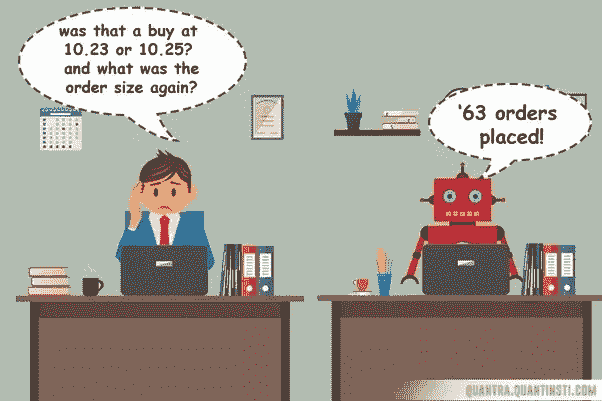

[Image Courtesy](https://blog.quantinsti.com/why-you-should-be-doing-algorithmic-trading/)

如果人工智能可以预测未来，那么为什么不能预测股票价格呢？谁不喜欢有钱？但是说起来容易做起来难。市场情绪可能不仅取决于技术因素，还取决于政治局势、产品突破、公司并购甚至最近的新闻字节。**如何客观量化所有这些因素来预测股票供求曲线？**嗯，这听起来可能令人生畏，但这在雄心勃勃的可能范围之内！

这里我们介绍一些数学技术来分析股票市场的时间序列数据并预测未来曲线。如果你是那些对应用机器学习进行交易感到好奇，但不确定从哪里开始的人之一，那么你就来对地方了。

[](https://www.datadriveninvestor.com/2020/02/19/cognitive-computing-a-skill-set-widely-considered-to-be-the-most-vital-manifestation-of-artificial-intelligence/) [## 认知计算——一套被广泛认为是……

### 作为它的用户，我们已经习惯了科技。这些天几乎没有什么是司空见惯的…

www.datadriveninvestor.com](https://www.datadriveninvestor.com/2020/02/19/cognitive-computing-a-skill-set-widely-considered-to-be-the-most-vital-manifestation-of-artificial-intelligence/) 

所有技术和各自数据集的源代码可以在[这里](https://github.com/AdroitAnandAI/Algo-Trading-Math-Models)找到。

# 定量交易

量化策略遵循数据驱动的方法来挑选股票。这种试图减少人为偏见的方法在概念上介于主动交易和被动交易之间。股票数据是“时间序列”的一个典型例子，其中价格以固定的间隔被采样。

# **时间序列数据**

时间序列是按时间顺序索引的一系列数据点**。时间序列的两个属性是:**

*   **周期性**:数据中有重复模式时。
*   **趋势**:当曲线的平均值**随时间增加**时。

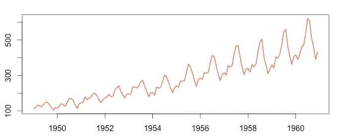

Time Series: Periodic & Trending

高斯分布是数学家们最喜欢的分布，因为它有明确的特征。同样，**如果时间序列是平稳的，那么就很容易预测。**

**平稳时间序列**

当**满足三个条件**时，时间序列是平稳的

1.  **均值常数:**一个窗口值的平均值随时间是常数。(无上升或下降趋势)
2.  **方差常数**:窗口中值的方差应该是常数。
3.  **协方差只是间隙**的函数:值的互变性不应随时间变化，但可以随间隙变化。

# **A .数据准备**

在现实世界中，**时间序列同样包含噪声、趋势和季节性**。趋势会导致均值随时间变化，而季节性会导致方差随时间变化。因此，在数据准备阶段，我们需要在建模之前诱导信号的平稳性和去噪。

**i)诱导平稳性**

类似于将非高斯分布转换为高斯分布的 box-cox 变换或 log 变换，有两种方法将非平稳时间序列转换为平稳时间序列**。**

1.  **转换:**如果序列为对数正态，则取对数(值)
2.  **求差:**类似于求差，取与前一值的差

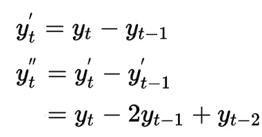

First & Second order differences

**二阶差分比一阶差分更可能是平稳的。**因此，你可以做**四阶差分**来尝试使数值稳定。如您所知，只有对数正态或线性级数等少数分布可以转换为高斯分布。同样，不是所有的时间序列都是平稳的，但四阶差分在实践中效果很好。这里，d 是一个超参数。

**如何识别平稳与非平稳 TS？**

就像我们做 **QQ 图**来检查分布是否是高斯分布一样，一个简单的平稳性检查是**目测检查**以上 3 个条件。


Second curve is trending down. Hence, not stationary.

类似于 KS 检验或 Anderson Darling (AD)检验来**统计检查**一个分布是否为高斯分布，可以做**增广-Dickey Fuller 检验(ADF)** 来检查时间序列是否平稳。

**ii)傅立叶滤波**

傅立叶滤波**有助于消除信号**的噪声，以便找出显著的曲线。该技术可以在将预测模型**输入**之前使用**，或者甚至平滑**模型输出。

我们可以绘制信号 FFT 的**功率，并进行逆 FFT** 以重构信号。然后移除所有高频，并从信号峰值频率转换回来。

如果我们对噪音数据运行上述代码，例如从 1950 年到 2015 年 S & P500 指数的**每日价格记录，那么我们可以在去除每日波动后发现显著的价格变化。**

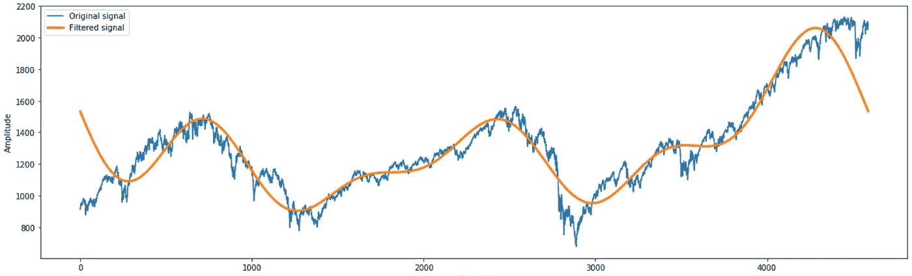

Blue: S&P500 Daily Price. Orange: Filtered Signal

# **B .预测模型**

在数据准备步骤之后，我们可以将值输入到预测模型中。这些是时间序列常用的**模型**:

*   **ARIMA** (自回归综合移动平均线)
*   **频率分解**
*   **特征工程数据的线性回归**
*   **LSTM &双向 LSTM**

# **i) ARIMA 车型**

又名。 **Box-Jenkins model** ，ARIMA 于 1976 年诞生。它在概念上类似于应用于时间序列数据的线性回归模型。

ARIMA 有 **3 个部分:**

*   **自动回归**
*   **积分(差分)**
*   **移动平均线**

**自动回归(AR)**

AR (p)类似于序列中先前“p”值的**线性回归模型。我们假设未来的值可以通过**‘p’**以前的值计算出来，就像线性回归中的“几乎一条线”假设一样。这里，p 是一个超参数。**


*Linear sum of last ‘p’ values is conceptually similar to LR (*[*Courtesy*](https://www.appliedaicourse.com)*)*

**移动平均线**

MA (q)模型是对以前的“q”误差项的线性回归，类似于 AR (p)。因此， **ARMA** 模型可以表示如下

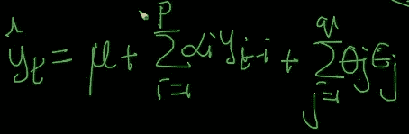

**ARMA = linear sum of previous ‘p’ values & ‘q’ errors** *(*[*Courtesy*](https://www.appliedaicourse.com)*)*

因此，“p”先前值和“q”误差项是特征，α和θ是线性回归参数。**积分与上面解释的“差异”概念相同。**

简而言之， **ARIMA (p，q，d)** 可以被定义为**在差分‘d’次后对先前‘p’值&‘q’误差的线性回归模型。**这里 p，q & d 是超参数。

## **自相关**

如果曲线的一组值在 k 的间隙之后与其自身相关，那么协方差值趋向于 1。但是我们怎么知道差距呢？

**自相关因子(ACF)和部分 ACF 是帮助确定差距的图。**当 ACF 绘制**相关值与间隙 k** 的关系时，部分 ACF 绘制累积相关值与 k 的关系。

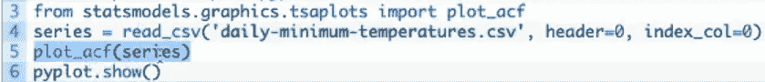

[Courtesy](https://machinelearningmastery.com/gentle-introduction-autocorrelation-partial-autocorrelation/)

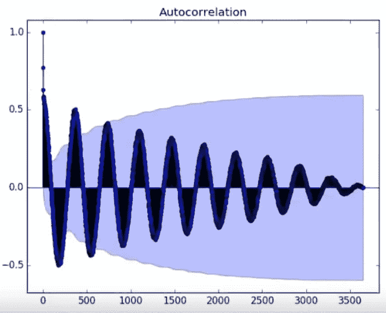

X = k (gap). Y = *Correlation value (outside 95% suggests correlation)*

置信区间设置为 95%，表明该代码之外的相关值很可能是相关的，而不是统计上的侥幸。

为了使绘图更容易阅读，将 x 轴上的滞后限制为 50。


从上图来看， *k = 1 到 10 具有可接受的自相关性。*

部分自相关**仅绘制增量值**。也就是说，您可以知道多使用一个先前值的好处。

让我们试着在下面描述的 TCS 股票数据集上应用 ARIMA 模型。

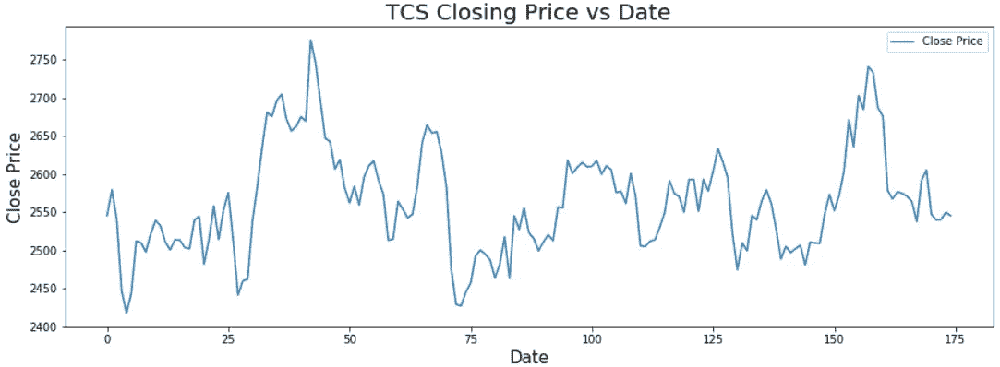

TCS Stock Market Prices

当你运行自动相关时，你会得到下图。

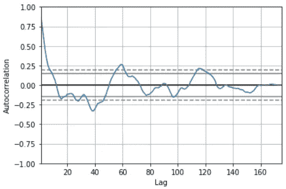

High correlation found on last 5~10 values

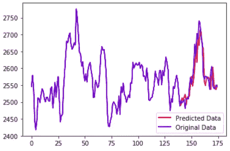

Predicted values correlate with values in test data.

为了密切观察，我们只绘制预测值和原始值。

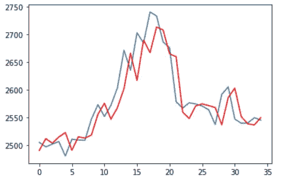

Predicted vs Original: Zoomed in

ARIMA 模型扩展到 **SARIMA(季节性自回归综合移动平均)**来支持序列的**季节性成分**。它用于包含趋势和季节性的单变量时间序列。

**带解释变量的自回归综合移动平均(ARIMAX)** 模型在有分类或数字格式的附加解释变量(**多元**)时使用。

# ii)频率分解

自相关是计算周期的一种方法。但是一个**更科学的发现周期性的方法是傅立叶变换。**该技术可用于找出历史数据中最显著的周期性变化，从而为未来提供可靠的提示。

让我们试着画出，

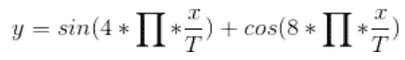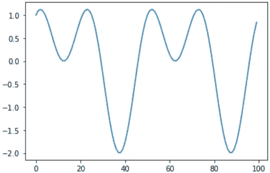

Sine and Cosine Additive

绘制**功率谱密度曲线**并找出显著的峰值。

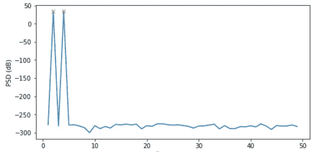

对对应于重要峰值点的频率进行逆 FFT。

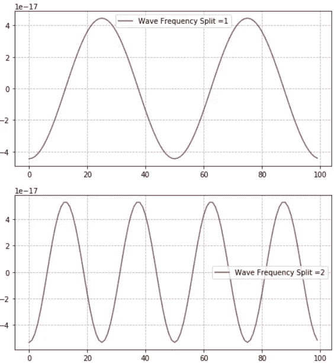

**Top**: Inverse FFT of 1st PSD peak. **Bottom**: Inverse FFT of 2nd PSD peak

下面是上面描述的进行频率分解的代码。

当你把上面分开的波加起来，你就会把输入波拿回来。这证明了上述两个波代表了输入波的分量。

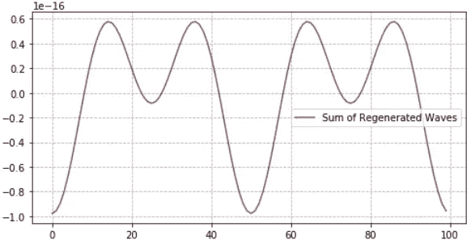

Sum of Inverse FFT curves

# **iii)线性回归**

我们仅使用“p”个先前值和“q”个误差来预测。但是我们可以使用其他功能，如星期几、时间、假期等。这种被称为**特征工程**的技术与其说是科学，不如说是艺术。

这里我们取一个 CSV 文件，包含从 1950 年到 2015 年 S & P500 指数**价格的每日记录。**让我们尝试预测一天前的反应变量，即收盘价。我们可以使用以下功能:

1) **过去 365 天的平均价格**。

2) **过去 5 天的平均价格**与过去 365 天的平均价格&的比率。

3) **前 365 天的均值和标准差**。

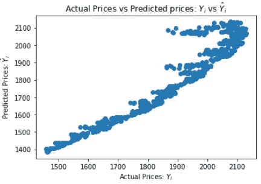

```
Mean Absolute Error (MAE) = 99.43097824659425
Median Absolute Percentage Error (MAPE) = 6.0%
```

解决任何时间序列问题的理想方法是首先使用差分或变换使数据更加平稳，然后应用高级回归模型，如 GBDT 或随机森林。

然而，时间序列数据最流行的模型是深度学习中的 rnn。**时间序列的最新模型是 LSTMs、GRUs、注意力模型&变压器。因为 LSTMs 比其他的更强大，所以我们在这里进行更深入的研究。**

# iv) LSTM &双向 LSTM

长短期记忆网络可用于从一系列过去的观察中学习，以预测序列中的下一个值。

一个普通的 LSTM 模型有一个 LSTM 单位的隐藏层和一个用于进行预测的输出层。这里我们使用的是一个**单变量**系列，所以特性的数量是一个。

我们对用于傅立叶滤波的相同标准普尔 500 数据应用 LSTM。首先我们画出**自相关图来估计滞后。**

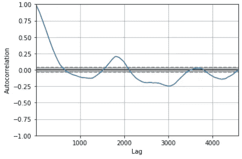

Auto Correlation on Closing Price

发现高达 500 的滞后是正相关的。由于**前 100 个具有超过 80%的相关性**，窗口大小被设置为 100，时期被设置为 200。

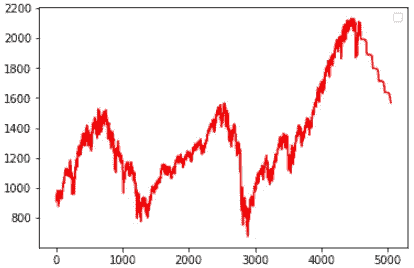

LSTM Prediction of S&P500 curve

如前所述，我们可以使用傅立叶滤波**来平滑输出**。

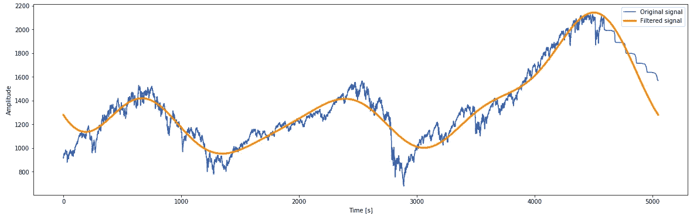

Fourier Filtered Prediction Curve of S&P 500

***双向 LSTMs***

在时序序列预测问题中，允许 LSTM 模型向前和向后学习输入序列**并连接两种解释可能是有益的。**

一元时间序列预测的双向 LSTM。

# **如何开始交易？**

*   在 [Zerodha](https://zerodha.com/) 或 [Upstox](https://upstox.com/) 开立 demat 账户。
*   进行文档上传和帐户设置(15 分钟)
*   安装相应的应用程序并监控市场图表。
*   从菜单进入 algo labs，熟悉自己。
*   要进行 algo 交易，安装 [Amibroker](https://www.amibroker.com/) 或 [Ninjatrader](https://ninjatrader.com/) 。
*   从一些授权的[数据供应商](https://www.ticanalytics.com/)购买数据
*   为上述算法编写代码并进行分析。

如果你对上述数学模型不确定，那么你可以把数据供应商的实时数据输入到第三方解决方案中，比如亚马逊预测。不投入真金白银也可以在[纸上交易 app](https://web.sensibull.com)上做虚拟交易。

# **结论**

在这篇博客中，你已经看到了一些基本的数学技术来模拟按时间顺序索引的数据。它将为你从时间序列数据开始提供足够的技术基础。然而，要打败市场，你可能不得不求助于先进的技术。

我们试图使用**监督学习方法模拟股票市场行为，即。线性回归或 LSTM** 。但是**强化学习**对于考虑到影响股票市场的各种环境因素更加稳健，因为它旨在**在给定的情况下最大化报酬。**

傅立叶分析最适合有规律和可预测的波或小波，这与股票市场相反。因此，研究**光谱分析和信号提取也是有益的。**如果你想了解这些先进的技术，请继续关注即将到来的博客，或者你可以在这里联系到我。

所有讨论过的技术的源代码都可以在[这里](https://github.com/AdroitAnandAI/Algo-Trading-Math-Models)找到。

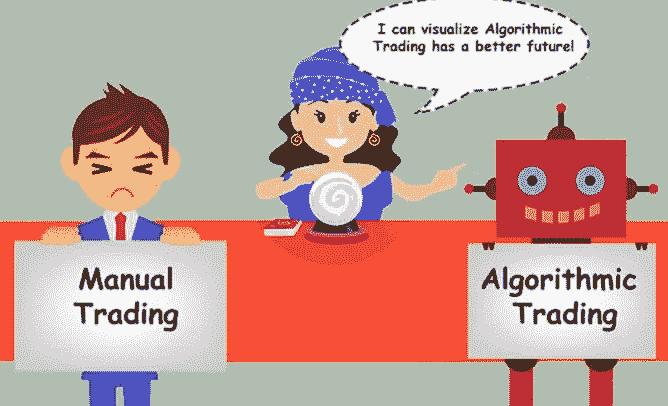

[Image Courtesy](https://blog.quantinsti.com/why-you-should-be-doing-algorithmic-trading/)

# **参考文献**

 [## 1.5.12.17.绘制和操作 FFT 进行滤波

### 画出信号 FFT 的功率，并反推 FFT 以重构信号。此示例演示了和。它…

scipy-lectures.org](http://scipy-lectures.org/intro/scipy/auto_examples/plot_fftpack.html) [](https://machinelearningmastery.com/how-to-develop-lstm-models-for-time-series-forecasting/) [## 如何开发用于时间序列预测的 LSTM 模型

### 长短期记忆网络，简称 LSTMs，可用于时间序列预测。有很多种…

machinelearningmastery.com](https://machinelearningmastery.com/how-to-develop-lstm-models-for-time-series-forecasting/) [](https://www.appliedaicourse.com/) [## 应用课程

### 我们知道转行是多么具有挑战性。我们的应用人工智能/机器学习课程被设计为整体学习…

www.appliedaicourse.com](https://www.appliedaicourse.com/)