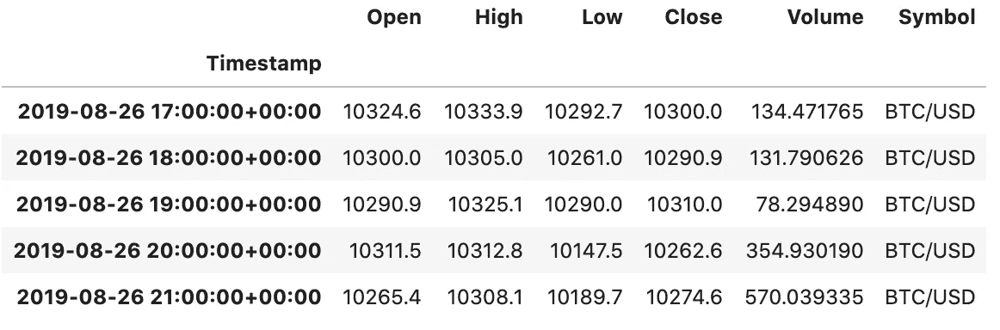
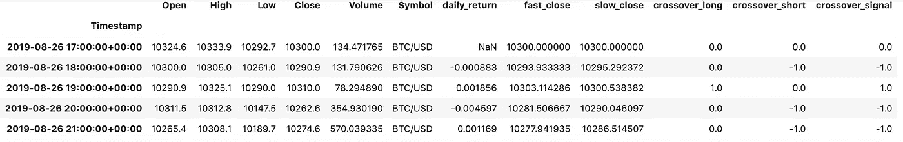
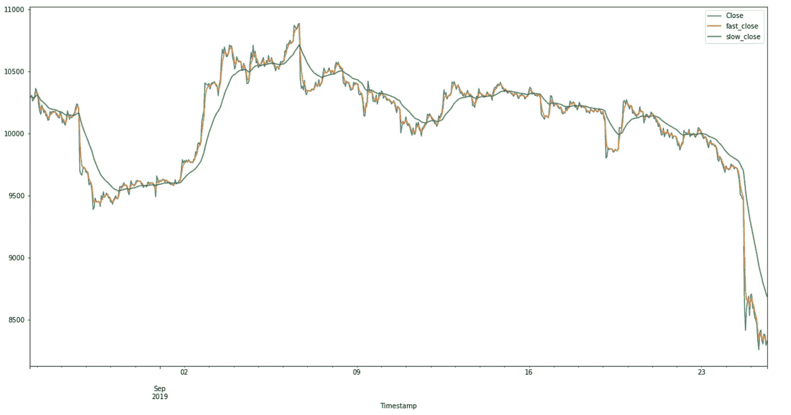
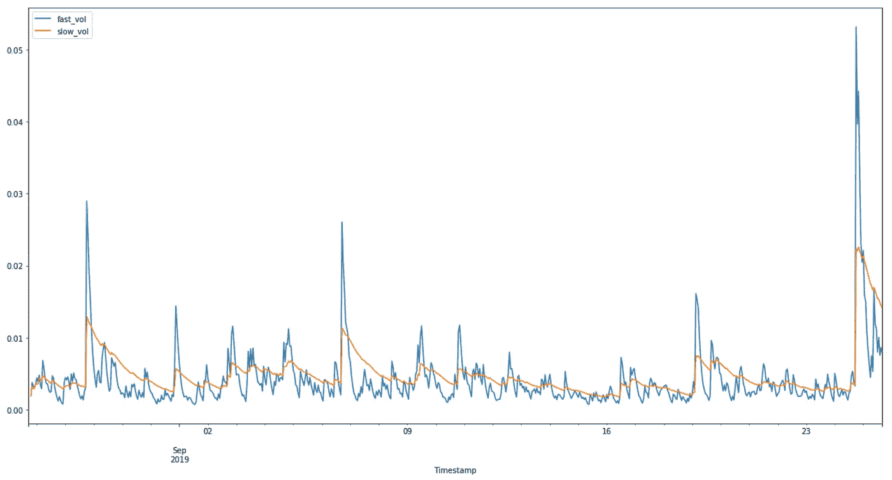
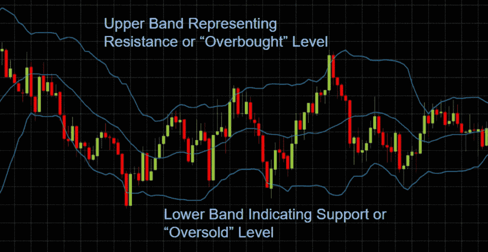
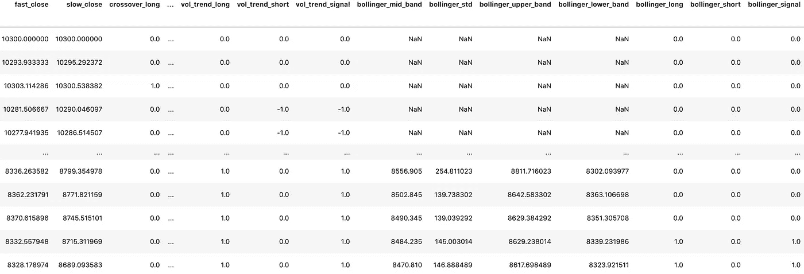
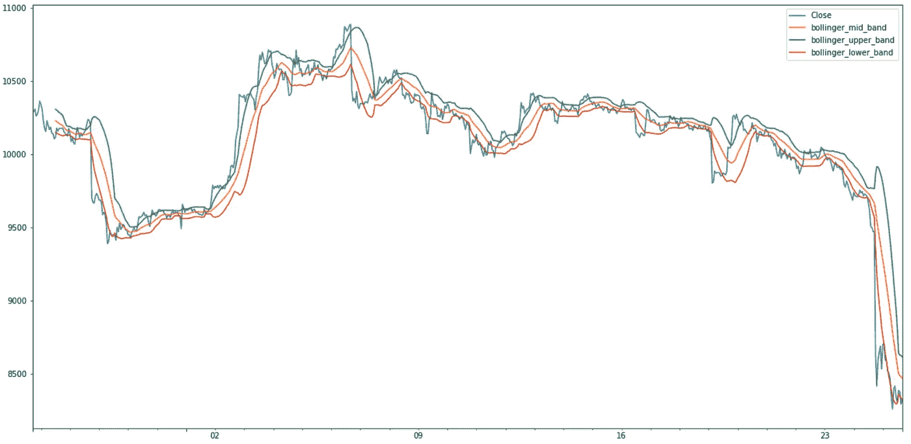

# 用 Python 进行算法交易。

> 原文：<https://medium.datadriveninvestor.com/algorithmic-trading-with-python-80ee7e7fb8b2?source=collection_archive---------7----------------------->

高级技术的初级编码。


目录:

*   从北海巨妖 Api 提取数据
*   格式化数据帧
*   计算每日回报
*   生成指数移动平均线(短/长窗口)
*   用均线绘制比特币的收盘价
*   计算每日波动性
*   构建布林线

# 简介:

首先，让我们先了解这篇文章的目的，它为普通散户投资者提供了一个快速简单的方法来导入数据，使用这些数据来突出关键指标，并绘制一个信息图表，供我们评估我们的头寸。

在这篇文章中，我们将介绍三种使用各种技术指标的基本交易信号。

```
# Import libraries and dependencies
import pandas as pd
import numpy as np
from pathlib import Path
%matplotlib inlineimport warnings
warnings.filterwarnings('ignore')# Set path to CSV and read in CSV
csv_path = Path('../Medium/kraken_btc_1hr.csv')
btc_df=pd.read_csv(csv_path)
btc_df.head()
```

*我们将在这个例子中使用的数据来自* [*【北海巨妖】*](https://www.kraken.com/en-us/) *，如果你想使用他们的实时数据，你必须创建一个帐户并获得一个 API 密钥。但是，您可以通过进入 my*[*GitHub*](https://github.com/scottandersen23/Medium_Blog)*并下载 csv.file.* 来找到本文中使用的确切数据

```
# Set index as datetime object and drop columnsbtc_df.set_index(pd.to_datetime(btc_df['Timestamp'], infer_datetime_format=True), inplace=True)btc_df.drop(columns=['Timestamp'], inplace=True)
btc_df.head()
```



在我们用我们想要的列清理了数据集之后，在这种情况下删除“NaN”值并计算每日百分比回报是很重要的。

[](https://www.datadriveninvestor.com/2020/12/07/name-matching-techniques-with-python/) [## 使用 Python |数据驱动投资者的名称匹配技术

### 我们确实面临很多情况，我们必须匹配一个有很多变体的单词。这可能是因为错别字…

www.datadriveninvestor.com](https://www.datadriveninvestor.com/2020/12/07/name-matching-techniques-with-python/) 

我们还将在数据框架中添加一个名为“每日回报”的新列。

```
# Drop NAs and calculate daily percent returnbtc_df['daily_return'] = btc_df['Close'].dropna().pct_change()
btc_df
```

**交易信号#1:** 指数移动平均线

*   *与简单移动平均线(SMA)相比，收盘价的指数移动平均线(EMA)代表一种移动平均线，其对最近的价格给予更多的权重或关注。*

```
# Set short and long windows
short_window = 1
long_window = 10# Construct a `Fast` and `Slow` Exponential Moving Average from short and long windows, respectively
btc_df['fast_close'] = btc_df['Close'].ewm(halflife=short_window).mean()
btc_df['slow_close'] = btc_df['Close'].ewm(halflife=long_window).mean()# Construct a crossover trading signal
btc_df['crossover_long'] = np.where(btc_df['fast_close'] > btc_df['slow_close'], 1.0, 0.0)
btc_df['crossover_short'] = np.where(btc_df['fast_close'] < btc_df['slow_close'], -1.0, 0.0)
btc_df['crossover_signal'] = btc_df['crossover_long'] + btc_df['crossover_short']btc_df.head()
```



绘制比特币“收盘价”的均线



**交易信号#2:** 日收益率波动的均线

```
# Set short and long volatility windows
short_vol_window = 1
long_vol_window = 10# Construct a `Fast` and `Slow` Exponential Moving Average from short and long windows, respectively
btc_df['fast_vol'] = btc_df['daily_return'].ewm(halflife=short_vol_window).std()
btc_df['slow_vol'] = btc_df['daily_return'].ewm(halflife=long_vol_window).std()# Construct a crossover trading signal
btc_df['vol_trend_long'] = np.where(btc_df['fast_vol'] < btc_df['slow_vol'], 1.0, 0.0)
btc_df['vol_trend_short'] = np.where(btc_df['fast_vol'] > btc_df['slow_vol'], -1.0, 0.0) 
btc_df['vol_trend_signal'] = btc_df['vol_trend_long'] + btc_df['vol_trend_short']
```

情节:



*   当日回报波动的短窗口(快速)均线大于日回报波动的长窗口(慢速)均线时，交叉表明日回报波动预期上升时存在做空机会。



**交易信号#3:** 布林线

*   *布林线描述了一个中、上、下三个波段，其中中间是收盘价的简单移动平均线(SMA)，上下两个波段分别描述了 SMA 上方和下方的滚动标准差。*

```
# Set bollinger band window
bollinger_window = 20# Calculate rolling mean and standard deviation
btc_df['bollinger_mid_band'] = btc_df['Close'].rolling(window=bollinger_window).mean()
btc_df['bollinger_std'] = btc_df['Close'].rolling(window=20).std()# Calculate upper and lowers bands of bollinger band
btc_df['bollinger_upper_band']  = btc_df['bollinger_mid_band'] + (btc_df['bollinger_std'] * 1)
btc_df['bollinger_lower_band']  = btc_df['bollinger_mid_band'] - (btc_df['bollinger_std'] * 1)# Calculate bollinger band trading signal
btc_df['bollinger_long'] = np.where(btc_df['Close'] < btc_df['bollinger_lower_band'], 1.0, 0.0)
btc_df['bollinger_short'] = np.where(btc_df['Close'] > btc_df['bollinger_upper_band'], -1.0, 0.0)
btc_df['bollinger_signal'] = btc_df['bollinger_long'] + btc_df['bollinger_short']
```



绘制布林线:

```
# Plot the Bollinger Bands for BTC/USD closing pricesbtc_df[['Close','bollinger_mid_band','bollinger_upper_band','bollinger_lower_band']].plot(figsize=(20,10))
```



当价格向高波段或低波段移动时，它会反弹向平均价格。这是因为上下波段代表一定的标准差。因此，价格更有可能回到它的平均值，而不是保持在一个不太可能远离平均值的范围内。

因此，当比特币收盘价小于下限时，存在一个**长**的机会:信号表明价格行动将倾向于向上移动，更符合价格在负标准差内的位置。

相反的情况存在一个短暂的机会，在这种情况下，资产收盘价高于上限，表明价格波动将趋于向下移动，并在正标准差范围内。

**感谢您的阅读！**

*如果你觉得这篇文章有用，欢迎在* [*GitHub*](https://github.com/scottandersen23/Medium_Blog/tree/main/Articles) *上下载我的个人代码。你也可以直接在 scottandersen23@gmail.com 给我发邮件，在*[*LinkedIn*](https://www.linkedin.com/in/scott-andersen-3208897b/)*上找到我。有兴趣了解更多关于数据分析、数据科学和机器学习应用的信息吗？跟我上* [*中*](https://medium.com/@scottandersen23) *。*

## 访问专家视图— [订阅 DDI 英特尔](https://datadriveninvestor.com/ddi-intel)