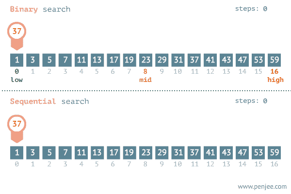
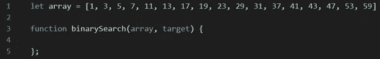
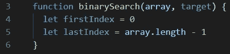
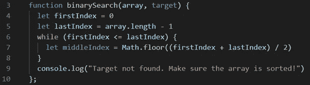
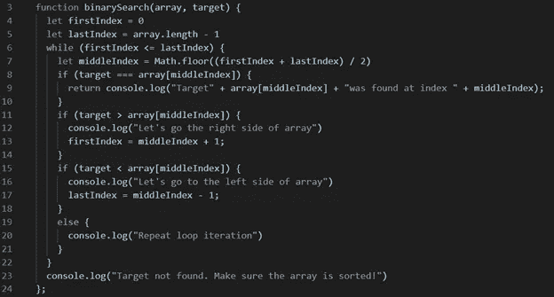
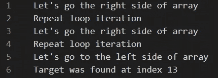
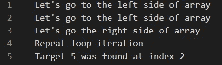

# 算法:二分搜索法

> 原文：<https://medium.datadriveninvestor.com/algorithms-binary-search-5d58056cb23e?source=collection_archive---------15----------------------->

这一周，我要讲的是**二分搜索法**算法！听起来很复杂，对吧？实际上，不是的！这种算法很常见，你可能以前遇到过。那么什么是**二分搜索法**算法呢？基本上就是顾名思义。这是一种算法，通过不断“将数组一分为二”来搜索特定元素的索引。但你会问，这意味着什么？好吧，我在下面贴了一张 gif 来演示这是什么意思。请记住，二分搜索法 ***只适用于排序后的数组*** ！



Binary Search (gif from penjee.com)

上图比较了二分搜索法和顺序搜索，寻找的目标是 37。我将分解每一个工作的步骤。

**二分搜索法**

1.指定数组中间的索引

2.检查中间索引的值是大于还是小于我们要寻找的值

3.隔离数组中有值的部分

4.重复步骤 1–3，直到找到该值

**顺序搜索**

1.检查索引中的每个值**并查看其是否与目标值匹配**

所以现在你可能会问，为什么我们不经常使用这种算法，而不是顺序搜索？二分搜索法算法有局限性！我在开始的时候提到过一个，声明它只适用于排序的数组！如果您想使用它，请确保正在讨论的数组已经排序。如果它还没有被排序，你可以对它应用插入算法，看看我上一篇关于它的博文！

[](https://www.datadriveninvestor.com/2020/02/22/algorithms-for-fairness/) [## 公平算法|数据驱动的投资者

### 许多人都有算法偏见。软件工程师关心算法偏差，因为我们关心…

www.datadriveninvestor.com](https://www.datadriveninvestor.com/2020/02/22/algorithms-for-fairness/) 

现在让我们进入为二分搜索法算法创建函数的过程。如果让你创建一个二分搜索法函数，你会如何处理并最终解决它？好吧，让我们来分解一些我们知道的关键事情。我们知道该算法在一个**数组**中搜索一个**目标**。这意味着我们有**两个论点**！



下面是 gif prior 中使用的数组，以及图片中提供的一个空函数。所以我们知道算法会根据索引值将数组一分为二。这意味着我们需要记住一些索引值:第一个、中间的和最后一个。让我们首先创建变量来表示第一个和最后一个索引。不要担心，我们将在不久之后到达中间索引。



现在让我们进入下一步。我们知道，算法会不断前进，直到找到目标，这意味着在此之前，firstIndex 将继续小于或等于 lastIndex。所以我们需要创建一个条件来表示它。现在让我们创建我们的中间索引。



让我们看一下第 6-9 行。第 6 行使得该块中的代码只有在 firstIndex 小于或等于 lastIndex 时才继续运行。在第 7 行，我使中间的索引等于 firstIndex 和 lastIndex 相加后的舍入值除以 2，从而表示数组的“中点”。然后，我将第 9 行作为错误消息。现在让我们来看看代码中最精彩的部分，数组的实际搜索！

但在此之前，让我们考虑几件事！我们实际上如何使用所有 3 个值，firstIndex、lastIndex 和 middleIndex，并将其与我们的目标进行比较。我们需要根据算法中已知的情况来设置条件。

让我们扪心自问“我们如何为 _____ 设定一个条件？”

1.我们真的找到目标了？

2.我们的目标大于中间指数的值？

3.我们的目标小于 middleIndex 的值？

4.我们的目标还没有找到吗？

这里是最终解决方案！



```
let array = [1, 3, 5, 7, 11, 13, 17, 19, 23, 29, 31, 37, 41, 43, 47, 53, 59]function binarySearch(array, target) {
 let firstIndex = 0
 let lastIndex = array.length - 1
 while (firstIndex <= lastIndex) {
  let middleIndex = Math.floor((firstIndex + lastIndex) / 2)
  if (target === array[middleIndex]) {
   return console.log("Target" + array[middleIndex] + "was found at index " + middleIndex);
  }
  if (target > array[middleIndex]) {
   console.log("Let's go the right side of array")
   firstIndex = middleIndex + 1;
  }
  if (target < array[middleIndex]) {
   console.log("Let's go to the left side of array")
   lastIndex = middleIndex - 1;
  }
  else {
   console.log("Repeat loop iteration")
  }
 }
 console.log("Target not found. Make sure the array is sorted!")
};
```

所以让我们来分解代码。让我们看看第 8 行。它将目标与数组中 middleIndex 的值进行比较。如果相等，我们将返回一条语句，说明无论目标的索引是什么，都可以找到它。让我们看看下一个条件，第 11 行。如果我们的目标大于 middleIndex 的值，类似于开始时的 gif，我们将在右侧通过将 firstIndex 重新定义为 middleIndex + 1 来“将数组隔离为子数组”。第 13 行基本上是相同的，但是如果目标小于 middleIndex 的值会发生什么呢？现在我们有了第 19 行，这是当函数重复自己最终找到目标时打印的消息。

现在让我们测试一下这个功能！让我们试试 43 作为我们的目标。



结果应该是这样的。

现在让我们尝试将 5 作为我们的目标。



结果应该是这样的。

总之，二分搜索法算法是寻找一个值的索引的很好的工具，特别是在大的集合中。请记住它的局限性，比如只能处理排序后的数组。