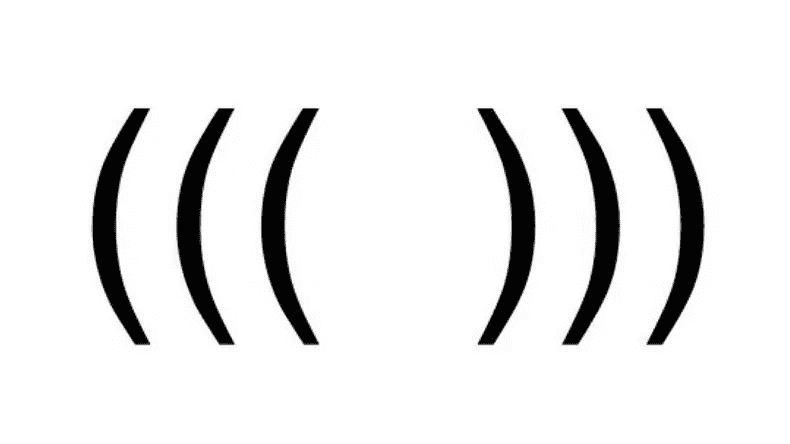

# 算法:验证括号

> 原文：<https://medium.datadriveninvestor.com/algorithms-validating-parentheses-e8c8749e6e67?source=collection_archive---------5----------------------->

## 查看有效括号算法挑战的两个不同版本



如果我完全诚实的话，作为一名开发人员最好的部分之一就是有机会解决代码挑战。他们玩起来很有趣，但除非你熟悉挑战的语言，否则你可能会迷失方向。如果你喜欢数独或类似的逻辑游戏，我肯定你会同意。最棒的是没有唯一正确的答案！正确答案可以有多种变化！关键是让你的回答更快更有效率，还有赏心悦目！这使得解决这些代码挑战更加令人兴奋！

更重要的是，作为一名开发人员，你可能会在工作面试中被要求解决代码挑战。既然如此，练习你的算法也同样重要。网络上的挑战数不胜数，你永远不知道哪一个会被你的面试选中，即使你最终遇到了一个你从未见过的挑战，你也会知道如何去解决它。

[](https://www.datadriveninvestor.com/2019/03/22/the-seductive-business-logic-of-algorithms/) [## 算法诱人的商业逻辑|数据驱动的投资者

### 某些机器行为总是让我感到惊讶。我对他们从自己的成就中学习的能力感到惊讶…

www.datadriveninvestor.com](https://www.datadriveninvestor.com/2019/03/22/the-seductive-business-logic-of-algorithms/) 

在这篇博客中，我将回顾一下如何解决与圆括号相关的代码挑战的思考过程，对于圆括号，我已经看到了两种不同的变体。

# 变体 1

*写一个函数，接受一串括号，并确定括号的顺序是否有效。*

```
//Examples:"()"              =>  true 
")(()))"          =>  false 
"("               =>  false 
"(())((()())())"  =>  true
```

这种挑战总是伴随着一个例子来帮助我们想象我们的解决方案应该能够做什么，这很好。

对于上面的挑战，我首先必须考虑是什么使括号有效。

`()`有效。左圆括号`(`必须用右圆括号`)`正确闭合。

换句话说，只要每一个`(`都有一个相应的`)`来关闭它，这对就有效。

当括号字符串变得太长时，很难看出这一点。

我首先想到的是创建一个从字符串中删除所有有效对的函数。这是一个函数，它基本上会收缩我的输入字符串，直到只剩下无效的字符串对。如果字符串以空结束，我知道原来的字符串是有效的。

但是我该如何着手做这件事呢？

我从我熟悉的东西开始:操纵数组。

我将字符串输入转换成一个字符串数组。

```
function validParentheses(parens) {
  let parenths = parens.split('')
}
```

接下来，我需要编写一个方法来遍历这个数组，只删除有效的数组对，并在这样做的时候折叠原始数组。

为了控制这个循环只在有效对存在时运行，我设置了一个条件:

```
function validParentheses(parens) {
  let parenths = parens.split('')
  while (parenths.join('').includes('()')) { }
}
```

这样，一旦我的数组不再有有效的对，我的循环就会停止。

接下来，我需要编写一个循环来删除有效的线对。

```
function validParentheses(parens) {
  let parenths = parens.split('')
  while (parenths.join('').includes('()')) {
    for (let i = 0; i < parenths.length - 1; i++) {       
      if (parenths[i].concat(parenths[i + 1]) == '()') { 
        parenths.splice(i, 2)         
        i -= 1       
      }     
    }
  }
}
```

我希望我写的`for loop`所代表的数组能够改变。这就是为什么每次我找到一个有效的对并修改我的数组时，我都要后退一次，以免错过任何东西。

我的数组由单个圆括号组成。我测试当前的括号加上下一个括号是否等同于`()`，如果等同，则删除两个括号。

这样下去，阵列会崩溃。`'(())’`会变成`'()’`，然后变成`''`。

现在我需要根据新数组的长度设置返回`true`或`false`的条件。

```
function validParentheses(parens) {
  let parenths = parens.split('')
  while (parenths.join('').includes('()')) {
    for (let i = 0; i < parenths.length - 1; i++) {       
      if (parenths[i].concat(parenths[i + 1]) == '()') { 
        parenths.splice(i, 2)         
        i -= 1       
      }     
    }
  }
  if (parenths.length === 0) {
    return true
  }
  return false
}
```

如果新数组是空的，我知道原来的字符串是有效的，所以我的函数返回`true`。否则，我的函数返回`false`。

# 变体 2

*编写一个函数，它接受一串括号，并确定使括号有效所需的运算次数。*

```
//Examples'()'          =>  0 // No additional brackets necessary
'('.          =>  1 // Missing one bracket
'(()(((())'   =>  3 // Missing three brackets
```

对于这种变异，我一开始有点迷茫。

我最初的想法是，有效的一对意味着相同数量的`(`和`)`。

我认为我需要做的就是检查每一个的数量并找出不同之处。如果它是零，那么它是一个有效的括号串。否则，我只需要填写缺失的括号。

一开始听起来很巧妙！😅

但是后来我运行了我的测试，发现我实际上失败了很多！

这是为什么呢？

经过进一步思考，我意识到括号的顺序很重要。

`'((()))'`有效。

`'()()()'`有效。

`)))(((`无效。

嗯，我觉得自己很蠢…😅

既然是这样，我不得不改变我的整个思维方式。

我需要写一个函数来跟踪左右括号的数量…不！我需要一个跟踪所需补码数量的函数。

如果我的函数遍历字符串输入并找到了`(`，那么它的补码的计数就会增加，因为它缺少一个`)`来变得有效。

类似地，一旦我的函数遇到`)`，这个补码的计数就会下降。

反之亦然。

如果函数遇到的`)`比`(`多，那么补码计数将增加。

它的基本功能是中和所需数量的补体。

让我们开始吧:

```
function numComplements(parens) {
  let parenths = parens.split('')
}
```

我能说什么呢？对于这类挑战，我更喜欢使用数组。尤其是因为我会循环播放。

接下来，我需要将我的补数设置为零。

```
function numComplements(parens) {
  let parenths = parens.split('')
  let rComplement = 0
  let lComplement = 0
}
```

我的循环将持续到字符串输入的长度。

```
function numComplements(parens) {
  let parenths = parens.split('')
  let rComplement = 0
  let lComplement = 0
  for (let i = 0; i < parenths.length; i++) {

  }
}
```

现在我需要我的条件句。如果我的循环遇到了`(`,循环计数就会增加。

如果我的循环遇到了`)`，那么它应该会降低`(`所需的补码，并且 rComplement 会降低。然而，这仅在存在要关闭的现有`(`的情况下。如果没有要关闭的内容，我们将缺少一个左括号，因此必须增加 lComplement 计数。

> 这很难用语言来解释，但是试着在脑海中描绘出来。

最终的代码看起来像这样:

```
function numComplements(parens) {
  let parenths = parens.split('')
  let rComplement = 0
  let lComplement = 0
  for (let i = 0; i < parenths.length; i++) {
    if (parenths[i] === '(') {
      rComplement++
    }
    else {
      if (rComplement > 0) {
        rComplement--
      }
      else {
        lComplement++
      }
    }
  return rComplement + lComplement
}
```

这里我增加了我需要的右补的数量，当我遇到一个补时就中和它。否则，我的左补的计数反而上升。

最后，我对所有需要的补码求和，并返回结果。

这个结果就是使括号中的字符串有效所需的运算次数(补码数，左右都有)!

# 结论

在我写这篇博客的时候，我意识到我为第一个变体编写的代码可能也能解决第二个变体。

由于我的第一个解决方案折叠括号数组，直到只剩下无效的括号，这意味着数组将只包含需要补码的括号。

该数组的长度应该是求解第二个变量所需的长度。

我应该很快意识到这一点，但自从我看到第一个变化已经有一段时间了，我不想依靠我的旧代码来解决新的挑战。

虽然我花的时间比我回头看旧的解决方案要长，但这仍然是一次有趣的经历，我尝试了一种不同的编码方式。

不用看旧的解决方案，回去重复你以前可能已经解决的挑战是很有趣的，因为你永远不知道你自己的思维过程可能会发生什么变化。

不管怎样，你都要从两种经历中学习！