# 阿里云 PAI:阿里云机器学习平台的新功能

> 原文：<https://medium.datadriveninvestor.com/alibaba-cloud-pai-new-features-of-alibaba-clouds-machine-learning-platform-89bd426f07e4?source=collection_archive---------20----------------------->

*用* [*阿里云 2020 双 11 大卖*](https://www.alibabacloud.com/campaign/singles-day-double-11-2020) *加紧你的业务数字化！获取新用户优惠券，探索超过 16 种免费试用、30 多种畅销产品和 6 多种解决方案，满足您的所有需求！*

*阿里云计算平台产品经理余*

本文基于演讲和相关的 PowerPoint 幻灯片，涵盖以下主题:

*   PAI 概述
*   自定义算法上传
*   DTplus 智能生态市场
*   AutoML2.0 自动参数调整
*   自动学习

# 1) PAI 概述及其功能的开发

## 1.1)派-工作室

在[面向 AI 的机器学习平台(PAI)](https://www.alibabacloud.com/product/machine-learning) 的架构中，底层是 PAI 的计算框架和数据资源。支持 [MaxCompute](https://www.alibabacloud.com/product/maxcompute) 、[对象存储服务](https://www.alibabacloud.com/product/oss) (OSS)、 [Hadoop 分布式文件系统](https://www.alibabacloud.com/product/ide) (HDFS)、以及 [NAS](https://www.alibabacloud.com/product/nas) 等多种数据资源。PAI 的最初原型是 PAI-Studio，这是一个围绕数据资源和各种计算框架构建的可视化建模实验平台。Studio 包括 200 多种算法，涵盖了整个环境过程，包括数据预处理、特征工程、模型训练以及评估和推理。用户可以通过在 PAI-Studio 中拖放组件来轻松设置实验。此外，PAI 内置了鲲鹏计算框架，支持超大规模的矩阵训练，拥有数百亿个特征和样本。最初，PAI-Studio 是为中级算法工程师设计的算法平台。使用方便，技术门槛低。借助 Studio 的可视化建模功能，PAI 可以为企业提供诸如推荐系统、金融风险控制、疾病预测和新闻分类等功能。

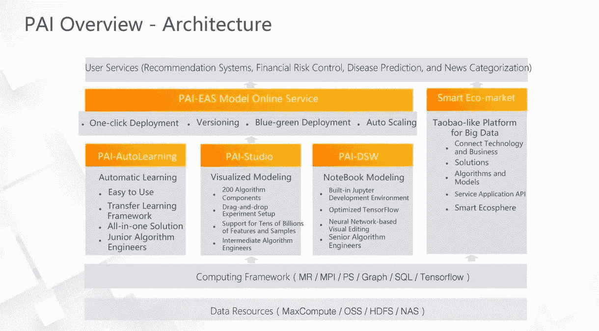

## 1.2) PAI-EAS

在工作室中构建的算法和实验与用户随时可获得的模型服务之间还有最后一英里——如何将模型部署为在线服务。这最后一英里通常需要很多努力。为了解决这个问题，PAI 后来推出了 PAI-EAS 模型在线服务，为 EAS 在线服务提供一键部署。此功能简化了操作，并将模型构建与生产服务联系起来。除了一键式部署之外，PAI-EAS 模型在线服务还提供版本控制、蓝绿色部署和自动扩展等功能。PAI-EAS 模型在线服务允许用户轻松设置实验，在线部署模型，并将模型应用于实际业务。

## 1.3)派-DSW

随着 PAI 的不断发展，新的需求不断涌现。例如，一些工程师在实验设置期间需要更多的定制控制。为此，PAI 推出了以笔记本电脑为基础的造型功能 PAI-DSW。PAI-DSW 内置了 Jupyter 开发环境，继承了优化的 TensorFlow，允许用户以可视化的方式编辑神经网络。与 PAI-Studio 相比，PAI-DSW 提供了更多的定制控制，因此适合具有更多样化算法背景的高级算法工程师。

## 1.4)PAI-自动学习

随着高级和中级算法工程师的要求得到满足，PAI 继续为初级算法工程师推出新的 PAI-自动学习解决方案。关于自动学习的更多信息将在本文后面给出。通过前面的 PAI 变体，具有不同算法能力的工程师可以通过 PAI 选择最适合他们的产品。

## 1.5)智能生态市场

如前所述，用户可以根据自己的技能选择合适的 PAI 模块，并快速将服务部署到自己的企业中。然而，用户仍然需要自己完成开发步骤。应对这一挑战的新解决方案是依靠第三方的能力和专业知识。为此，PAI 推出了智能生态市场模块，允许用户在市场上寻找其业务问题的解决方案(如模型、算法或应用程序),以快速获得能力，节省否则将花费在开发上的人力资源。另一方面，拥有相应技术的开发商或公司利用市场发布和销售产品，获得经济回报，并提高品牌知名度。

# 2)自定义算法上传

自定义算法上传是 PAI-Studio 的一个功能。在实际应用中，机器学习可以以无数种方式与业务相结合，并用于各种用例。同时，用户可能有个性化的需求。虽然 PAI-Studio 提供了 200 多个算法组件，但它不能满足每个用户的所有需求。通过自定义算法上传，用户可以开发自己的算法组件供以后使用。

## 2.1)自定义算法上传的优势

自定义算法上传有三个好处。首先，自定义算法上传兼容 Spark 生态系统，支持 Spark 和 PYSpark 框架。在这些框架下，用户根据需要开发自己的算法。第二，自定义算法上传简化了发布。为了减少发布工作，自定义算法上传旨在使发布更简单、更快速，允许算法在几分钟内发布。第三个好处是视觉配置。在 PAI 中，用户上传算法包，在 PAI-Studio 中拖拽可用组件，并为这些组件配置算法参数和相关设置。所有这些都以可视化的方式在线执行。

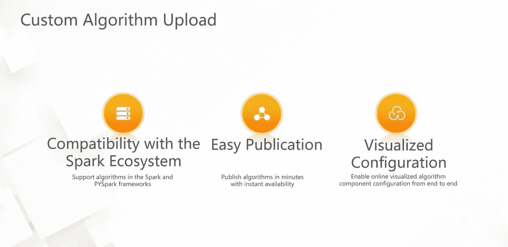

# 3) DTplus 智能生态市场

## 3.1)智能生态市场的作用

智能生态市场是一个类似淘宝的大数据和人工智能(AI)技术平台。它将开发人员与业务方联系起来。以前开发者拥有能力和技术，业务方有需求和突出问题。然而，双方一直未能有效地相互联系。DTplus 智能生态市场通过将一方的技术与另一方的需求相匹配，连接并惠及双方。具体来说，开发人员简化了产品发布和销售，提高了品牌知名度，并与市场新闻和需求保持同步。业务端在方便获取合适的业务解决方案的同时，也降低了探索新服务的成本，拓展了基础业务，以更快的速度优化了公司的技术。

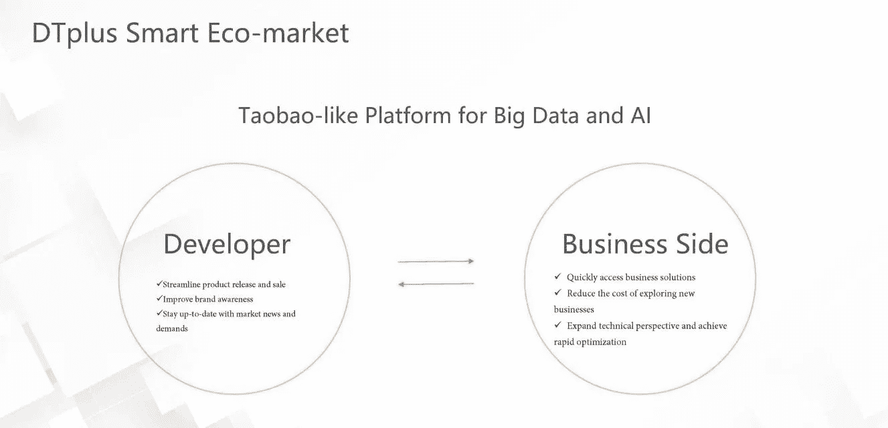

如下图所示，在智能生态市场出现之前，用户通过两种方式构建商业解决方案:一种是利用机器学习 PAI 自行开发解决方案。这种开发模式的步骤包括实验构建、模型部署和模型应用。另一种方法是选择具有行业专业知识的独立软件供应商(ISV)来构建不同的模型，并在实际业务中部署以满足客户的需求。对于这两种方法，第一种需要相当的人力，第二种需要很高的财政投入。在这种背景下，DTplus 智能生态市场为客户提供了一种新的选择，有助于平衡人力和财务投资。客户现在可以从算法模型开发人员那里购买最新的模型或解决方案来解决他们的业务问题。这也是智能生态市场建立的目的及其对客户和开发者的价值。

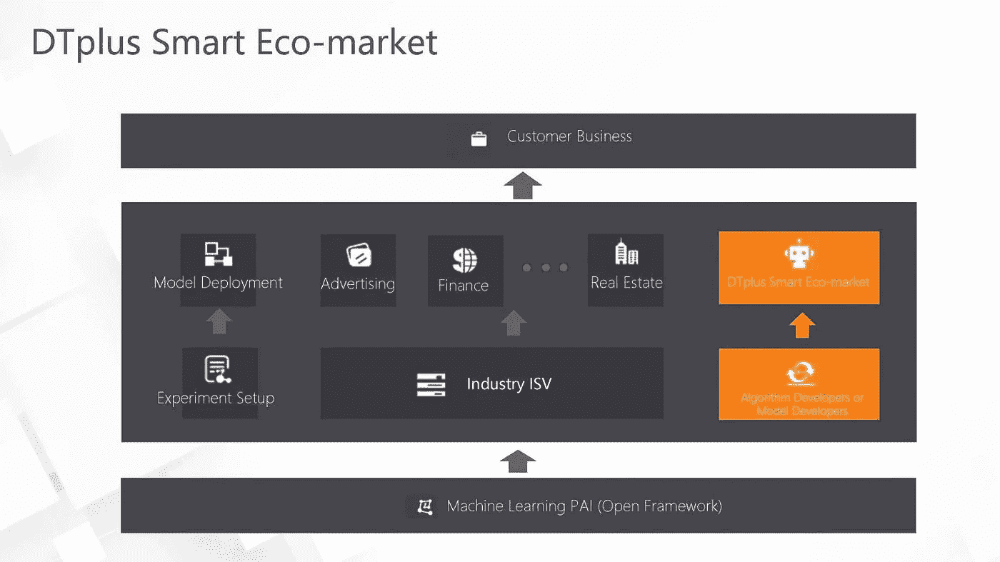

## 3.2)dt plus 智能生态市场的子模块

DTplus 智慧生态市场有四个子模块:在市场模块中，客户买卖大数据产品。消费者为他们的商业问题找到有效的解决方案，开发者通过分发和分享他们的技术获得回报和品牌利益。培训模块提供了使用市场相关平台的教程和案例研究。它还提供实践培训，帮助用户快速入门大数据。认证模块是为开发人员设计的。在该模块中，开发者可以获得 Apsara Clouder 技能的证书，通过认证提升开发技能，获得官方的资质评价。在论坛模块中，大数据用户和爱好者可以相互交流，学习前沿技术和知识。

 [## 机器学习和人工智能如何改变电子商务的面貌？|数据驱动…

### 电子商务开发公司，现在，整合先进的客户体验到一个新的水平…

www.datadriveninvestor.com](https://www.datadriveninvestor.com/2020/11/19/how-machine-learning-and-artificial-intelligence-changing-the-face-of-ecommerce/) 

这四个模块形成了一个动态的生态系统。智慧生态市场为用户提供培训，为开发者提供认证。用户和开发者彼此建立交易关系，各取所需。用户、开发者和智能生态市场共同构成了论坛的生态系统。

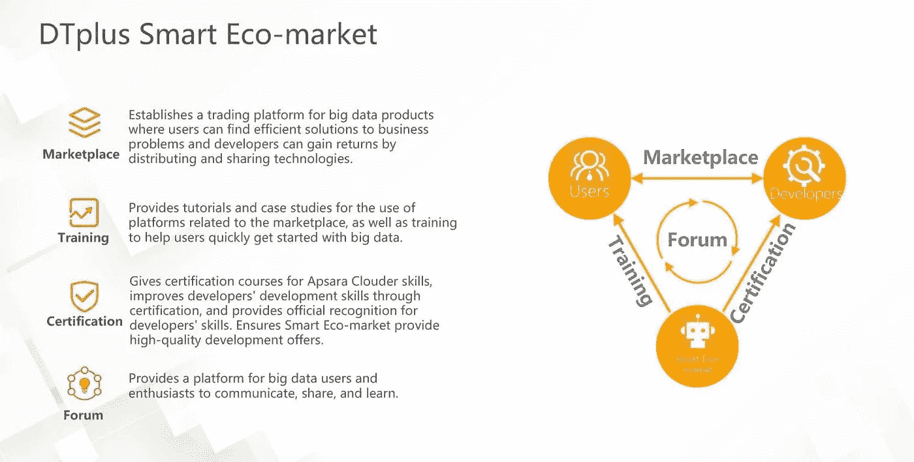

## 3.3)产品发布流程

下图为 DTplus 智能生态市场首页。在这里，开发人员可以注册为销售人员，填写个人信息，并提交审查申请。申请被批准后，卖家可以在市场上销售产品。要发布产品，销售者需要首先选择产品类别(例如，解决方案)，然后输入产品名称、描述和来源。在 Source 字段中，卖家需要输入一个 URL。由于解决方案比普通产品更加开放，开发者可以发布自己的联系卡，这样感兴趣的人就可以联系到他们。卖家也可以在市场上发布算法产品。算法产品和自定义算法上传功能是逻辑连接的。自定义算法上传配置完成后，您可以点击发布按钮将算法发布到 DTplus 智能生态市场。产品审核通过后，卖家可以点击发起，在发起完成后生成一个预置有产品常见问题的智能客服机器人。感兴趣的客户可以从智能客服机器人那里获得基本的产品信息。更多的产品信息，客户可以通过卖家提供的 DingTalk ID 联系卖家。

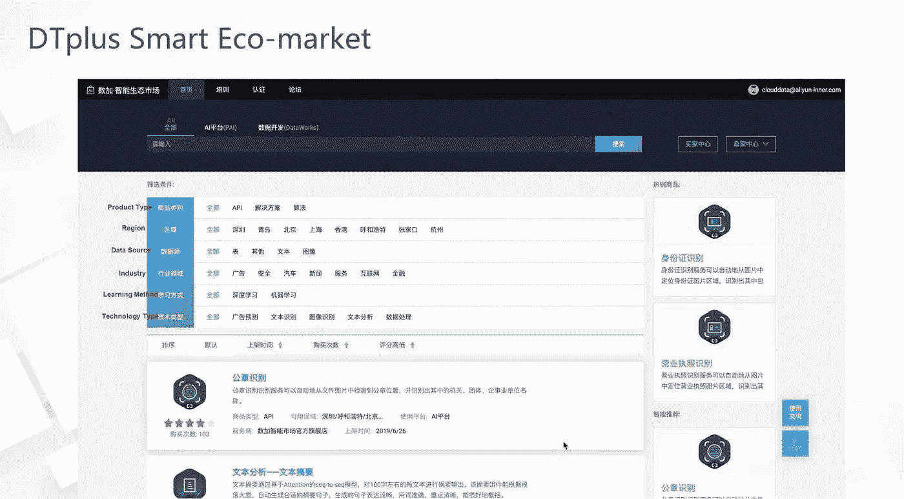

# 4)autom 2.0 自动参数调整

## 4.1)autom 2.0 概述

AutoML 自动参数调整是 PAI-Studio 的核心功能。PAI-Studio 允许您以可视化的方式执行建模。建立模型后，您需要调整参数以获得最佳实验结果。AutoML 旨在帮助参数调整。AutoML2.0 自动参数调优提供三个好处:自动参数调优可以一键实现自动参数调优、模型评估、模型转换。此外，AutoML2.0 支持 GritSearch、Random Search、PBT、Gause、Evolutionary 等七种参数调优算法。AutoML2.0 已经证明，它可以为用户削减 90%的工作量，并大大减少建立机器学习模型的时间和人力成本。

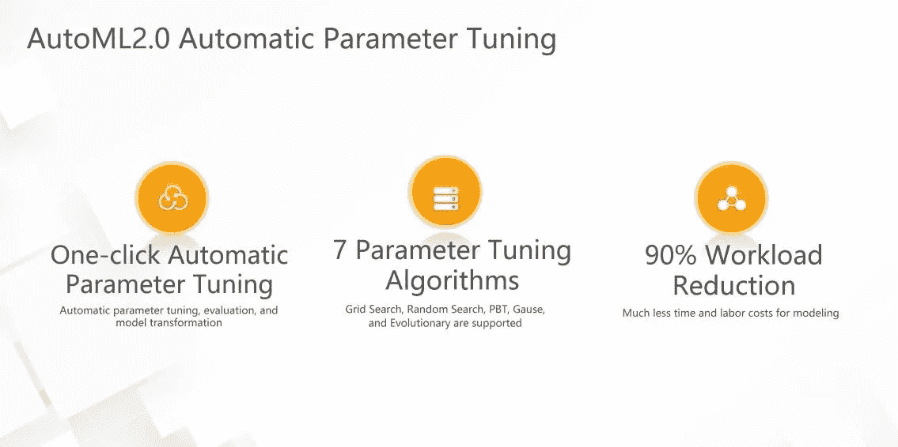

## 4.2)自动参数调整示例

在本例中，我们选择 GBDT 回归模型进行参数调整。在自动参数整定的配置页面，我们可以选择一个数据拆分比例，拆分后的数据一部分用于模型训练，一部分用于模型评估。AutoML2.0 现在支持七种参数调整方法:高斯、PBT、样本、随机搜索、网格搜索、自定义搜索和进化方法。这些参数整定方法涵盖了目前主流的参数整定方法。这里，我们选择进化参数调整方法进行演示。接下来，我们需要配置要搜索的样本数量、探索次数和收敛系数。同时，我们需要定义参数范围。完成前面的配置后，会自动生成一个模型。在本例中，总共生成了 11 个模型。我们如何从这些模型中确定最好的一个？自动参数调整页面提供平均绝对误差(MAE)选择标准，根据模型质量对模型进行排序。然后，您可以保存顶级模型以供进一步操作。

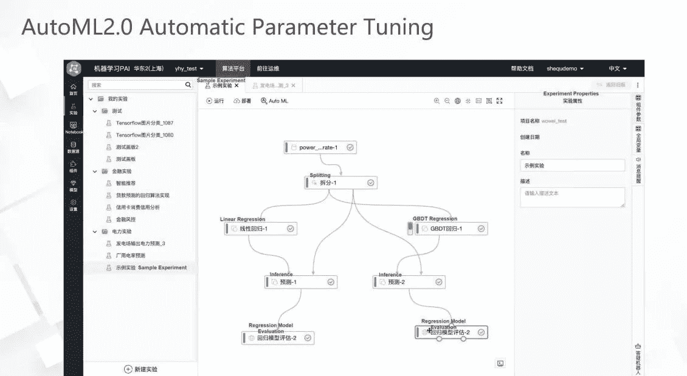

下图显示了“自动参数调整详细信息”页面，该页面演示了多次迭代后模型性能的显著提高。随着迭代次数的增加，模型的性能会提高。在该图中，Y 轴代表 MAE 值。MAE 值越小，模型的错误率越低。随着迭代次数的增加，模型的质量会提高。这证明 AutoML 参数调整是有效的。

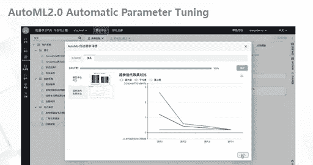

# 5)自动学习

## 5.1)自动学习概述

PAI-自动学习是 PAI 提供的最新功能之一。PAI-Studio 和 PAI-DSW 分别满足中高级算法工程师的实验设置要求。另一方面，PAI-AutoLearning 是一个初学者工具，可以满足初级或入门级算法工程师的实验设置要求。它旨在吸引更多的人使用机器学习，以产生商业价值。自动学习有几个好处:它是现成的，容易使用，对初学者友好。一次最少可以用五张图片来学习。凭借强大的迁移学习框架，PAI-AutoLearning 可以在少量数据上进行有效的学习，并且学习和训练效果不打折扣。自动学习提供了一个一体化的解决方案，涵盖了从数据标记和模型训练到模型部署的整个学习过程。所以，即使是初学者也能很快上手机器学习。

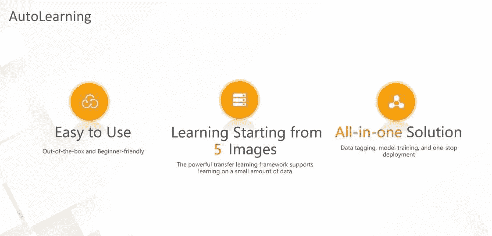

## 5.2)使用自动学习

在自动学习模块中，单击从模板创建。作为使用自动学习功能的快速入门，从模板创建为初学者提供了使用这些功能的快捷方式。实验的训练数据已在页面上预设。例如，在图像分类实验中使用的数据集包含不同种类的动物。通过训练，可以生成一个深度学习模型，可以准确识别动物类型。

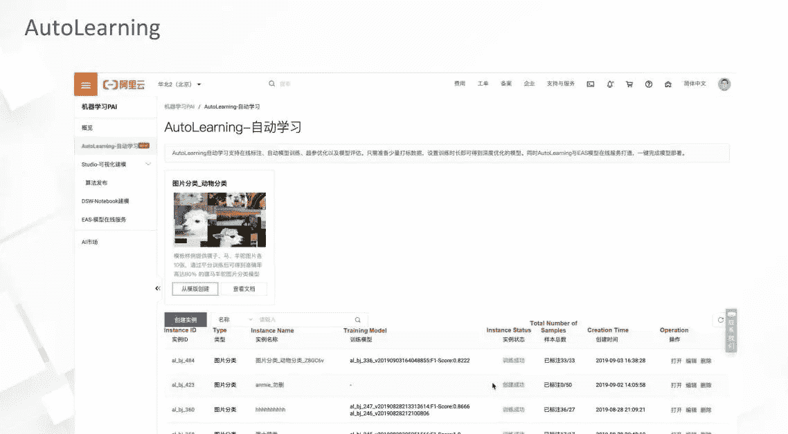

首先，在深度学习训练之前，必须将有效数据导入到深度学习算法中。为此，需要对数据进行标记以使其有效。因此，第一步是标记数据。自动学习模块集成了内置的数据标记功能，可帮助您快速访问数据标记。为此，首先向图像添加标签。动物的种类包括羊驼、马和骡子。检查同一类别的动物，并将它们标记为羊驼、马或骡子。在“培训开始”页面上，输入培训持续时间。训练持续时间决定了模型训练的结果。训练持续时间越长，模型结果越好。自动学习可以在短时间内训练出准确的模型。一般来说，你只需要 10 分钟就可以训练一个模型达到很好的训练和分类效果，比传统的深度学习模型有了显著的提升。

培训启动页面上的另一个选项是增量学习，它指示是否基于现有模型继续培训。“模型训练和评估”页面显示训练模型的结果。模型度量包括准确度、精确度和召回率，其指示模型对当前训练结果的有效程度。您可以上传新图像来测试训练好的模型的推理性能。模型部署是自动学习提供的一体化解决方案的一部分。要将经验证的模型应用于生产，请单击转到 EAS 以在自动学习界面上部署。

*访问官方页面获取* [*阿里云 AI 机器学习平台【PAI】*](https://www.alibabacloud.com/product/machine-learning)*了解更多！*

# 原始来源:

 [## 阿里云 PAI:阿里云机器学习平台的新功能

### Merchine Learning PAI 年 10 月 30 日 1，156 借助阿里云 2020 加快企业数字化步伐加倍…

www.alibabacloud.com](https://www.alibabacloud.com/blog/alibaba-cloud-pai-new-features-of-alibaba-clouds-machine-learning-platform_596820) 

## 访问专家视图— [订阅 DDI 英特尔](https://datadriveninvestor.com/ddi-intel)