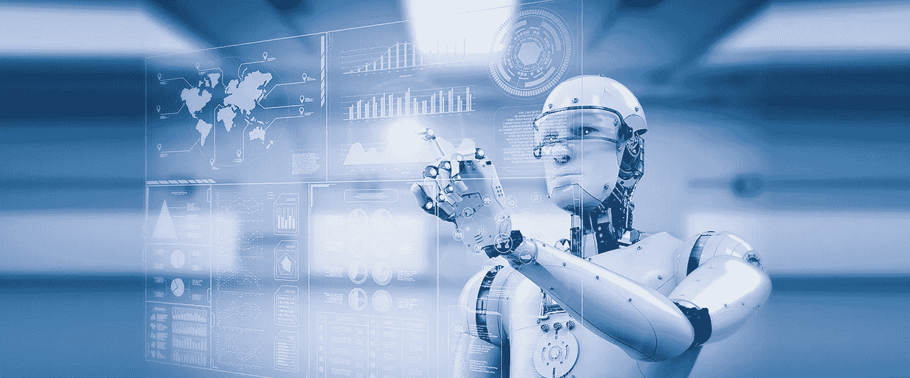
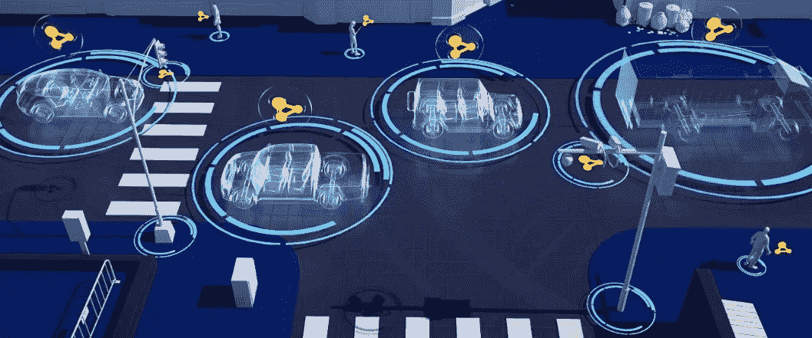

# 阿里巴巴对 2020 年十大科技的预测

> 原文：<https://medium.datadriveninvestor.com/alibabas-predictions-for-the-top-10-tech-in-2020-c1dc9a65f9f6?source=collection_archive---------7----------------------->

在本文中，[阿里巴巴 DAMO 研究院](https://damo.alibaba.com/?spm=a2c41.13951612.0.0)，阿里巴巴集团和[阿里云](https://us.alibabacloud.com/?spm=a2c41.13951612.0.0)背后的研究机构和创新动力，将分享它预测的 2020 年科技和计算的十大趋势。通过将明年的技术置于显微镜下，DAMO 希望站在今年技术革命的最前沿，为阿里巴巴创造更多领先的技术创新。

# №1:人工智能将进入认知智能领域

到目前为止，[人工智能](https://www.alibabacloud.com/et?spm=a2c41.13951612.0.0)或 AI 已经达到，在某些方面甚至超过了人类在感知智能领域的水平，如语音到文本，自然语言处理和跟踪视频剪辑中的主题。但人工智能仍然落后的一个领域是认知智能。

认知计算很难，因为它需要大量的外部知识、逻辑推理以及所谓的领域迁移。因此，它仍然处于初级阶段，但我们知道它今年仍将产生重大影响，使它成为我们 2020 年的头号技术。

在今年和未来，认知智能的重要性和应用不断增长，从认知心理学、脑科学和社会史等领域汲取灵感。此外，其应用将汇集跨领域知识图、因果关系推理和持续学习的技术和计算技术，以建立更稳定的获取和知识表达的有效机制。

 [## 幸福的算法？数据驱动的投资者

### 从一开始，我们就认为技术正在使我们的生活变得更好、更快、更容易和更实用。社交媒体…

www.datadriveninvestor.com](https://www.datadriveninvestor.com/2019/03/08/an-algorithm-for-happiness/) 

这最后两件事，知识的获取和表达，在一定程度上是使机器能够以前所未有的方式从概念上理解和利用知识的两件最大的事情，从而将计算机从感知智能领域带到认知智能领域。

# №2:内存计算将打破人工智能的“记忆墙”

在经典的冯诺依曼架构中，内存和处理器是分开的，因此计算需要数据在两者之间来回移动。冯诺依曼架构是目前大多数台式机、笔记本电脑和功能强大的工作站计算机使用的主要架构。在过去，这种架构是真正的创新。然而，随着这些天来数据驱动的人工智能算法的快速发展，它已经成为探索更先进的人工智能和机器学习算法的瓶颈。

与这种架构相反，内存处理(PIM)架构将内存和处理器集成在一起，允许直接在存储数据的位置执行计算。我们认为这种架构可以打破当今人工智能面临的内存墙，因为它可以提供计算并行性和显著更好的能效。

# №3:工业物联网将推动新一轮数字化转型

2020 年，随着 5G 的持续推出和[物联网](https://www.alibabacloud.com/solutions/IoT?spm=a2c41.13951612.0.0) (IoT)市场的增长，我们预计将出现新一波创新和数字技术，云计算和边缘计算技术的进一步发展将与之相结合。正如我们所看到的，这一新浪潮将加速信息和通信系统与工业控制系统的融合。

例如，通过工业物联网应用，制造企业将实现新的自动化水平，改善厂内物流和生产调度。我们认为这些系统将使消费者对企业的智能制造成为现实。

借助 5G、物联网和云，工业系统将更好地连接，并将有能力快速调整和协调上游和下游供应商的生产能力。这反过来将导致制造业的利润大幅增加，因为在现实中，即使是 5%至 10%的小生产率增长，在大规模的情况下也可以增加几百万美元的利润。

# №4:机器之间的大规模协作将成为现实

现在已经成为某种惯例的东西，如果不仅仅是默认的话，使用单机智能系统将不再能够满足一些大规模机器学习和人工智能应用的要求。因此，多系统智能模型和机器之间的大规模协作将成为越来越重要的解决方案。这些系统将具备赶上今年应用的实时感知和认知决策模型所需的能力。

我们认为，物联网领域协作传感的持续发展和超高速 5G 连接的持续推出将有助于实现多台机器之间的协作，以完成大规模生产级任务。

也就是说，机器之间的这种合作所带来的群体智能将放大单个机器的计算能力以及系统收集的智能。

例如，[智能交通灯调度](https://www.alibabacloud.com/et/city?spm=a2c41.13951612.0.0)将实现更加动态和实时的调整。仓库机器人将共同合作，在货物分拣任务中进行更高效的合作。自动驾驶汽车或自动驾驶汽车将能够相互合作，大幅提高效率和安全性，这种合作也将出现在无人驾驶飞机和无人机中。

# №5:模块化设计将提高芯片制造工艺效率

现实是，传统的芯片设计模式无法有效应对快速变化、不断发展和日益分散的芯片生产市场，尤其是在生产定制芯片方面。

相反，基于 RISC-V 的开源片上系统(SoC)芯片设计，采用高级硬件描述语言和基于 ip 的模块化芯片设计方法，是一个更好的解决方案。事实上，它已经加速了敏捷设计方法和开源芯片生态系统的快速发展。另外，基于小芯片的模块化设计方式也是一种进步。它使用先进的封装方法将不同功能的小芯片封装在一起，可以快速定制和交付满足不同应用特定要求的芯片。

# №6:大规模区块链应用将获得大规模采用

我们预测[区块链即服务](https://www.alibabacloud.com/products/baas?spm=a2c41.13951612.0.0) (BaaS)将成为今年的一项重要技术。它将继续降低几种不同类型的企业级区块链应用程序的准入门槛。我们还认为，今年我们将开始看到专门为区块链制造的各种芯片——这些芯片将预装算法并连接到云。

随着这种硬件的出现，实物中的资产将被世界映射到区块链世界中的资产。而且，所有这些都将扩大价值互联网的边界，同时实现未来的多链互联。

与此同时，我们认为我们将开始看到区块链技术的大量创新应用，这些应用利用了跨多个不同行业和生态系统的多维协作。我们还预测，大规模生产级区块链应用程序将获得大规模采用，每天的活跃项目将超过 1000 万个。

# №7:量子霸权将取得重大进展

2019 年，达到“量子霸权”的竞赛再次成为人们关注的焦点，将所有人的注意力都带回了量子计算的问题。此外，过去一年一些令人印象深刻的计算能力的展示也吸引了一些人，并表明量子和超级计算将非常成为现实。我们看到的计算能力的改进和进步利用了一些超导电路。

接下来，在 2020 年，我们预计量子计算领域将获得更多投资，部分原因是竞争日益激烈。随着相关生态系统的形成，该市场还将通过获得更大的行业份额而得到推动。

在接下来的几年里，我们认为下一个里程碑将是容错量子计算的实现以及在现实世界场景中演示和实现高级量子计算。这两个都还不可能，但很快就会，因为量子计算正进入其发展的关键时期。

# №8:新材料将彻底改变半导体行业

在摩尔定律和对计算能力和存储的爆炸性需求的双重压力下，经典的硅基晶体管很难推动半导体行业的持续发展。时至今日，各大半导体厂商对这个问题都没有明确的答案。

然而，新材料将通过新的物理机制带来新的逻辑、存储和互连设备，这些新机制将反过来推动半导体行业的持续创新。

除其他外，我们认为拓扑绝缘体以及可以实现电子和自旋无损传输的二维超导材料将成为该行业进步的最重要基础。它们将带来新的性能水平，并将设备连接在一起。同时，新的磁性材料和新的阻变材料将具备实现高性能磁存储器所需的能力，包括软 MRAM 和阻变存储器。

# №9:保护数据隐私的人工智能技术将越来越多地被采用

在全球范围内，包括在美国和欧洲，[安全性和合规性](https://www.alibabacloud.com/trust-center?spm=a2c41.13951612.0.0)与个人数据处理相关的最新数据保护法律法规所要求的成本比以往任何时候都要高。鉴于所有这些，人们对使用人工智能和其他相关技术来保护用户隐私的兴趣也越来越大。希望客户可以使用各种在线服务，同时保持数据的私密性。在过去一年的几起数据隐私丑闻之后，这些技术应该在一定程度上帮助恢复一些信任。

# №10:云将成为所有技术创新的中心

我们认为云一如既往地重要。近年来，直到今天，随着云计算技术在几个不同行业的不断发展和进一步集成，云已经远远超出了传统信息技术的范围，但它也逐渐成为几乎所有技术创新的中心。

云与 IT 的几个不同领域密切相关，包括芯片设计、数据库和数据管理系统、自动驾驶自适应网络、大数据、人工智能、物联网、区块链，甚至量子计算。同时，云也是新技术和即将到来的技术的摇篮，如无服务器计算、云原生软件、软件和硬件集成的新探索以及智能自动化。

总而言之，到目前为止，云计算已经完善了技术空间的几乎每个方面，更广泛地说，完善了我们生活的世界。因此，我们确信，它将继续把新的技术转化为服务，从而继续推动我们的数字经济。

*要了解更多我们可以期待的技术趋势，以及它们将如何影响我们的生活，请立即下载由阿里巴巴 DAMO 学院* *提供的*[*2020 年十大技术趋势。*](https://resource.alibabacloud.com/whitepaper/top-10-technology-trends-in-2020-by-alibaba-damo-academy_1384?spm=a2c41.13951612.0.0)

# 原始来源:

 [## 阿里巴巴对 2020 年十大科技的预测

### 阿里巴巴云 2020 年 2 月 4 日 27 由阿里巴巴 DAMO 学院的作家团队。在这篇文章中，阿里 DAMO…

www.alibabacloud.com](https://www.alibabacloud.com/blog/alibabas-predictions-for-the-top-10-tech-in-2020_595790?spm=a2c41.13951612.0.0)