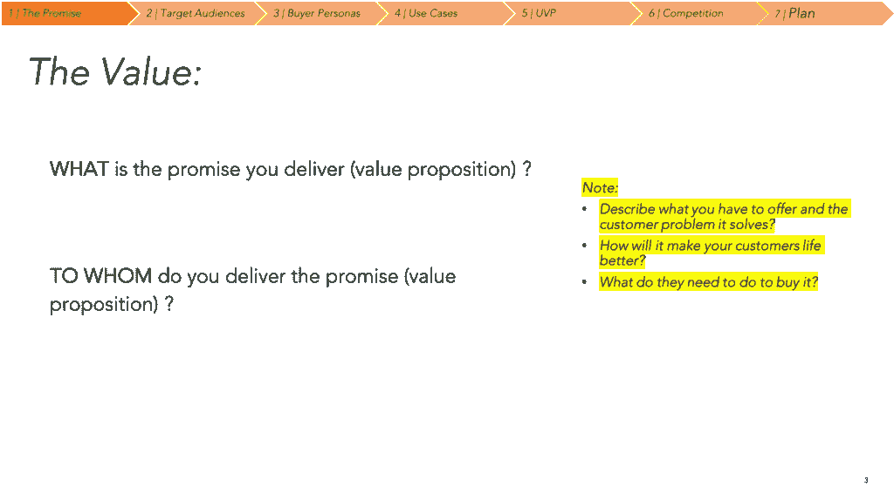
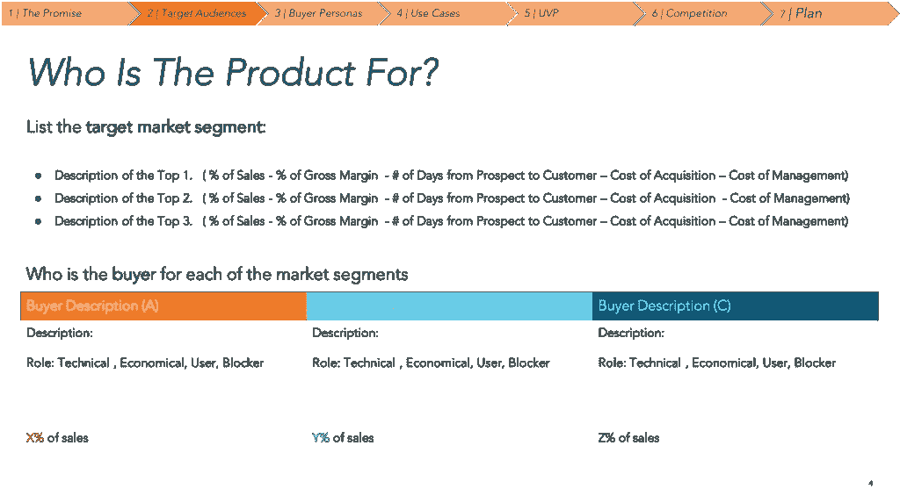

# 将您的价值主张与正确的细分市场和买家角色相结合

> 原文：<https://medium.datadriveninvestor.com/aligning-your-value-proposition-to-the-right-market-segment-buyer-persona-3a1ed2b86b5e?source=collection_archive---------20----------------------->

***收入是你的公司和你的客户之间价值互动的产出。***

如果你的收入没有实现，那么你需要重新关注并重新检查你的价值主张、产品和细分市场。

也许你只是想把你的产品卖给一个没有兴趣的客户群，因为这不是他们的问题…也许你的市场群或客户已经改变了优先顺序，以前是问题的东西，现在是好东西，你必须适应新的现实。

你必须记住的一点是，你不会通过最积极或最坚持不懈来实现你的目标——如果你的产品和价值与细分市场和客户需求相吻合，你就会实现目标。

以下是我们用来重新构建价值主张和客户一致性的一些工具。

我们从定义价值主张开始。

专注于；

*   清晰描述您提供的产品/服务
*   了解客户面临的问题
*   通过使用您的产品/服务来解决此类问题的途径
*   证明你就是那个能解决的人。

然后，我们将注意力转向产品与高层次客户细分的客户的匹配:

重点关注:

确定产品及其价值主张适合的细分市场。如果你已经有了客户和数据——这是一个很好的机会去了解什么在起作用，在哪里“加倍下注”——因为你应该把你的市场细分为；

*   您从该细分市场获得的销售额百分比
*   对应的毛利率是多少？
*   从第一次接触到销售，你需要多长时间获得一个客户？
*   你的获客成本是多少？
*   你的客户管理成本是多少？

一旦你定义了前三个细分市场，然后关注每个细分市场的每个买家角色。当你定义购买者角色时，你也应该定义他们的角色类型——是吗？

*   技术买家
*   产品的使用者？
*   经济决策者？
*   或者他们是你产品或服务的阻碍者？

这项工作的价值在于帮助确定前进的道路；阐明您的产品提供的价值主张，并将其与正确的细分市场和买家联系起来。

牢记在心；作为企业家，我们迷恋活动，但没有结果的活动是浪费精力。将您的精力集中在为正确的细分市场和客户角色解决问题上，而不是从事可能让您忙碌但不会影响您的收入和目标的活动。

# 分享:

[**脸书**](https://www.facebook.com/sharer/sharer.php?display=popup&u=https%3A%2F%2Finnovatingpartners.net%2Fblog%2Ffocus-aligning-your-value-proposition-to-the-right-market-segment-buyer-persona%2F) [**推特**](https://twitter.com/intent/tweet?text=Check+out+%27FOCUS+%E2%80%93+Aligning+your+value+proposition+to+the+right+market+segment+%26+buyer+persona%27+on+Innovating+Partners%C2%AE+website&url=https%3A%2F%2Finnovatingpartners.net%2Fblog%2Ffocus-aligning-your-value-proposition-to-the-right-market-segment-buyer-persona%2F)**[**Pinterest**](https://pinterest.com/pin/create/button/?url=https%3A%2F%2Finnovatingpartners.net%2Fblog%2Ffocus-aligning-your-value-proposition-to-the-right-market-segment-buyer-persona%2F&media=https%3A%2F%2Finnovatingpartners.net%2Fwp-content%2Fuploads%2F2021%2F02%2Fmodern-archer-1-scaled.jpg&description=FOCUS%20%E2%80%93%20Aligning%20your%20value%20proposition%20to%20the%20right%20market%20segment%20&%20buyer%20persona)**