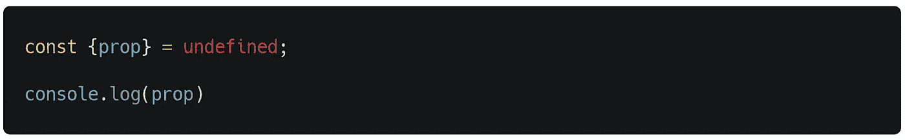
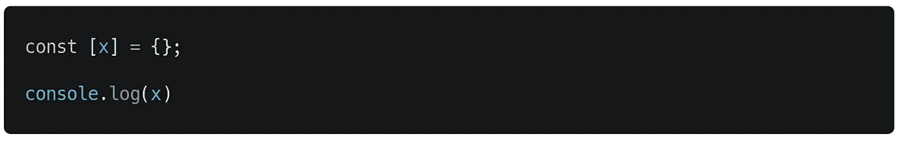

# 关于 JavaScript 中的析构

> 原文：<https://medium.datadriveninvestor.com/all-about-destructuring-in-javascript-c71d9c23bb44?source=collection_archive---------5----------------------->

## ES6 的一大特色

Photo by [Max Duzij](https://unsplash.com/@max_duz?utm_source=medium&utm_medium=referral) on [Unsplash](https://unsplash.com?utm_source=medium&utm_medium=referral)

例如，在 ES6 之前，使用普通赋值，我们一次提取一条数据。

输出。

# 什么是解构作业？

在 JavaScript ES6 中，添加了一种新的语法，用于从数组索引或对象属性创建多个变量，称为[析构](https://eslint.org/docs/rules/prefer-destructuring#further-reading)。此规则强制使用析构，而不是通过成员表达式访问属性。

 [## 数据驱动的投资者|微软比 Chrome 有“优势”

### 简史我从来不是浏览器的粉丝，确切地说，我只是一个浏览器的粉丝，Chrome。这是我的…

www.datadriveninvestor.com](https://www.datadriveninvestor.com/2020/03/29/microsoft-having-an-edge-over-chrome/) 

下面是使用值数组的简单析构赋值。

这段代码的输出与前面的代码相同，它只提取我们需要的内容。

# **对象破坏**

对象析构让我们通过看起来像对象文字的模式批量提取属性值。

## 基本语法

我们可以把模式想象成放置在数据上的透明片:模式键`‘user_name’`在数据中有一个匹配。因此，我们也可以对原始值进行对象析构。

我们也可以像下面这样对数组进行对象析构。

## 我们可以在没有声明的情况下做作业

变量的赋值和析构可以独立于它的声明。

## 对象析构时缺少属性

如果对象模式中的一个属性在右边没有匹配，我们得到`undefined`值。

如果我们想要使用不同的值，我们需要指定一个默认值。

## 我们不能析构未定义的空对象

只有当要析构的值是`undefined`或`null`时，析构对象才会失败。

例如使用`undefined`值。

输出。

# **数组析构**

数组析构允许您通过看起来像数组文字的模式批量提取数组元素的值。

我们可以通过提到数组模式中的孔来跳过元素。索引`1`处的数组元素被忽略。

## 数组析构中缺少元素

如果数组模式中的一个元素在右边没有匹配项，那么就会得到`undefined`值。

输出。

我们也可以在数组析构中设置默认值。

## 我们不能数组解构不可迭代的值

数组析构要求析构的值是可迭代的。因此，我们不能对`undefined`和`null`进行数组解构。但是我们也不能数组解构`non-iterable`对象。

输出。

# 解构的魔力

## 我们可以用析构来交换 JavaScript 中的变量值？

之前。两个变量怎么互换？

现在，我们可以使用数组析构来交换两个变量的值，而不需要临时变量。

输出。

所以，我们可以交换多个变量的值，而不需要任何临时变量。

## 返回数组的运算

当操作返回数组时，数组析构很有用。

我们跳过了索引 0 处的元素，因为它匹配整个。

## 编写一个返回多个值的函数

如果函数返回多个值，析构非常有用。

## **参数定义类似于析构**

其实下面两个函数声明是等价的。

# **嵌套解构**

析构也适用于嵌套对象。

很简单，对吧？

**访问专家视图—** [**订阅 DDI 英特尔**](https://datadriveninvestor.com/ddi-intel)