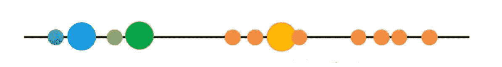
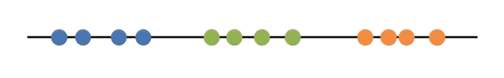
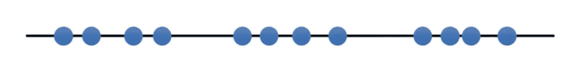

# 关于“K 均值”聚类的所有内容

> 原文：<https://medium.datadriveninvestor.com/all-about-k-means-clustering-7a2a93a3bdf9?source=collection_archive---------7----------------------->

在这篇文章中，我们将讨论**K-均值聚类**！！！

我们将学习如何对可以放在一条线上的样本进行分组。在 X-Y 图上，甚至在热图上，最后，我们还将讨论**如何为 k 选择最佳值**

想象一下，你有一些数据，你可以画在一条线上，你知道你需要把它分成 3 组。也许它们是对 3 种不同类型的肿瘤或其他细胞类型的测量。

在这种情况下，数据形成三个相对明显的集群。但是，**与其依靠我们的眼睛，不如让我们看看能否让计算机识别出**相同的 3 个星团。

为此，我们将使用 K 均值聚类。

我们将从尚未聚类的原始数据开始。

**步骤 1:** 选择您想要在数据中识别的聚类数。这就是“K-means 聚类”中的“K”。

在这种情况下，我们将选择 K=3。也就是说，我们要识别 3 个集群。

有一种更好的方法来选择“K”的值，但是我们将在后面讨论。

 [## 认知计算——一套被广泛认为是……

### 作为它的用户，我们已经习惯了科技。这些天几乎没有什么是司空见惯的…

www.datadriveninvestor.com](https://www.datadriveninvestor.com/2020/02/19/cognitive-computing-a-skill-set-widely-considered-to-be-the-most-vital-manifestation-of-artificial-intelligence/) 

**第二步:**随机选择 3 个不同的数据点。这些是最初的集群。

**步骤 3:** 测量第一个点和三个初始聚类之间的距离。

**步骤 4:** 将第一个点分配给最近的聚类。在这种情况下，最近的星团是蓝色星团。

现在对下一点做同样的事情。

我们测量距离…将该点分配给最近的集群。

现在我们弄清楚第三个点属于哪个集群。

我们测量距离…并将该点分配给最近的群集。

其余的这些点离橙色集群最近，所以它们也将进入那个集群。

现在所有的点都在集群中，我们继续…

**第五步**:计算每个聚类的**均值**。

然后，我们使用平均值重复我们刚刚做的事情(测量和聚类)**。**

***由于聚类在最后一次迭代中没有任何变化，我们完成了…***

与我们目测的结果相比，K-means 聚类非常糟糕。

我们可以通过累加每个聚类内的变化来评估聚类的质量。

这是星团内的总变化量。

由于 K-means 聚类不能“看到”最佳聚类，它唯一的选择是跟踪这些聚类，以及它们的**总方差**，并以不同的起点重新做整个事情。

所以，我们又回到了起点。

k 均值聚类**挑选** 3 个初始聚类…然后**聚类**所有剩余的点，计算每个聚类的**均值**，然后**基于**新均值**重新聚类**。它**重复**直到簇不再改变。

既然数据已经聚类，我们就要对每个聚类内的变化进行求和。

然后再做一遍…

此时，K-means 聚类知道第二次聚类是迄今为止最好的聚类。但是它不知道它是否是整体上最好的，所以它会再做几个集群(你让它做多少它就做多少)，然后如果它仍然是最好的，就返回那个集群。

**问题:**怎么算出“K”用什么值？

有了这个数据，很明显我们应该把 K 设为 3，但其他时候就不那么清楚了。

决定的一个方法是尝试不同的 k 值。

从 K = 1 开始。

K = 1 是最坏的情况。我们可以用总变差来量化它的“坏”。

现在试试 K = 2。

K = 2 更好，我们可以通过比较 2 个集群内的总变化与 K = 1 来量化好多少。

现在试试 K = 3。

K = 3 就更好了！我们可以通过将 3 个聚类内的总变化与 K = 2 进行比较来量化好多少。

现在试试 K = 4。

每个聚类内的总变化小于 K = 3 时的总变化。

每次我们添加一个新的聚类，每个聚类内的总变化都比以前小。而当每个聚类只有一个点时，变差= 0。

然而，如果我们画出每 K 值的方差减少量，那么当 K = 3 时，方差会大幅减少，但在此之后，方差不会很快下降。

这叫做一个**“肘图”**，在图中找到“肘”就可以挑选**“K”**。

**问题:****K-means**聚类和**层次聚类**有什么不同？

***K-means 聚类专门尝试将数据放入你告诉它的聚类数中。***

***层次聚类只是告诉你，两两之间，哪两个东西最相似。***

**问题**:如果我们的数据没有绘制在数字线上会怎么样？

就像以前一样，你随机选择三个点…

我们用欧几里德距离。在二维空间中，欧几里得距离与勾股定理是一回事。

然后，就像之前一样，我们将该点分配给最近的簇。

和以前一样，我们计算每个聚类的中心，然后重新聚类…

虽然这看起来不错，但计算机直到进行几次聚类后才知道。

问:如果我的数据是热图，该怎么办？

好吧，如果我们只有两个样本，我们可以把它们重命名为“X”和“Y”。然后将数据绘制成 X/Y 图。然后我们就可以像以前一样聚在一起了！

注意:我们实际上不需要绘制数据来进行聚类。我们只需要计算事物之间的距离。

即使我们有 2 个样本，或 2 个轴，欧几里德距离是:sqrt(x2 + y2)。

当我们有 3 个样本或 3 个轴时，欧几里德距离是:sqrt(x2 + y2 + z2)。

当我们有 4 个样本或 4 个轴时，欧几里德距离是:sqrt(x2 + y2 + z2 + p2)。

等等。等等。等等。

> [嘿！我们已经到了激动人心的博客文章的结尾。如果你喜欢这篇博文，并想了解更多，请在这个平台上**关注我**。](https://medium.com/@praveen.pareek)

**好吧！请在另一个时间收听另一篇激动人心的博文。**