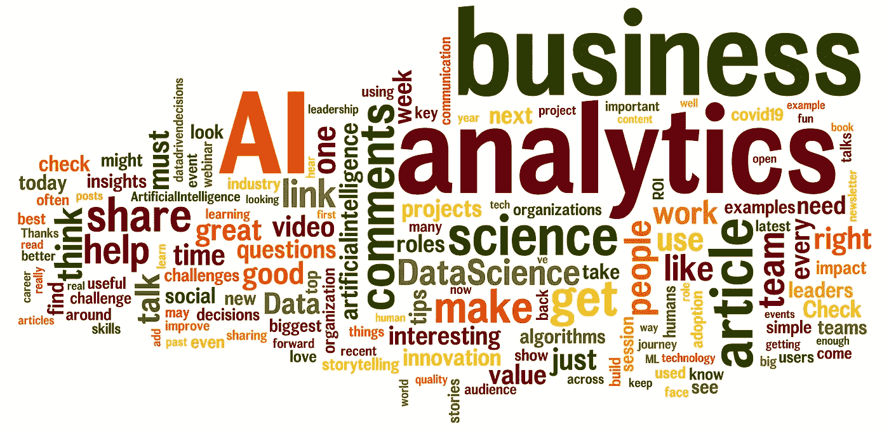

# 我在 LinkedIn 上的所有 2020 帖子

> 原文：<https://medium.datadriveninvestor.com/all-of-my-2020-posts-on-linkedin-d481564bf240?source=collection_archive---------27----------------------->

Word cloud created using all of my 2020 LinkedIn posts’ content

## 以下是我在 12 个类别中发表的 274 篇数据科学帖子的列表

到 2020 年，我平均每周发布 5 天。全年总共有 274 个职位。😀

作为年终反思的一部分，我重新审视了我在 LinkedIn 上的活动。我想了解过去的一年，做一些“分析”来找出我可以改进的地方。说说自己吃狗粮吧！🤓

一些快速统计:这些帖子总共被浏览了 780，000 次。平均每条帖子被浏览 2844 次，点赞 36 次，引发 6 条对话评论。📈

我会把我的发现单独发一个帖子。

在这里，我列出了我在 LinkedIn 上的 274 篇帖子，分类链接。这些员额分为 12 类。每篇文章都按照被浏览次数最多的文章降序排列。这篇文章的灵感来自艾莉·米勒，她也做过类似的编辑。

感谢[普拉塔普·瓦德汉](https://www.linkedin.com/in/pratapvardhan/)用一个漂亮的刮刀帮助获取数据。LinkedIn 的数据导出并没有给你带来真正有趣的原始数据。

我希望这能作为一个现成的参考，帮助你深入了解一些知识。看一看，让我知道什么最能引起你的共鸣。

# 1.数据科学趋势

*我分享数据科学趋势和行业更新的帖子:*

*   你认为 2021 年最热门的人工智能趋势应该是什么？
*   [人工智能公司不像传统创业公司那样规模化](https://www.linkedin.com/feed/update/urn:li:activity:6708326219122839552/)
*   [科技是不是让人类变傻了？](https://www.linkedin.com/feed/update/urn:li:activity:6702168572145283072/)
*   [我们没有用正确的方法来衡量人工智能的进步](https://www.linkedin.com/feed/update/urn:li:activity:6726810928710520832/)
*   [Gartner 的十大分析趋势](https://www.linkedin.com/feed/update/urn:li:activity:6684428474758815744/)
*   这本书旨在让你相信数据是极其愚蠢的！
*   不，人工智能不会改变我们的世界。直到你觉得无聊为止
*   算法是新的丑陋的中间人吗？
*   [有了人工智能，我们是不是混淆了智能和意识？](https://www.linkedin.com/feed/update/urn:li:activity:6691300913543462912/)
*   [经济衰退对数据科学行业意味着什么？](https://www.linkedin.com/feed/update/urn:li:activity:6661590139246039040/)
*   [只要机器学习是新潮的，就不会有用](https://www.linkedin.com/feed/update/urn:li:activity:6697461786955812864/)
*   [你如何让人工智能的工作人员保持积极性？](https://www.linkedin.com/feed/update/urn:li:activity:6706893276781297664/)
*   [为什么 Covid 将使人工智能在 2021 年成为主流:企业的三大趋势](https://www.linkedin.com/feed/update/urn:li:activity:6746757228344205312/)
*   [你愿意挑选你的 LinkedIn 算法的个性吗？](https://www.linkedin.com/feed/update/urn:li:activity:6708691546629308416/)
*   [你准备好在脑袋里植入芯片了吗？](https://www.linkedin.com/feed/update/urn:li:activity:6706154861345419264/)
*   [基于推理的模型能让 AI 变得更聪明吗？](https://www.linkedin.com/feed/update/urn:li:activity:6635406714881531904/)
*   [受访者处于 Covid 反应的 3 个阶段中的哪个阶段？](https://www.linkedin.com/feed/update/urn:li:activity:6665409665137991680/)
*   [为什么“公民数据科学家”被过度宣传](https://www.linkedin.com/feed/update/urn:li:activity:6646602448523845632/)
*   新冠肺炎如何改变了我们的词汇？
*   我们会不会以被降级的人类滥用升级的电脑而告终？
*   [2020 年及以后的人工智能趋势](https://www.linkedin.com/feed/update/urn:li:activity:6637533936102756352/)
*   我们被内容所淹没，但却缺乏注意力
*   COVID 将改变世界。下面是如何
*   [经济会放缓吗？](https://www.linkedin.com/feed/update/urn:li:activity:6644415930459840512/)
*   [新冠肺炎正在引领公司的数字化转型！](https://www.linkedin.com/feed/update/urn:li:activity:6650771048507719680/)
*   OpenAI 试图拯救世界背后混乱隐秘的现实
*   [人工智能仍然不具备理解人类语言的常识](https://www.linkedin.com/feed/update/urn:li:activity:6633222419932860416/)
*   [您认为未来数据科学面临的最大威胁是什么？](https://www.linkedin.com/feed/update/urn:li:activity:6727582408037736449/)
*   [2020 年，四分之一的 CX 职业人士将失去工作](https://www.linkedin.com/feed/update/urn:li:activity:6632505058795806720/)
*   你会欢迎在酒店外工作的机会吗？
*   [我们没有为摩尔定律的终结做好准备](https://www.linkedin.com/feed/update/urn:li:activity:6643368362892148736/)
*   [AI 最大的威胁是什么&数据科学？](https://www.linkedin.com/feed/update/urn:li:activity:6717401355180404736/)
*   未来一年，企业对人工智能有哪些期待？
*   你认为人们为什么不信任数据？

# 2.数据科学实施

*我在哪里谈数据科学的业务实现的帖子:*

*   [增加你在数据分析方面的投资不会改善你的决策](https://www.linkedin.com/feed/update/urn:li:activity:6725723764178386944/)
*   [什么时候不应该投资 AI？](https://www.linkedin.com/feed/update/urn:li:activity:6742051863203524608/)
*   [“为什么 ML 模型不是 100%准确”询问业务用户](https://www.linkedin.com/feed/update/urn:li:activity:6681157066083586048/)
*   [创建一个数据科学解决方案和建造一艘宇宙飞船有什么相似之处？](https://www.linkedin.com/feed/update/urn:li:activity:6720290749709111296/)
*   [从数据科学中确定投资回报的最佳方式是什么？](https://www.linkedin.com/feed/update/urn:li:activity:6724644372291358720/)
*   [高质量的数据不足以启动您的分析项目](https://www.linkedin.com/feed/update/urn:li:activity:6732986623857885184/)
*   [你的完美算法让你赔钱了吗？](https://www.linkedin.com/feed/update/urn:li:activity:6709416323262275584/)
*   [从数据科学角度衡量投资回报率的最大挑战是什么？](https://www.linkedin.com/feed/update/urn:li:activity:6723187048477458432/)
*   [你的 AI 解决方案需要人类吗？](https://www.linkedin.com/feed/update/urn:li:activity:6714137136989306881/)
*   [您应该如何确定合适的数据科学项目？](https://www.linkedin.com/feed/update/urn:li:activity:6716674803392135168/)
*   [来自分析的小“啊哈”时刻同样有价值](https://www.linkedin.com/feed/update/urn:li:activity:6693481027207249920/)
*   [为什么 Gartner 的 4 级分析经常被误解](https://www.linkedin.com/feed/update/urn:li:activity:6629962657162162176/)
*   [漫画:为什么数据科学的投资回报率和归属很难](https://www.linkedin.com/feed/update/urn:li:activity:6712677817529769984/)
*   [您在数据科学领域将面临的 5 大挑战是什么？](https://www.linkedin.com/feed/update/urn:li:activity:6739878083374964736/)
*   [你是登陆火星还是识别猫？你的人工智能需要在此基础上进行调整](https://www.linkedin.com/feed/update/urn:li:activity:6714489755842752512/)
*   只有当你用数据做一些事情时，数据才是有用的
*   [新冠肺炎打破了我们所有的 ML 模式](https://www.linkedin.com/feed/update/urn:li:activity:6668834983823622144/)
*   [仅仅为了自动化而自动化是浪费投资的良方](https://www.linkedin.com/feed/update/urn:li:activity:6709778708934250496/)
*   [你有适合 ML 的数据质量吗？](https://www.linkedin.com/feed/update/urn:li:activity:6619330576375705601/)
*   [在 COVID 期间，53%的公司拥有数据，但却难以进行分析](https://www.linkedin.com/feed/update/urn:li:activity:6668147136594489344/)
*   [你认为数据如何帮助公司安全重开？](https://www.linkedin.com/feed/update/urn:li:activity:6682251411742330880/)
*   [您的数据科学解决方案的可解释程度如何？](https://www.linkedin.com/feed/update/urn:li:activity:6711601941572587520/)
*   [应该关心 AI 可解释性吗？](https://www.linkedin.com/feed/update/urn:li:activity:6620213303970938880/)
*   [您应该如何确定最佳数据科学计划的优先级？](https://www.linkedin.com/feed/update/urn:li:activity:6706532337947074560/)
*   [有很多方法可以解决垃圾数据质量问题](https://www.linkedin.com/feed/update/urn:li:activity:6668498157711736833/)
*   [我们的答案和我们对数据提出的问题一样好](https://www.linkedin.com/feed/update/urn:li:activity:6691657978753400833/)
*   [公司如何在 Covid 期间使用假设模拟](https://www.linkedin.com/feed/update/urn:li:activity:6663624111975092224/)
*   [商家不该非要学 AI 说话。艾一定要讲商业](https://www.linkedin.com/feed/update/urn:li:activity:6625974478146977792/)
*   [为什么数据不合理的有效？需要注意哪些陷阱？](https://www.linkedin.com/feed/update/urn:li:activity:6729373366546939904/)
*   [数据科学对企业有什么价值？](https://www.linkedin.com/feed/update/urn:li:activity:6664709418355089408/)
*   [人工智能的偏见不能仅仅通过修正算法来解决](https://www.linkedin.com/feed/update/urn:li:activity:6644766047683571712/)
*   [确定您的解决方案是否真正使用人工智能的步骤](https://www.linkedin.com/feed/update/urn:li:activity:6654949871377805312/)
*   [对数据科学的追求有助于提高你的数据质量](https://www.linkedin.com/feed/update/urn:li:activity:6677199769900740608/)
*   [您如何选择合适的项目来从数据中获取价值？](https://www.linkedin.com/feed/update/urn:li:activity:6673898313814745088/)
*   [大多数数据科学项目解决了错误的问题](https://www.linkedin.com/feed/update/urn:li:activity:6669247319646515201/)

# 3.数据科学采用

*涵盖企业采用和使用数据科学的帖子:*

*   [数据素养是您分析投资的保险单](https://www.linkedin.com/feed/update/urn:li:activity:6732267198653509632/)
*   [您会信任分析洞察力来做出决策吗？](https://www.linkedin.com/feed/update/urn:li:activity:6731537069136523264/)
*   [您是否为采用您的数据项目留出了预算？](https://www.linkedin.com/feed/update/urn:li:activity:6734436175144079361/)
*   [为什么数据变更管理如此艰难？](https://www.linkedin.com/feed/update/urn:li:activity:6703618139827040256/)
*   [克服组织对数据科学的文化抵制的 4 个技巧](https://www.linkedin.com/feed/update/urn:li:activity:6701455726121947136/)
*   [加倍研究数据科学不会改善你的决策](https://www.linkedin.com/feed/update/urn:li:activity:6737339116079370240/)
*   [为什么您需要决策智能来释放数据的商业价值](https://www.linkedin.com/feed/update/urn:li:activity:6729736981355536384/)
*   [迈向数据驱动型文化的 5 个步骤](https://www.linkedin.com/feed/update/urn:li:activity:6744953755919282176/)
*   [为什么大部分数据科学项目从来不用？](https://www.linkedin.com/feed/update/urn:li:activity:6687321274483576832/)
*   [您如何确保企业采用您的分析解决方案？](https://www.linkedin.com/feed/update/urn:li:activity:6696018653458038784/)
*   [关于数据驱动的决策，刷牙能教会你什么？](https://www.linkedin.com/feed/update/urn:li:activity:6695298414114086912/)
*   [你的初创公司负责任地使用人工智能吗？](https://www.linkedin.com/feed/update/urn:li:activity:6631406004661698560/)
*   [大多数数据科学项目未被采用的 5 个原因](https://www.linkedin.com/feed/update/urn:li:activity:6621611955436220419/)
*   [如何建立数据文化？](https://www.linkedin.com/feed/update/urn:li:activity:6676086866640429056/)
*   [领养最大的拦路虎是什么？文化](https://www.linkedin.com/feed/update/urn:li:activity:6632848494883328000/)

# 4.领导力

*领导和数据主管岗位:*

*   你如何准备好想出绝妙的主意？
*   [商业领袖应该关心算法准确性吗？](https://www.linkedin.com/feed/update/urn:li:activity:6709062717627514880/)
*   [在没有战略的情况下开始数据科学就像在没有地图的情况下徒步旅行](https://www.linkedin.com/feed/update/urn:li:activity:6716306221395189761/)
*   [为什么企业在数据科学之旅的中途停滞不前？](https://www.linkedin.com/feed/update/urn:li:activity:6704344928308264960/)
*   你的领导风格会对一个完全孤立的团队产生反作用吗？
*   领导者必须提出正确的问题，而不是试图知道所有的答案
*   [领导者在追求数据科学时犯的最大错误](https://www.linkedin.com/feed/update/urn:li:activity:6699275587640442880/)
*   你知道驯狮员用他们的椅子来转移野兽的注意力吗？
*   你是来穿越沼泽还是来和所有的鳄鱼战斗？
*   [情商可以在像今天这样不确定的时候指引你](https://www.linkedin.com/feed/update/urn:li:activity:6714864396167905280/)
*   [数据科学战略如何帮助你避免失败的项目](https://www.linkedin.com/feed/update/urn:li:activity:6734806838694469633/)
*   [Gartner 调查中 CDO 报告的 5 大挑战](https://www.linkedin.com/feed/update/urn:li:activity:6734806838694469633/)
*   [只有 30%的公司调整了他们的分析&组织战略](https://www.linkedin.com/feed/update/urn:li:activity:6734806838694469633/)
*   [领导者失败人工智能项目的 3 种方式](https://www.linkedin.com/feed/update/urn:li:activity:6747485443882831872/)
*   [你对数据科学最大的挫折是什么？](https://www.linkedin.com/feed/update/urn:li:activity:6742776220418662400/)
*   [领导者是否应该推动数据的外部共享？](https://www.linkedin.com/feed/update/urn:li:activity:6693845933651759104/)
*   在压力很大的时候，把你的愤怒转化成积极的东西
*   [什么是真正的数据驱动型公司？](https://www.linkedin.com/feed/update/urn:li:activity:6686592359771246592/)
*   [数据科学领导者报告的主要障碍](https://www.linkedin.com/feed/update/urn:li:activity:6669565575762624512/)
*   [鼓舞人心的领导力故事&危机中的应变能力](https://www.linkedin.com/feed/update/urn:li:activity:6656427083079708672/)
*   [“远程”——帮助您的团队远程工作的书籍](https://www.linkedin.com/feed/update/urn:li:activity:6645154194686828544/)
*   人们不在乎你知道多少，直到他们知道你有多在乎
*   [为什么数据领袖必须在新冠肺炎期间进攻](https://www.linkedin.com/feed/update/urn:li:activity:6673549663406239744/)
*   【CDAOs 应该拥有防御性投资组合还是进攻性投资组合？
*   [您的数据科学之旅中的推拉效应](https://www.linkedin.com/feed/update/urn:li:activity:6671404244643434496/)
*   [为什么高管们在人工智能的采用上苦苦挣扎——NVP 年度调查](https://www.linkedin.com/feed/update/urn:li:activity:6621967993037484032/)
*   [拯救需要面对面互动的企业——创新](https://www.linkedin.com/feed/update/urn:li:activity:6653094094358802432/)
*   面对疫情，我们毫无准备。是时候建造了
*   [成为数字化领导者意味着什么？](https://www.linkedin.com/feed/update/urn:li:activity:6681380720780337152/)
*   【Covid 对首席数据官的角色有何影响？
*   [后 Covid 时代，数据领导者的角色有什么变化？](https://www.linkedin.com/feed/update/urn:li:activity:6659486389492596737/)

# 5.数据科学示例

*我分享现实世界中数据科学的例子和应用的帖子:*

*   愤怒的婆婆是否提高了你的电视收视率？
*   今天的人工智能有多像人？你对 GPT 3 号有什么看法
*   我用人工智能为我的 IABC 演讲写了一份摘要！
*   社交媒体上的个性化被打破。这就是它对你的伤害
*   [这就是你断章取义应用 AI 的后果！](https://www.linkedin.com/feed/update/urn:li:activity:6738060058778763264/)
*   [您的组织如何安全地欢迎员工重返工作岗位](https://www.linkedin.com/feed/update/urn:li:activity:6692407866562789376/)
*   [数据不仅能帮助你的客户赚钱，还能帮他们省钱](https://www.linkedin.com/feed/update/urn:li:activity:6670666506713538560/)
*   [你上次愚弄算法是什么时候？](https://www.linkedin.com/feed/update/urn:li:activity:6719563179992653824/)
*   [品牌如何利用人工智能获得可操作的客户情报？](https://www.linkedin.com/feed/update/urn:li:activity:6659103430797246464/)
*   [当你无法获得疫苗时，人工智能可以帮助你](https://www.linkedin.com/feed/update/urn:li:activity:6735160952611749889/)
*   [使用谷歌地图检查锁定的有效性](https://www.linkedin.com/feed/update/urn:li:activity:6654218603652530176/)
*   这些工业机器人每完成一项任务都会变得更加智能
*   从卫星图像中预测贫困是可能的
*   [社交距离是否有助于减缓 Covid 的传播？](https://www.linkedin.com/feed/update/urn:li:activity:6655290930322567168/)
*   [下面是一堆手机如何迷惑谷歌地图](https://www.linkedin.com/feed/update/urn:li:activity:6630680463931424768/)
*   我和儿子一起玩人工智能宾果游戏，这就是他学到的东西
*   [那是网飞党的辉煌创新](https://www.linkedin.com/feed/update/urn:li:activity:6652731664017485824/)
*   [漫画:为了数据科学，你会走多远？！](https://www.linkedin.com/feed/update/urn:li:activity:6707241997436014592/)
*   [toiler paper&Covid 有什么关系？](https://www.linkedin.com/feed/update/urn:li:activity:6645516441502171136/)
*   [发现新冠肺炎的深度学习网络？](https://www.linkedin.com/feed/update/urn:li:activity:6650583741100027904/)
*   [使用人工智能转变您品牌的客户体验](https://www.linkedin.com/feed/update/urn:li:activity:6633555412627017728/)
*   [你介意在机器人的社交距离上轻轻推一把吗？](https://www.linkedin.com/feed/update/urn:li:activity:6669949643591348225/)
*   [2020 年世界在搜索什么——谷歌搜索年](https://www.linkedin.com/feed/update/urn:li:activity:6743502737192882176/)
*   [今天 AI 失败在哪里？了解局限性，充分利用它](https://www.linkedin.com/feed/update/urn:li:activity:6721735798095454208/)
*   你买的不是人工智能:如何辨别真假？
*   [人工智能如何被用来对抗疫情](https://www.linkedin.com/feed/update/urn:li:activity:6646239555001339904/)
*   [我们准备好迎接沉浸式虚拟会议了吗？](https://www.linkedin.com/feed/update/urn:li:activity:6642621492511195136/)
*   [人工智能将安全返回工作场所](https://www.linkedin.com/feed/update/urn:li:activity:6695644004534550528/)
*   [为什么你的初创公司需要数据科学来度过这场危机？](https://www.linkedin.com/feed/update/urn:li:activity:6700727541335937024/)
*   [数据漫画如何讲述商业故事](https://www.linkedin.com/feed/update/urn:li:activity:6672836959376867328/)
*   [如何检测假 AI？](https://www.linkedin.com/feed/update/urn:li:activity:6653868123126587392/)
*   [人工智能正被用于大规模生产人类简介&新闻文章](https://www.linkedin.com/feed/update/urn:li:activity:6651694198753947648/)
*   这个世界在寻找什么？

# 6.数据科学团队和角色

*涵盖数据科学技能、角色和对团队至关重要的方面的帖子:*

*   [每个数据科学团队必须雇佣的 5 个角色](https://www.linkedin.com/feed/update/urn:li:activity:6736979483208761344/)
*   [你应该什么时候雇佣数据科学专家？](https://www.linkedin.com/feed/update/urn:li:activity:6728260479468273664/)
*   [对于团队来说，最大的挑战不是雇佣最优秀的人](https://www.linkedin.com/feed/update/urn:li:activity:6730812291899551745/)
*   [每个数据科学团队需要的 5 个角色是什么？](https://www.linkedin.com/feed/update/urn:li:activity:6719208634011697152/)
*   [数据科学旅程中的 8 个数据科学角色](https://www.linkedin.com/feed/update/urn:li:activity:6623791213663313920/)
*   [什么时候应该避免雇佣数据科学专家？](https://www.linkedin.com/feed/update/urn:li:activity:6730449907280359424/)
*   [漫画:在《分析学》中，你真正需要的数学技能是什么？](https://www.linkedin.com/feed/update/urn:li:activity:6670299743509364736/)
*   [我关于数据科学项目的前 3 篇文章&数据科学团队](https://www.linkedin.com/feed/update/urn:li:activity:6636469181988564992/)
*   [艺术学科与数据科学有什么关联？](https://www.linkedin.com/feed/update/urn:li:activity:6627404859719106560/)
*   [您的数据科学团队应该集中还是分散？](https://www.linkedin.com/feed/update/urn:li:activity:6674666147033489409/)
*   [每个数据科学团队必须雇佣的 3 个缺失角色](https://www.linkedin.com/feed/update/urn:li:activity:6619629845779406848/)
*   [让你在数据科学职业生涯中变得无价的 4 种超能力](https://www.linkedin.com/feed/update/urn:li:activity:6693111271690178560/)
*   [Gramener 网络研讨会:如何建立有效的数据科学团队？](https://www.linkedin.com/feed/update/urn:li:activity:6622316069228990464/)
*   [一个完整的数据科学团队需要的不仅仅是数据科学家](https://www.linkedin.com/feed/update/urn:li:activity:6629492686011330560/)
*   [何时以及如何组建你的团队](https://www.linkedin.com/feed/update/urn:li:activity:6624159789893120000/)
*   [你如何促进数据科学团队的协作？](https://www.linkedin.com/feed/update/urn:li:activity:6683303519480541184/)
*   [感觉幸运吗？这里有一个有趣的数据科学标题生成器！](https://www.linkedin.com/feed/update/urn:li:activity:6624895546941333504/)
*   [行为经济学能帮助通过分析做出更好的决策吗？](https://www.linkedin.com/feed/update/urn:li:activity:6620579383910428672/)

# 7.生产力和自我提升

*关于自我提升、演讲、阅读等的帖子:*

*   讲述睡前故事将如何提高你的公众演讲能力！
*   [是什么造就了 Linkedin 上的帖子趋势？](https://www.linkedin.com/feed/update/urn:li:activity:6685511363105734656/)
*   [教学是理解的最高形式。这样做是为了更好地学习](https://www.linkedin.com/feed/update/urn:li:activity:6715214523197911040/)
*   [摆脱生产力不佳的 3 种方法](https://www.linkedin.com/feed/update/urn:li:activity:6696740241585303552/)
*   在演讲中，你遇到的最大挑战是什么？
*   你如何处理网上的负面评论？
*   [沟通真的只是 7%的话吗？不尽然！](https://www.linkedin.com/feed/update/urn:li:activity:6688042955875397632/)
*   下面是我们挑选下一款家庭桌游的方法
*   帮助你从书籍中获得更多的 3 个技巧
*   你如何利用冒名顶替综合症为自己谋利？
*   [我为什么在 LinkedIn 上发帖？](https://www.linkedin.com/feed/update/urn:li:activity:6681511389221199873/)
*   [是什么导致你的数据科学事业停滞不前？](https://www.linkedin.com/feed/update/urn:li:activity:6686950810611445760/)
*   [你如何远程吸引你的观众？](https://www.linkedin.com/feed/update/urn:li:activity:6680061728870428672/)
*   你如何在演讲中加入幽默元素？
*   [是时候对 2020 年进行反思，并提前制定大胆的计划了](https://www.linkedin.com/feed/update/urn:li:activity:6748587132631232512/)
*   [社交帖子的字数限制是一项功能，而不仅仅是一种约束](https://www.linkedin.com/feed/update/urn:li:activity:6688786958249951232/)
*   你应该如何为你的演讲准备幻灯片？
*   [伟大的演讲者如何让演讲看起来如此轻松&毫不费力？](https://www.linkedin.com/feed/update/urn:li:activity:6675381466819526656/)
*   [洗碗机里的碗碟干净吗？下面是我儿子的黑客来了解一下！](https://www.linkedin.com/feed/update/urn:li:activity:6690219893066924032/)
*   [5 本培养新习惯的书](https://www.linkedin.com/feed/update/urn:li:activity:6702550693665943552/)
*   这里有两件事可以帮助我在阅读中获得更大的影响力
*   犯错误没关系。不要担心会搞砸
*   你在演讲时会觉得自己像个骗子吗？解决冒名顶替综合症
*   如果你是一名渴望从事人工智能职业的学生，请注册这个项目
*   你应该记住你的演讲吗？这样做有助于更好的交付
*   [我如何准备&重复使用我演讲的内容](https://www.linkedin.com/feed/update/urn:li:activity:6713414341758119936/)
*   [如何提高你的肢体语言&在谈话中的音调？](https://www.linkedin.com/feed/update/urn:li:activity:6733729611911376896/)
*   [你会在演讲前后宣传你的演讲吗？](https://www.linkedin.com/feed/update/urn:li:activity:6738791050183270400/)
*   [你如何在职业道路上保持相关性并不断成长？](https://www.linkedin.com/feed/update/urn:li:activity:6667971362579103744/)

# 8.AI 为好

*关于应用数据科学改善社会和生物多样性的帖子:*

*   [为了抗击流行病，我们需要更好的数据](https://www.linkedin.com/feed/update/urn:li:activity:6713777622830129152/)
*   [AI 能帮你和动物对话吗？](https://www.linkedin.com/feed/update/urn:li:activity:6703981226987966464/)
*   [未来 10 年，人工智能将如何影响环保？](https://www.linkedin.com/feed/update/urn:li:activity:6684064353777401856/)
*   [对观鸟感兴趣？使用这个人工智能驱动的应用程序](https://www.linkedin.com/feed/update/urn:li:activity:6634264905455321088/)
*   [建立艾的基金会，一次一只企鹅](https://www.linkedin.com/feed/update/urn:li:activity:6641385368014897152/)
*   人工智能如何拯救企鹅
*   [深度学习如何帮助统计南极洲的企鹅数量](https://www.linkedin.com/feed/update/urn:li:activity:6662533034178342912/)
*   [非政府组织如何在不破产的情况下利用人工智能](https://www.linkedin.com/feed/update/urn:li:activity:6619045108392218624/)
*   [国家企鹅日——非政府组织如何利用人工智能](https://www.linkedin.com/feed/update/urn:li:activity:6627003678089887744/)
*   [蚊子是如何被用来对付蚊子的](https://www.linkedin.com/feed/update/urn:li:activity:6676457667579416576/)
*   你如何减轻对人工智能灭绝的谈论？补充一个鲸鲨笑话！

 [## 一瞬间学会数据科学！？数据驱动的投资者

### 在我之前的职业生涯中，我是一名训练有素的古典钢琴家。还记得那些声称你可以…

www.datadriveninvestor.com](https://www.datadriveninvestor.com/2020/07/23/learn-data-science-in-a-flash/) 

# 9.数据叙事

*关于数据讲故事、信息设计、数据漫画的帖子:*

*   [数据漫画如何应用于企业](https://www.linkedin.com/feed/update/urn:li:activity:6678261199806701568/)
*   [关于数据讲故事，灰姑娘能教你什么？😉](https://www.linkedin.com/feed/update/urn:li:activity:6685860244347789312/)
*   [用数据漫画带美国总统候选人兜一圈](https://www.linkedin.com/feed/update/urn:li:activity:6715580408764928000/)
*   [各国如何利用数据应对疫情](https://www.linkedin.com/feed/update/urn:li:activity:6642965398536933376/)
*   [为什么大多数可视化只是美化了的报告](https://www.linkedin.com/feed/update/urn:li:activity:6623079571963072512/)
*   [以下是人工智能和数据故事如何激发你的观众](https://www.linkedin.com/feed/update/urn:li:activity:6678626420605906944/)
*   [从来没有人因为一个数字而做出决定。他们需要一个故事](https://www.linkedin.com/feed/update/urn:li:activity:6676802677017468928/)
*   [领导者成为故事大师的 3 种方式](https://www.linkedin.com/feed/update/urn:li:activity:6697823602332499968/)
*   这个 5000 年的历史时间线在短短 3 个月内就过时了！
*   [用数据成为讲故事高手的 3 种方法](https://www.linkedin.com/feed/update/urn:li:activity:6739147216025395200/)
*   新冠肺炎的失业状况如何？
*   信息就是力量。但是清晰更有力量。
*   [我关于数据故事和深度学习的前 3 篇文章](https://www.linkedin.com/feed/update/urn:li:activity:6636801666345684992/)
*   [用数据故事改变您的业务](https://www.linkedin.com/feed/update/urn:li:activity:6712479614272344064/)
*   [这是两周用数据漫画讲故事的样子](https://www.linkedin.com/feed/update/urn:li:activity:6699999315319943168/)
*   [Covid 如何改变美国的购物行为？](https://www.linkedin.com/feed/update/urn:li:activity:6651302147172425728/)
*   [灰姑娘如何帮助你的下一次公司演讲](https://www.linkedin.com/feed/update/urn:li:activity:6678502756237508608/)
*   [现在 NYC 最大的投诉？社交距离](https://www.linkedin.com/feed/update/urn:li:activity:6664345916268441600/)
*   [有很多新冠肺炎追踪者，但很少有真知灼见](https://www.linkedin.com/feed/update/urn:li:activity:6658915844053094400/)
*   [分析和设计如何实现商业价值](https://www.linkedin.com/feed/update/urn:li:activity:6628138316220911616/)
*   [对我在 IABC 20 周年大会上关于人工智能驱动的讲故事的演讲的反馈](https://www.linkedin.com/feed/update/urn:li:activity:6679205674502656000/)
*   [伟大的电影、演讲&有什么共同点？情感弧线](https://www.linkedin.com/feed/update/urn:li:activity:6705443613922394112/)
*   在美国，大多数人是什么时候出生的？我们能找到什么模式？
*   [以下是美国如何登上 Covid 排行榜榜首的](https://www.linkedin.com/feed/update/urn:li:activity:6653477103754895360/)

# 10.造诣

*那些我分享一些个人里程碑的时光:*

*   [我的第一篇福布斯文章:为什么你的企业需要增强智能](https://www.linkedin.com/feed/update/urn:li:activity:6724060295943249920/)
*   [我获得了 2020 年 CSuite 最佳商业领袖博客奖](https://www.linkedin.com/feed/update/urn:li:activity:6683704127463141376/)
*   [Gramener 跻身新泽西州发展最快的 50 家公司](https://www.linkedin.com/feed/update/urn:li:activity:6746394972083277824/)
*   [很高兴入围 2020 年 CSuite 奖最佳博客](https://www.linkedin.com/feed/update/urn:li:activity:6672105893800292352/)
*   [我将作为社区贡献者加入企业家项目](https://www.linkedin.com/feed/update/urn:li:activity:6694571870659891200/)
*   [格拉米纳 10 岁了！](https://www.linkedin.com/feed/update/urn:li:activity:6638502643008368640/)
*   我为一本关于公众演讲的书撰稿
*   [格拉米纳跻身印度 150 家发展最快的公司](https://www.linkedin.com/feed/update/urn:li:activity:6629230884925038592/)

# 11.事件

*关于行业活动和我的演讲活动的更新:*

*   [我们如何利用地理空间人工智能拯救数百万人的生命](https://www.linkedin.com/feed/update/urn:li:activity:6722462287380189184/)
*   [即将到来的演讲:供应链中的人工智能——宣传与现实](https://www.linkedin.com/feed/update/urn:li:activity:6740963537423794176/)
*   [报名参加学生 AI 工作坊](https://www.linkedin.com/feed/update/urn:li:activity:6681893475643887616/)
*   [在 GDS 分析峰会上与 CDAOs 的小组讨论](https://www.linkedin.com/feed/update/urn:li:activity:6736615891955458048/)
*   [罗格斯大学客座演讲:数据科学和商业价值](https://www.linkedin.com/feed/update/urn:li:activity:6660538287423315968/)
*   [在佛罗里达州 Corinium 的 CDAO Apex 举行的小组讨论](https://www.linkedin.com/feed/update/urn:li:activity:6626338053159997440/)
*   [我即将与 CSuite 进行 Instagram 实时聊天](https://www.linkedin.com/feed/update/urn:li:activity:6688415062358601728/)
*   [即将在 IABC 世界人工智能大会上发表的演讲&讲故事](https://www.linkedin.com/feed/update/urn:li:activity:6675713125485969408/)
*   [我将作为技术导师加入 SXSW 2020](https://www.linkedin.com/feed/update/urn:li:activity:6618469552768503808/)
*   [下周 CDAO 活动中即将举行的小组讨论](https://www.linkedin.com/feed/update/urn:li:activity:6657100013874798592/)
*   [你如何打破数据科学团队中的孤岛？](https://www.linkedin.com/feed/update/urn:li:activity:6673196136586629120/)
*   [在 IQPC CDAO 交流活动上，我们的专家小组发表了真知灼见](https://www.linkedin.com/feed/update/urn:li:activity:6658568068144381952/)
*   [你如何确保人工智能带来投资回报？](https://www.linkedin.com/feed/update/urn:li:activity:6671955855040159744/)
*   [呼入 2020 喇叭已呼出](https://www.linkedin.com/feed/update/urn:li:activity:6620787455836639233/)
*   [cdao 应该了解哪些关于数据故事的知识 Corinium 的 Gramener](https://www.linkedin.com/feed/update/urn:li:activity:6625214026148298752/)
*   [学习如何用 Powerpoint 讲述更好的故事](https://www.linkedin.com/feed/update/urn:li:activity:6640607568446181376/)
*   [Nasscom Panel:人工智能商业价值的本质是什么？](https://www.linkedin.com/feed/update/urn:li:activity:6671035226971545600/)
*   [网络研讨会:用数据证明你的企业不衰退](https://www.linkedin.com/feed/update/urn:li:activity:6662894612044148736/)

# 12.更新

关于所有其他更新和一些不属于任何其他类别的帖子:)

*   [工作提醒—格拉曼纳咨询公司的首席数据顾问](https://www.linkedin.com/feed/update/urn:li:activity:6713040187926081536/)
*   [招聘 Gramener 的内容营销总监](https://www.linkedin.com/feed/update/urn:li:activity:6675001571379576832/)
*   [我们家最近最爱的游戏——冒险](https://www.linkedin.com/feed/update/urn:li:activity:6698181052734726144/)
*   想要尝试数据漫画吗？加入动漫节
*   [我在普林斯顿大学的客座演讲“商业预测”](https://www.linkedin.com/feed/update/urn:li:activity:6663993382475444224/)
*   [格拉米纳如何促进性别多样性](https://www.linkedin.com/feed/update/urn:li:activity:6705894503552749568/)
*   [发布 Gramener 的数据科学白板系列](https://www.linkedin.com/feed/update/urn:li:activity:6710865861562961920/)
*   [COVID:关于你现在必须如何行动的便捷指南](https://www.linkedin.com/feed/update/urn:li:activity:6644073909153001472/)
*   [我第二年指导 NASSCOM 女性技术领导者](https://www.linkedin.com/feed/update/urn:li:activity:6702906265938530304/)
*   [漫画:下雨了 webinars！](https://www.linkedin.com/feed/update/urn:li:activity:6687685213729955840/)
*   [奥莱利关闭了现场会议业务](https://www.linkedin.com/feed/update/urn:li:activity:6649854583197745152/)
*   [Gramener 正在寻找一名数据科学经理](https://www.linkedin.com/feed/update/urn:li:activity:6652369234083008512/)
*   [WWRT Nasscom 即将推出的指导计划](https://www.linkedin.com/feed/update/urn:li:activity:6647328697718231040/)
*   我们现在是生活在计算机模拟中吗？！
*   [我给 Nasscom 的女性科技领导者开的辅导会议](https://www.linkedin.com/feed/update/urn:li:activity:6649131183059845120/)
*   [犹太大学硕士研究生奖学金](https://www.linkedin.com/feed/update/urn:li:activity:6677546766281265152/)
*   这是检疫隔离的第 15 天。下面是我们的计划
*   [2019 年的反思和 2020 年的规划](https://www.linkedin.com/feed/update/urn:li:activity:6618362799049502721/)

要了解我 2021 年的最新动态，请在 LinkedIn 上关注我。请分享你最喜欢的类别！

**进入专家视角—** [**订阅 DDI 英特尔**](https://datadriveninvestor.com/ddi-intel)