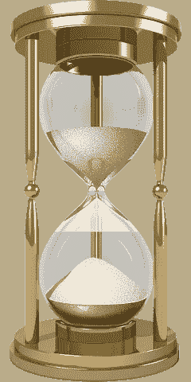

# 我们所有的昨天:对时间的感知

> 原文：<https://medium.datadriveninvestor.com/all-our-yesterdays-the-perception-of-time-ff5fef026921?source=collection_archive---------18----------------------->

## 总的来说。

从人类感知的角度来看，时间的体验似乎是相对的。

对时间的体验可以被定义为一个时时刻刻思考的心理序列；对时间的回忆可以被定义为对那个序列的记忆。这些时间测量(前瞻性和回顾性)并不相同。

时间的速度，以事件的流动来衡量，可以被体验为旋风或无精打采，这取决于一个人的心理解释。类似地，在一系列事件发生后，根据人类的感知，对时间流逝的估计可以是最近的，也可以是很久以前的。

各种研究表明，儿童经历时间流逝的速度比成人慢。研究表明，与年长的同龄人相比，孩子们的大脑受到更大的精神刺激。童年时期对新数据的强烈吸收和学习包含了更丰富的经验，使时间看起来更长。

成人和儿童在时间观念上的差异的另一个可能的原因可以在“比例”论点中找到，该论点认为，与成人生活中的相同时间相比，儿童生活中的特定时间在整个生活中占据更大的百分比。这个论点似乎是一个版本的[德尔波夫错觉](https://www.npr.org/sections/thesalt/2012/01/28/145865238/deception-diet-how-optical-illusions-can-trick-your-appetite)，除了它是关于时间，而不是光学效应。

不管年龄大小，在“有趣”的情况下，对时间的估计似乎比正常情况下要快。(“开心的时候时间过得很快。”)这个悖论怎么解释？也许“有趣”的情境并不能激发儿童同样程度的批判性学习。也许另一个原因是情绪化的:*你不希望时间结束。*

加州大学圣巴巴拉分校心理学和脑科学系的博士后研究员詹姆斯·m·百老汇和布兰妮·桑多瓦尔认为，公认的解释是“从事一项新奇的冒险活动会让时间过得更快。但如果我们以后还记得那次活动，它似乎会比更世俗的经历持续更长时间。”

或许类似的解释也适用于无聊，如果以相反的形式呈现的话:如果从事一项无聊的工作使时间过得更慢，那么也许以后人们会记得它持续的时间似乎更短。无聊是由缺乏新奇刺激引发的。不像看似转瞬即逝的无梦睡眠，无聊似乎会阻碍我们的精神时间流逝。也许无聊的一段时间应该在小睡中度过——或者，更好的是，在学习新东西中度过。

如前所述，对时间的体验和对时间的回忆似乎并不相同。对老年人来说，随着时间的推移，“仿佛就在昨天”这句话有了新的含义。

换句话说，随着时间的推移，过去事件之间的时间流逝速度也在增加。结果是:看起来好像一个事件发生在更短的时间之前。在生命的时间流逝中，从一个序列到另一个序列存在的时间片段可能反映了一个人对时间的整体感知。

时间似乎是可塑的。爱因斯坦在一篇名为《相对论》的数学论文中确立了他对时间的直觉。正如爱因斯坦的方程式所证明的那样，人类的思维不是一个时空可以扭曲的物理宇宙。但事实上，我们对时间的感知会经历各种各样的扭曲，并经常被隐藏的惊喜所缠绕。

也许，对于我们当中最古老和最聪明的人来说，我们对时间的感知可以为我们的实际利益所用。老年人的时间膨胀效应可能被操纵；它甚至可能被预先阻止。一个人永远不会老到无法以更有成效的方式管理时间的流动。延伸我们的昨天，或拓宽我们的明天的关键，可能在于寻找大胆的、不可预测的、刺激的和新的事物。

**关于约翰·迪普雷特**

作者对心理中枢，知觉和运动技能，医学假说，科学和技术的推测，以及其他渠道做出了贡献。他的网站是 MindBluff.com 的。

[最初发表于心理中心](https://psychcentral.com/blog/all-our-yesterdays-the-perception-of-time/)