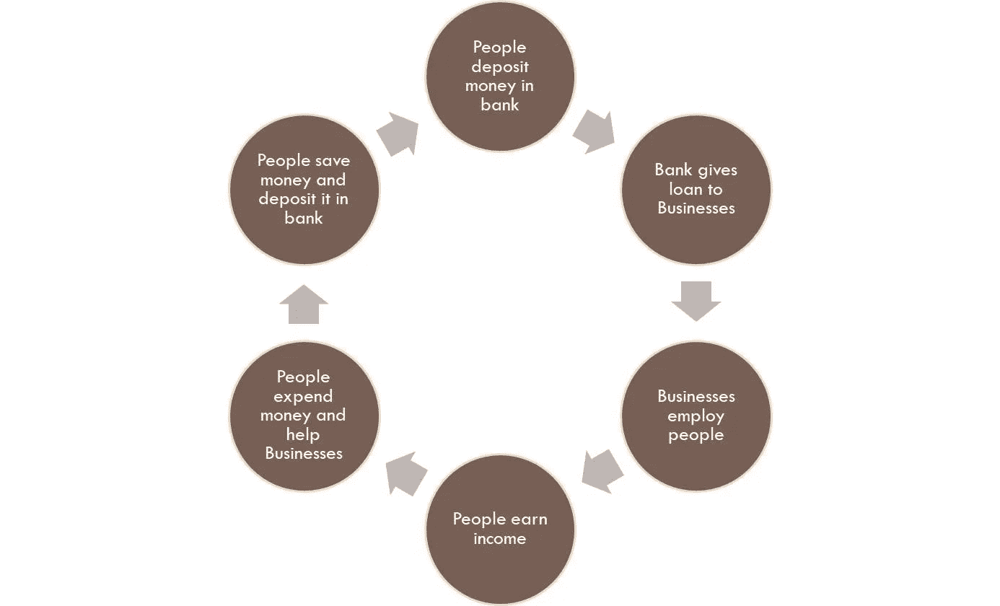

# 闪光的未必都是金子

> 原文：<https://medium.datadriveninvestor.com/all-that-glitters-is-not-gold-50f32313372d?source=collection_archive---------1----------------------->

## 购买实物黄金如何危害经济！

Photo by [rupixen.com](https://unsplash.com/@rupixen?utm_source=medium&utm_medium=referral) on [Unsplash](https://unsplash.com?utm_source=medium&utm_medium=referral)

印度是世界上最大的黄金进口国，年消费量为 800-900 吨。在像 [Akshaya Tritiya](https://en.wikipedia.org/wiki/Akshaya_Tritiya) 这样的节日购买黄色金属已经成为一种传统。“Akshaya”象征着永无止境的繁荣、希望、欢乐和成功。“Tritiya”表示月亮的第三阶段，是庆祝节日的时候。每次有人买金饰或者首饰，我都觉得不对劲。原因很简单。我认为黄金在某种程度上是 T4 锁定的投资。

让我们用更简单的方式来理解这一点。这是一个简单的循环，

(created by author in MS powerpoint)

1.  你赚了钱，把积蓄作为‘定期存款’存在银行。这笔钱不会闲置。银行用你的钱借给企业。
2.  企业投资这些钱，建立工厂，让生产运转起来。
3.  这创造了就业机会。就业和产出增加，经济繁荣。
4.  人们因此赚到了钱，他们再次把钱存在银行里。

你拿到钻头了，对吧？

现在，考虑一个案例，一个人想把他的钱用于购买实物黄金。一个人购买黄金的那一刻，资金就在某种程度上被冻结了。流通不畅。当然，当一个人购买珠宝时，店主会赚到钱，并让它回到流通中，但黄金作为一种资产不会给你带来任何回报，它不会像任何金融资产一样给你带来利息。**是不毛之地。**

你把钱存入银行，它给你带来利息，这些利息可以投入使用，这些钱再次进入流通。股票也是如此，你可以将股息作为收入。但是，黄金却不是这样。

黄金还有流动性等其他问题。比如说，一个人给妻子买黄金首饰。乍看起来，人们可能会将此视为对黄金的投资。但是，你见过多少次这样的人敢问他的妻子:“亲爱的，你看黄金价格一直都很高。”。让我们卖掉我前几天给你买的那套珠宝吧！

在印度，出售黄金首饰和饰品是不被允许的。出售这些资产被认为是最后的手段。只有在现金短缺的最坏情况下，才会这样做。我觉得，这也是一个普遍的东西。

因此，无论何时金价上涨，购买金饰的人都只有名义上的收益。除非你卖掉它，帮助经济增长，否则钱是不会转手的。这对整体经济不利。

在印度，黄金是代代相传的。人们以这样做为荣。你看，黄金从来都不容易卖出去。

1998 年，在哈佛大学的一次会议上，沃伦·巴菲特说:

> **它是在非洲或其他地方被挖出来的。然后我们把它熔化，再挖一个洞，再埋起来，并雇人站在周围看守它。它没有效用。任何从火星上观看的人都会挠头。**

在 2012 年美国消费者新闻与商业频道的[采访中，他总结道:](https://www.cnbc.com/2012/05/07/cnbc-transcript-warren-buffett-on-squawk-box.html)

> 如果你今天购买一盎司黄金，并持有一百年，你可以每天去那里，你可以抚摸它，你可以爱抚它，你可以抚弄它，一百年后你将拥有一盎司黄金，它不会为你做任何事情。
> 
> 如果你买一百亩农田，它每年都会为你生产。你可以用这笔钱购买更多的农田。你可以做各种各样的事情。但是在 100 年内，它会为你生产东西，在 100 年后，你仍然有 100 英亩的农田。

你现在可以说是世界上最理智的投资者了。他说得很有道理。

# 黄金与黄金债券

当我们将资金投入黄金债券，而不是购买实物形式的黄金时，情况就完全不同了。

当你购买黄金债券时，你从中获得利息收入。你可以用无数种方式使用这些收入。

你可以买东西，这将成为另一个人的收入，资金循环继续运转。你可以把这笔钱投资到银行，这又会促进循环流动。你受益，经济也受益。这是双赢的局面。

债券可以很容易地出售，不像实物黄金，其销售，如前所述，是不赞成的。

政府知道这一点。因此，在印度，你可以看到政府出台了一些计划，这些债券的利息收入是免税的。此外，出售债券产生的资本收益是免税的。

像印度这样的国家，如前所述，痴迷于黄金，每进口一次黄金，就有一次美元外流。这不仅会对外汇产生相当大的影响，还会减缓资金的循环流动。这真是祸不单行！

每次黄金进口激增时，政府都会通过提高进口关税，在抑制进口方面发挥重要作用。

2013 年，时任财政部长不得不敦促印度人民不要购买黄色金属。

 [## 不要购买黄金，奇丹巴拉姆呼吁公民-印度时报

### 新德里:财政部长 P·奇丹巴拉姆周四敦促公民抵制购买黄金的诱惑，并表示…

timesofindia.indiatimes.com](https://timesofindia.indiatimes.com/business/india-business/Dont-buy-gold-P-Chidambaram-urges-citizens/articleshow/20582677.cms) 

但是，人们从未停止投资黄金，这是一种未来仍将存在的资产类别。

人们投资黄金时感到安全。黄金价格的历史就是支持这一论点的证据。

即使在经济困难的时候，企业不赚钱，股票暴跌，但黄金继续发光。

嗯，这就是等式。当一切都没用的时候，把钱投入黄金。这就是黄色金属保持活力的原因！