# 机器学习所需的所有概率基础知识

> 原文：<https://medium.datadriveninvestor.com/all-the-probability-fundamentals-you-need-for-machine-learning-93a177dc9aea?source=collection_archive---------1----------------------->

## 假设你读了这篇文章，你的概率基础知识为 ML 做好准备的概率是 100%。

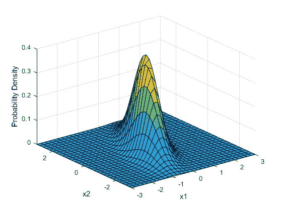

机器学习就是做预测。从给定一些特征来预测房屋价格，到基于单细胞测序来确定肿瘤是否是恶性的。这些预测只是预测，即从数据中发现的相关性中导出的输出值，而不是真实世界中会发生的确定值或事件。

因此，我们可以将机器学习视为在给定特定输入或公认相关性的情况下输出最有可能或概率性的结果(几乎类似于条件概率 P(x|y)。因此，在更深层次上理解机器学习需要对概率论有扎实的理解；虽然许多使用机器学习的人只是将其作为一个“黑箱”(他们不关心模型如何得出预测，只关心预测本身)，但其他人关心的是理解 ML 模型如何做出预测，并使用这种对 ML 模型如何学习的理解，以便在更深的层次上理解他们正在研究的过程的机制。

ML 中的许多“学习”过程实际上来自概率和概率分布，因此，理解这些概念背后的数学将允许我们在更深的层次上理解机器学习。

在这一部分，我将讲述高中水平的统计数据——如果你已经熟悉简单形式的条件概率和高斯分布，你可以继续下一部分。

想象一下，你在一架飞机上，你试图预测它在特定时间到达目的地的概率。**首先**你需要做的是理解不确定性的来源(波动的变量),这将改变到达时间。一些例子包括:

*   动荡
*   更多的空中交通
*   闪电
*   其他恶劣天气

这被称为被建模系统的固有随机性。其他类型的不确定性源于不完全的可观测性——在我们的情况下，这可能意味着你可能无法预测即将到来的空中交通流量。最后，不完整的建模，你可能会遗漏很多变量。

上面的每个变量都由一个**随机变量**表示，它可以取多个值，每个值出现的概率都不同。

概率密度函数和质量函数分别用于连续函数和离散函数。

例如，如果 X 是特定湍流量的随机变量，那么 P(X=x)是随机变量 X 取该特定值的概率。

 [## 认知计算——一套被广泛认为是……

### 作为它的用户，我们已经习惯了科技。这些天几乎没有什么是司空见惯的…

www.datadriveninvestor.com](https://www.datadriveninvestor.com/2020/02/19/cognitive-computing-a-skill-set-widely-considered-to-be-the-most-vital-manifestation-of-artificial-intelligence/) 

联合概率分布类似于正态分布，除了现在，你试图封装两个变量的随机性，所以

> P(x，y) = P(X=x，Y=y)

本质上是两个变量取特定值的概率。

现在，如果我告诉你，当你在飞机上飞行时，你到达目的地的概率是 0.0000000001，你可能不会相信我，但你必须考虑到这样一个事实，那就是有足够的燃料让你到达目的地，而且飞机已经进行了维修检查。

> p(您将准时到达目的地|燃油已加满，修理已完成)

这叫做条件概率。

# 分布类型

# 高斯分布

好的——现在有很多数学上表示分布的方法。最常见的方法是围绕高斯分布(或正态分布)，正态这个名称很合适，因为它是最常用于近似其他分布的分布。

您可以使用下面的表达式在笛卡尔坐标上绘制方程:

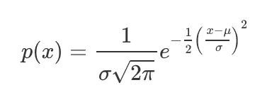

适马和分别代表总体标准差和均值。

假设我们想一次画出两个或三个变量的分布。事情变得很快。这是二维高斯分布的样子。

Two dimensional multivariate gaussian distribution, where x1 and x2 represent the values of the two random variables

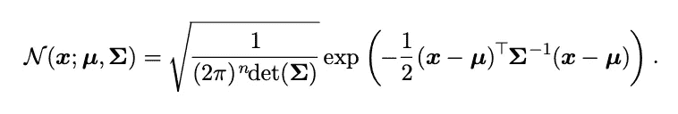

The equation for a multivariate gaussian distribution

这里，我们不仅要理解一个变量的“标准差”，还要理解变量之间的关系。换句话说，回到我们的飞机例子，如果湍流更高，这是否意味着更有可能发生不好的情况？我们使用协方差矩阵，其中协方差由下面的公式表示。

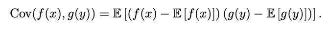

本质上，你是在乘以两个随机变量的标准差，看看它们是如何相互缩放的(它们是如何相互依赖的)。

# 拉普拉斯分布

如果我们把高斯和拉普拉斯分布想象成山丘，高斯分布有一个平滑的顶点。换句话说，如果你把一个球放在顶部，它会开始平稳地滚动，然后加速离开。

另一方面，拉普拉斯分布有一个非常尖锐的顶点，位于顶点的球会立即开始加速。

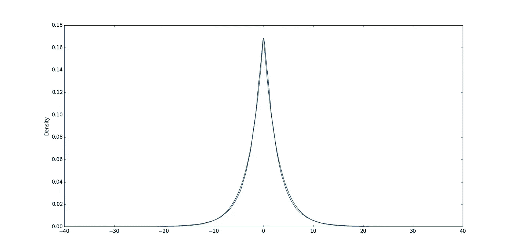

信息论就是关于一组给定的值和概率能捕获多少信息。

例如，如果我告诉你，你今天会呼吸，你会感到惊讶吗？可能不会，因为你有 99.99999%的机会活下来。因此，这条信息具有**低**的信息含量。另一方面，其他信息具有更高的信息含量——可能性越小，信息就越多。

举个例子，如果我告诉你夏天的某一天要下雪了，那条信息的信息量就超高。

让我们更正式地定义信息(它在数学中的含义)。

我们可以通过取特定概率的负对数来计算信息量。

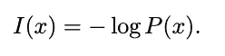

Equation for self-information content

现在，夏天真的会下雪的概率非常非常小(比如 0.0001%会下雪，99.9999%不会下雪)。因此，我们获得高水平信息的可能性非常非常低。

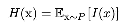

为了预测包含的平均或预期信息量，我们从一个分布中找到从一个事件中提取的**预期**信息量。

现在，为什么信息在机器学习中很重要？有时，我们输入一个概率分布，得到另一个概率分布作为输出，两者都是关于同一个随机变量 x，我们想看看这些分布彼此有多相似。

在**变分自动编码器**的情况下，它接受一个分布作为输入，尝试将其编码为几个潜在变量，然后解构回来尝试重新创建原始分布，重要的是要看看新的分布比旧的原始分布具有更多或更少的信息。

我们可以通过检查新的分布是否具有更高的信息含量来检查模型是否真正“学习”了任何东西。我们可以使用 **KL(Kullback-Leibler)散度来衡量这一点。**

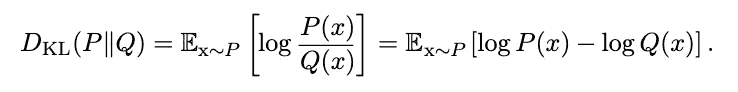

Equation for Kuller-Leibler Divergence

# 结构化概率模型

结构化概率模型(具有节点和边)用于表示多个变量之间的相互作用以及与它们相关联的条件概率。

例如，看看下面的结构化概率模型。节点由小写字母表示，有向边表示条件关系。换句话说，c 以 b 上的 a 为条件，因为 a 和 b 的箭头指向它。

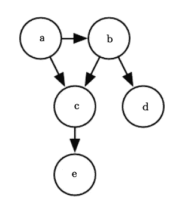

我们可以通过查看每个变量的条件概率的乘积来表示找到所有五个变量的某个组合的概率。

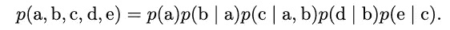

“给定”符号右边的变量表示提供有向箭头的节点。

**无向模型**不需要有向边(带箭头)。它们只是在变量之间有代表依赖/关系的线。

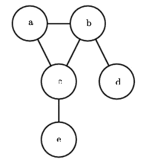

Undirected probablistic model for the five variables above

无向模型中的每个**集团**都由互相连接的节点组成。比如上图中，a，b，c 是一个小团体。每个集团都有一个与之相关联的唯一函数，从中可以导出一个**因子**。

就是这样——你需要知道的关于机器学习的概率:)