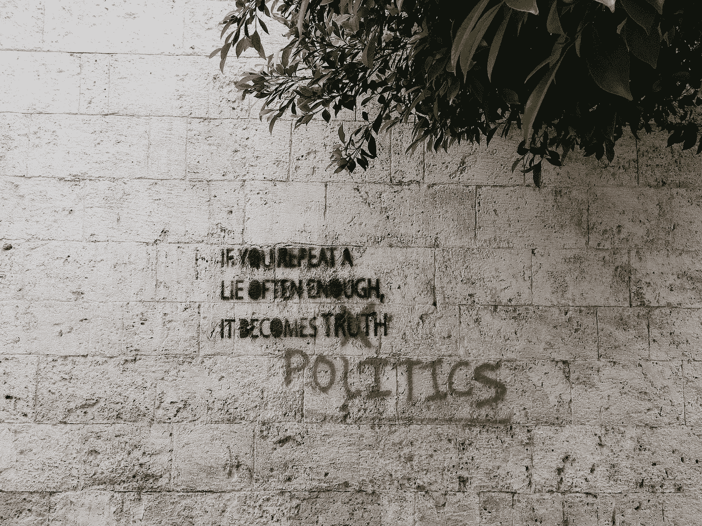

# 让对手来定义我们

> 原文：<https://medium.datadriveninvestor.com/allowing-opponents-to-define-us-24b21df416a?source=collection_archive---------28----------------------->

Photo by [Brian Wertheim](https://unsplash.com/@brianwertheim?utm_source=unsplash&utm_medium=referral&utm_content=creditCopyText) on [Unsplash](https://unsplash.com/s/photos/lie?utm_source=unsplash&utm_medium=referral&utm_content=creditCopyText)

我是一群绅士中的一员，他们每周聚会一次，讨论我们当下感兴趣的各种话题。我们大多是白人、退休的男性专业人士，他们认为自己是进步的，但这并不意味着我们都有相同的想法和观点。在国会大厦被攻占后的第二天早上，我们进行了一场热烈的讨论。随着会议的进行，一些评论引起了我的注意。该团体中的一些人将民主党的进步派称为极左和极左。我们小组中的另一个人后来称伯尼·桑德斯和他提倡的计划是激进的。

在这些评论中，最能给我启示的是，它如何突出了右翼在定义反对派并将其置于最负面的环境中所取得的压倒性成功。更令人不安的是看到他们的成功标签如何渗透到民主党的中间派和自由派温和派。证据是，他们认为民主党联盟中最进步的部分过于激进、极端和极左。

共和党人认为民主党，不管它变得多么保守，都是激进的、社会主义的和一群共产主义者。至少从 LBJ 开始，右翼在他们的标签努力中的成功在民主党的右翼运动中是显而易见的。其拥抱新自由主义的政策和思想是对劳动力、劳动穷人、穷人和贫困者的抛弃。这是对我年轻时拥护这个政党的所有理由的抛弃。

更保守的民主党人断言伯尼·桑德斯、他的想法和追随者是激进或极端的，这表明右翼在定义民主党方面是多么成功。从全球范围来看，伯尼·桑德斯充其量可能是一个自由派温和派。从长远来看，值得记住富兰克林·罗斯福在 1944 年 1 月 11 日的国情咨文中提出的第二项权利法案。它包括:

在国家的工业、商店、农场或矿场获得有用和有报酬的工作的权利；

有权赚取足够的收入以提供足够的食物、衣服和娱乐；

每个农民都有权种植和出售自己的产品，以获得回报，使自己和家人过上体面的生活；

每个商人，无论大小，都有权在不受国内外不公平竞争和垄断支配的环境中进行贸易；

每个家庭拥有体面住房的权利；

获得充分医疗保健的权利以及获得和享受良好健康的机会；

有权得到充分保护，免受年老、疾病、事故和失业的经济恐惧；

接受良好教育的权利。

当你比较罗斯福的第二个权利法案和桑德斯的提议时，你可能会注意到相似之处。桑德斯增加了环境和气候变化问题，并更新或重申了罗斯福 76 年前提出的许多内容。罗斯福是激进分子吗？1944 年民主党是激进分子吗？当然，共和党人是这么认为的。他们总是这样，所以我们为什么要关心？我们不应该问发生了什么吗？为什么我们美国人没有实施这个星球上所有其他发达国家都接受的保护措施和项目？我们未能做到这些事情，导致了这一时刻。

在米奇·麦康奈尔成功引导艾米·科尼·巴雷特提名通过参议院进入最高法院后，一个笑话出现了。事情是这样的:民主党人被锁在一个房间里，给他们许多颜色的油漆。麦康奈尔这样做了，因为他知道他们会无休止地争论使用什么颜色，而不会费心去开门。这是对当前民主党领导层的严厉批评..

此时此刻，民主党人无法就摆脱奴隶时代的阻挠议事规则达成一致，并受到麦康奈尔和共和党人的威胁，要求他们放弃急需的项目。当共和党人迅速将未遂政变造成的灾难转化为战斗口号时，他们在深思。当民主党人目瞪口呆地坐着时，他们正在重新定义我们眼前发生的事情。

这是一个敏锐的观察，提出了一个重要的观点。民主党人花很多时间互相争斗。更重要的是，他们通过允许共和党人定义他们是谁和他们是什么来做到这一点。

袭击国会大厦的暴乱分子、想要革命的人和群众追随者表现出他们的愤怒、沮丧和可悲的无知，给我们提出了一个不容易解决的问题。在我们目睹了这些之后，现在的共和党不能被委托执政。民主主义者必须找到勇气来掌控一切，而不是被右翼所左右和定义。

可悲的是，最近的报道和评论表明，麦康奈尔仍然控制着参议院，操纵民主党人为所欲为。约翰·C·卡尔霍恩在 19 世纪 40 年代首次使用了阻挠议事的手段来保护奴隶的利益，但未能消除这种手段对于实施有意义的变革来说并不是一个好兆头。

如果你不使用权力，它就毫无价值。民主党人需要掌握和控制信息。他们需要定义自己，不允许自己被共和党人和右翼媒体贴上标签。在如此多的事情处于危险之中的时候，胆怯不是一个选择。我们的未来岌岌可危，我们中间的极端分子威胁着我们的生命。

也可在 jerrymlawson.com 买到