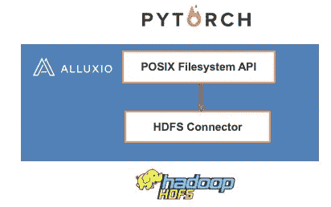

# Alluxio 深度学习实践— 1:在 HDFS 上运行 PyTorch 框架

> 原文：<https://medium.datadriveninvestor.com/alluxio-deep-learning-practices-1-running-pytorch-framework-on-hdfs-904b5789d97?source=collection_archive---------3----------------------->


*作者毕然*

# 背景

谷歌的 TensorFlow 和脸书的 PyTorch 是社区中两个流行的深度学习框架。虽然 PyTorch 相对较新，但由于其开发人员友好的体验，它已经得到了快速发展。但是，PyTorch 默认不允许在 [Hadoop 分布式文件系统](https://www.alibabacloud.com/products/emapreduce) (HDFS)中直接训练模型。这给许多在 HDFS 存储数据集的用户带来了困难。因此，对于训练模型，用户需要从 HDFS 导出数据或修改 PyTorch 的源代码以支持 HDFS 协议。这一复杂的过程极大地损害了用户体验。

相比之下，Alluxio 能够将 HDFS API 翻译成 POSIX 文件系统 API。这个特性将 PyTorch 开发人员从修改计算框架的需要中解放出来，因此极大地提高了开发效率。



本文描述了如何在 [Kubernetes](https://www.alibabacloud.com/product/kubernetes) 环境中验证整个工作。

# 准备 HDFS 2.7.2 环境

如果没有可用的现有 HDFS 集群，请使用 Helm Chart 直接安装 HDFS。

1)用 Hadoop 2.7.2 安装舵图。

```
git clone https://github.com/cheyang/kubernetes-HDFS.gitkubectl label nodes cn-huhehaote.192.168.0.117 hdfs-namenode-selector=hdfs-namenode-0
#helm install -f values.yaml hdfs charts/hdfs-k8s
helm dependency build charts/hdfs-k8s
helm install hdfs charts/hdfs-k8s \
      --set tags.ha=false  \
      --set tags.simple=true  \
      --set global.namenodeHAEnabled=false  \
      --set hdfs-simple-namenode-k8s.nodeSelector.hdfs-namenode-selector=hdfs-namenode-0
```

2)检查舵图的状态。

```
kubectl get all -l release=hdfs
```

3)使用 HDFS 命令行界面客户端连接到 HDFS。

```
kubectl exec -it hdfs-client-f5bc448dd-rc28d bash
root@hdfs-client-f5bc448dd-rc28d:/# hdfs dfsadmin -report
Configured Capacity: 422481862656 (393.47 GB)
Present Capacity: 355748564992 (331.32 GB)
DFS Remaining: 355748515840 (331.32 GB)
DFS Used: 49152 (48 KB)
DFS Used%: 0.00%
Under replicated blocks: 0
Blocks with corrupt replicas: 0
Missing blocks: 0
Missing blocks (with replication factor 1): 0-------------------------------------------------
Live datanodes (2):Name: 172.31.136.180:50010 (172-31-136-180.node-exporter.arms-prom.svc.cluster.local)
Hostname: iZj6c7rzs9xaeczn47omzcZ
Decommission Status : Normal
Configured Capacity: 211240931328 (196.73 GB)
DFS Used: 24576 (24 KB)
Non DFS Used: 32051716096 (29.85 GB)
DFS Remaining: 179189190656 (166.88 GB)
DFS Used%: 0.00%
DFS Remaining%: 84.83%
Configured Cache Capacity: 0 (0 B)
Cache Used: 0 (0 B)
Cache Remaining: 0 (0 B)
Cache Used%: 100.00%
Cache Remaining%: 0.00%
Xceivers: 1
Last contact: Tue Mar 31 16:48:52 UTC 2020
```

4)配置 HDFS 命令行界面客户端。

```
[root@iZj6c61fdnjcrcrc2sevsfZ kubernetes-HDFS]# kubectl exec -it hdfs-client-f5bc448dd-rc28d bash
root@hdfs-client-f5bc448dd-rc28d:/# cat /etc/hadoop-custom-conf
cat: /etc/hadoop-custom-conf: Is a directory
root@hdfs-client-f5bc448dd-rc28d:/# cd /etc/hadoop-custom-conf
root@hdfs-client-f5bc448dd-rc28d:/etc/hadoop-custom-conf# ls
core-site.xml  hdfs-site.xml
root@hdfs-client-f5bc448dd-rc28d:/etc/hadoop-custom-conf# cat core-site.xml
<? xml version="1.0"? >
<? xml-stylesheet type="text/xsl" href="configuration.xsl"? >
<configuration>
  <property>
    <name>fs.defaultFS</name>
    <value>hdfs://hdfs-namenode-0.hdfs-namenode.default.svc.cluster.local:8020</value>
  </property>
</configuration>
root@hdfs-client-f5bc448dd-rc28d:/etc/hadoop-custom-conf# cat hdfs-site.xml
<? xml version="1.0"? >
<? xml-stylesheet type="text/xsl" href="configuration.xsl"? >
<configuration>
  <property>
    <name>dfs.namenode.name.dir</name>
    <value>file:///hadoop/dfs/name</value>
  </property>
  <property>
    <name>dfs.namenode.datanode.registration.ip-hostname-check</name>
    <value>false</value>
  </property>
  <property>
    <name>dfs.datanode.data.dir</name>
    <value>/hadoop/dfs/data/0</value>
  </property>
</configuration>
root@hdfs-client-f5bc448dd-rc28d:/etc/hadoop-custom-conf# hadoop --version
Error: No command named `--version' was found. Perhaps you meant `hadoop -version'
root@hdfs-client-f5bc448dd-rc28d:/etc/hadoop-custom-conf# hadoop -version
Error: No command named `-version' was found. Perhaps you meant `hadoop version'
root@hdfs-client-f5bc448dd-rc28d:/etc/hadoop-custom-conf# hadoop version
Hadoop 2.7.2
Subversion https://git-wip-us.apache.org/repos/asf/hadoop.git -r b165c4fe8a74265c792ce23f546c64604acf0e41
Compiled by jenkins on 2016-01-26T00:08Z
Compiled with protoc 2.5.0
From source with checksum d0fda26633fa762bff87ec759ebe689c
This command was run using /opt/hadoop-2.7.2/share/hadoop/common/hadoop-common-2.7.2.jar
```

5)验证 HDFS 上的基本文件操作。

```
# hdfs dfs -ls /
Found 1 items
drwxr-xr-x   - root supergroup          0 2020-03-31 16:51 /test
# hdfs dfs -mkdir /mytest
# hdfs dfs -copyFromLocal /etc/hadoop/hadoop-env.cmd /test/
# hdfs dfs -ls /test
Found 2 items
-rw-r--r--   3 root supergroup       3670 2020-04-20 08:51 /test/hadoop-env.cmd
```

6)下载数据。

```
mkdir -p /data/MNIST/raw/
cd /data/MNIST/raw/
wget http://kubeflow.oss-cn-beijing.aliyuncs.com/mnist/train-images-idx3-ubyte.gz
wget http://kubeflow.oss-cn-beijing.aliyuncs.com/mnist/train-labels-idx1-ubyte.gz
wget http://kubeflow.oss-cn-beijing.aliyuncs.com/mnist/t10k-images-idx3-ubyte.gz
wget http://kubeflow.oss-cn-beijing.aliyuncs.com/mnist/t10k-labels-idx1-ubyte.gz
hdfs dfs -mkdir -p /data/MNIST/raw
hdfs dfs -copyFromLocal *.gz /data/MNIST/raw
```

# 部署 Alluxio

1)选择一个或多个指定的节点。

```
kubectl label nodes cn-huhehaote.192.168.0.117 dataset=mnist
```

2)创建 config.yaml，特别是将节点选择器设置为指定的节点。

```
cat << EOF > config.yaml
image: registry.cn-huhehaote.aliyuncs.com/alluxio/alluxio
imageTag: "2.2.0-SNAPSHOT-b2c7e50"
nodeSelector:
    dataset: mnist
properties:
    alluxio.fuse.debug.enabled: "false"
    alluxio.user.file.writetype.default: MUST_CACHE
    alluxio.master.journal.folder: /journal
    alluxio.master.journal.type: UFS
    alluxio.master.mount.table.root.ufs: "hdfs://hdfs-namenode-0.hdfs-namenode.default.svc.cluster.local:8020"
worker:
    jvmOptions: " -Xmx4G "
master:
    jvmOptions: " -Xmx4G "
tieredstore:
  levels:
  - alias: MEM
    level: 0
    quota: 20GB
    type: hostPath
    path: /dev/shm
    high: 0.99
    low: 0.8
fuse:
  image: registry.cn-huhehaote.aliyuncs.com/alluxio/alluxio-fuse
  imageTag: "2.2.0-SNAPSHOT-b2c7e50"
  jvmOptions: " -Xmx4G -Xms4G "
  args:
    - fuse
    - --fuse-opts=direct_io
EOF
```

*   请注意，在编译期间必须指定 HDFS 版本。在本例中，容器映像支持 HDFS 2.7.2。
*   alluxio . master . mount . table . root . ufs 属性指定 HDFS 地址。
*   quota 属性指定缓存的最大大小。有关具体配置的信息，请访问此[页面](https://docs.alluxio.io/os/user/stable/en/deploy/Running-Alluxio-On-Kubernetes.html.)。

[](https://www.datadriveninvestor.com/2020/06/24/disclosure-and-resolution-program-wont-prevent-physicians-from-practicing-defensive-medicine/) [## 人工智能、深度学习和医疗实践|数据驱动的投资者

### 人工智能和深度神经学习的效用看起来可能是合法和有前途的，特别是…

www.datadriveninvestor.com](https://www.datadriveninvestor.com/2020/06/24/disclosure-and-resolution-program-wont-prevent-physicians-from-practicing-defensive-medicine/) 

3)安装 Alluxio。

```
wget http://kubeflow.oss-cn-beijing.aliyuncs.com/alluxio-0.12.0.tgz
tar -xvf alluxio-0.12.0.tgz
helm install alluxio -f config.yaml alluxio
```

4)检查 Alluxio 的状态，直到所有组件都处于就绪状态。

```
helm get manifest alluxio | kubectl get -f -
NAME                     TYPE        CLUSTER-IP   EXTERNAL-IP   PORT(S)                                   AGE
service/alluxio-master   ClusterIP   None         <none>        19998/TCP,19999/TCP,20001/TCP,20002/TCP   14hNAME                            DESIRED   CURRENT   READY   UP-TO-DATE   AVAILABLE   NODE SELECTOR   AGE
daemonset.apps/alluxio-fuse     4         4         4       4            4           <none>          14h
NAME                            DESIRED   CURRENT   READY   UP-TO-DATE   AVAILABLE   NODE SELECTOR   AGE
daemonset.apps/alluxio-worker   4         4         4       4            4           <none>          14hNAME                              READY   AGE
statefulset.apps/alluxio-master   1/1     14h
```

# 准备 PyTorch 容器图像

1)准备一份文档。

*   创建一个目录、一个 Dockerfile 文件和一个 PyTorch 脚本。

```
mkdir pytorch-mnist
cd pytorch-mnist
vim Dockerfile
```

*   输入以下信息:

```
FROM pytorch/pytorch:1.4-cuda10.1-cudnn7-devel# pytorch/pytorch:1.4-cuda10.1-cudnn7-develADD mnist.py /CMD ["python", "/mnist.py"]
```

2)准备一个名为 mnist.py 的测试代码文件。

```
cd pytorch-mnist
vim mnist.py
```

*   输入以下信息:

```
# -*- coding: utf-8 -*-
# @Author: cheyang
# @Date:   2020-04-18 22:41:12
# @Last Modified by:   cheyang
# @Last Modified time: 2020-04-18 22:44:06
from __future__ import print_function
import argparse
import torch
import torch.nn as nn
import torch.nn.functional as F
import torch.optim as optim
from torchvision import datasets, transforms
from torch.optim.lr_scheduler import StepLR class Net(nn.Module):
    def __init__(self):
        super(Net, self).__init__()
        self.conv1 = nn.Conv2d(1, 32, 3, 1)
        self.conv2 = nn.Conv2d(32, 64, 3, 1)
        self.dropout1 = nn.Dropout2d(0.25)
        self.dropout2 = nn.Dropout2d(0.5)
        self.fc1 = nn.Linear(9216, 128)
        self.fc2 = nn.Linear(128, 10) def forward(self, x):
        x = self.conv1(x)
        x = F.relu(x)
        x = self.conv2(x)
        x = F.relu(x)
        x = F.max_pool2d(x, 2)
        x = self.dropout1(x)
        x = torch.flatten(x, 1)
        x = self.fc1(x)
        x = F.relu(x)
        x = self.dropout2(x)
        x = self.fc2(x)
        output = F.log_softmax(x, dim=1)
        return output def train(args, model, device, train_loader, optimizer, epoch):
    model.train()
    for batch_idx, (data, target) in enumerate(train_loader):
        data, target = data.to(device), target.to(device)
        optimizer.zero_grad()
        output = model(data)
        loss = F.nll_loss(output, target)
        loss.backward()
        optimizer.step()
        if batch_idx % args.log_interval == 0:
            print('Train Epoch: {} [{}/{} ({:.0f}%)]\tLoss: {:.6f}'.format(
                epoch, batch_idx * len(data), len(train_loader.dataset),
                100\. * batch_idx / len(train_loader), loss.item())) def test(model, device, test_loader):
    model.eval()
    test_loss = 0
    correct = 0
    with torch.no_grad():
        for data, target in test_loader:
            data, target = data.to(device), target.to(device)
            output = model(data)
            test_loss += F.nll_loss(output,
                                    target,
                                    reduction='sum').item()
            pred = output.argmax(dim=1, keepdim=True)
            correct += pred.eq(target.view_as(pred)).sum().item() test_loss /= len(test_loader.dataset) print('\nTest set: Average loss: {:.4f}, Accuracy: {}/{} ({:.0f}%)\n'.format(
        test_loss, correct, len(test_loader.dataset),
        100\. * correct / len(test_loader.dataset))) def main():
    # Training settings
    parser = argparse.ArgumentParser(description='PyTorch MNIST Example')
    parser.add_argument('--batch-size', type=int, default=64, metavar='N',
                        help='input batch size for training (default: 64)')
    parser.add_argument('--test-batch-size', type=int,
                        default=1000,
                        metavar='N',
                        help='input batch size for testing (default: 1000)')
    parser.add_argument('--epochs', type=int, default=14, metavar='N',
                        help='number of epochs to train (default: 14)')
    parser.add_argument('--lr', type=float, default=1.0, metavar='LR',
                        help='learning rate (default: 1.0)')
    parser.add_argument('--gamma', type=float, default=0.7, metavar='M',
                        help='Learning rate step gamma (default: 0.7)')
    parser.add_argument('--no-cuda', action='store_true', default=False,
                        help='disables CUDA training')
    parser.add_argument('--seed', type=int, default=1, metavar='S',
                        help='random seed (default: 1)')
    parser.add_argument('--log-interval', type=int, default=10, metavar='N',
                        help='how many batches to wait before logging training status') parser.add_argument('--save-model', action='store_true', default=False,
                        help='For Saving the current Model')
    args = parser.parse_args()
    use_cuda = not args.no_cuda and torch.cuda.is_available() torch.manual_seed(args.seed) device = torch.device("cuda" if use_cuda else "cpu") kwargs = {'num_workers': 1, 'pin_memory': True} if use_cuda else {}
    train_loader = torch.utils.data.DataLoader(
        datasets.MNIST('../data', train=True, download=True,
                       transform=transforms.Compose([
                           transforms.ToTensor(),
                           transforms.Normalize((0.1307,), (0.3081,))
                       ])),
        batch_size=args.batch_size, shuffle=True, **kwargs)
    test_loader = torch.utils.data.DataLoader(
        datasets.MNIST('../data', train=False, transform=transforms.Compose([
                       transforms.ToTensor(),
                       transforms.Normalize((0.1307,), (0.3081,))
                       ])),
        batch_size=args.test_batch_size, shuffle=True, **kwargs) model = Net().to(device)
    optimizer = optim.Adadelta(model.parameters(), lr=args.lr) scheduler = StepLR(optimizer, step_size=1, gamma=args.gamma)
    for epoch in range(1, args.epochs + 1):
        train(args, model, device, train_loader, optimizer, epoch)
        test(model, device, test_loader)
        scheduler.step() if args.save_model:
        torch.save(model.state_dict(), "mnist_cnn.pt") if __name__ == '__main__':
    main()
```

3)在与测试代码文件相同的目录级别创建一个定制映像。在本例中，目标容器映像是 registry . cn-Shanghai . aliyuncs . com/tensor flow-samples/mnist:py torch-1.4-cuda 10.1-cud nn 7-devel。

```
docker build -t \
 registry.cn-shanghai.aliyuncs.com/tensorflow-samples/mnist:pytorch-1.4-cuda10.1-cudnn7-devel .
```

4)将创建的图像 registry . cn-Shanghai . aliyuncs . com/tensor flow-samples/mnist:py torch-1.4-cuda 10.1-cud nn 7-devel 提交到在中国(杭州)地区创建的图像库。更多信息，参见[基本图像操作](https://help.aliyun.com/document_detail/60743.html)。

# 提交 PyTorch 训练任务

1)安装竞技场。

```
$ wget http://kubeflow.oss-cn-beijing.aliyuncs.com/arena-installer-0.3.3-332fcde-linux-amd64.tar.gz
$ tar -xvf arena-installer-0.3.3-332fcde-linux-amd64.tar.gz
$ cd arena-installer/
$ ./install.
$ yum install bash-completion -y
$ echo "source <(arena completion bash)" >> ~/.bashrc
$ chmod u+x ~/.bashrc
```

2)使用 Arena 提交一个训练任务。确保为选择器选择了 dataset=mnist。

```
arena submit tf \
             --name=alluxio-pytorch \
             --selector=dataset=mnist \
             --data-dir=/alluxio-fuse/data:/data \
             --gpus=1 \
             --image=registry.cn-shanghai.aliyuncs.com/tensorflow-samples/mnist:pytorch-1.4-cuda10.1-cudnn7-devel \
             "python /mnist.py"
```

3)在 Arena 中查看训练日志。

```
# arena logs --tail=20 alluxio-pytorch
Train Epoch: 12 [49280/60000 (82%)] Loss: 0.021669
Train Epoch: 12 [49920/60000 (83%)] Loss: 0.008180
Train Epoch: 12 [50560/60000 (84%)] Loss: 0.009288
Train Epoch: 12 [51200/60000 (85%)] Loss: 0.035657
Train Epoch: 12 [51840/60000 (86%)] Loss: 0.006190
Train Epoch: 12 [52480/60000 (87%)] Loss: 0.007776
Train Epoch: 12 [53120/60000 (88%)] Loss: 0.001990
Train Epoch: 12 [53760/60000 (90%)] Loss: 0.003609
Train Epoch: 12 [54400/60000 (91%)] Loss: 0.001943
Train Epoch: 12 [55040/60000 (92%)] Loss: 0.078825
Train Epoch: 12 [55680/60000 (93%)] Loss: 0.000925
Train Epoch: 12 [56320/60000 (94%)] Loss: 0.018071
Train Epoch: 12 [56960/60000 (95%)] Loss: 0.031451
Train Epoch: 12 [57600/60000 (96%)] Loss: 0.031353
Train Epoch: 12 [58240/60000 (97%)] Loss: 0.075761
Train Epoch: 12 [58880/60000 (98%)] Loss: 0.003975
Train Epoch: 12 [59520/60000 (99%)] Loss: 0.085389Test set: Average loss: 0.0256, Accuracy: 9921/10000 (99%)
```

# 摘要

早先，在 HDFS 上运行 PyTorch 程序需要修改 PyTorch 适配器的代码。现在，Alluxio 简化了适应，允许您快速开发和训练模型。在[阿里云 Kubernetes 平台](https://www.alibabacloud.com/product/kubernetes)上，前面的工作变得非常简单。我们强烈建议您尝试一下！

# 原始来源:

[](https://www.alibabacloud.com/blog/alluxio-deep-learning-practices---1-running-pytorch-framework-on-hdfs_596532) [## Alluxio 深度学习实践- 1:在 HDFS 上运行 PyTorch 框架

### 阿里巴巴容器服务 2020 年 8 月 25 日 81 Google 的 TensorFlow 和脸书的 PyTorch 是两个流行的深度学习…

www.alibabacloud.com](https://www.alibabacloud.com/blog/alluxio-deep-learning-practices---1-running-pytorch-framework-on-hdfs_596532) 

**访问专家视图—** [**订阅 DDI 英特尔**](https://datadriveninvestor.com/ddi-intel)