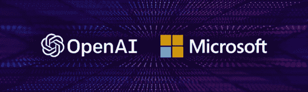
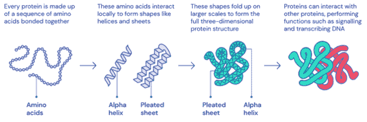

# 阿尔法折叠和 GPT——激进的技术颠覆将如何影响我们的未来

> 原文：<https://medium.datadriveninvestor.com/alpha-fold-and-gpt-how-radical-technology-disruptions-will-affect-our-future-c048a3af3ff2?source=collection_archive---------31----------------------->

2019 年，我写了关于你关心 [AI](https://www.datadriveninvestor.com/glossary/artificial-intelligence/) 需要关注的 10 大人物。最近，我在上一篇文章中提到的两个机构取得了有希望的突破，今天值得关注，因为它们可能会导致明显的技术中断。

技术中断不是历史异常，而是*持续*的事件，其*的频率不可预测。*一些重大中断的例子包括:在 19 世纪利用蒸汽动力推动工业革命，在 20 世纪初广泛采用电力，然后在 21 世纪人类通过互联网进行了信息革命。

*Two institutions working on AI made promising breakthroughs*

在过去的十年中，由于互联网，加上非凡的人类研究活动和生产力的不断提高，人类可以获得的信息已经极其丰富。这导致了许多新技术的发展，这使得很难预测哪些技术将会是颠覆性的，哪些将会是未来的主导技术。手机、社交媒体、[云计算](https://www.datadriveninvestor.com/glossary/cloud-computing/)等趋势涌现，可穿戴设备、流媒体、增强现实、[区块链](https://www.datadriveninvestor.com/glossary/blockchain/)等新技术开始成为主流。

> “技术中断不是异常事件，而是与不可预测的频率一致”

然而，对于普通的非技术人群来说，还有更重要的技术颠覆正在从根本上改变并将继续改变未来。可再生能源的发展正在颠覆能源世界；随着太阳能和风能以及电池储能的资本成本下降。最终结果可能是人类有史以来最低的能源成本，破坏性的结果可能是能源，像信息一样，可以以很少甚至没有成本的方式提供给最终消费者。另一个根本性的破坏是大批量消耗品生产的边际成本接近于零，这对于最终用户来说意味着成本非常低，最终可能导致消费者对此类物品几乎没有成本。这对人们的生活方式产生了破坏性影响。

当谈到人工智能(AI)这个被过分炒作的话题时，非技术人群可能不太关心技术细节，然而，大多数人将经历由人工智能技术破坏引发的对他们生活的根本性破坏。到目前为止，基于人工智能的计算机代码在以下领域非常成功地影响了许多人的日常生活:翻译(谷歌翻译)、识别(语音识别:siri 呼叫鲍勃，alexa 购买卫生纸)，以及[分类](https://www.datadriveninvestor.com/glossary/classification/)(什么会出现在你的 facebook/instagram/news feed 上)。然而，随着 OpenAI 的生成式预训练变形金刚(GPT)和谷歌的 Deepmind Alpha 系列程序(AlphaGO、AlphaZero、AlphaStar)，一个新的颠覆时代即将到来。

*“开放 AI 通过选择有限数量的人允许使用 GPT-3”*

First let’s start with Open AI, a company whose mission is to ensure that artificial general intelligence (AGI) i.e. highly autonomous systems that outperform humans at most economically valuable work, benefits all of humanity. The company gave access to the use of a computer program (via an [API](https://www.datadriveninvestor.com/glossary/application-programming-interface/)) called GPT-3 to a select limited number of people, and announced it will share it with Microsoft. GPT-3 is a type of a computer program called a transformer that is trained on a language data set from the internet. It has the ability to transcribe language based on a prompt given to it. The output transcription has a meaningful relationship to the input text. GPT-3 can provide answers to questions, comments on phrases, and perform a writing task written to it. The implications are substantial because if used by anyone it could flood the internet cyberspace with text that has meaning, but created by the program. Essentially introducing more noise to human to human communication within the internet, internet noise is not a new problem though, in the recent years language bots became popular over the internet, however, they were easy to recognize by humans and to detect by automated systems, because these primal bots didn’t provide much of meaning or material to the reader. As a result, they can be easily reported and discarded by humans, and detected and controlled by anti-spam systems. The challenge with GPT-3 is that In a zero-day scenario, GPT-3 texts are not easily recognized by humans and in some cases not recognized at all. This is a very problematic issue in terms of risks to meaningful communication on the internet in addition to posing risk to the public decorum in cyberspace. In a nutshell, OpenAI created GPT-3, a program that can be very helpful depending on how it is used, but didn’t make it “open” to everyone. Eventually GPT-3 will be available in the wild and the opportunities for its use will be limitless. This technology will be disruptive. This promising technology will help in facilitating human communications, augmenting innovation, and elevating arts.

*Open AI announced they will share GPT-3 with Microsoft*

现在转到谷歌，Deepmind(谷歌公司)一直在做有趣的工作，试图建立一个可以玩游戏的程序，任何游戏，他们从 AlphaGo 开始，在中国古代围棋比赛中展示了对人类的优越性，然后他们开始创建 AlphaZero，该程序下棋并成为超级棋手。后来，Deepmind 团队做了正确的事情，通过扩展到另一个领域来解决一个现实世界的问题。他们开发了 AlphaFold，一个可以高精度预测蛋白质折叠的程序，蛋白质折叠是一种复杂的生物现象。准确的蛋白质折叠预测是一个很难解决的物理/生物问题，Deepmind 团队刚刚展示了使用 AlphaFold 2 解决这个问题的能力。这将为生物技术进步的全新时代打开大门。这将是颠覆性的技术，当它被允许被其他人使用时。这一充满希望的突破可能会带来医学上的巨大进步，改善公共卫生，延长人类寿命，增强人类能力。

*“没有足够的证据表明谷歌 Deepmind 的技术可以在域之间无缝转移”*

*Protein Folding Explained, image: Deepmind*

最后一点，在现实世界的应用中使用人工智能时，看到开放人工智能和 DeepMind 方法之间的差异是很有趣的。Deepmind 有一种方法似乎更专注于某些领域(游戏和最近的生物学)，然而，没有足够的证据表明该技术可以在领域之间无缝转移，这对 Deepmind 来说是一个问题，对任何关注人工智能的人来说都是一种解脱。另一方面，虽然 OpenAI 的 GPT-3 有其局限性，但它专注于解决语言这一通用知识领域，因此它可以跨领域使用，这似乎符合这样的哲学:解决语言就解决了其他一切。看看 GPT-4、GPT-5 或者最终的 GPT-10 能做些什么将会很有趣。这种策略可能会失败或需要更长的时间才能成功。但与此同时，DeepMind 团队和人类将从阿尔法算法解决实际问题中获益。

如果你学到了新的东西或者喜欢这个内容，请关注我[这里](https://medium.com/@7asabala)询问问题，表示支持和反馈请联系我[这里](https://mhassaballa.com/contact-me/)

# 参考

[【1】](https://www.datadriveninvestor.com/2021/01/07/alpha-fold-and-gpt-how-radical-technology-disruptions-will-affect-our-future/#_ftnref1)“如果你关心人工智能，你应该关注的 10 个人……”[https://medium . com/@ 7 asabala/10-people-you-should-follow-if-you-care-ai-40d 94081697d](https://medium.com/@7asabala/10-people-you-should-follow-if-you-care-about-ai-40d94081697d)。于 2020 年 12 月 26 日访问。

[【2】](https://www.datadriveninvestor.com/2021/01/07/alpha-fold-and-gpt-how-radical-technology-disruptions-will-affect-our-future/#_ftnref2)“成本下降如何让可再生能源变得更具成本效益……”https://www . irena . org/news room/articles/2020/Jun/How-Falling-Costs-Make-Renewables-a-Cost-effect-Investment。于 2020 年 12 月 26 日访问。

[【3】](https://www.datadriveninvestor.com/2021/01/07/alpha-fold-and-gpt-how-radical-technology-disruptions-will-affect-our-future/#_ftnref3)“了解电池储能系统及其……”[https://www . nrel . gov/USAID-partnership/project-understanding-battery-storage-grid-integration . html](https://www.nrel.gov/usaid-partnership/project-understanding-battery-storage-grid-integration.html)。于 2020 年 12 月 26 日访问。

[【4】](https://www.datadriveninvestor.com/2021/01/07/alpha-fold-and-gpt-how-radical-technology-disruptions-will-affect-our-future/#_ftnref4)《走向零边际成本社会|日本时报》2018 年 1 月 24 日，[https://www . Japan times . co . jp/opinion/2018/01/24/commentation/world-commentation/forward-zero-marginal-cost-society/](https://www.japantimes.co.jp/opinion/2018/01/24/commentary/world-commentary/toward-zero-marginal-cost-society/)。于 2020 年 12 月 26 日访问。

[【5】](https://www.datadriveninvestor.com/2021/01/07/alpha-fold-and-gpt-how-radical-technology-disruptions-will-affect-our-future/#_ftnref5)更准确地说[基于机器学习](https://www.datadriveninvestor.com/glossary/machine-learning/)的计算算法:“人工智能(AI)定义——Investopedia。”2020 年 3 月 13 日，[https://www . investopedia . com/terms/a/人工智能-ai.asp](https://www.investopedia.com/terms/a/artificial-intelligence-ai.asp) 。于 2020 年 12 月 26 日访问。

[【6】](https://www.datadriveninvestor.com/2021/01/07/alpha-fold-and-gpt-how-radical-technology-disruptions-will-affect-our-future/#_ftnref6)“谷歌翻译。”https://translate.google.com/[。于 2020 年 12 月 26 日访问。](https://translate.google.com/)

[【7】](https://www.datadriveninvestor.com/2021/01/07/alpha-fold-and-gpt-how-radical-technology-disruptions-will-affect-our-future/#_ftnref7)“Siri——苹果。”[https://www.apple.com/siri/](https://www.apple.com/siri/)。于 2020 年 12 月 26 日访问。

[【8】](https://www.datadriveninvestor.com/2021/01/07/alpha-fold-and-gpt-how-radical-technology-disruptions-will-affect-our-future/#_ftnref8)《亚马逊 Alexa 官网:什么是 Alexa？."[https://developer.amazon.com/alexa](https://developer.amazon.com/alexa)。于 2020 年 12 月 26 日访问。

[【9】](https://www.datadriveninvestor.com/2021/01/07/alpha-fold-and-gpt-how-radical-technology-disruptions-will-affect-our-future/#_ftnref9)“变形金刚如何工作。变形金刚是一种神经……”2019 年 3 月 10 日，[https://towardsdatascience.com/transformers-141e32e69591](https://towardsdatascience.com/transformers-141e32e69591)。于 2020 年 12 月 26 日访问。

[【10】](https://www.datadriveninvestor.com/2021/01/07/alpha-fold-and-gpt-how-radical-technology-disruptions-will-affect-our-future/#_ftnref10)“零日漏洞:它是什么，它是如何工作的——诺顿。”2019 年 8 月 28 日，[https://us . Norton . com/internet security-emerging-threats-how-do-zero-day-vulnerability-work-30 sec tech . html](https://us.norton.com/internetsecurity-emerging-threats-how-do-zero-day-vulnerabilities-work-30sectech.html)。于 2020 年 12 月 26 日访问。

[【11】](https://www.datadriveninvestor.com/2021/01/07/alpha-fold-and-gpt-how-radical-technology-disruptions-will-affect-our-future/#_ftnref11)“alpha fold:50 年来最大挑战的解决方案”2020 年 11 月 30 日，[https://deep mind . com/blog/article/alpha fold-a-solution to-a-a-50 岁的生物学大挑战](https://deepmind.com/blog/article/alphafold-a-solution-to-a-50-year-old-grand-challenge-in-biology)。于 2020 年 12 月 26 日访问。

简历:Mike 在 2013 年获得了应用科学硕士学位，然后他开始了他在数据中心行业的职业生涯。2015 年，他换了工作，在一家开发减排技术的公司担任首席工程师。然后，他在 2018 年进入能源咨询行业。Mike 关注业务中最关键的问题和机会:战略、运营、技术、转型、高级分析和可持续发展。迈克写了引人入胜的故事，任何人都可以读。他擅长简化复杂的主题，并为紧迫的问题带来全新的视角。

**进入专家视角—** [**订阅 DDI 英特尔**](https://datadriveninvestor.com/ddi-intel)

*原载于 2021 年 1 月 7 日 https://www.datadriveninvestor.com**[*。*](https://www.datadriveninvestor.com/2021/01/07/alpha-fold-and-gpt-how-radical-technology-disruptions-will-affect-our-future/)*