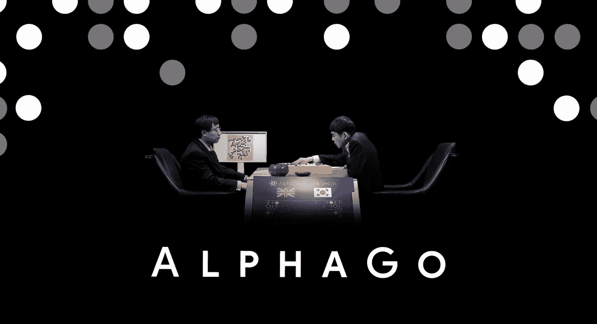
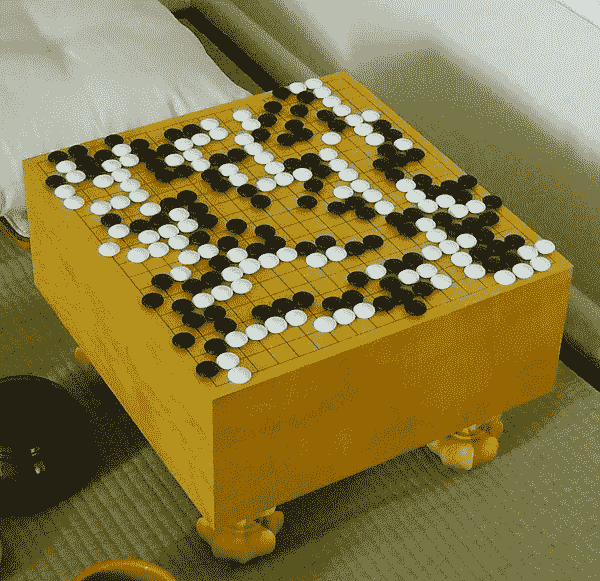
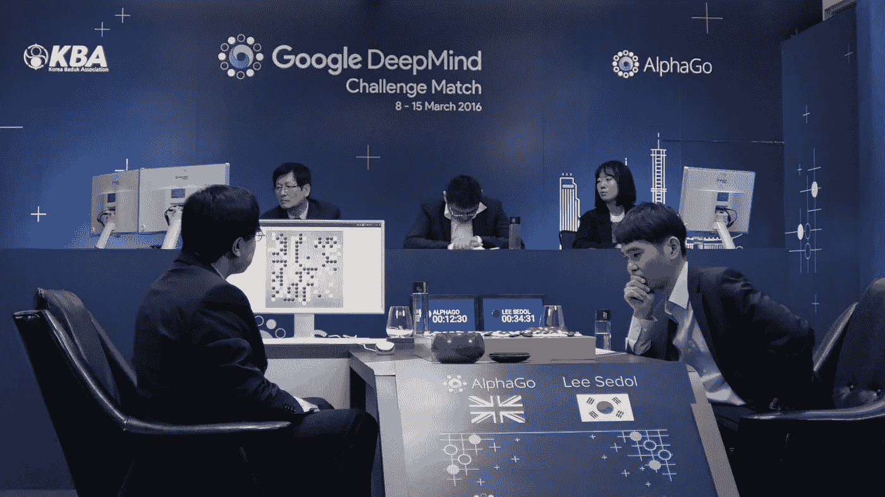

# alpha go——一部关于人工智能的纪录片

> 原文：<https://medium.datadriveninvestor.com/alphago-a-documentary-about-artificial-intelligence-37c147252889?source=collection_archive---------3----------------------->

AlphaGo Movie

这部纪录片于 2018 年在网飞播出后，现在可以在 YouTube 上观看。这是一部关于 18 次世界冠军韩国围棋选手 Lee Sedol 的纪录片，他于 2016 年 3 月在首尔与人工智能 AlphaGo 进行了一场比赛。AlphaGo 项目由 2014 年被谷歌收购的英国人工智能公司 DeepMind 创建。

 [## 人工智能和监督资本主义|数据驱动的投资者

### 大科技，总是现在:人工智能推动的大科技，已经使购物，搜索，在你的…

www.datadriveninvestor.com](https://www.datadriveninvestor.com/2020/03/04/on-artificial-intelligence-and-surveillance-capitalism/) 

很多时候，用机器人太容易被误认为是人工智能，尤其是对于我这样的非专家来说。在看这部纪录片之前，我一直对它很好奇，并有几个问题在脑海中停留了一段时间。人工智能到底是什么？我为什么要关心它？而一个正常的计算机程序和人工智能有什么区别？

如果你感兴趣，我会劝你在我破坏它之前先看这部纪录片。同样作为免责声明，这个故事是我从参考资料中了解到的，我没有受过人工智能方面的技术培训。

DeepMind, YouTube

# 普通程序与人工智能

从我的理解来说，在计算机程序中你要写一套规则比如 if-else(当这种情况发生时，这样做。)，给电脑一套玩的规则。你必须为软件设置执行一系列任务的场景，如果你想让它做不同的事情。你必须重写规则。

人工智能的核心区别是，通过模仿人类的思维方式，它能够根据你提供给它的信息，为未知的场景做出决定。我不知道代码是如何工作的，也不知道程序是什么样子的，但它本身就说明了它在这部纪录片中的重要性。传统的软件程序限制更多，人工智能开放无限可能。

# 为什么要去游戏？

Go is played on a grid of black lines (usually 19×19). Game pieces, called *stones*, are played on the lines’ — Wiki, Go (game)

中国古代的围棋(发明于 2500 多年前)在亚洲和许多其他国家都很流行。我记得小时候在台湾玩过，虽然我一点也不擅长。

在许多文化中，它被认为是一种高贵的艺术形式，专业人士受到高度尊重，因为尽管它的规则简单，但它有移动的可能性。在人工智能中，它通常被认为是计算机程序战胜人类的最具挑战性的游戏，甚至比象棋更具挑战性。

# 它是如何工作的？

你可能想知道，人类是如何玩弄人工智能的。他是在电脑上下棋，还是 AlphaGo 是机器人？正如你在电影中看到的那样，项目团队的研究科学家 Aja Huang 博士在那里帮助 AlphaGo 为 AlphaGo 放置石头。

AlphaGo Movie

# **机器和人类的情感**

这部电影中透露出的情感是原始而真实的，它让我感到惊讶。看电影的时候，我没有想到这是不是一个严肃的游戏。即使对于一个从未看过职业围棋比赛的人来说。

在这 5 场比赛中，玩家和机器之间有很多紧张关系。在连续输了 3 天后，当李·塞多尔终于赢了一场比赛时，人们为他欢呼。我几乎为李·塞多尔感到难过，我觉得他不应该因为输掉比赛而自责。这只是一个计算机程序，不是吗？但是我想我错了。不仅仅是这样。

很多疑惑，和一个电脑程序对战会不会变得更复杂更奇怪？人工智能的不可预测性，它不是人类的事实，增加了游戏的复杂性？这是我们可以习惯的吗？

它传达了一个强有力的信息，即机器和人类之间的互动还有更多的东西。如何添加一个机器(像人类一样思考)到等式中改变了游戏的几乎所有东西，是值得发现的特别和有趣的事情。

# **alpha go 之后的未来**

AlphaGo 已经证明了一点，我们已经拥有了比人类更聪明的人工智能。尽管如此，我们都能从李·塞多的脸上看到失望。最后，他确实很欣赏 AlphaGo 作为他玩了多年的游戏为围棋带来了新的光芒。

这也让我想到，技术不应该被视为威胁，而应该是一个以全新的眼光看待我们自己的机会。我们的生活方式很可能不再一样了。与埃隆·马斯克不同，我可能很天真，因为我不害怕人工智能的未来。虽然很明显，这是在我们明智地使用人工智能的情况下。

它是由我们当中最聪明的头脑产生的人工智能建造的，是人类集体智慧的一个令人印象深刻的成就。我希望我们可以利用这些新兴技术来解决难题。然而，我同意道德和技术多样性比以往任何时候都更重要。看穿戴密斯·哈萨比斯博士 DeepMind 's vision 的首席执行官及其充满激情的团队。我充满希望，也很高兴能见证这一历史事件。

## **参考文献**

【https://en.wikipedia.org/wiki/AlphaGo 

[https://en . Wikipedia . org/wiki/Go _(game)](https://en.wikipedia.org/wiki/Go_(game))

 [## AlphaGo 电影

### 纪录片* 2017 年春

www.alphagomovie.com](https://www.alphagomovie.com/)  [## 深度思维

### DeepMind Technologies 是一家英国人工智能公司，成立于 2010 年 9 月，于年被谷歌收购

en.wikipedia.org](https://en.wikipedia.org/wiki/DeepMind)  [## 李·塞多尔

### Lee Sedol(韩语:이세돌；出生于 1983 年 3 月 2 日)，或李时斗，是前韩国职业围棋选手 9 丹…

en.wikipedia.org](https://en.wikipedia.org/wiki/Lee_Sedol)  [## AlphaGo 对 Lee Sedol

### AlphaGo 对 Lee Sedol，也被称为谷歌 DeepMind 挑战赛，是一场五局比赛，在 18 次…

en.wikipedia.org](https://en.wikipedia.org/wiki/AlphaGo_versus_Lee_Sedol) 

Royal Academy of Arts, YouTube

TED, YouTube