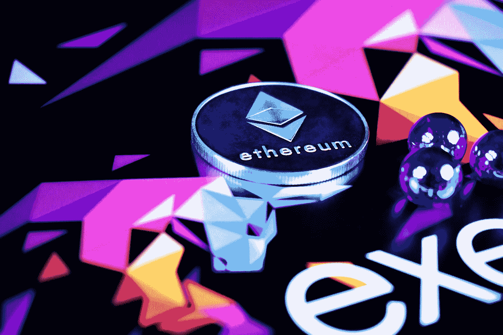
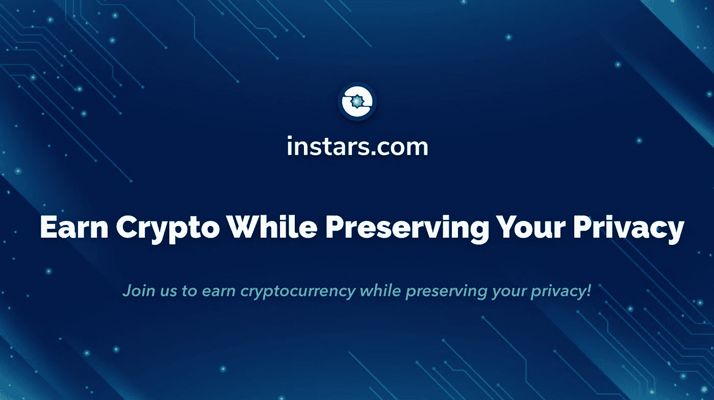
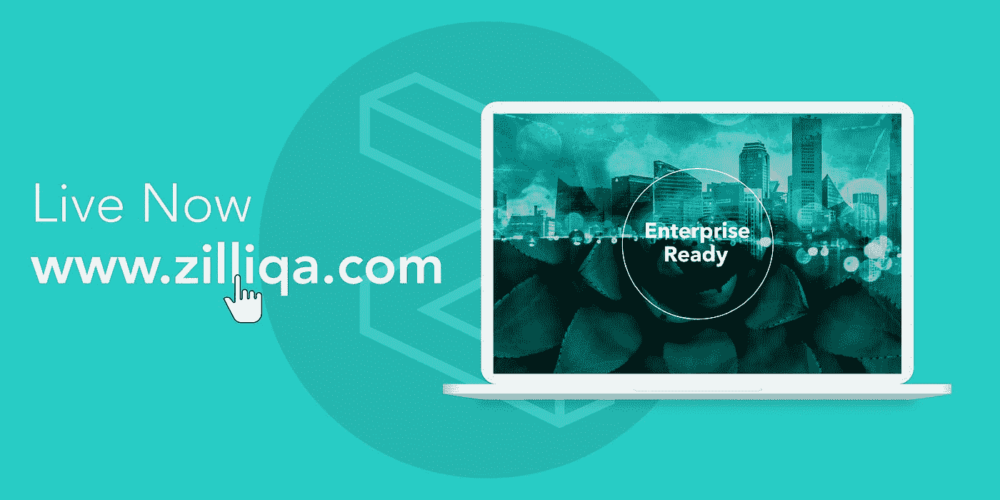
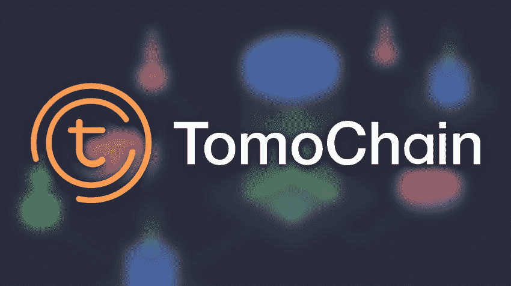
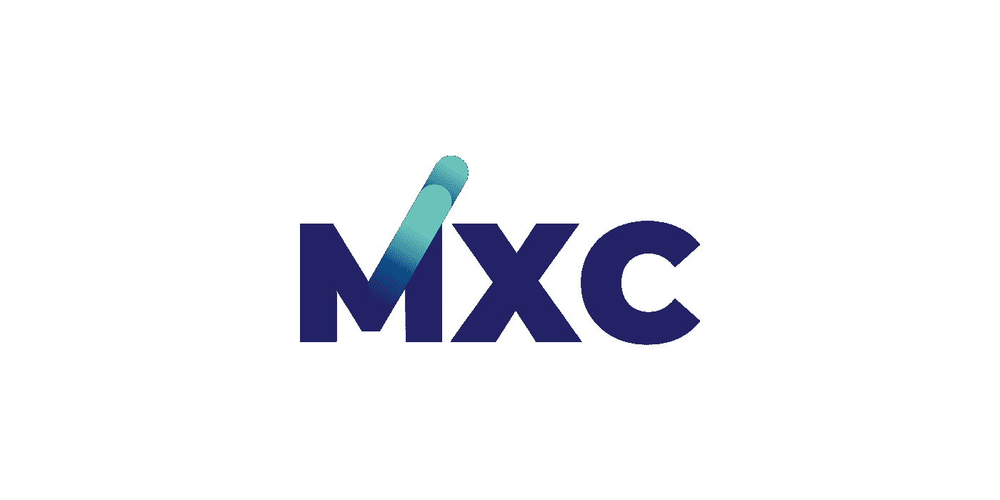
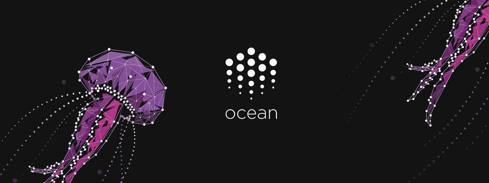
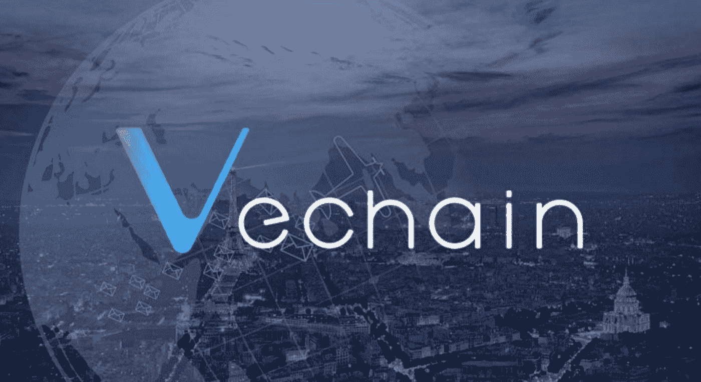
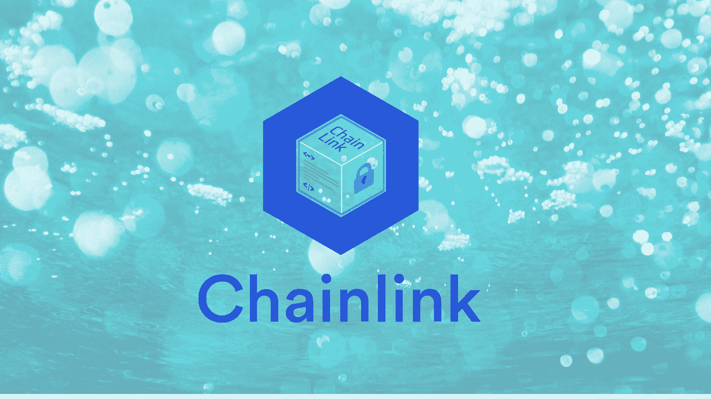

# Altcoin 季 2020:你应该从根本上看好哪些币？

> 原文：<https://medium.datadriveninvestor.com/altcoin-season-2020-what-coins-should-you-fundamentally-be-bullish-on-b38c050efd7f?source=collection_archive---------0----------------------->


Photo by [Marc Szeglat](https://unsplash.com/@marcszeglat?utm_source=medium&utm_medium=referral) on [Unsplash](https://unsplash.com?utm_source=medium&utm_medium=referral)

这里有一个明确的迹象表明市场是看涨的——替代硬币的季节可能终于到来了。市场上的大多数替代硬币都有令人沮丧的图表。在 2017 年成功的 altcoin 年之后，由于当时加密货币市场的失败，大多数 alt coin 都遭遇了急剧下滑。然而，随着市场回暖，2020 年哪种替代硬币是最佳投资？

2017 年的伤害还没有完全愈合；然而，在一些替代硬币中出现了希望的曙光。2019 年，许多替代币朝着盈利迈出了积极的步伐。

[](https://www.datadriveninvestor.com/2019/03/10/swiss-based-etp-enters-the-crypto-trading-market/) [## 总部位于瑞士的 ETP 进入加密交易市场|数据驱动的投资者

### 虽然金融市场几乎没有沉闷的时刻，特别是在引入…

www.datadriveninvestor.com](https://www.datadriveninvestor.com/2019/03/10/swiss-based-etp-enters-the-crypto-trading-market/) 

分散的平台正在采取不同的商业方法来尝试和驾驭不可预测的加密货币经济。许多平台改进了服务，并与各自领域的天才玩家建立了合作伙伴关系。

加密货币市场的复苏也促进了替代硬币市场的表现。

随着时间的推移，一些替代硬币显示出了成功的迹象。根据我们的评估，这篇文章强调了一些我们认为你应该从根本上看好的替代币。

# 以太坊



不出所料，这个平台是我们最看好的替代平台。继比特币之后，以太坊可以说是市场上级别最高的加密货币。以太坊(ETH)的市值仅次于比特币[也不足为奇。](https://coinmarketcap.com/)

以太坊平台背后的大脑 Vitalik Buterin 是早期的比特币爱好者，他看到了比特币闻名的支付解决方案之外的机会。以太坊随之诞生，为更重要的区块链网络和社区提供了无数的机会。

它的特点是区块链网络中缺失的一环。在其智能合同特性建立后，分散社区能够发展壮大，利用智能合同进入每一个可用的行业。

随着以太坊平台的普及性和实用性的提高，对以太坊(ETH)的需求也在上升。

然而，加密货币在熊市期间也遭受了损失，这极大地影响了整个加密货币行业。以太坊(ETH)股价在一年内从 1200 美元的高点跌至不到 100 美元。

如前所述，2019 年在 altcoin 市场上注入了新的希望，其中一个指标是以太坊在市场上的表现不断改善。

除了总体上升趋势之外，以太坊还通过改善其服务来挑战即将到来的“现代”区块链协议，从而使自己变得有市场。他们的下降部分归因于他们缓慢的网络，这可能会很快变得拥挤(还记得 [CryptoKitties](https://media.consensys.net/the-inside-story-of-the-cryptokitties-congestion-crisis-499b35d119cc?gi=69ab8cbd9e84) 事件吗？).

有了更快的平台，对以太坊(ETH)的需求可能会增加，因为更多的开发者选择在已经建立的协议中建立 d'Apps。

2020 年可能只是以太坊(ETH)的一年。人们至少可以密切关注加密货币的发展。

# 幼虫(幼虫)



[INSTAR 在我们精心策划的榜单上名列前两位，理由很充分。](https://instars.com/)加密货币背后的平台一直在幕后采取所有正确的行动。市场注意到该平台的辉煌及其加密货币的暴涨只是时间问题。

该平台服务于世界经济不可或缺的一部分，为数据消费者提供符合道德标准的数据。该平台可以说是全球最赚钱的行业之一。

[Instars](https://instars.com/) 一直在改进他们的服务，以更好地服务他们的用户群，并吸引潜在用户到他们的平台。

在遭受了 2017 年牛市之后紧接着的熊市之后，Instars 现在正走在复苏的[道路上](https://coinmarketcap.com/currencies/insights-network/)。

该平台还建立了一些令人兴奋的合作伙伴关系，这些关系将很快被证明至关重要。基于用户在他们的推特账号上收到的积极反馈，它的策略引起了用户群的共鸣。

[Instars 也是全球领先的免费加密平台之一，这为其令人印象深刻的功能列表增添了一笔。](https://instars.com/)

凭借其先进的功能和战略合作伙伴关系，更多的人可能会加入这个平台，推动 INSTAR 的价值更高。该平台已经成为免费加密平台的领导者。这可以很容易地转化为其加密货币的增值。

密切关注 INSTAR，重大收获可能即将到来！

# 齐利卡(ZIL)



[平台](https://zilliqa.com/)诞生于提高区块链生态系统可扩展性的需要。它加入了许多解决同样问题的其他平台。然而，该平台有机会超越竞争对手，在市场上建立自己的加密货币。

2018 年发布后，Zilliqa (ZIL)的市值超过了【2018 亿美元。尽管早期取得了成就，但加密货币不得不与恶劣的普遍条件作斗争，这使其价值和市值损失了一半以上。

该平台仍有潜力确立其相关性。Zilliqa 一直在改进其平台，以实现更好的可扩展性和速度。

其最新升级使该平台在越来越多的行业考虑采用区块链来提高生产率的关键时刻成为企业就绪平台。

Zilliqa 成为主要产业的潜力足以提升 ZIL 的价值。投资者可能会发现 Zilliqa 是名副其实的失败者。

# Aelf(精灵)


可以说，Aelf 是区块链企业中最好的平台，它不断地向人们展示它无愧于这个称号的原因。

该平台经过精心设计，能够适应任何行业和任何形式的业务或结构。它还被设计为服务于一个企业中尽可能多的不同分支。

其 Merkle tree 架构和侧链结构使该平台能够充分满足繁忙企业的多种需求。此外，Aelf 为其平台所能支持的尽可能多的企业执行此操作。

随着区块链的未来似乎依赖于企业采用，Aelf 可能会发现自己处于更高的上升轨道。

ELF 对于投资者来说可能是一个令人兴奋的选择！

# Tomochain



另一个试图解决区块链生态系统中复杂的可扩展性问题的平台是 [Tomochain](/v) 。然而，该平台已经完成了它的工作。它面临着已经在这个名单上的两个平台的激烈竞争，可能还有区块链生态系统中的数百个平台。

尽管这是一座必须攀登的大山，但 Tomochain 展现了一些希望。TOMO 最近的市值达到了 3319 万美元，对美元升值了 8.2%。

这些迹象表明，该平台可能是另一个意想不到的投资选择。

Tomochain 要证明自己在市场上的独特性和实用性还有很多工作要做。然而，它似乎已经吸引了越来越多的人。

# MXC (MXC)



从服务和经济角度来看，机器兑换硬币(MXC)是一个有趣的行业。

MXC 是推动数据驱动的物联网平台的标志。

该平台希望通过位于这些城市战略要地的物联网设备的互联，帮助在全球范围内创建智能城市。这些数据可以用于不同的服务。

MXC 是驱动整个智能城市生态系统的标志。

MXC 网络由 LPWAN 技术支持，该技术使物联网设备之间的数据传输快速安全，可在网络内无缝传输数据。

MXC 团队提出的智慧城市概念促成了令人鼓舞的合作伙伴关系的形成。其他城市可能会加入 T2、上海等城市的行列，采用 MXC 的模式。这可能会在市场上引起 MXC 币有趣的价格波动。

对投资者来说，MXC 可能是一个有利可图的投资选择。

# 海洋议定书(海洋)



数据经济吸引了很多关注。

[海洋协议](https://oceanprotocol.com/)是数据经济的另一个入口，试图通过为所有人提供平等的数据，让世界变得更美好。

该平台在数据消费者和数据生产者之间架起了一座桥梁，从而消除了中间商。通过将数据消费者与生产者直接联系起来，Ocean Protocol 希望在没有不必要的第三方参与的情况下，使数据共享和销售变得安全。

海洋议定书可能会面临激烈的竞争；然而，该平台一直处于[上升轨道](https://coinmarketcap.com/currencies/ocean-protocol/)，考虑到它必须与之竞争的平台，这是非常令人鼓舞的。

如果海洋成为 2020 年最赚钱的加密货币投资，这并不奇怪。

# 兹卡什(ZEC)


[Zcash](https://www.google.com/url?sa=t&rct=j&q=&esrc=s&source=web&cd=1&cad=rja&uact=8&ved=2ahUKEwi0vN--0rjnAhWdQEEAHez9A9gQFjAAegQIAhAB&url=https%3A%2F%2Fz.cash%2F&usg=AOvVaw1Yq90dDgyBBFHc_90tJNKT) 于 2016 年发布，是比特币的一个分叉。该平台更注重交易的隐私和安全。Zcash 使用零知识证明系统来确保通过其平台进行的所有交易都是匿名和安全的。

与市场上的其他选择相比，所进行的交易也是快速和有效的。

因此，ZEC 燃料在 Zcash 内的交易会直接受到 Zcash 受欢迎程度的影响。然而，据 C[oinmaretap](https://coinmarketcap.com/currencies/zcash/)报道，Zcash 似乎停滞了一段时间。平台剩下的唯一选择就是向上移动。

# 兽医



由于其合作伙伴关系和市场动向，该平台在 2019 年成为了众多头条新闻。

VeChain 设法与中国的[沃尔玛](https://blockspectator.com/vechain-price-explodes-on-potential-walmart-chinese-partnership-further-adoption-ahead/)建立了利润丰厚的合作关系，这引发了人们对兽医的兴趣。它的[价格走势](https://coinmarketcap.com/currencies/vechain/)也成为头条新闻，因为区块链社区看到了加密货币的潜力。

2020 年，该平台需要做的不仅仅是头条新闻，如果策略得当，它有潜力成长为一个供应巨头。

更多的伙伴关系和更多关于 VeChain 能做什么的真实世界演示将有助于把这个平台放在世界地图上。

投资者可能会发现，通过职业教育培训为 VeChain 注入更多活力是有回报的。

# 链环(链环)



该平台是一个相当有吸引力的机构，在区块链生态系统中的一个非常特殊的市场提供服务。

[链节](https://www.google.com/url?sa=t&rct=j&q=&esrc=s&source=web&cd=1&cad=rja&uact=8&ved=2ahUKEwjD6ZPGzbjnAhWGQEEAHdwKDN0QFjAAegQIBRAB&url=https%3A%2F%2Fchain.link%2F&usg=AOvVaw07eJluK1FsWglrAHNPQJ90)作为链外存储和链上存储之间的链接。它的服务对于拥有敏感数据的企业来说尤其重要，这些敏感数据在离线存储中会更安全。

此外，它的服务对于使用不一定在链上找到的数据的企业来说也是至关重要的。它所允许的连接使得企业内部的各种流程无缝且更加安全。

2020 年，Chainlink 将有更多的追求者，这是看好该链接的一个理由。

Altcoins 已经走过了很长的路，在他们改进的平台上可以看到他们的进步。然而，还有更多的事情可以做，这可以通过鹰眼投资者的支持来完成，他们可以从远处发现一个绝佳的机会。

大多数这些替代硬币正在走向成功，只是需要一些额外的东西来推动它们进入盈利生产力。

```
***Disclaimer:*** *Please only take this information as my* ***OWN*** *opinion and should not be regarded as financial advice in any situation. Please remember to* ***DYOR*** *before making any decisions.*
```

♂️你好，我叫萨尔。*如果你觉得这篇文章很有用，并想看我的其他作品，请务必鼓掌并关注我的* [*中型*](https://medium.com/@salmanmiah) *和* [*LinkedIn！*](https://linkedin.com/in/salman-miah-57aa90a0/) *😎*