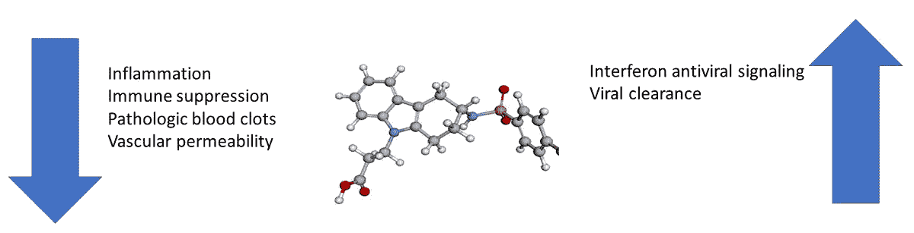

# 改变的前列腺素:新冠肺炎严重程度、肥胖和年龄之间的联系

> 原文：<https://medium.datadriveninvestor.com/altered-prostacyclins-a-link-between-covid-19-severity-obesity-and-age-9a856bccd02c?source=collection_archive---------6----------------------->

Ramatroban, an allergy medicine used in Japan may be beneficial for COVID-19 treatment, especially in the elderly and obese.

## 在日本使用的一种用于过敏的药物可能是治疗老年人和超重者新冠肺炎的有效方法。

肥胖与促炎状态有关。衰老也与免疫系统的变化有关。这两种人群中的炎症介质是否有共同的变化，导致发生严重新冠肺炎的风险增加？

Ajay Gupta 博士，医学博士，MBBS (罗克韦尔医疗公司首席科学官)认为是这样的。他认为这种联系是前列腺素类，特别是前列腺素 D2 和血栓烷 A2。特别是前列腺素 D2，随着年龄和肥胖而增加，提供了这两种情况和发生严重新冠肺炎风险之间的潜在分子联系。

前列腺素 D2 具有复杂的作用，这种作用取决于哪个细胞有反应以及它激活的受体。前列腺素 D2 通过其受体之一(DP2)的激活所介导的作用可导致严重新冠肺炎的症状。前列腺素 D2 通过 DP2 发出信号，可导致被称为[干扰素应答](https://medium.com/swlh/interferon-responses-could-explain-susceptibility-to-severe-covid-19-cc69a654b999)的抗病毒免疫应答受损，并可抑制多种免疫细胞的活性。这些效应一起阻止了身体清除病毒和被病毒感染的细胞。因此，DP2 信号的这些免疫抑制作用让病毒复制并导致肺部严重肺炎，并可能感染和损害其他组织。此外，前列腺素 D2 通过 DP2 发出信号，引发支气管收缩，使呼吸更加困难。

通过它的另一个受体，前列腺素 D2 实际上对新冠肺炎患者有益。其中包括抑制肥大细胞释放组胺(减少炎症)，抑制血小板聚集(减少凝血)，以及松弛平滑肌和降低血管的渗透性(使其更容易呼吸)。

因此，靶向前列腺素 D2 治疗新冠肺炎的关键不是阻断其合成，而是特异性地阻断其对受体 DP2 的刺激，使 DP1 的激活保持完整。

过度凝血是严重新冠肺炎的主要并发症。血栓烷 A2 的主要功能是通过其对受体 TP 的作用来促进血液凝固。通过防止由血凝块的过度形成引起的并发症和组织损伤，防止血栓烷 A2 在其受体上的活性预期对新冠肺炎患者有益。

Ramatroban 是一种自 2000 年以来在日本用于治疗过敏性鼻炎(鼻塞和打喷嚏)的药物。Ramatroban 有两个关键目标，这两个目标都与新冠肺炎有关。拉马曲班抑制前列腺素 D2 受体 DP2 和血栓烷 A2 受体 TP。因此，ramatroban 是一种潜在的双重作用疗法，既能促进免疫介导的病毒清除，又能防止危险血凝块的形成。

Beneficial effects of ramatroban for COVID-19 patients. [Credit: Nancy R. Gough, [BioSerendipity](http://www.bioserendipity.com), LLC]

Gupta 博士对 ramatroban 治疗新冠肺炎非常有信心，他已经申请了 3 个临时专利(63/003，286；63/005,205;63/027，751)，用于在新冠肺炎使用 ramatroban。他还试图将 ramatroban 纳入新冠肺炎的临床试验。

注:本文于 2020 年 12 月 11 日更正。术语前列环素是不正确的，现已更正为前列腺素类。

**与拉马曲班和前列腺素 D2 相关的参考文献**

埃尔南德斯-卡列特罗 A，韦伯 N，拉弗兰奥，*等*。肥胖引起的脂质介质变化在体重减轻后仍然存在。*国际肥胖杂志***42**:728–736(2018)。DOI:[10.1038/ijo . 2017.266](https://doi.org/10.1038/ijo.2017.266)

年龄相关的 PGD2 表达增加损害呼吸道 DC 迁移，导致小鼠呼吸道病毒感染后 T 细胞反应减弱。 *J. Clin。投资。***121**:4921–4930(2011)。DOI: [10.1172/JCI59777](https://doi.org/10.1172/JCI59777)

Gupta A，Kalantar-扎德 K，Reddy ST. Ramatroban:一种治疗新冠肺炎的新型免疫疗法 *J. Mol。吉尼特。Med* 。**14**:10.37421/jmgm . 2020 . 14 . 457(2020)。DOI:[10.37421/jmgm . 2020 . 14 . 457](https://doi.org/10.37421/jmgm.2020.14.457)

前列腺素 D2 作为淋巴细胞减少症的介质和新冠肺炎病的治疗靶点。*医学假说***143**:110122(2020)DOI:[10.1016/j . mehy . 2020 . 110122](https://doi.org/10.1016/j.mehy.2020.110122)

Werder RB，Lynch JP，Simpson JC，Zhang V，Hodge NH，Poh M，Forbes-Blom E，Kulis C，Smythe ML，Upham，Spann K，Everard ML，Phipps S. PGD2/DP2 受体激活通过抑制 IFN- **λ** 的产生促进重症病毒性细支气管炎。 *Sci。Transl。医学。* **10** :eaao0052 (2018)。DOI:[10.1126/scitranslmed . AAO 0052](https://doi.org/10.1126/scitranslmed.aao0052)

Ishizuka T，Matsui T，Okamoto Y，Ohta A，Shichijo M. Ramatroban (BAY u 3405):一种新型的 TXA2 受体和 CRTh2 双重拮抗剂，一种新鉴定的前列腺素 D2 受体。心血管疾病。药品修订版(2004)**22:**71–90。DOI:[10.1111/j . 1527–3466.2004 . TB 00132 . x](https://doi.org/10.1111/j.1527–3466.2004.tb00132.x)。

村田 T，有竹 K，坪坂 Y，丸山 T，中川 T，堀 M *等*。PGD2 在急性肺部炎症中的抗炎作用及其信号增强的治疗应用。 *Proc。自然。阿卡德。Sci。美国***110**:5205–5210(2013)。DOI:[10.1073/PNAS . 1218091110](https://10.1073/pnas.1218091110)