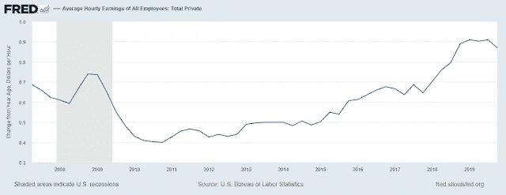

# 交替经济史:大通货膨胀

> 原文：<https://medium.datadriveninvestor.com/alternate-economic-histories-the-great-inflation-7a95ecc01ad3?source=collection_archive---------23----------------------->

我可能在其他地方提到过这一点，但真正让我对经济学感兴趣的一件事是，我在危机后失业了两年。2008 年，我不知何故丢掉了两份工作，而且我没有本地网络，所以不管我去哪里申请，不管我做了什么，感觉一切都在垃圾堆里。这是令人难以置信的沮丧。我救星之一就是知道其他人和我处境相同。我等待着经济学家和大众媒体记者的数据发布和分析，以显示失业率确实在下降，但“长期失业者”的失业率仍然很高。

那段时间流行的东西之一是工资随时间变化的图表。这是一个区间内百分比变化的直方图，从中可以得出的教训是，在危机刚刚结束时，绝大多数工资变化都停留在零。从名义上看，劳动力价格似乎是有粘性的。没有人真的接受减薪。工作岗位被取消或停滞在零增长。各州立法鼓励工作共享，这在德国更为普遍，但据我所知，这种结构很少被采用。如果你有工作，你的权力非常小，而且你很高兴有一份工作，因为大多数人都认识失业或失去住房或两者兼而有之的人。

 [## 为什么包容性财富指数比 GDP 更能衡量社会进步？|数据驱动…

### 你不需要成为一个经济奇才或金融大师就能知道 GDP 的定义。即使你从未拿过 ECON 奖…

www.datadriveninvestor.com](https://www.datadriveninvestor.com/2019/03/08/why-inclusive-wealth-index-is-a-better-measure-of-societal-progress-than-gdp/) 

如果我在谷歌上做得更好，我也许能找到我正在想的准确的图表，但我不能。相反，下面是一个代理数据，显示了危机后几年的总体工资变化有多接近最低工资。

在 FRED 上玩不同的时间序列会让你看到这种变化的不同外观，如果你叠加各种通货膨胀指标，你可以看到在这段时间内实际工资也没有太大的变化。

我在这段时间听到的一个原因是，政策制定者正在停止使用货币和财政政策工具，因为他们害怕通货膨胀。在通胀时期，许多能够对经济事务产生影响的人都在读研究生，或者是年轻学者。当时正值越南战争和尼克松关闭黄金窗口，标志着布雷顿森林体系的终结和自由浮动法定货币的全面引入。我们知道沃尔克冲击(Volcker shock)和 80 年代初的衰退打破了通胀的脊梁，但我们不常谈论的是，解散工会的政治举措不仅仅是劳动力减弱的信号，它还产生了货币政策效应。大西洋两岸都支持支持商业的新自由主义计划。撒切尔夫人对矿工穷追不舍，里根解雇了罢工的 PATCO 空中交通管制员工会，这些都是对工会开放的信号。随着工会密度的下降，我们看到通货膨胀率也相应下降。这就把我们带到了一个点上，经济学家称这个时期为“大缓和”，并声称商业周期已经结束。

经济史的问题是，我们经常在打最后一仗。担心通货膨胀，所以我们没有使用积极的政策来确保普通民众不会承受最严重的危机。我们救助了所有的银行，并为救助最终让投资资产回报了 1%而沾沾自喜，而人们却失去了家园和生计，我们开始谈论长期停滞，担心滞后，并抛出“新常态”等术语，而不是问我们是否还能做更多。希望我们能从这次危机中吸取教训，为下一次危机做好准备。问题在于，你无法让时间倒流，也无法对宏观政策的结果进行实验。因此，当事情变糟时，你必须要么说我们本可以做得更好，要么说服自己别无选择。

但除了大通胀，还有其他选择。

凯恩斯主义经济学家詹姆士·托宾在 1984 年主张“通胀控制是一种公共产品”(53)，并指出它确实给社会带来了真正的成本。对于我这一代人来说，这很难相信，联邦基金利率最高约为 5%，而 CPI 一直处于静止状态。托宾在他的文章“一个社会契约的约束”中认为，这正是一个“相互保证的通货紧缩”(54)。托宾在他的论点中所缺乏的是一个现实的变革理论，希望通过总统的领导达成一个国家共识，以自我实施工资政策来保持通货膨胀率下降。虽然我希望在劳资之间的 kumbaya 时刻走到一起，但我们看到了历史实际上是如何发展的，资本的力量压倒了劳工，以至于劳工在其组织形式中是一种非常微弱的抗衡力量。

为了让托宾 1984 年的理想化世界成为可能，我们真的需要看看权力是如何在经济中存在和运用的。你必须创造激励来做出你心目中的改变，激励劳资双方。英国马克思主义者大卫·波弟在他对 70 年代历史的回顾《战斗的代价》中谈到了这样一种平衡。波弟倡导的社会契约与托宾所希望的一样，在 70 年代的加速通货膨胀时期，这是一个“劳工运动通过提出接受自愿工资限制以换取旨在实现经济民主化的结构改革来争夺霸权”的时期(1)。波弟的作品包含了许多 70 年代英国左翼内部意识形态斗争的“内幕”历史，但我们可以从他身上汲取一些精华。一是他指出，工会主义者否认他们的持续工资增长具有宏观经济影响(9)，因此否认主义导致他们看不到他们可以在遏制工资增长方面发挥作用。波弟还强调了高通胀的社会问题，即使对于工党政府来说也是如此，因为高且不可预测的通胀会降低商业信心，并控制通胀以防止社会动荡(12)。自上而下控制通胀的问题在于，我们采取的方式是制造失业或试图利用工资和价格控制。所使用的机制不起作用，所以保守党政府最终使用了第一种选择，这一事件他称之为“不流血的内战”(15)。

对波弟来说，有一个真正的替代方案，即有一个强大的劳工运动，愿意接受更低或冻结的工资，以换取“工人通过选举产生的工人董事系统参与从车间到公司董事会的决策”(15-6)。我们看到波弟概述的是一个错过的机会，因为真正的历史是工党在英国十多年的保守党统治中失去权力的历史。不幸的是，我们不能像波弟建议的那样，让时间倒流，通过工人的力量来打破通货膨胀。这产生了连锁反应，劳工力量被削弱，在下一次危机的余波中没有发言权。然而，我认为它提出了一个有趣的问题，即它对工人权力整体意味着什么。波弟关注的是工资谈判是通货膨胀的驱动力，在这里“很难想象一个更清晰的个人理性导致社会病态的例子”(14)，所以当我们谈论工人权力时，我们应该记住大局。但它也向我暗示了《共产党宣言》中的呼吁有许多角度，这是世界各地的工人需要团结起来的著名结束语，因为除了我们的锁链，没有什么可以失去。这是对革命的呼唤，但波弟概述的是另一种方式的革命，在这种方式下，劳动力变成了资本，或者至少在企业管理方面，他们的关注是平等和平行的。我想，工人控制生产资料的意义不止一个。

引用
大卫·波弟，“好战的工资:收入政策，霸权和英国左派的衰落”，[http://david.purdy1@btopenworld.com，](http://david.purdy1@btopenworld.com,)2006 年 7 月 7 日
詹姆士·托宾，“社会契约的约束”，挑战，1984 年 3-4 月
美国劳工统计局，所有雇员的平均每小时收入:私人总额[ces 05000000003]，从圣路易斯的美联储银行检索；[https://fred.stlouisfed.org/series/CES0500000003,](https://fred.stlouisfed.org/series/CES0500000003,)2020 年 2 月 17 日。

*最初发表于*[*http://econautodidactic.blogspot.com*](https://econautodidactic.blogspot.com/2020/02/alternate-economic-histories-great.html)*。*