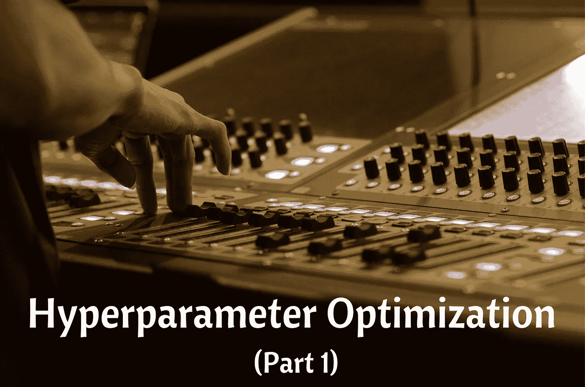

# 您需要了解的替代超参数优化技术—第 1 部分

> 原文：<https://medium.datadriveninvestor.com/alternative-hyperparameter-optimization-techniques-you-need-to-know-part-1-3f68d0448fcd?source=collection_archive---------3----------------------->

## 超参数优化技术。

## 微调机器学习模型以提高性能的不同方法。



Image by [dmwcebi](https://pixabay.com/users/dmwcebi-6228068/?utm_source=link-attribution&utm_medium=referral&utm_campaign=image&utm_content=2666136) from [Pixabay](https://pixabay.com/?utm_source=link-attribution&utm_medium=referral&utm_campaign=image&utm_content=2666136)

在进行机器学习项目时，您需要遵循一系列步骤，直到您达到目标，其中一个步骤是对您选择的模型进行超参数优化。该任务总是在模型选择过程之后(选择比其他模型表现更好的最佳模型)。

# 什么是超参数优化？

在我定义超参数优化之前，你需要理解什么是**超参数**。简而言之，超参数是用于控制学习过程的不同参数值，并且对机器学习模型的性能具有显著影响。随机森林算法中超参数的例子是估计量的数量(*n _ 估计量*)、最大深度( *max_depth* )和标准。这些参数**是可调的**，可以直接影响模型训练的好坏。

然后**超参数优化**是寻找超参数值的正确组合的过程，以便在合理的时间内实现数据的最高性能。它在机器学习算法的预测准确性方面起着至关重要的作用。因此，超参数优化被认为是构建机器学习模型中最棘手的部分。

这些机器学习算法中的大多数都带有默认的超参数值。默认值并不总是在不同类型的机器学习项目中表现良好，这就是为什么你需要优化它们，以获得最佳性能的正确组合。

> 一个好的超参数选择真的可以让一个算法大放异彩。

有一些优化超参数的常用策略:

## (a)网格搜索

这是一种广泛使用的传统方法，通过执行超参数调整来确定给定模型的最佳值。网格搜索通过尝试你想要在你的模型中尝试的参数的每一个可能的组合来工作，这意味着它将花费**很多时间**来执行整个搜索，这可能变得非常计算昂贵。

**注意:**你可以在这里学习如何实现网格搜索[。](https://github.com/Davisy/Hyperparameter-Optimization-Techniques/blob/master/GridSearchCV%20.ipynb)

## 随机搜索

这种方法的工作方式不同，其中超参数值的**随机**组合被用于**寻找**所建模型的最佳解决方案。随机搜索的缺点是有时会错过搜索空间中的重要点(值)。

注意:你可以在这里了解更多实现随机搜索的方法。

# 替代超参数优化技术。

在这一系列文章中，我将向您介绍不同的高级超参数优化技术/方法，它们可以帮助您获得给定模型的最佳参数。我们将研究以下技术。

*   远视
*   Scikit 优化
*   奥普图纳

在本文中，我将重点介绍**hyperpt**的实现。

> *如果您没有执行超参数优化，您需要现在就开始。*

# 什么是远视

Hyperopt 是一个强大的超参数优化 python 库，由 James Bergstra 开发。Hyperopt 使用一种贝叶斯优化形式进行参数调整，允许您获得给定模型的最佳参数。它可以大规模地优化一个具有数百个参数的模型。

[](https://www.datadriveninvestor.com/2020/07/23/learn-data-science-in-a-flash/) [## 一瞬间学会数据科学！？数据驱动的投资者

### 在我之前的职业生涯中，我是一名训练有素的古典钢琴家。还记得那些声称你可以…

www.datadriveninvestor.com](https://www.datadriveninvestor.com/2020/07/23/learn-data-science-in-a-flash/) 

# 远视的特征

Hyperopt 包含 4 个你需要知道的重要特性，以便运行你的第一次优化。

## (一)搜索空间

超点具有不同的函数来指定输入参数的范围，这些是随机搜索空间。搜索空间最常见的选项有:

*   **hp.choice(label，options)** —这可用于分类参数，它返回选项之一，应该是列表或元组。例如:hp.choice("criterion "，["gini "，" entropy",])
*   **hp.randint(label，upper)** —可用于整数参数，返回(0，upper)范围内的随机整数。示例:hp.randint("max_features "，50)
*   **hp.uniform(label，low，high)** —在`low`和`high`之间统一返回值，例如:hp.uniform("max_leaf_nodes "，1，10)

您可以使用其他选项有:

*   **hp.normal(label，mu，sigma)**-返回一个正态分布的真实值，其平均值为 mu，标准差为 sigma
*   **hp.qnormal(label，mu，sigma，q)** —这将返回一个类似 round(normal(mu，sigma) / q) * q 的值
*   **hp.lognormal(label，mu，sigma)** —返回根据 exp(normal(mu，sigma))得出的值
*   **hp.qlognormal(label，mu，sigma，q)** —返回类似 round(exp(normal(mu，sigma)) / q) * q 的值

你可以在这里了解更多搜索空间选项[。](https://github.com/hyperopt/hyperopt/wiki/FMin#21-parameter-expressions)

**注意:**每个可优化的随机表达式都有一个标签(例如 n 个估计量)作为第一个参数。这些标签用于在优化过程中向调用者返回参数选择。

## 目标函数

这是一个最小化函数，它从搜索空间接收超参数值作为输入，并返回损失。这意味着在优化过程中，我们用选定的超参数值训练模型，预测目标特征，然后评估预测误差并将其反馈给优化器。优化器将决定检查哪些值并再次迭代。你将在一个实例中学习如何创建一个目标函数。

## fmin

fmin 函数是优化函数，其迭代不同组的算法及其超参数，然后最小化目标函数。fmin 接受 5 个输入，它们是:-

*   最小化的目标函数
*   定义的搜索空间
*   要使用的搜索算法，例如随机搜索、TPE(树 Parzen 估计器)和自适应 TPE。
    **NB:** `hyperopt.rand.suggest`和`hyperopt.tpe.suggest`为超参数空间的顺序搜索提供逻辑。
*   最大评估次数。
*   trials 对象(可选)。

示例:

## (四)审判对象

Trials 对象用于保存所有超参数、损耗和其他信息，这意味着您可以在运行优化后访问它们。此外，试验可以帮助您保存重要信息，稍后加载，然后恢复优化过程。(您将在实际示例中了解更多信息)。

在了解了远视的重要特征之后，在以下步骤中描述了使用远视的方法。

*   初始化要搜索的空间。
*   定义目标函数。
*   选择要使用的搜索算法。
*   运行远视功能。
*   分析存储在**试验对象**中的评估输出。

# 实践中的超波特

现在您已经知道了 Hyperopt 的重要特性，在这个实际例子中，我们将使用**手机价格数据集**，任务是创建一个模型来预测手机的价格有多高，即 0( *低成本*)或 1( *中等成本*)或 2( *高成本*)或 3( *非常高成本*)。

## 安装 Hyperopt

您可以从 PyPI 安装 hyperopt。

```
pip install hyperopt
```

然后进口重要包包括 Hyperopt。

## 资料组

让我们从数据目录加载数据集。要获得关于数据集的更多信息，请阅读此处的[。](https://www.kaggle.com/iabhishekofficial/mobile-price-classification?select=train.csv)

检查数据集的前五行。


如您所见，在我们的数据集中，我们有不同的带有数值的要素。

让我们观察数据集的形状。

(2000, 21)

在这个数据集中，我们有 *2000 行*和 *21 列*。现在，让我们来了解一下该数据集中的要素列表。

['battery_power '，' blue '，' clock_speed '，' dual_sim '，' fc '，' four_g '，' int_memory '，' m_dep '，' mobile_wt '，' n_cores '，' pc '，' px_height '，' px_width '，' ram '，' sc_h '，' sc_w '，' talk_time '，' three_g '，' touch_screen '，' wifi '，' price_range']

你可以在这里找到每个列名[的含义。](https://www.kaggle.com/iabhishekofficial/mobile-price-classification)

## 将数据集分割成目标要素和独立要素

这是一个分类问题，我们将从数据集中分离目标特征和独立特征。我们的目标功能是**价格范围**。

## 预处理数据集。

然后使用 scikit-learn 中的[standard scaler](https://scikit-learn.org/stable/modules/generated/sklearn.preprocessing.StandardScaler.html)方法对独立特征进行标准化。

## 定义优化的参数空间

我们将使用**随机森林算法**的三个超参数，即 *n_estimators、max_depth 和 criterion* 。

我们在上面选择的超参数中设置了不同的值。然后我们将定义目标函数。

## 定义一个函数来最小化(目标函数)

我们最小化的函数叫做**超参数调整**，优化其超参数的分类算法是**随机森林**。我使用交叉验证来避免过度拟合，然后函数将返回一个损失值及其状态。

注意:记住[远视](https://github.com/hyperopt/hyperopt/tree/master/hyperopt)最小化功能，这就是为什么我在 **acc** 中添加负号:

## 微调模型

最后，首先实例化试验对象，微调模型，然后打印最佳损失及其超参数值。

100%|█████████████████████████████████████████████████████████| 100/100[10:30 < 00:00，6.30s/试，最佳损失:-0.8915]最佳:{'criterion': 1，' max_depth': 11.0，' n_estimators': 2}。

在进行超参数优化后，损失为 **-0.8915** 意味着在随机森林分类器中使用 *n_estimators = 300，max_depth = 11，criterion = "entropy"* ，模型性能具有 **89.15%** 的准确度。

## 使用试验对象分析结果

trials 对象可以帮助我们检查在实验过程中计算的所有返回值。

**(a) trials.results** 这显示了搜索期间“目标”返回的词典列表。

```
trials.results
```

[{'loss': -0.879000000000001，' status': 'ok'}，{'loss': -0.877，' status': 'ok'}，{'loss': -0.768，' status': 'ok'}，{'loss': -0.8205，' status': 'ok'}，{ ' loss ':-0.87200000000000001，' status': 'ok'}，{ ' loss ':' loss ':' ok ' }，{ ' loss ':-0.]

**(b)trials . loss()** 这显示了一个损失列表(每个‘ok’试验的浮动)。

```
trials.losses()
```

[-0.8790000000000001, -0.877, -0.768, -0.8205, -0.8720000000000001, -0.883, -0.8554999999999999, -0.8789999999999999, -0.595, -0.8765000000000001, -0.877, ………]

**(c)trials . status()** 显示状态字符串列表。

```
trials.statuses()
```

['ok '，' ok '，' ok '，' ok '，' ok '，' ok '，' ok '，' ok '，' ok '，' ok '，' ok '，' ok '，' ok '，' ok '，' ok '，' ok '，' ok '，' ok '，' ok '，' ok '，' ok '，' ok '，' ok '。]

**注意:**该试验对象可以被保存，传递给内置绘图程序，或使用您自己的定制代码进行分析。

# 包扎

恭喜你，你已经完成了这篇文章的结尾！

您可以在这里下载本文中使用的数据集和笔记本:
[https://github . com/Davisy/Hyperparameter-Optimization-Techniques](https://github.com/Davisy/Hyperparameter-Optimization-Techniques)

## 下一步是什么？

在第 2 部分中，我将介绍第二种可选的超参数优化技术，称为 **Scikit-Optimize** 。

*更新:系列第二部现已面世点击* [*此处*](https://medium.com/datadriveninvestor/alternative-hyperparameter-optimization-techniques-you-need-to-know-part-2-e9b0d4d080a9) *阅读。*

如果你学到了新的东西或者喜欢阅读这篇文章，请分享给其他人看。在那之前，第 2 部分再见！。也可以通过 Twitter [@Davis_McDavid](https://twitter.com/Davis_McDavid) 找到我

## 访问专家视图— [订阅 DDI 英特尔](https://datadriveninvestor.com/ddi-intel)