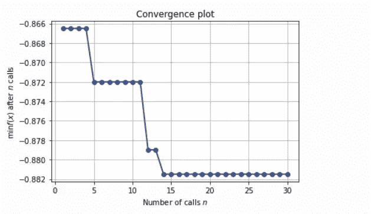

# 您需要了解的替代超参数优化技术—第 2 部分

> 原文：<https://medium.datadriveninvestor.com/alternative-hyperparameter-optimization-techniques-you-need-to-know-part-2-e9b0d4d080a9?source=collection_archive---------1----------------------->

## 超参数优化技术。

## 微调机器学习模型以提高性能的不同方法。


这是关注您需要了解的替代超参数优化技术系列的第二部分。在第一部分中，我们看了最常用的方法(GridsearchCV 和 randomizedSearchCV)和第一种替代方法**hyperpt**。如果这是你的第一次，我强烈建议你在这里阅读第一部分。

现在让我们学习第二种替代超参数优化技术。

# sci kit-优化

Scikit-optimize 是另一个用于超参数优化的开源 python 库，它实现了几种基于模型的顺序优化方法。该库非常易于使用，并为贝叶斯优化提供了一个通用工具包，可用于超参数调优。它还支持对 scikit-learn 库提供的机器学习算法的超参数进行调优。

scikit-optimize 构建在 Scipy、NumPy 和 Scikit-Learn 之上。

# scikit-optimize 的特性

Scikit-optimize 包含至少四个您需要了解的重要特性，以便运行您的首次优化。

## 空间

scikit-optimize 具有不同的函数来定义包含一个或多个维度的优化空间。搜索空间最常见的选项有:

*   **实数** —这是一个搜索空间维度，可以采用任何实数。您需要定义下限和上限，并且两者都包含在内。
    举例:`Real(low=0.2, high=0.9, name="min_samples_leaf")`
*   **整数** —这是一个可以采用整数值的搜索空间维度。
    例如:`Integer(low=3, high=25, name="max_features")`
*   **分类** —这是一个可以采用分类值的搜索空间维度。
    例如:`Categorical(["gini","entropy"],name="criterion")`

注意:在每个搜索空间中，你必须使用 **name** 参数来定义要优化的超参数名称。

## BayesSearchCV

BayesSearchCV 类提供了一个类似于`GridSearchCV`或`RandomizedSearchCV`的接口，但是它对超参数执行贝叶斯优化。BayesSearchCV 实现了“**拟合**”和“**得分**”方法以及其他常用方法( *predict()、predict_proba()、decision_function()、transform()和 inverse_transform()* )，如果它们在所使用的估计器中实现的话。

> 与 GridSearchCV 相反，不是所有的参数值都被尝试，而是从指定的分布中采样固定数量的参数设置。尝试的参数设置的数量由 n_iter 给出。

**NB:** 您将在一个实际的例子中学习如何实现 BayesSearchCV。

## 目标函数

这是一个将由搜索过程调用的函数，它从搜索空间接收超参数值作为输入，并返回损失(越低越好)。这意味着在优化过程中，我们用选定的超参数值训练模型，预测目标特征，然后评估预测误差并将其反馈给优化器。优化器将决定检查哪些值并再次迭代。你将在一个实例中学习如何创建一个目标函数。

## 优化程序

这是执行贝叶斯超参数优化过程的函数。优化函数在每个模型和搜索空间迭代以优化然后最小化目标函数。
sci kit-optimize 库提供了不同的优化功能，例如:-

*   **dummy_minimize** —在给定范围内均匀采样的随机搜索。
*   **forest_minimize** —使用决策树的顺序优化。
*   **gbrt_minimize** —使用梯度增强树的顺序优化。
*   **gp_minimize —** 使用高斯过程的贝叶斯优化。
    注意:我们将在实际例子中实现 gp_minimize。

其他需要学习的功能如下

*   [空间变形金刚](https://scikit-optimize.github.io/0.7/modules/classes.html#module-skopt.space.transformers) s
*   [实用程序功能](https://scikit-optimize.github.io/0.7/modules/classes.html#module-skopt.utils)
*   [绘图功能](https://scikit-optimize.github.io/0.7/modules/classes.html#module-skopt.plots)
*   [基于模型优化的机器学习扩展](https://scikit-optimize.github.io/0.7/modules/classes.html#module-skopt.learning)

# sci kit-实践中的优化

现在，您已经了解了 scikit-optimize 的重要特性，在这个实际示例中，我们将使用**手机价格数据集**，任务是创建一个模型来预测手机的价格有多高，即 0( *低成本*)或 1( *中等成本*)或 2( *高成本*)或 3( *极高成本*)。

[](https://www.datadriveninvestor.com/2020/07/23/learn-data-science-in-a-flash/) [## 一瞬间学会数据科学！？数据驱动的投资者

### 在我之前的职业生涯中，我是一名训练有素的古典钢琴家。还记得那些声称你可以…

www.datadriveninvestor.com](https://www.datadriveninvestor.com/2020/07/23/learn-data-science-in-a-flash/) 

## 安装 sci kit-优化

scikit-optimize 需要以下 python 版本和包。

*   Python >= 3.6
*   NumPy (>= 1.13.3)
*   SciPy (>= 0.19.1)
*   joblib (>= 0.11)
*   scikit-learn >= 0.20
*   matplotlib >= 2.0.0

您可以通过以下方式安装最新版本:

```
pip install scikit-optimize
```

然后导入重要的包，包括 scikit-optimize。

## 资料组

让我们从数据目录加载数据集。要获得关于数据集的更多信息，请阅读此处的[。](https://www.kaggle.com/iabhishekofficial/mobile-price-classification?select=train.csv)

检查数据集的前五行。


如您所见，在我们的数据集中，我们有不同的带有数值的要素。

让我们观察数据集的形状。

(2000, 21)

在这个数据集中，我们有 *2000 行*和 *21 列*。现在，让我们来了解一下该数据集中的要素列表。

['battery_power '，' blue '，' clock_speed '，' dual_sim '，' fc '，' four_g '，' int_memory '，' m_dep '，' mobile_wt '，' n_cores '，' pc '，' px_height '，' px_width '，' ram '，' sc_h '，' sc_w '，' talk_time '，' three_g '，' touch_screen '，' wifi '，' price_range']

你可以在这里找到每个列名[的含义。](https://www.kaggle.com/iabhishekofficial/mobile-price-classification)

## 将数据集分割成目标要素和独立要素

这是一个分类问题，我们将从数据集中分离目标特征和独立特征。我们的目标功能是**价格范围**。

## 预处理数据集。

然后使用 scikit-learn 的[标准定标器](https://scikit-learn.org/stable/modules/generated/sklearn.preprocessing.StandardScaler.html)方法对独立特征进行标准化。

## 第一种方法

在第一种方法中，我们将使用 **BayesSearchCV** 为随机森林算法执行超参数优化。

## 定义搜索空间

我们将调整随机森林模型的以下超参数:

*   **n_estimators** —森林中树木的数量。
*   **max_depth** —树的最大深度。
*   **标准** —测量分割质量的功能。

我们将搜索空间定义为一个字典，其中超参数名称用作关键字，变量的范围用作值。

## 定义 *BayesSearchCV* 配置

BayesSearchCV 的好处是搜索过程是自动执行的，只需要最少的配置。该类可以像 Scikit-Learn 一样使用(GridSearchCV 和 RandomizedSearchCV)。

## 微调模型

然后，我们通过传递预处理的特性和目标特性(price_range)来执行搜索。

您可以从**搜索**中使用 **best_score_** 属性找到最佳分数，使用 **best_params_** 属性找到最佳参数。

**注意:**当前版本的 scikit-optimize(0.7.4)与最新版本的 scikit learn (0.23.1 和 0.23.2)不兼容，因此当您使用这种方法运行优化过程时，可能会出现如下错误:-

```
**TypeError**: object.__init__() takes exactly one argument (the instance to initialize)
```

你可以在他们的 GitHub 账号里找到更多关于这个错误的信息。

*   [https://github . com/sci kit-optimize/sci kit-optimize/issues/928](https://github.com/scikit-optimize/scikit-optimize/issues/928)
*   [https://github . com/sci kit-optimize/sci kit-optimize/issues/924](https://github.com/scikit-optimize/scikit-optimize/issues/924)
*   [https://github . com/sci kit-optimize/sci kit-optimize/issues/902](https://github.com/scikit-optimize/scikit-optimize/issues/902)

我希望他们很快解决这个不兼容的问题。

## (b)第二种方法

在第二种方法中，我们首先通过使用 scikit-optimize 提供的空间方法来定义搜索空间，这些方法是*分类的和整数的。*

我们在上面选择的超参数中设置了不同的值。然后我们将定义目标函数。

## 定义一个函数来最小化(目标函数)

我们最小化的函数叫做 **evalute_model** ，优化其超参数的分类算法是**随机森林**。我使用交叉验证来避免过度拟合，然后函数将返回一个损失值。

use_named_args() decorator 允许您的目标函数接收参数作为关键字参数。当您想要设置 scikit-learn 估计器参数时，这尤其方便。

注意:记住 scikit-optimize 最小化了函数，这就是为什么我在 acc 中添加了负号。

## 微调模型

最后，我们使用 scikit-optimize 的 **gp_minimize** 方法(它使用基于高斯过程的优化)对模型进行微调，然后打印最佳损失及其超参数值。

**输出:**
*开始第 1 次迭代。随机点的评价函数。
1 号迭代结束。在随机点进行评估。
耗时:8.6910
获得函数值:-0.8585
当前最小值:-0.8585
第 2 次迭代开始。随机点的评价函数。第二次迭代结束。在随机点进行评估。
耗时:4.5096
获得的函数值:-0.7680
当前最小值:-0.8585……………………*

**注意:**它会一直运行到最后一次迭代。对于我们的优化过程，迭代的总数是 30。

然后，我们可以打印出最佳精度和所用的选定超参数值。

```
Best Accuracy: -0.882
Best Parameters: [300, 'entropy', 9]
```

在执行超参数优化后，损失为 **-0.882** 意味着通过使用随机森林分类器中的 *n_estimators = 300，max_depth = 9，criterion = "entropy"* ，模型性能具有 **88.2%** 的准确度。
我们的结果和第一篇文章的远视相差不大(准确率 **89.15%** )。

## 打印函数值

通过使用 OptimizeResult 对象(Result)的 **func_vals** 属性，可以打印每次迭代的所有函数值。

```
print(result.func_vals)
```

**输出:**
数组([-0.8665，-0.7765，-0.7485，-0.86，-0.872，-0.545，-0.81，
-0.7725，-0.8115，-0.8705，-0.8685，-0.879，-0.816，-0.8815，
-0.8645，-0.8645

## 绘制收敛轨迹

我们可以使用 scikit-optimize 中的 **plot_convergence** 方法来绘制一条或多条收敛轨迹。我们只需要在 plot_convergence 方法中传递 OptimizeResult 对象(Result)即可。



convergence plot

该图显示了优化过程中不同迭代的函数值。

# 包扎

祝贺您，您已经完成了本系列的第二篇文章。！

你可以在这里下载本文使用的数据集和笔记本:
[https://github . com/Davisy/Hyperparameter-Optimization-Techniques](https://github.com/Davisy/Hyperparameter-Optimization-Techniques)

## 下一步是什么？

在第 3 部分中，我将介绍第三种也是最后一种超参数优化技术，称为 **Optuna。**

如果你学到了新的东西或者喜欢阅读这篇文章，请分享给其他人看。在那之前，第 3 部分再见！。也可以通过推特 [@Davis_McDavid](https://twitter.com/Davis_McDavid) 联系到我

***最后一件事:*** *在下面的链接里多看看类似这样的文章。*

[](https://medium.com/@Davis_David/alternative-hyperparameter-optimization-techniques-you-need-to-know-part-1-3f68d0448fcd) [## 您需要了解的替代超参数优化技术—第 1 部分

### 微调机器学习模型以提高性能的不同方法。

medium.com](https://medium.com/@Davis_David/alternative-hyperparameter-optimization-techniques-you-need-to-know-part-1-3f68d0448fcd) [](https://medium.com/datadriveninvestor/how-to-use-tree-based-algorithms-for-machine-learning-9da624c75755) [## 如何使用基于树的算法进行机器学习

### 使用和理解随机森林算法的指南

medium.com](https://medium.com/datadriveninvestor/how-to-use-tree-based-algorithms-for-machine-learning-9da624c75755) [](https://medium.com/analytics-vidhya/how-to-write-configuration-files-in-your-machine-learning-project-47bc840acc19) [## 如何在你的机器学习项目中写配置文件？

### 用配置文件管理参数和初始设置。

medium.com](https://medium.com/analytics-vidhya/how-to-write-configuration-files-in-your-machine-learning-project-47bc840acc19) 

## 访问专家视图— [订阅 DDI 英特尔](https://datadriveninvestor.com/ddi-intel)