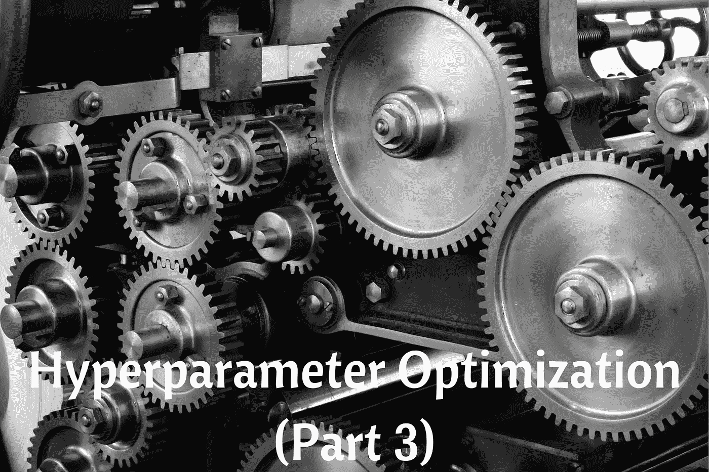
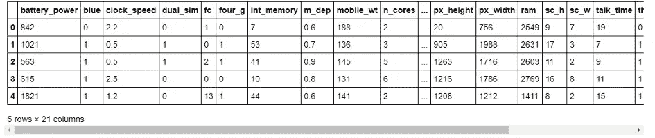
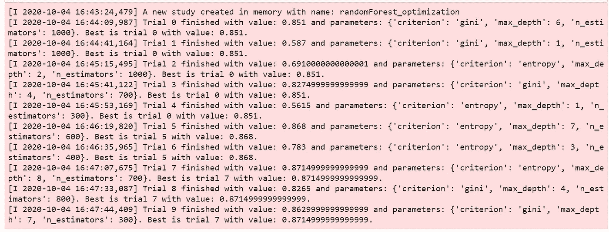
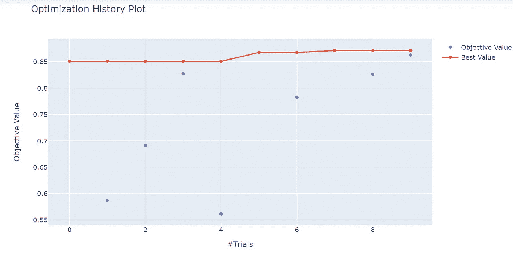
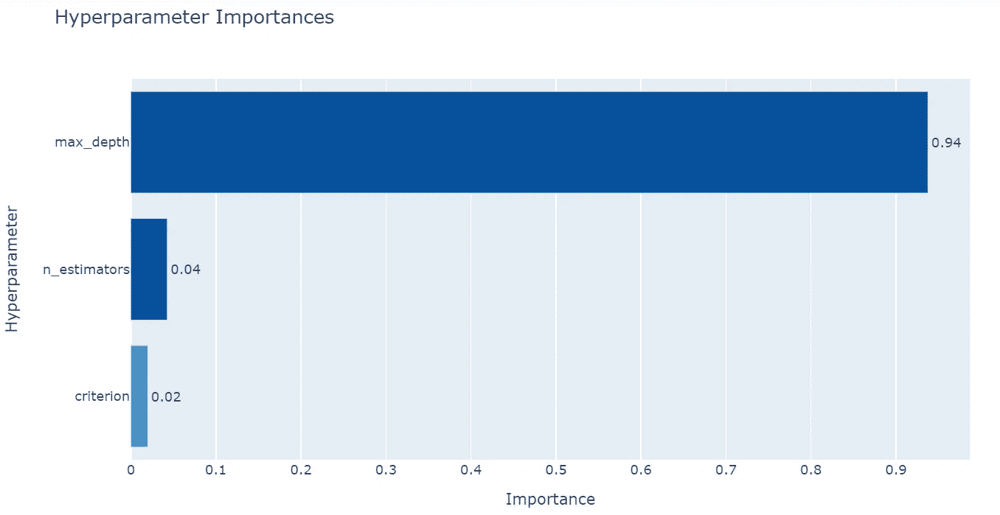
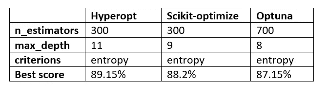

# 您需要知道的替代超参数优化技术—第 3 部分

> 原文：<https://medium.datadriveninvestor.com/alternative-hyperparameter-optimization-techniques-you-need-to-know-part-3-efc93489a27f?source=collection_archive---------4----------------------->

## 微调机器学习模型以提高性能的不同方法。



这是本系列的第三部分，也是最后一部分，重点介绍您需要了解的备选超参数优化技术。在第一部分中，我们看了最常用的方法(GridsearchCV 和 randomizedSearchCV)和第一种替代方法，称为**hyperpt**(点击[此处](https://medium.com/datadriveninvestor/alternative-hyperparameter-optimization-techniques-you-need-to-know-part-1-3f68d0448fcd)阅读第一部分)。在第二部分中，我们看了另一种替代的超参数优化技术，称为 **scikit-optimize** (点击[此处](https://medium.com/datadriveninvestor/alternative-hyperparameter-optimization-techniques-you-need-to-know-part-2-e9b0d4d080a9)阅读第二部分)。

现在让我们学习第三种可选的超参数优化技术。

# **Optuna**

Optuna 是另一个用于超参数优化的开源 python 框架，它使用贝叶斯方法来自动搜索超参数空间。该框架由一家名为 Preferred Networks 的日本人工智能公司开发。Optuna 提供了一种比 Hyperopt 更容易实现和使用的方法。您还可以指定优化过程应该持续多长时间。

# Optuna 的特征

Optuna 包含至少 5 个您需要了解的重要特性，以便运行您的第一次优化。

## (a)搜索空间

Optuna 为所有超参数类型提供了不同的选项。最常见的选择如下。

*   **分类参数**:使用**trials . suggest _ categorial()**方法，需要提供参数的名称及其选择。
*   **整型参数:**使用 **trials.suggest_int()** 方法，需要提供参数的名称，低值和高值。
*   **Float 参数:**使用 **trials.suggest_float()** 方法时，需要提供参数的名称，低值和高值。
*   **连续参数:**使用**trials . suggest _ uniform()**方法，需要提供参数的名称，低值和高值。
*   **离散参数:**使用**trials . suggest _ Discrete _ uniform()**方法，需要提供参数的名称，低值，高值，以及离散化的步长。

## 优化方法(采样器)

Optuna 提供了不同的方法来执行超参数优化过程。最常见的方法是:-

*   [**grid sampler**](https://optuna.readthedocs.io/en/stable/reference/generated/optuna.samplers.GridSampler.html)**:**它采用网格搜索，在研究过程中试验建议给定搜索空间中的所有参数组合。
*   [**random sampler**](https://optuna.readthedocs.io/en/stable/reference/generated/optuna.samplers.GridSampler.html)**:**它采用随机抽样。该采样器基于独立采样。
*   [**TPE sampler**](https://optuna.readthedocs.io/en/stable/reference/generated/optuna.samplers.TPESampler.html)**:**使用 TPE(Tree-structured Parzen Estimator)算法。
*   [**CmaEsSampler**](https://optuna.readthedocs.io/en/stable/reference/generated/optuna.samplers.CmaEsSampler.html) :使用 CMA-ES 算法。

## 目标函数

关于目标函数的解释与远视和 scikit 优化技术相同。唯一的区别是 Optuna 允许您在 one 函数中定义搜索空间和目标。

示例:

## 研究

一项研究对应于一项优化任务(一组试验)。如果您需要开始优化过程，您需要创建一个研究对象，并将目标函数传递给一个名为 **optimize()** 的方法，并按如下方式设置试验次数。

```
study = optuna.create_study()
study.optimize(objective, n_trials=100)
```

**create_study()** 方法允许您选择是*最大化*还是*最小化*您的目标函数。这是我喜欢 optuna 的有用特性之一，因为您可以选择优化过程的方向。

**NB:** 你将在一个实际的例子中学习如何实现。

## 可视化

Optuna 中的可视化模块提供了不同的方法来创建优化结果的图形。这些方法有助于您获得关于参数之间的相互作用以及如何前进的信息。这里有一些你可以使用的方法。

*   **plot_contour()** :该方法将参数关系绘制为病历报告中的等高线图。
*   **plot _ intermediate _ values():**此方法绘制研究中所有试验的中间值。
*   **plot _ optimization _ history():**此方法绘制研究中所有试验的优化历史。
*   **plot _ param _ importances():**该方法绘制超参数重要性及其值。
*   **plot_edf():** 该方法绘制研究的目标值 edf(经验分布函数)。

**注意:**我们将在实际例子中使用上面提到的一些方法。

# 实践中的 Optuna

现在你已经知道了 Optuna 的重要特性，在这个实际的例子中，我们将使用**手机价格数据集**，任务是创建一个模型来预测手机的价格有多高 0( *低成本*)或 1( *中成本*)或 2( *高成本*)或 3( *非常高成本*)。

## 安装 Optuna

您可以通过以下方式安装最新版本:

```
pip install optuna
```

然后导入重要的包包括 optuna。

## 资料组

让我们从数据目录加载数据集。要了解更多关于数据集的信息，请阅读此处的[。](https://www.kaggle.com/iabhishekofficial/mobile-price-classification?select=train.csv)

检查数据集的前五行。



如您所见，在我们的数据集中，我们有不同的带有数值的要素。

让我们观察数据集的形状。

(2000, 21)

在这个数据集中，我们有 *2000 行*和 *21 列*。现在，让我们来了解一下该数据集中的要素列表。

['battery_power '，' blue '，' clock_speed '，' dual_sim '，' fc '，' four_g '，' int_memory '，' m_dep '，' mobile_wt '，' n_cores '，' pc '，' px_height '，' px_width '，' ram '，' sc_h '，' sc_w '，' talk_time '，' three_g '，' touch_screen '，' wifi '，' price_range']

你可以在这里找到每个栏目名称[的含义。](https://www.kaggle.com/iabhishekofficial/mobile-price-classification)

[](https://www.datadriveninvestor.com/2020/08/27/what-is-a-data-catalog-and-how-does-it-enable-machine-learning-success/) [## 什么是数据目录，它如何使机器学习取得成功？数据驱动的投资者

### 数据目录是机器学习和数据分析的燃料。没有它，你将不得不花费很多…

www.datadriveninvestor.com](https://www.datadriveninvestor.com/2020/08/27/what-is-a-data-catalog-and-how-does-it-enable-machine-learning-success/) 

## 将数据集分割成目标要素和独立要素

这是一个分类问题，我们将从数据集中分离目标特征和独立特征。我们的目标特征是**价格范围**。

## 预处理数据集。

然后使用 scikit-learn 中的[standard scaler](https://scikit-learn.org/stable/modules/generated/sklearn.preprocessing.StandardScaler.html)方法对独立特征进行标准化。

## 在一个函数中定义搜索空间和目标。

正如我之前解释过的，Optuna 允许你在一个函数中定义搜索空间和目标。我们将为随机森林模型的以下超参数定义搜索空间:

*   **n_estimators** —森林中树木的数量。
*   **max_depth** —树的最大深度。
*   **标准** —测量分割质量的功能。

我们使用**trial . suggest _ categorial()**方法为 *max_depth* 和 *n_estimators* 的*准则*和 **trial.suggest_int()** 定义搜索空间。
同样，我们使用交叉验证来避免过度拟合，然后函数将返回平均精度。

## 创建研究对象

然后，我们创建一个与优化任务相对应的研究对象。 **create-study()** 方法允许我们提供研究的名称、优化的方向(*最大化*或*最小化*)以及我们想要使用的优化方法。

在我们的例子中，我们将我们的研究对象命名为**randomForest _ optimization**，优化的方向是 **maximize** (意味着分数越高越好)，使用的优化方法是 **TPESampler()。**

## 微调模型

为了运行优化过程，我们需要在 **optimize()** 方法中从我们创建的研究对象中传递目标函数和试验次数。我们将试验次数设置为 10 次(如果您想进行更多试验，可以更改次数)。

**输出:**



Trials output.

然后，我们可以打印出最佳精度和所用的选定超参数值。

(a)显示所选的最佳超参数值。

**输出:** { '准则':'熵'，'最大深度':8，' n _ 估计量':700}

(b)显示最佳得分或准确性。

**输出:** 0.871499999999999。

我们最好的成绩是 87.15%左右。

## 地块优化历史

我们可以使用 Optuna 中的**plot _ optimization _ history()**方法来绘制研究中所有试验的优化历史。我们只需要在方法中传递优化的学习对象。



该图显示了优化过程中不同试验的最佳值。

## 绘图超参数重要性

Optuna 提供了一个名为**plot _ param _ importances()**的方法来绘制超参数重要性。我们只需要在方法中传递优化的学习对象。



从上图可以看出，最大深度是最重要的超参数。

## 保存和加载超参数搜索

您可以使用 **joblib** 包保存并加载超参数搜索。

(a)保存超参数搜索。
我们将把超参数搜索保存在 optuna_searches 目录中。

(b)加载超参数搜索。
然后，如果您想从 optuna_searches 目录加载超参数搜索，您可以使用 joblib 中的 **load()** 方法。

# 包扎

祝贺您，您已经完成了本系列的第二篇文章。！

你可以在这里下载本文用到的数据集和笔记本:
[https://github . com/Davisy/Hyperparameter-Optimization-Techniques](https://github.com/Davisy/Hyperparameter-Optimization-Techniques)

让我们来看看从第 1 部分到第 3 部分讨论的 3 种超参数优化技术选择的总体得分和超参数值。



Optimization techniques overview

每种技术呈现的结果彼此没有太大的不同。所选择的迭代或试验的次数非常重要。对我来说，Optuna 提供了一种简单的实现方式，是我首选的超参数优化技术。请让我知道你的想法！

如果你学到了新的东西或者喜欢阅读这篇文章，请分享给其他人看。在那之前，我的下一篇文章再见！。也可以在推特上找到我 [@Davis_McDavid](https://twitter.com/Davis_McDavid)

***最后一件事:*** *在以下链接中阅读更多类似这样的文章。*

[](https://medium.com/datadriveninvestor/how-to-use-tree-based-algorithms-for-machine-learning-9da624c75755) [## 如何使用基于树的算法进行机器学习

### 使用和理解随机森林算法的指南

medium.com](https://medium.com/datadriveninvestor/how-to-use-tree-based-algorithms-for-machine-learning-9da624c75755) [](https://medium.com/analytics-vidhya/how-to-write-configuration-files-in-your-machine-learning-project-47bc840acc19) [## 如何在你的机器学习项目中写配置文件？

### 用配置文件管理参数和初始设置。

medium.com](https://medium.com/analytics-vidhya/how-to-write-configuration-files-in-your-machine-learning-project-47bc840acc19) [](https://towardsdatascience.com/14-lesser-known-impressive-features-of-scikit-learn-library-e7ea36f1149a) [## Scikit 学习库的 14 个鲜为人知的令人印象深刻的特性。

### scikit 学习库中经常未知和被低估的功能示例。

towardsdatascience.com](https://towardsdatascience.com/14-lesser-known-impressive-features-of-scikit-learn-library-e7ea36f1149a) 

## 访问专家视图— [订阅 DDI 英特尔](https://datadriveninvestor.com/ddi-intel)