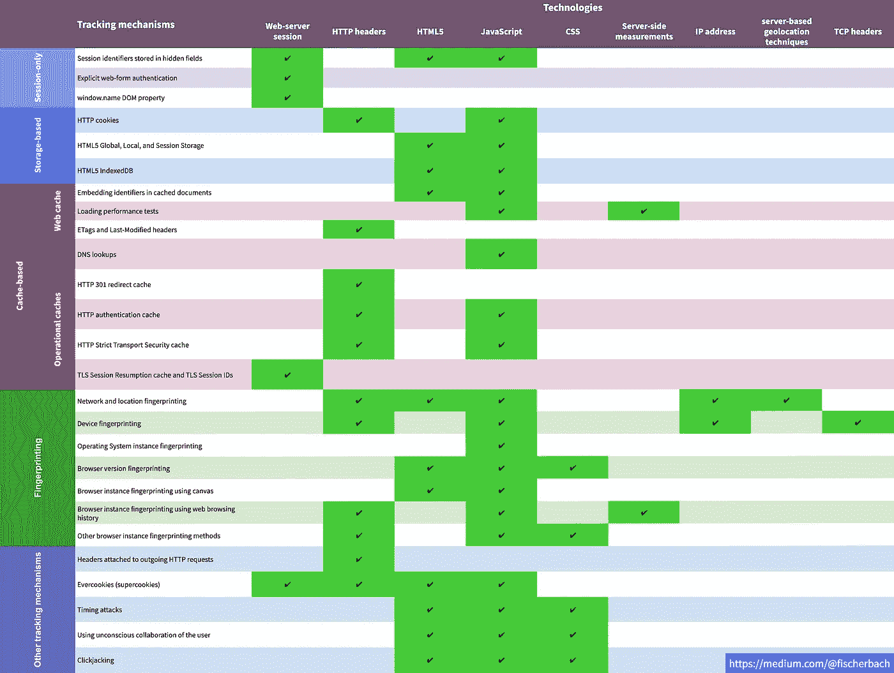
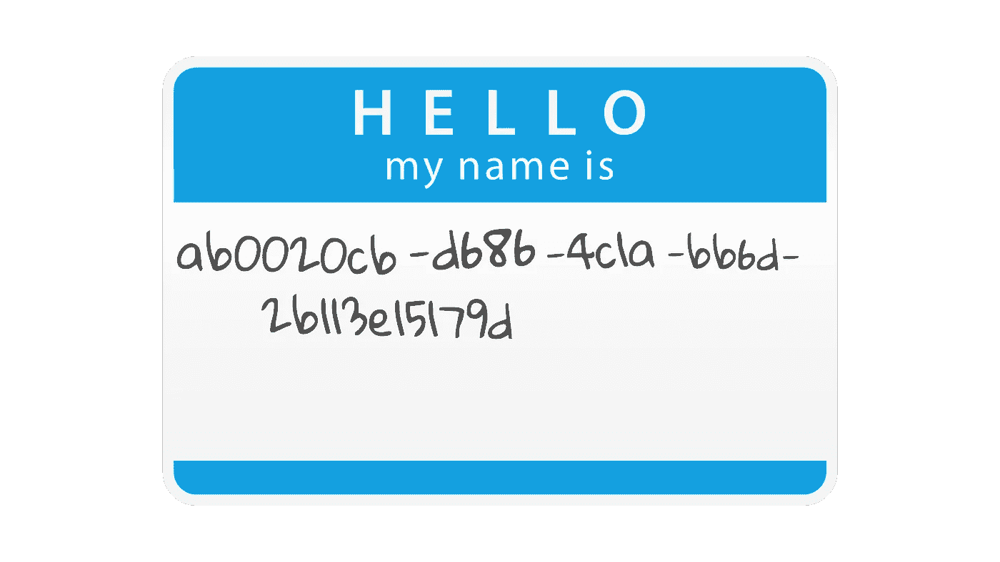
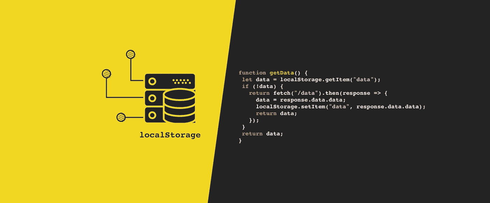
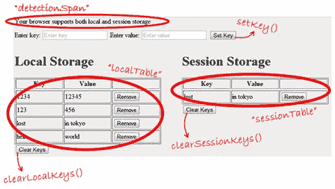
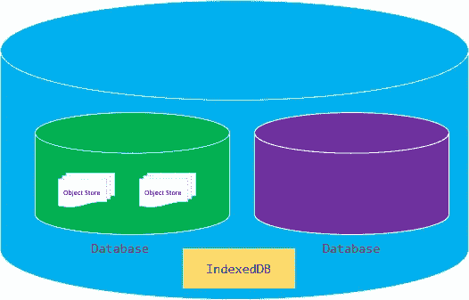
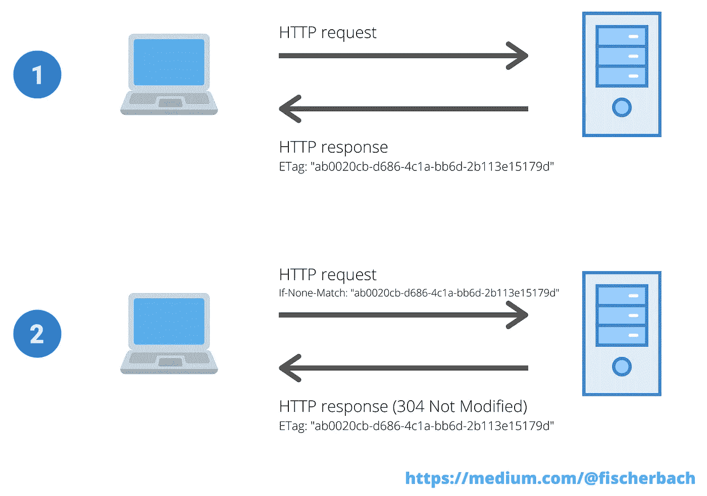
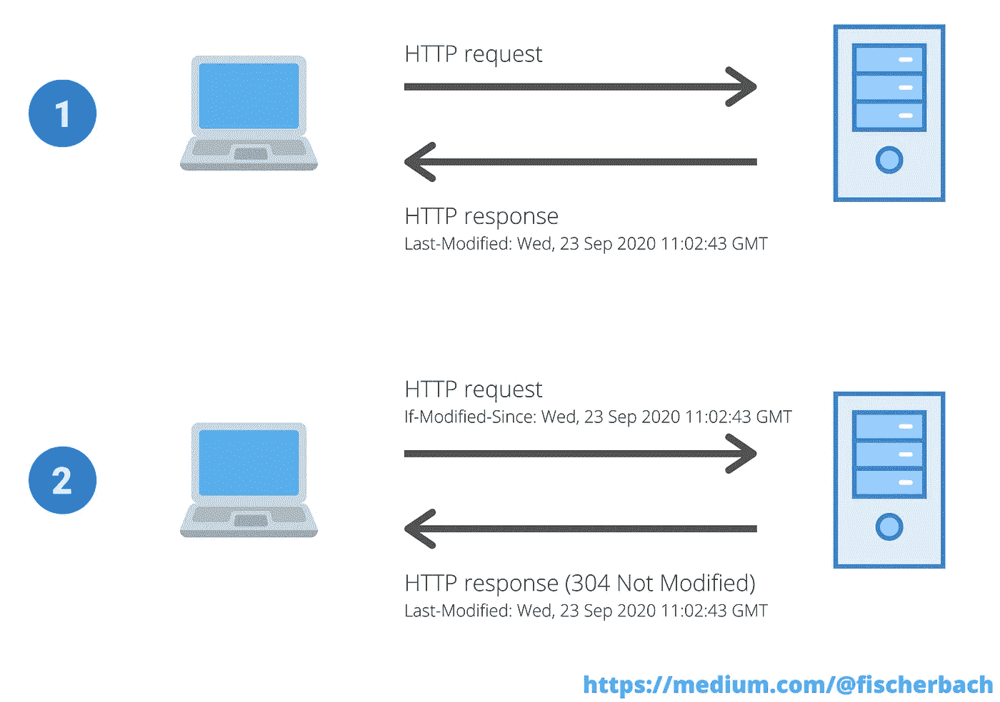
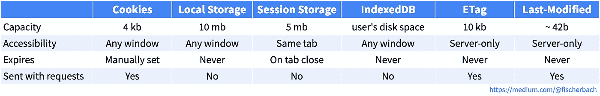

# 第三方 cookies 替代品

> 原文：<https://medium.datadriveninvestor.com/alternatives-to-third-party-cookies-in-2020-857609f8f2bb?source=collection_archive---------0----------------------->

## 第一部分

## 不使用第三方 cookies 的跨域跟踪

# 饼干面包店

现代网络是曲奇饼店。广告商使用 cookies 来提供令人毛骨悚然的广告。网站所有者使用 cookies 来衡量他们的受众。开发人员使用 cookies 来存储用户设置。

天哪，即使是那些 cookie 信息弹出窗口也是基于 cookie 的(否则网站怎么知道你已经看过了呢？).

Video fragment of [asdfmovie5](https://www.youtube.com/watch?v=tCnj-uiRCn8)

自从 mighty cookies 发明以来，整个行业都在依靠跟踪网站用户的能力。第三方 cookies 是广告商用来在域之间识别用户的最流行的机制。

所以难怪，这个机制在讨论中。出于隐私考虑。

[🔔想要更多这样的文章？在这里签名。](https://fischerbach.medium.com/membership)

# 谷歌饼干怪兽

2019 年 8 月，Chrome 的团队宣布，他们将在两年内从浏览器中删除第三方 cookies。Chrome 是最后一个开始限制第三方 cookies 的浏览器。

Image by Author

虽然 Safari 和 Firefox 已经内置了减少跨站点跟踪的解决方案，但 Chrome 占据了浏览器市场的大部分份额，对市场的影响也相应更大。

# 寻求替代方案

然而，仍然有符合[网络标准](https://en.wikipedia.org/wiki/Web_standards)的替代方案。为了找到它们，让我们在 web 标准文档中搜索“隐私问题”。

在这一部分中，我重点介绍了使用会话存储的机制、基于存储的机制和 web 缓存。

**基于存储的**

*   局部存储器
*   会话存储
*   索引 b

**网络缓存**

*   在缓存的文档中嵌入标识符
*   负载性能测试
*   ETag &上次修改时间

在接下来的部分，我将调查更先进的方法，如指纹和点击劫持。

Table of possible tracking mechanisms (based on [https://arxiv.org/pdf/1507.07872.pdf](https://www.google.com/url?q=https://arxiv.org/pdf/1507.07872.pdf&sa=D&ust=1600595720426000&usg=AFQjCNGtsk4VjcBF5QbMB-C5B4Lf3-ANaQ), moderated by Author)

# 唯一标识符的存储

让我们考虑这个用例。

你是一个出版商，拥有三个不同领域的网站。您需要实现在用户之间识别用户的机制(例如，确定有多少用户至少访问过每个站点一次)。

由于你的网站都没有登录功能，你必须使用某种匿名标识符。

例如，当用户第一次访问您的网站时，您将生成一个 [UUIDv4](http://ekonomia.wne.uw.edu.pl/ekonomia/getFile/778) ，并使用所有可用的方法将其保存在用户的计算机上。

Image by Author

然后，你的每个网站都应该能够在用户每次访问它的时候检索这个标识符。

无论获取 ID 的网站是什么，恢复的 ID 都应该是相同的。

# 基于存储的机制

HTML5 标准支持客户端的一系列结构化数据存储机制。这些是最广为人知的一代追踪技术，基于用户计算机上的持久存储。

Cookies 就属于这一类，它还包括本地存储、索引数据库和文件 API。

这些机制都是对用户隐私的最大威胁。因此，默认情况下，它们都不能在跨域环境中工作，大多数浏览器会根据用户的请求清除这些存储。

## 局部存储器

本地存储是一种机制，类似于 cookies，用于在客户端存储对象。

Local storage, a part of the web storage API, is a type of persistent storage built into the browser. (source: [Everything You Need To Know About Local Storage](https://www.boldare.com/blog/everything-you-need-to-know-about-local-storage/))

这些对象(键值对)被永久存储，直到用户或网站删除它们。一个对象可以有 5 MB 大，这比 cookies 有很大的优势。

正如我之前提到的，[标准网络存储(也叫本地存储)不允许跨域数据共享。](https://www.w3.org/TR/webstorage/#user-tracking)访问本地存储甚至比 cookies 更难，因为你甚至不能指定有权访问数据的子域。它们被视为完全不同的领域。

当某人有许多(子)域，并希望在它们之间共享数据时，这可能会有问题。

但是这个问题有一个解决方案——post message。

[postMessage](https://developer.mozilla.org/en-US/docs/Web/API/Window/postMessage) 方法安全地支持页面和嵌入其中的 iframe 之间的跨来源通信。后消息传递功能旨在允许来自不同域的文档之间共享数据，同时仍然是安全的。

只需在所有域中嵌入一个 iframe，使用它将数据保存在 localStorage 中，然后所有域都可以通过这个 iframe 访问同一个存储。

不幸的是，还有另一个障碍。

有的浏览器(*是的 Safari，我说的就是你！*)阻止第三方设置和读取存储(无论是 cookie、本地存储还是其他)。

通过将用户重定向到第三方网站，可以很容易地绕过“仅第一方”的限制。这个中间站点可以设置或读取 cookies，因为它的内容出现在第一方上下文中。

接下来，用户被重定向到他最初访问的网站。

## 会话存储

HTML5 会话存储类似于本地存储，但是存储的对象只对当前浏览器窗口可用，并且在窗口关闭时被删除。

(source: [Having fun with HTML5 — Local Storage and Session Storage](https://theburningmonk.com/2010/12/having-fun-with-html5-local-storage-and-session-storage/))

尽管本地存储和会话存储是同一标准的一部分。

除了它的临时性，它还可以用来恢复用户 ID，当用户在网站仍然打开的情况下清除其他存储时。

## 索引 b

IndexedDB 是一个内置在浏览器中的 NoSQL 数据库。它比本地存储强大得多。缺点是 IndexedDB 使用起来比 cookies 或本地存储稍微复杂一些。

IndexedDB is a **large-scale object store** built into the browser. (source: [JavaScript IndexedDB](https://www.javascripttutorial.net/web-apis/javascript-indexeddb/))

但是这个问题你可以通过使用像[这样的库来规避。](https://dexie.org/)

当然，不同的域不能访问彼此的数据库。但是用于共享本地存储的解决方案也可以用于共享来自 IndexedDB 的数据。

## 文件 API

我想知道是否将该机制列入清单。

问题是 API 需要用户的明确操作(从磁盘中选择一个文件)。这是一个很大的限制，因为大多数用户不想共享他们的数据。

然而，我认为文件 API 可能是出版商的某种备份，作为跨网站交换数据的最后机会。通过一些努力，它甚至可以为用户增加新的功能。例如，用户可以获得一个包含其帐户密钥的文件，作为双因素身份验证。

但是在这一点上，你应该把它当作一个更深奥的解决方案。

## 不朽 b

要将您的存储游戏提升到一个新的水平，您可以使用 ImmortalDB。

正如本库的作者所说:

> ImmortalDB 是在浏览器中存储持久键值数据的最佳方式。保存到 ImmortalDB 的数据冗余地存储在 Cookies、IndexedDB 和 LocalStorage 中，如果其中的任何数据被删除或损坏，它们会毫不留情地自我修复。
> 
> 例如，清除 cookies 是一个常见的用户操作，即使对于非技术用户也是如此。在存储压力下，浏览器会在没有警告的情况下随意删除 IndexedDB、LocalStorage 和/或 SessionStorage。
> 
> 面对这样的事件，ImmortalDB 是有弹性的。

关于不朽的更多信息 https://github.com/gruns/ImmortalDB

# 基于缓存的机制

另一组跟踪方法也使用基于客户端的存储。根据设计，缓存用于存储很少更改的数据。

该功能限制了不必要的网络数据传输，对于基础设施带宽维护至关重要。因此，浏览器将很难在不影响用户体验和互联网性能的情况下限制基于缓存的跟踪机制。

缓存所需的机制也可以用作用户标识数据的存储。

## 在缓存的文档中嵌入标识符

在我们的基本场景中，服务器可能会返回一个 JavaScript 文档，该文档的主体中嵌入了一个惟一的标识符(例如，作为变量值或者甚至在注释中)。

这个 JS 文件可以附加到所有 3 个域。这个 id 将在服务器端被请求时生成。

但是为了存储曾经生成的标识符，服务器将 Expires/max-age=设置为遥远未来的日期。

## 负载性能测试

让我们暂时放弃基本的场景，假设我们只想知道一个给定站点的用户曾经访问过我们的其他站点。

网站可以使用 JavaScript 来检测从任何 URL 加载任何对象(例如，图像)的时间。所测量的加载时间可以被报告给服务器，服务器可以评估对象是否存在于高速缓存中(因此，用户先前访问过网站)。

但是你只需要记住用户体验，因为这种“敲打”可能会迅速降低网站的加载速度。

## ETag &上次修改时间

ETag 和 Last-Modified 是 HTTP 响应头。它们的目的是优化性能和增强客户端-服务器通信过程。

ETag 字段是资源的特定版本的标识符(例如，文档内容的散列)。它可以包含大约 10kb 的数据。这足以储存我们的 UUID。

理论上，Last-Modified 头应该包含 DateTime，但实际上也接受任何字符串。但是我不建议这么用。

更好的方法是用一组 DateTime 值构建一个自定义散列函数。它

在我们的例子中，如何使用 ETag 和 Last-Modified？

当用户第一次从服务器请求一些资源时，响应头包含 ETag 和 Last-Modified 字段。在下一次访问网站时，浏览器在请求头中发送 If-Modified-Since 和 If-None-Match。

这些头包含来自先前缓存的资源的 Last-Modified 和 ETag 字段的值。

ETag diagram (Image by Author)

Last-Modified diagram (Image by Author)

我提到过它可以跨域工作吗？

有趣的是，即使在单个私人浏览会话期间，跟踪也是可能的，因为缓存一直保持到最后一个浏览器窗口关闭。

唯一的挑战是开发一种机制，将来自 ETag/Last-Modified 的服务器端唯一 id 插入到客户端 JavaScript 代码中。

# 外卖食品

在本文中，我们重点关注严格基于在用户设备上存储数据的跟踪方法。

Comparison of tracking methods (Image by Author)

在 cookie 启示的背景下，最有前途的是基于缓存的 HTTP 头和 iframes 之间的`postMessaging`。

但是，总会有关于用户隐私的讨论。不管网站所有者使用什么方法。

在下一部分中，我将关注更复杂的方法。[指纹识别](/fingerprinting-aba640862019)结合统计方法可以提供几乎和 cookie 跟踪一样好的结果。

感谢您的阅读。我希望你喜欢阅读，就像我喜欢为你写这篇文章一样。

> [https://fischerbach.medium.com/membership](https://fischerbach.medium.com/membership)

***Pro 提示:*** 注册 Medium，就可以完全访问我所有的内容以及成千上万像我一样的内容创作者。如果你喜欢你看到的，使用[我的链接](https://fischerbach.medium.com/membership)支持我的写作。

# 参考

 [## 指纹识别

### 不使用第三方 cookies 的跨域跟踪

medium.datadriveninvestor.com](/fingerprinting-aba640862019) 

## 跟踪机制

[https://arxiv.org/pdf/1507.07872.pdf](https://arxiv.org/pdf/1507.07872.pdf)
http://www . chromium . org/Home/chromium-security/client-identificati on-mechanisms
[https://github.com/gruns/ImmortalDB](https://github.com/gruns/ImmortalDB)

## 局部存储器

[https://www.w3.org/TR/webstorage/](https://www.w3.org/TR/webstorage/)
[https://caniuse.com/mdn-api_window_localstorage](https://caniuse.com/mdn-api_window_localstorage)
[https://level up . git connected . com/share-local storage-session storage-between-different-domain-EB 07581 e 9384](https://levelup.gitconnected.com/share-localstorage-sessionstorage-between-different-domains-eb07581e9384)

## 索引 b

[https://www.w3.org/TR/IndexedDB-2/](https://www.w3.org/TR/IndexedDB-2/)
[https://caniuse.com/indexeddb](https://caniuse.com/indexeddb)
https://github.com/localForage/localForage

## 文件 API

[https://www.w3.org/TR/2019/WD-FileAPI-20190911/](https://www.w3.org/TR/2019/WD-FileAPI-20190911/)
https://caniuse.com/mdn-api_file

## ETag &上次修改时间

[https://caniuse.com/mdn-http_headers_etag](https://caniuse.com/mdn-http_headers_etag)https://caniuse.com/mdn-http_headers_last-modified