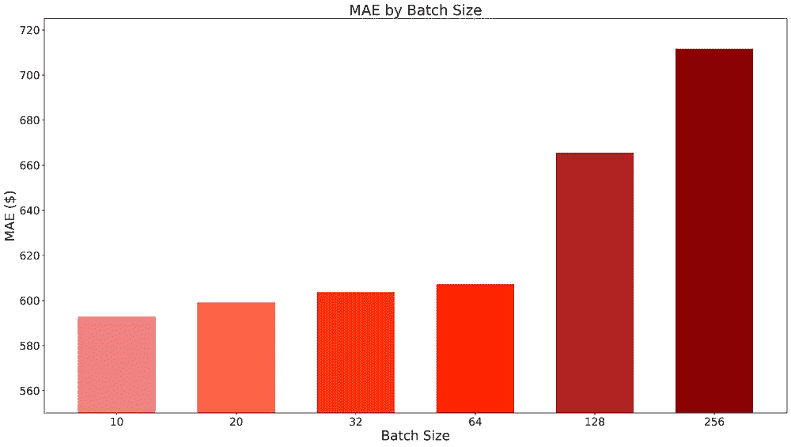
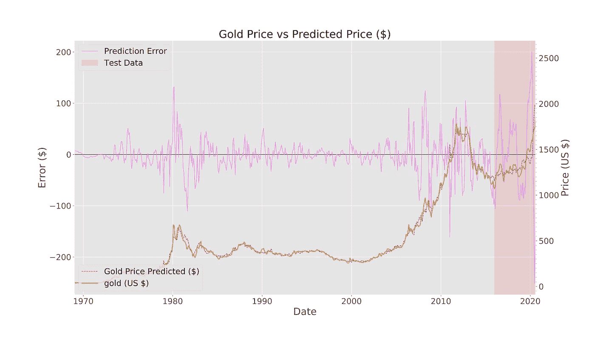
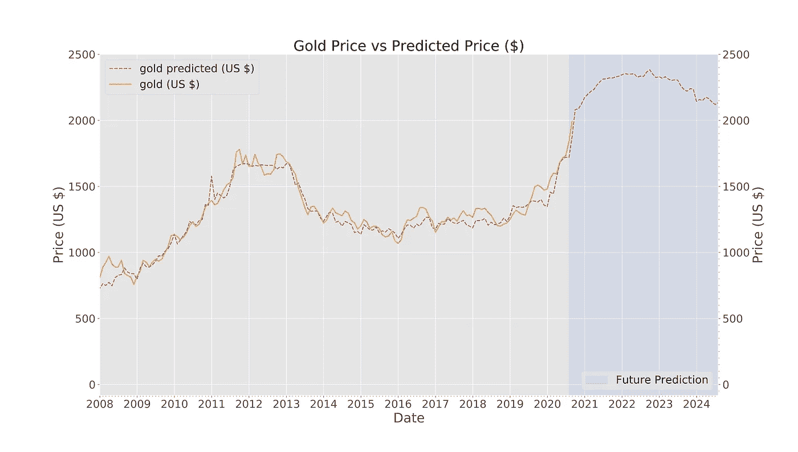

# 永远相信…金子！

> 原文：<https://medium.datadriveninvestor.com/always-believe-in-gold-a302296a1cb6?source=collection_archive---------13----------------------->

一边唱着史班杜·巴蕾，一边用 Python 和 Keras 模拟黄金价格。

Photo by [Aperture Vintage](https://unsplash.com/@aperturevintage?utm_source=medium&utm_medium=referral) on [Unsplash](https://unsplash.com?utm_source=medium&utm_medium=referral)

债务和极度通货膨胀即将到来，黄金价格即将呈抛物线状……或者他们是这么说的。你登录你的银行，决定你账户中的 3.64 美元需要防范恶性通货膨胀。现在是时候留出你净资产的 20%(0.73 美元)，投资黄金以对冲全球动荡。

使用 ML 包训练的各种模型在互联网上存在，但是作者经常忘记真实世界的含义。好极了，统计数据看起来不错，但你的实际价格预测是什么！？！

这里我们想知道我们投资黄金的 2.63 美元能赚多少钱(我买了一块巧克力，我饿了！)但是报告模型具有 0.0542 的 MAE(平均绝对误差)在没有上下文的情况下可能是没有意义的。

> "我能用多少你们最好的美元兑换 0.0542 美元的美金呢，先生？"

Photo by [Alexander Mils](https://unsplash.com/@alexandermils?utm_source=medium&utm_medium=referral) on [Unsplash](https://unsplash.com?utm_source=medium&utm_medium=referral)

本文将介绍一个在 Keras 中训练的模型，其黄金价格预测与一些大型金融机构的预测一致。

[**听一些很棒的黄金主题音乐**](https://www.youtube.com/watch?v=ntG50eXbBtc) 并继续阅读，学习如何将 2.63 美元变成 2.89 美元！

(声明:不要接受我的投资建议，我是个白痴。本人通过 iShares 实物黄金等做多黄金，所提观点为本人观点)。

**获取黄金数据**

大部分数据来自圣路易斯的美联储银行。这是一个免费的、现成的经济数据的巨大来源。来自那里的附加数据可以很容易地添加到模型中或从模型中减去(提供的代码可以很容易地用于预测其他参数)。

本文使用的数据和笔记本都是 [**都可以从这里**](https://github.com/sameckford/Always_believe_in_Gold) 下载。

我最终使用了 49 列数据进行探索性数据分析，然后决定了 11 个特征用于训练和预测(在下一节列出)。这些特征考虑了一系列经济因素。

Two of the features plotted against gold, that were then taken through to train the model with.

黄金主要以美元交易，人们认为黄金与美国经济有着内在联系。这就是为什么这篇文章以美国的数据为中心。

**功能和超参数选择**

我使用来自多次训练运行的 MAE 值来计算特征重要性。这包括在多次运行中随机采样不同数量的特征。平均 MAE 值表明“黄金产量”、“家庭资产”和“利率”的误差最大。

额外的运行侧重于 hyderparameter 优化。右下图显示“SGD”优化器在训练后具有最差的 MAE。然而，当使用测试数据时，“SGD”比具有最低 MAE 的优化器产生更好的预测，“Nadam”(在下一节中进行比较)。

 [## 用 Python |数据驱动投资者进行股票价格时间序列预测简介

### 在这个简单的教程中，我们将看看如何将时间序列模型应用于股票价格。更具体地说，一个…

www.datadriveninvestor.com](https://www.datadriveninvestor.com/2020/07/07/introduction-to-time-series-forecasting-of-stock-prices-with-python/) 

依赖培训 MAE 的风险在于，它可能会讲述一个不完整且误导性的故事。[这篇博客阐述了很多为什么](https://shaoanlu.wordpress.com/2017/05/29/sgd-all-which-one-is-the-best-optimizer-dogs-vs-cats-toy-experiment/)的原因。

简而言之，我浪费了大量时间对超参数进行不确定的分析。

这里的教训是，我们都需要不时地从统计数据中退一步，使用我们自己的解释。第二个教训是抄近路，[听从预先构建的软件包背后的专家。](https://github.com/slundberg/shap#deep-learning-example-with-deepexplainer-tensorflowkeras-models)

SHAP 认为:汽车销售、新住房、黄金产量和利率对模型的影响最小。在我自己的分析中，利率和黄金产量的 MAE 最高。也许这并不完全是浪费时间，至少我会一直这样告诉自己……
根据 SHAP 的说法，联邦债务占 GDP 的比例(%)迄今为止影响最大，这实际上符合我事先的预期。[印钞和债务](https://www.forbes.com/sites/greatspeculations/2020/05/26/you-cant-just-print-more-gold/)将使传统法定货币(如美元)贬值，并“推高”黄金的价值。

**型号**

输入到模型中的特征如下图所示。有趣的是，债务占 GDP 的百分比具有降低的平均影响，只有 7 个特征用于训练模型。

和模型结果本身。

该预测非常好地跟踪了 2016 年至 2020 年之间的长期价格趋势，同时错过了一些短期价格波动。

就这样，任务完成了。让我们把我们全部 2.64 美元的财富押在这个模型告诉我们要做的事情上。

让我们等待第二个关于 2016 年至 2020 年期间的美好预测，但我们预测价格的基础是 2016 年没有的参数，如 2020 年的零售就业人数。

Photo by [Tom Pumford](https://unsplash.com/@tompumford?utm_source=medium&utm_medium=referral) on [Unsplash](https://unsplash.com?utm_source=medium&utm_medium=referral)

是时候放弃并准备迎接天启了吗？也许还没有。我们所知道的是，当特征值已知时，模型是相当准确的。因此，考虑到这一点，我们可以做出明智的未来假设，并相信如果这些假设成真，金价将相当准确。

**Left**: 2009 to 2013 recovery data to copy. **Middle:** Real data. **Right:** 2009-2013 data bulk shifted and added to the real data.

我们可以以 2009 年衰退后的复苏为指南。在这里，我选取了 2009 年至 2013 年的一大块数据，添加了一个批量转移，并将其插入到最近的数据之后，以提供一个总体趋势。联邦债务和利率使用手动插入的值和插值进行处理。

我故意不包括通货膨胀和股票市场的数据来训练，因为它们非常不稳定，极难预测。

下图显示了所有训练特征的估计值。总的来说，这些估计看起来是合理的，形成了中央/中部的情况。例如，如果失业率下降的速度比预测的要快，这很可能是由于政府刺激力度加大，从而增加了债务，在某种程度上抵消了假设。

FEDFUNDS = Federal Reserve Interest Rates. All data is included for completeness but only the 7 listed above were used.

我对一些预测曲线看起来如此合理感到惊讶。如果有什么的话，比如零售就业和新屋建设看起来相当乐观(对黄金价格来说是悲观的)，那么这可能是对黄金的保守估计。它还假设没有进一步的瘫痪性封锁，下周人们对病毒有 100%的免疫力，经济现在处于纯粹的复苏模式。

用这些来预测未来的价格，我们得到以下结果。

使用完全相同的超参数，但将优化器改为“Nadam ”,我们得到了更差的预测，可能是由于训练期间的过拟合。

坚持使用“SGD”并重新训练模型，以包括我们获得的最新数据(2016 年至 2020 年):

在将 2016 年至 2020 年的数据纳入培训后，预计 2020 年至 2024 年期间的价格将略有下降。

**模型做得怎么样？**

Photo by [Sharon McCutcheon](https://unsplash.com/@sharonmccutcheon?utm_source=medium&utm_medium=referral) on [Unsplash](https://unsplash.com?utm_source=medium&utm_medium=referral)

这个模型做得很“好”…至少在我看来是这样。我想你需要更具体的东西来对比？

高盛(Goldman Sachs)最近上调了对黄金价格的预期，目标是 12 个月内金价达到每盎司 2300 美元。这里展示的模型预测，到 2021 年 6 月，金价将达到每盎司 2313 美元。我认为一家市值 730 亿美元的 T2 公司包含一些专业知识。至少比一个中等排名的英国大学的地质学毕业生，在他奶奶的地下室里工作要有经验。

Photo by [Andriyko Podilnyk](https://unsplash.com/@yirage?utm_source=medium&utm_medium=referral) on [Unsplash](https://unsplash.com?utm_source=medium&utm_medium=referral)

[花旗银行的预测与高盛](https://www.fxstreet.com/news/gold-set-to-test-2300-over-next-12-months-citibank-202007290237)相似，而大多数银行的 12 个月目标价格在每盎司 2000-3000 美元之间。

该模型严重依赖于美国债务占 GDP 的百分比。很难想象这个数字在未来四年内不会增加。如果这个模型可信的话，这使得金价的进一步上涨几乎是不可避免的...

**预测结果的扩散**

中间的情况似乎是一个合理的开始，让我们添加一个低和高的情况，这样我们就可以覆盖我们的背部，并尖叫'看，我一直是正确的！？!'不管结果如何。

对于大多数特征，这涉及到在中间情况下取 2 个标准偏差。它在某些地方看起来有点乱，但它捕捉到了不确定性的普遍传播，跨多个特征的预测将消除噪声，所以我们不需要太担心。
对于美联储利率/‘fed funds’等特征，这涉及输入两个最终情况值和一个线性插值。

“高”案例包括对黄金价格有利的情况，如公共债务以更快的速度增长。低价格案例涉及对黄金价格不利的情况，如经济快速反弹。

当基于高低案例进行预测时，我们得到以下结果。

根据经济的超级快速复苏，到 2023 年，高价格将短暂越过每盎司 3000 美元，到 2022 年，低价格将跌至每盎司 2000 美元以下。

这篇文章旨在长期趋势，而不是日交易活动。这是基于这样一个假设:黄金是作为对冲投资的，以保护储蓄和资产免受通货膨胀和全球风险的影响。

**结论**

不管别人告诉你什么，预测未来没有灵丹妙药。这里的模型在 7 个经济指标上训练后可以很好地预测黄金价格。在基于 2009 年经济衰退的经济复苏做出明智而保守的假设后，该模型认为金价将在未来两年上涨。

Photo b[y itay verch](https://unsplash.com/@itayverchik?utm_source=medium&utm_medium=referral)ik o[n Unspla](https://unsplash.com?utm_source=medium&utm_medium=referral)sh

**进入专家视角—** [**订阅 DDI 英特尔**](https://datadriveninvestor.com/ddi-intel)