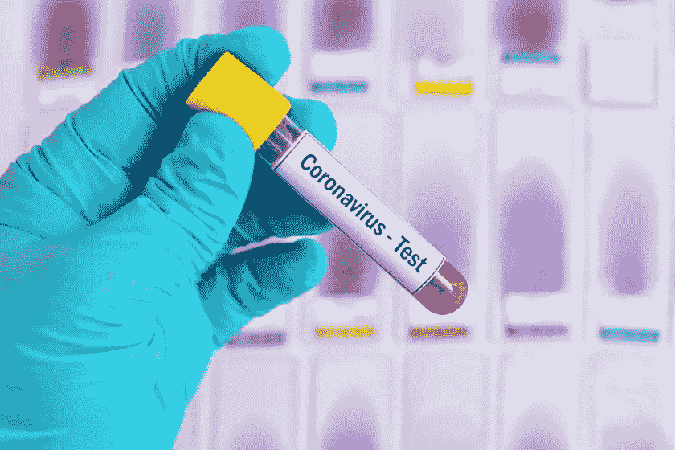
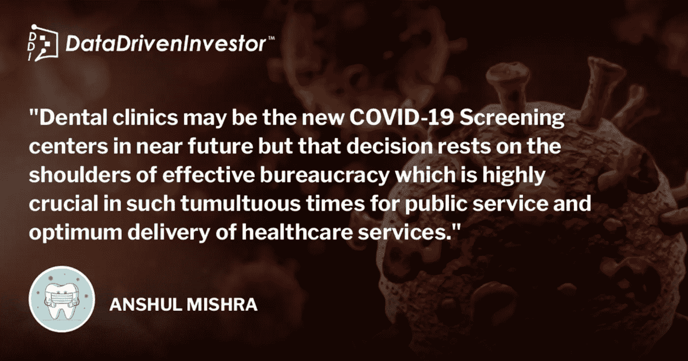

# 合并牙科诊所和新冠肺炎筛查中心

> 原文：<https://medium.datadriveninvestor.com/amalgamating-dental-clinics-covid-19-screening-centers-6070b056c164?source=collection_archive---------17----------------------->

也许是时候升级游戏了。

Getty images

牙科诊所长期以来一直被贴上高风险区的标签，但您知道吗？根据规定，几乎每个牙科诊所都使用与筛查中心筛查团队相同数量和质量的**个人防护设备(PPE)** 。那么，为什么不分配一些联邦资金，让奥运会开始呢？

关于新冠肺炎筛查中心的可用性和识别可能的热点的讨论与疫情本身一样古老，但拥有覆盖所有居民区的复杂网络的牙科诊所未能成为热点。鉴于牙科诊所是新冠肺炎的高风险地区，为什么不确保每位患者都接受强制性的新冠肺炎筛查，作为现有牙科治疗规则和指南的补充？

想象一下这种情况，你认为你有一种症状，并且不愿意去主要的新冠肺炎筛查中心，因为害怕把你最糟糕的噩梦带到生活中，并且家庭检测试剂盒的数量少且等待时间长；你直接去你的牙科医生那里做一次紧急新冠肺炎筛查，让你的恐惧得到休息。

现在你们中的一些人可能会想，嗯..受过训练的人员呢？设置它所需的时间和资源？全球的牙医都接受过口腔病理学、微生物学等方面的培训，这些都是做测试所需要的知识基础。在这一点上，所需要的只是一点点关于测试实施、处理和运送样本的培训，这可以通过与地方当局建立虚拟培训来轻松完成。

 [## 如何通过使用 SCENARIO | Data Driven Investor 实现数字化，在新冠肺炎经济衰退中茁壮成长

### 如果数字化是避免新冠肺炎破产的解药会怎样？一百万人死亡，三十八…

www.datadriveninvestor.com](https://www.datadriveninvestor.com/2020/11/13/how-to-thrive-in-the-covid-19-recession-by-going-digital-using-scenario/) 

那么为什么这个计划到现在还没有执行呢？那是一个值得深思的问题。可悲的是，官僚机构把事情搞砸了。由于众多机构在多个层面上进行干预，这不是一个人的独角戏，也就是说，简单地说，厨师太多会把汤弄糟。每个国家的每个卫生监管机构都想在这个问题上有自己的发言权，除此之外，太多的手续已经阻碍了在这些危机时刻塞翁失马焉知非福。除了 COVID 住院率飙升之外，所有医院都承受着额外的测试压力，这进一步增加了感染者和医疗保健专业人员的痛苦。

在安大略省，已经就此向省政府提出了多次请求，其中最著名的是乔治·赫里斯托多洛博士，他向加拿大广播公司建议，该省有近 5500 名牙医和大约 14000 名牙科保健员，新冠肺炎牙科筛查中心每天可以检测 100，000 名患者。这确实是一个惊人的数字，随着 IgG/IgM 快速检测试剂盒的出现，新冠肺炎筛查将是安全的，并尽可能快地进行。

作为一名医疗保健专业人员和外国培训的牙医，我认为牙科诊所很有可能在不久的将来成为新的新冠肺炎筛查中心，但这一决定取决于有效的官僚机构，在这个动荡的时代，这对于公共服务和医疗保健服务的最佳提供非常重要。

## 访问专家视图— [订阅 DDI 英特尔](https://datadriveninvestor.com/ddi-intel)