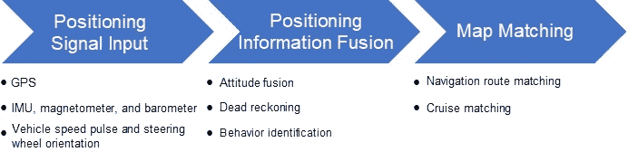
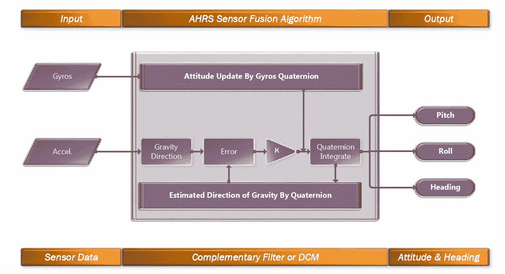
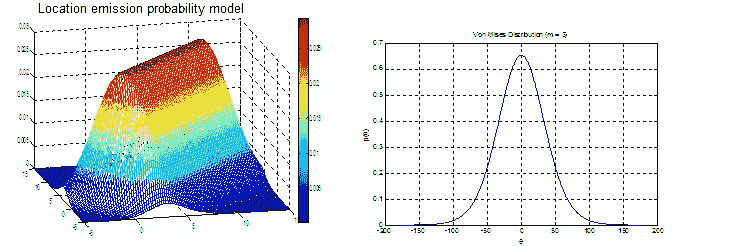
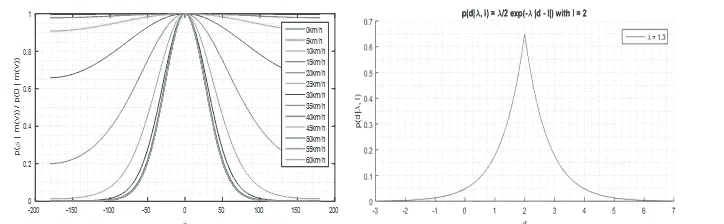
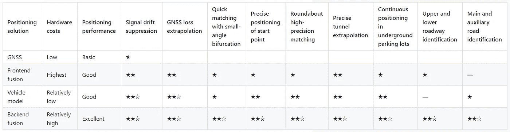
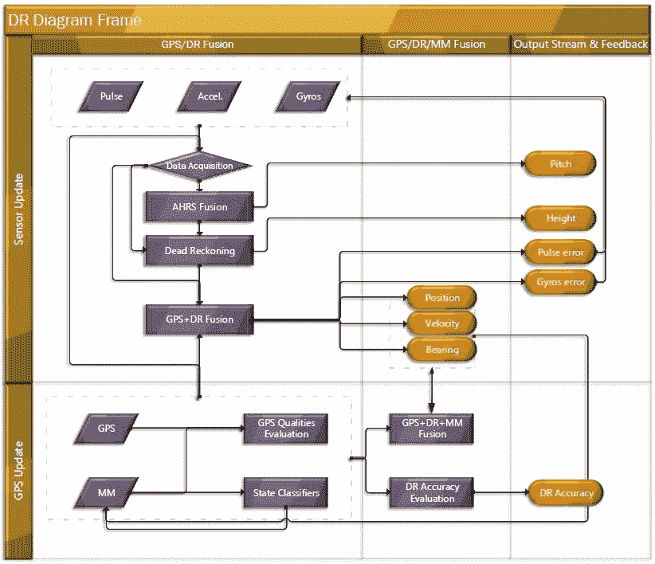
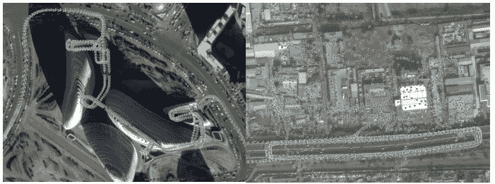
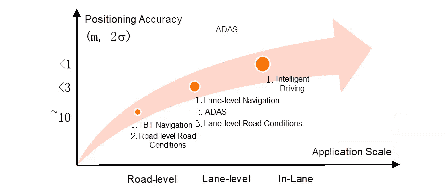
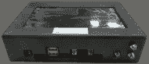

# AMAP 从导航定位到高精度定位的转变

> 原文：<https://medium.datadriveninvestor.com/amaps-transformation-from-navigation-positioning-to-high-precision-positioning-e2272c3d5842?source=collection_archive---------14----------------------->

如今，地图软件是日常出行的重要组成部分。精确导航的先决条件是精确定位驾驶员或车辆的当前位置。因此，定位技术是导航功能的基础。

本文系统介绍了安装在手机和车辆上的导航定位系统所使用的关键技术，以及 [AMAP，也就是高德](https://en.wikipedia.org/wiki/AutoNavi)在这些关键技术上的进展。此外，还探讨了定位技术从传统导航到自动驾驶的演进路径。

# 1)导航定位框架

导航定位的核心服务目标是始终如一地为导航服务提供可靠的位置信息。它试图向用户提供详细信息，例如他们在哪条路上，他们是否偏离了路线，到下一个十字路口有多远，以及各种这样的重要信息。

为了实现这一目标，首先必须接收定位信号输入。最常见的定位信号来自全球定位系统(GPS ),它为所有场景提供精确到 5 到 10 米的位置信息。此外，大多数手机都配备了惯性传感器(陀螺仪和加速度计)和磁力计，有些甚至还有气压计，可以感知海拔的变化。

车载系统具有额外的重要定位输入，例如车速脉冲、方向盘角度以及通过控制器局域网(CAN)总线获得的其他信息。基于这些定位信号，通过应用姿态融合、航位推算和其他算法来计算连续且可靠的位置和姿态。此外，地图用于基于地图数据说明道路上驾驶员或车辆的实际位置。这有助于确定车辆或驾驶员是否偏离了导航路线，并实时更新相对位置。

Figure 1\. Navigation positioning framework

在前述定位框架中，对于不同的终端类型，例如移动电话或车辆，输入定位信号的配置是不同的。因此，所使用的定位技术和定位场景也可能不同。

移动电话在走路、骑自行车或开车时使用，因此识别准确的用户行为至关重要。在行走场景下，由于速度较低，GPS 方向不准确，结合惯性导航和磁力计计算得到手机姿态。在驾驶时，车辆的位置和姿态主要由 GPS 提供。在这种情况下，关键问题是开发可靠的地图匹配算法来处理 GPS 跳跃、漂移和其他复杂情况。

如果导航终端是车辆，则只需考虑驾驶场景。同时，该系统安装在车辆的固定位置，通过 CAN 总线提供更多的定位信息。因此，航位推算和融合算法的设计考虑到了这一点，这使得系统能够解决由隧道、高架道路、平行道路和其他复杂场景引起的问题。这是车载定位系统的一个关键问题。

 [## 机器人会接管我们的餐馆吗？创业视角|数据驱动的投资者

### Tau Ventures 是硅谷的一个应用人工智能基金，食品自动化是我们的核心关注点之一，包括

www.datadriveninvestor.com](https://www.datadriveninvestor.com/2020/06/21/will-robots-take-over-our-restaurants-a-startup-view/) 

# 2)手机导航定位

## 2.1)姿态融合技术

最常见的姿态融合技术被称为姿态和航向参考系统(AHRS)。下图显示了包含陀螺仪和加速度计的六轴惯性传感器融合的 AHRS 算法。陀螺仪测量角速度，而角速度积分用于获得一定时间内的角度变化。加速度计测量物体的加速度，包括重力加速度。当物体静止时，通过获得重力加速度沿三个轴的分量来计算相对倾角。AHRS 算法使用滤波方法，例如互补滤波和卡尔曼滤波，来融合不同的传感器姿态。

Figure 2\. AHRS fusion algorithm

对于一个九轴传感器，增加了三个磁强计轴，融合使用与上一个相同的算法框架。

## 2.2)地图匹配技术

传统的地图匹配方法是根据一定的判断标准，例如接近的距离和方向，在锚点附近的道路中寻找最可能匹配的道路。这种方法实现起来很简单。然而，会出现 GPS 定位偏差，通常约为 10 米，但在信号干扰或障碍的情况下，可能会上升到几十或几百米。而且，测绘和地图简化造成的偏差可能会再增加 10 到几十米。在各种偏差条件下，很难单纯依靠距离、方向等几何特征判断进行匹配。

在开发地图匹配算法时，为了可靠、准确地确定匹配道路，需要充分利用来自定位源和地图的各种输入数据进行融合计算。此外，使用车载定位系统的功能有助于应对各种特殊情况。对于多源信息融合，隐马尔可夫模型(HMM)是一种常用而有效的方法。因此，我们使用 HMM 作为匹配算法的核心，辅以基于场景的策略算法，来执行地图匹配。

在 HMM 地图匹配算法中，匹配道路是未知的，并被用作隐藏变量“zn”。每个时刻观测到的 GPS 定位信息由“xn”观测变量表示。地图匹配的目标是根据已知的定位信息估计匹配的道路:

为了解决前面的问题，使用维特比算法进行递归计算。

在 HMM 框架下建立地图匹配模型的关键是确定发射概率模型和转移概率模型。为了确定发射概率模型，我们需要位置和方向。

1)基于定位位置，越靠近道路，概率越高。同时，我们必须考虑匹配道路的选择对水平距离误差敏感，而对垂直距离误差不太敏感。我们使用正态分布来建立模型。
2)基于，定位方向上，一条路的方向越近，概率越高。另一方面，概率与速度有关。因此，速度越高，比赛的信心就越大。我们使用冯·米塞斯分布建立一个以速度为超参数的模型。

Figure 3\. Position emission probability Figure 4\. Direction emission probability

转移概率模型的确定基于由道路距离和道路角度引起的驾驶行为的约束。

道路的角度越陡，高速行驶的概率越低。我们使用冯·米塞斯分布建立一个以速度为超参数的模型。根据车速和时间计算移动距离。这个距离越接近沿路移动的距离，这条路匹配的概率就越大。我们使用指数分布来建立模型。

Figure 5\. Speed transition probability Figure 6\. Transition probability of moving distance

前面的算法已经在 AMAP 应用程序中实现，它为驾驶导航提供精确的定位和匹配结果。它可以用于导航引导、位置广播和其他功能。与原有的基于策略的地图匹配方法相比，HMM 算法方法显著提高了匹配的准确性和可靠性。

# 3)车辆导航定位

## 3.1)车辆定位解决方案

车辆导航的核心问题是如何充分利用车辆传感器和公交车信息来优化复杂场景下的车辆导航。这些复杂的场景包括隧道和地下停车场中的定位失败，以及被高楼包围时的位置漂移。

解决这些痛点的关键在于多传感器融合技术。例如，当 GPS 位置漂移或失效时，航位推算技术与车速脉冲和惯性导航一起提供连续定位。但是，误差会累积，所以必须使用地图数据进行反馈校正。同时，地图数据和 GPS 标定惯性导航参数，提高航位推算精度。

在实际的车辆导航项目中，基于不同的传感器配置衍生出不同的定位解决方案，如下表所示。

在这些解决方案中，纯全球导航卫星系统(GNSS)解决方案不能使用任何传感器融合方法。因此，它提供了最差的定位性能。前端融合解决方案在前端实现了惯性导航和车辆速度的融合，使其能够在一些 GPS 故障情况下提供连续定位。然而，由于它会受到累积误差的影响，因此只能提供有限的改善。车辆模型和后端融合解决方案都实现了传感器、GPS 和地图数据的完全融合，从而提供了卓越的定位性能。此外，车辆模型解决方案使用车辆的 CAN 总线传感器数据，而后端融合解决方案使用安装在车辆上的惯性导航传感器。在仔细选择传感器并调整安装和使用后，该解决方案可提供最佳性能。

## 3.2)传感器融合技术

后端融合解决方案的传感器融合算法框架如下图所示。

Figure 7\. A framework of the sensor fusion algorithm

融合算法被设计用于两个目的。首先，它将不同技术的导航信息整合成独特的导航信息，使其更加可靠。第二，它估计器件误差，如陀螺仪零偏和速度计刻度误差。

融合算法是基于卡尔曼滤波实现的，并且依赖于适当的模型建立和模型参数配置。卡尔曼滤波模型由状态转移方程和观测方程组成。状态转移方程表示相邻导航状态之间的转移关系，并通过构建导航误差的微分方程来实现。模型参数是状态转换噪声和观测噪声。观测噪声的值与 GPS 质量评估模块相关。经过卡尔曼滤波后，可以获得导航误差的最优估计。

实现完全信息融合的传感器融合技术，在仅使用低成本传感器的情况下，可能会匹配甚至超过昂贵的专业惯性导航设备的定位性能。

下图显示了使用后端融合解决方案的车辆导航和定位的性能。在图中，GPS 位置以蓝色突出显示，高精度基准设备的定位轨迹以红色显示，车载导航系统的定位轨迹以绿色显示。如图所示，在 GPS 被遮挡的地下停车场或其他 GPS 信号较差的区域，车载导航定位持续可靠地提供高精度的位置信息，保证了车辆导航系统的可靠运行。

Figure 8\. Positioning performance of a parking lot Figure 9\. Positioning performance with signal interference

# 4)高精度定位的发展

传统的导航定位系统只需要解决道路级的定位问题，对定位精度的要求没有那么苛刻。但随着驾驶辅助、自动驾驶等应用场景的出现，对定位精度的要求也在不断提高，如下图所示。

Figure 10\. Evolution of high-precision positioning

对于车道级导航，定位系统必须能够区分车辆当前所处的车道，这要求位置精确到一米或更小。为了在更高级的智能驾驶应用中确保安全，位置信息必须精确到几厘米。

为了实现更高精度的定位能力，我们现有的定位方法必须升级。一种方法是直接升级现有的定位输入源，例如将普通 GPS 升级为更高精度的 RTK-GPS，将低成本的微机电系统(MEMS)惯性导航升级为高精度惯性导航。这样就实现了高精度的定位能力，而无需修改原有的算法框架。然而，缺点是这种解决方案没有解决原始算法中的缺陷，例如当 GPS 信号长时间丢失时的累积误差和高成本。解决上述问题的另一种方法是引入新的定位源，如激光雷达、毫米波雷达和摄像机。这需要为这些新传感器开发新的融合定位算法。下表比较了不同的高精度定位解决方案。

Amap 与钱逊合作开发了一种基于钱逊 RTK 服务的高精度定位解决方案，名为 Zhitu。根据道路测试，该解决方案在高速公路和普通道路条件下提供精确到小于 10 厘米的位置信息。该解决方案不依赖于任何其他传感器或地图数据，在所有场景中提供高精度，并且可以用作独立的高精度定位解决方案。

Figure 11\. “Zhitu” high-precision positioning prototype

在基于环境特征匹配的相对定位方案中，激光雷达方案是最成熟、最可靠的。激光雷达是目前自动驾驶原型车中最常用的定位解决方案。但由于激光雷达的成本和可靠性问题，启动量产仍存在风险。基于视觉的相对定位解决方案具有成本效益，并受益于近年来视觉算法和计算芯片的快速发展。这样的解决方案逐渐成为量产自动驾驶产品的主流定位方案。利用 Amap 的图像和定位能力，我们计划沿着三条业务线追求高精度定位。

**1)L3 自动驾驶的系统级定位:**该系统基于外部输入的视觉语义信息，如 Mobileye 发送的车道线形状和类型，将车辆位置与高精度地图数据(高清地图)进行匹配，并整合其他定位源，如 GPS、RTK、IMU 等。这使得它能够实时计算车道级高精度定位结果，同时高精度数据广播引擎(EHP)输出高精度数据。该系统旨在为自动驾驶提供定位和数据服务。
**2)车道级导航:**基于我们专有的视觉算法和云图定位能力，为所有场景提供车道级定位能力。这将推动传统的道路级导航升级为车道级导航。
**3)利用众包数据的软硬件一体化高精度定位:**基于我们专有的低成本视觉+ RTK + IMU 硬件，提供基于视觉同步定位与测绘(vSlam)技术的高精度绝对定位。这为高精度的数据收集、重建以及最终的快速更新和迭代提供了支持。

# 摘要

传统的导航定位都是基于 GPS 定位，只能精确到 10 米左右。这种系统是为不同的终端(例如移动电话和车辆)设计的，并且考虑到它们独特的运动特性和输入信号来配置。此外，它们需要设计传感器融合算法、行为判断算法和地图匹配算法，以便在所有场景中提供导航所需的道路级定位精度。随着我们迈向半自动和全自动驾驶，我们将需要能够提供精确到车道甚至几厘米的位置信息的系统。这就需要基于实际应用场景的考虑，对传感器和算法进行升级。随着定位技术进入下一个阶段，我们预计这将是定位技术发展的轨迹。

# 原始来源:

 [## AMAP 从导航定位到高精度定位的转变

### amap _ tech 年 8 月 27 日 79 如今，地图软件已经是日常出行的重要组成部分。准确的先决条件…

www.alibabacloud.com](https://www.alibabacloud.com/blog/amaps-transformation-from-navigation-positioning-to-high-precision-positioning_596546) 

**访问专家视图—** [**订阅 DDI 英特尔**](https://datadriveninvestor.com/ddi-intel)