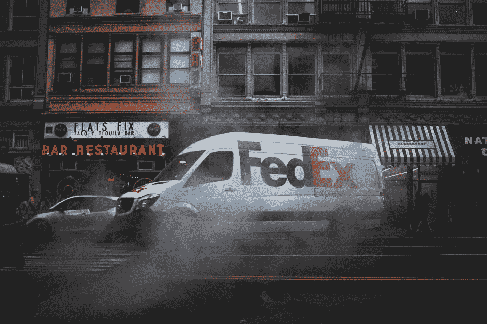

# Shopify 和联邦快递如何超越亚马逊

> 原文：<https://medium.datadriveninvestor.com/amazon-can-be-beaten-da3c77b0f6a3?source=collection_archive---------20----------------------->

**贝佐斯留下了机会吗？**

Photo by [Liam Kevan](https://unsplash.com/@shotbyliam?utm_source=medium&utm_medium=referral) on [Unsplash](https://unsplash.com?utm_source=medium&utm_medium=referral)

Shopify 和联邦快递可以联手搞垮亚马逊。

**亚马逊如何胜出**

亚马逊如此成功的原因正是他们将如何被打倒。

不，我不是在说以客户为中心。我说的是 2014 年杰夫·贝索斯的一句简单的话。

> **“你的保证金就是我的机会”**

这意味着对他所有的竞争对手来说。沃尔玛、塔吉特百货、JCPenney、西尔斯等。的世界。他知道，只要接受亚马逊基本上没有利润，他就可以夺走他们的市场份额。

亚马逊就是这样赢的。他们长期以来都在以低价竞争对手，并且多年来一直在抢占市场份额。

**亚马逊和他们现在的模式**

亚马逊仍然基本上采用这种模式进行市场销售。他们仍然接受非常低的利润，即使基本上不再是零。

但现在他们已经获得了如此多的市场份额，他们正在利用这一点来推动围绕其核心市场模式的利润更高的业务。

这些周边企业包括:

*   订阅服务(主要是主要会员资格)
*   亚马逊产品(亚马逊自己的产品，在市场上与第三方卖家竞争)，
*   广告(收入主要来自市场上的在线广告)

事实上，他们现在正在建立和鼓励这些更高利润的业务，正如贝佐斯所说，竞争对手可以将亚马逊的利润作为他们的机会。

**反垄断**

他们目前在美国没有针对亚马逊的反垄断案件，但如果有，每个人都知道它会针对什么样的商业行为。

事实上，亚马逊自己的产品在亚马逊市场上与其第三方卖家竞争，而亚马逊市场当然是由亚马逊控制的。

一个简单的类比。想象一下你当地的杂货店。他们出售各种品牌产品，如卡夫、亨氏、坎贝尔和其他一千种产品。

他们也出售自己的商店品牌产品。

现在想象一下，杂货店决定，他们的杂货店中所有的高流量和可见房地产将只提供他们商店品牌的产品。所以，你所能看到的只是在中间的货架上，在收银台等等的端盖上的商店品牌商品。而所有的名牌产品都在货架的底部和顶部(即看不见的地方)。

现在只想弄清楚。我并不是在指责亚马逊的这种做法。我从轶事经验中知道，亚马逊产品会出现在我自己在亚马逊上的产品搜索的顶部。但由于在线商店的复杂性，很难进行这种分析，我也不清楚他们在这方面做了多少。

但是外面有人指责。

> 参与该项目的人士表示，亚马逊公司(Amazon.com Inc .)已经调整了其产品搜索系统，以更突出地展示对该公司更有利可图的商品，这一举措可能有利于亚马逊自己的品牌，但内部存在争议引自 Dana Matiolli，WSJ 文章，2019 年 9 月 16 日。

**竞争会在反垄断之前解决这个问题**

我个人认为司法部不应该对亚马逊的这种做法提起诉讼。我只是认为亚马逊现在允许了一个开放。竞争对手可以利用这一点超越他们。

就像亚马逊打败了沃尔玛，沃尔玛打败了西尔斯等等。

 [## 收盘，但没有雪茄-股票市场目标在停滞的 COVID 救济中创新高|数据驱动…

### 专家聊天程序:一个协作市场，在这里人们可以和能够解决他们问题的专家聊天。是……

www.datadriveninvestor.com](https://www.datadriveninvestor.com/2020/08/18/close-but-no-cigar-stock-market-targets-record-highs-amidst-stalled-covid-relief/) 

**Shopify 和联邦快递可能联手夺走亚马逊的市场份额**

Shopify 的业务可以简单地描述为一种分解的亚马逊模式。它们允许每个个人或公司建立自己的市场(即他们自己的网站和在线商店)，而不是一个单一的和“购物化”控制的市场。

你可以在这里看到相对于亚马逊的优势。亚马逊(或在这种情况下的 Shopify)则无法控制算法。

当然，亚马逊目前相对于 Shopify 和所有 Shopify 商店的竞争优势是亚马逊庞大的履行基础设施。顾客在亚马逊上购物，因为他们知道他们可以在一两天内拿到产品。甚至是同一天。

但如果 Shopify 能通过与联邦快递合并来解决这一竞争优势。

*   那么，第一批供应商将涌向这家新公司，这是一个更加开放和自由的市场，可以像亚马逊一样提供相同的交付时间。不用担心亚马逊抢走他们的销售额。
*   其次，客户会蜂拥而至，因为最终最好的产品会以最便宜的价格出售(因为供应商不再需要支付亚马逊的提成)。

这家新的 Shopify/Fedex 公司将不得不接受较低的利润率，因为他们无法销售自己的产品来提高整体利润率。但这正是问题的关键。

这一较低的利润率再次成为贝佐斯所说的 Shopify/Fedex 的“机会”。

**交易如何发生**

这很难想象。截至目前，Shopify 的市值为 1560 亿美元，联邦快递的市值为 710 亿美元。因此，这将是 Shopify 的一次大规模收购。尽管可能可行，因为 Shopify 目前没有债务。

我也可以很容易地看到，随着亚马逊继续扩大他们的运输能力，联邦快递的市值正在下降。随着 Shopify 的成长，其市值也在持续增长。很容易看到这一收购在不久的将来变得更加可能。

老实说，我不明白这怎么会没被考虑过。老实说，这一举动对联邦快递来说是一个转机，因为它的市场份额已经被亚马逊抢走了。

对于 Shopify 来说，尽管他们近年来取得了巨大的成功，但这一举措将使他们变成 FAANG 类型的公司。

**当然，这并不意味着亚马逊会走向任何地方**

给亚马逊的粉丝们。老实说，这一预测对亚马逊不会有多大帮助。他们会步沃尔玛的后尘。即仍然是一家收入巨大的大公司。

也许只是另一家公司崛起挑战他们的第一名。这需要一段时间。

毕竟，你知道亚马逊每年带来的收入仍然比沃尔玛少，对吗？沃尔玛的销售额为 5144 亿美元，而亚马逊为 2805 亿美元。

当然，这篇文章根本没有考虑 AWS。只有亚马逊市场。所以，更有理由不去卖你的亚马逊股票。我还有我的。

## 访问专家视图— [订阅 DDI 英特尔](https://datadriveninvestor.com/ddi-intel)