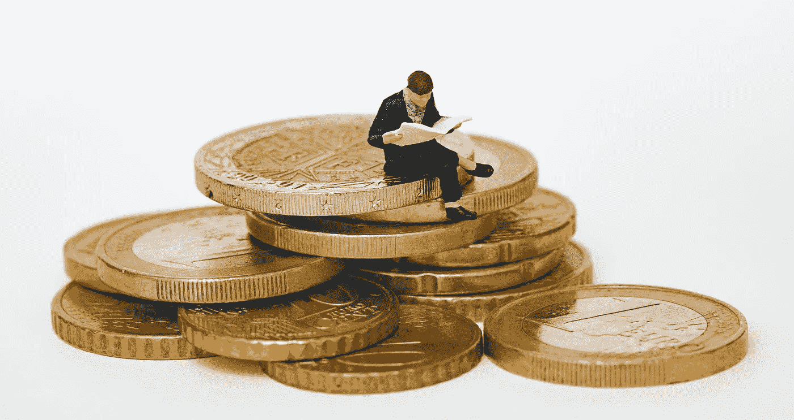

# 亚马逊、谷歌、脸书和其他与金融相关的趣闻

> 原文：<https://medium.datadriveninvestor.com/amazon-google-facebook-and-other-finance-related-anecdotes-e0de742af874?source=collection_archive---------27----------------------->

## 投资

## 傻瓜和他的钱很快就会分开。

Photo by [Mathieu Stern](https://unsplash.com/@mathieustern?utm_source=unsplash&utm_medium=referral&utm_content=creditCopyText) on [Unsplash](https://unsplash.com/s/photos/investing?utm_source=unsplash&utm_medium=referral&utm_content=creditCopyText)

1999 年，mazon 售出了 2000 万件商品，年收入超过 16 亿美元。20 年后的 2019 年，亚马逊在一天内(亚马逊 Prime Day)销售了超过 1.75 亿件产品，全年收入高达 2805 亿美元。换句话说，2019 年亚马逊每两天产生的收入比 1999 年全年产生的收入还要多。

当亚马逊在 1997 年 5 月成为上市公司时，你可以用 1.5 美元购买股票。花 150 美元，你可以拥有 100 股亚马逊股票。目前，亚马逊股票的价格为每股 3292 美元，但这并不意味着你最初的 100 股(150 美元)将价值 329200 美元。该公司在早期增长模式下进行了几次股票分割，现在你实际上拥有 12 倍于此的金额，即近 400 万美元。

你没有 150 美元投资下一个亚马逊？你可能在几年内花了更多的钱在 Amazon Prime 上，或者几个月后的有线电视账单上，或者在外面吃饭(在 Covid 之前)。

其实真的没有那么多亚马逊人吧？嗯……可能比你想象的要多。

当亚马逊起步时，我正在为丝网印刷行业的一份出版物撰写一篇关于互联网的专栏文章。数字世界是一个全新的世界，我的目标是教人们如何工作，同时向他们介绍网络的新词汇。有一个月我写了关于搜索引擎的文章。我对 25 个搜索引擎进行了利弊分析，当时谷歌甚至还不存在。

你可能会认为搜索引擎领域已经很拥挤了。这个暴发户是如何进来并完全压倒竞争对手的？如果你在意识到这家公司的主导地位后，本能地投资这家公司…在短短 20 多年的时间里，该公司今天的市值为 1.3 万亿美元。

然后是脸书，一个更新的孩子。他们坐拥如此多的现金，甚至不知道该如何处置。

苹果是这些数码新贵中最老的一个。目前市值超过两万亿美元。我在 1987 年买了第一台 Mac 电脑。它仍然有效。一个 512Ke。知道它值多少钱吗？不到 100 股苹果股票

如果市值等同于 GDP，苹果将是世界第八大国家，在法国(第七)和巴西(第八)之间。

难的是确定下一个亚马逊、谷歌或苹果。当他们还穿着尿布的时候，你真的不知道哪个会成为世界著名的物理学家，哪个会沦落到贫民区。(那是比喻。我说的是生意。)尽管如此，还是有很多线索。苹果从一开始就有“酷元素”，尽管它需要比谷歌或脸书长得多的跑道才能起步。

在淘金热或 1849 年，许多人迁移到加州寻找暴富。那个发了大财的家伙就是那个把镐和锅卖给这些人的家伙。当我们一年前去戴德伍德的时候，我们学到了一些当地人用来从也来到那里的淘金者那里学到的技巧。

沃伦·巴菲特(每个人都喜欢引用他的话)曾经说过，“你在市场上和很多愚蠢的人打交道；这就像一个巨大的赌场，其他人都在狂饮。如果你能坚持喝百事可乐，你应该没问题

然而现在，在十年的牛市之后，许多人开始注意到市场是如何不断创造新高的。越往山上爬，空气越稀薄，会让人头晕。

我最近在 Reddit 上看到一个讨论，热情的年轻投资者正在借钱和赊购股票。这正是科技股泡沫即将破裂时出现的繁荣景象。

留出一部分收入用于退休投资，这就是智慧。随着我们投资的公司的成长，财富会随着时间的推移而产生。华尔街不是一个把所有筹码都押在 36 红上的赌场。几乎在所有的生活决定中，都包含着风险。要明智，不要贪婪。