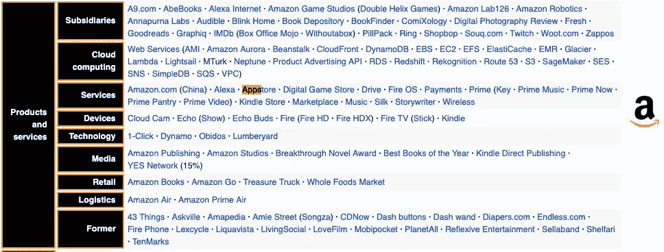
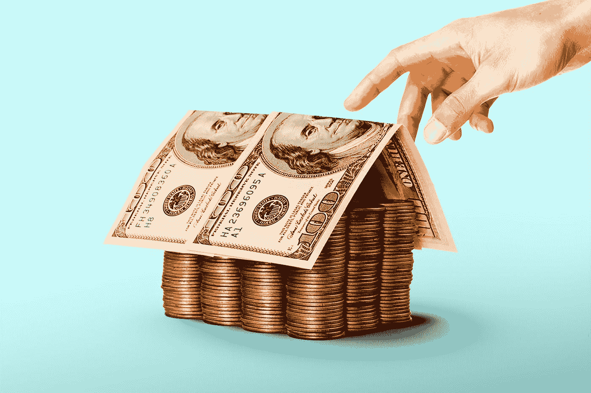
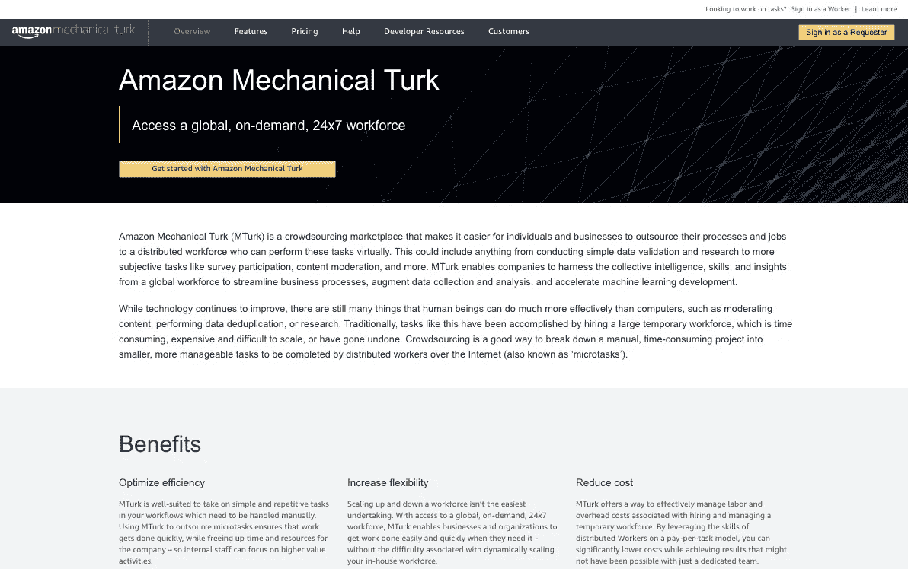
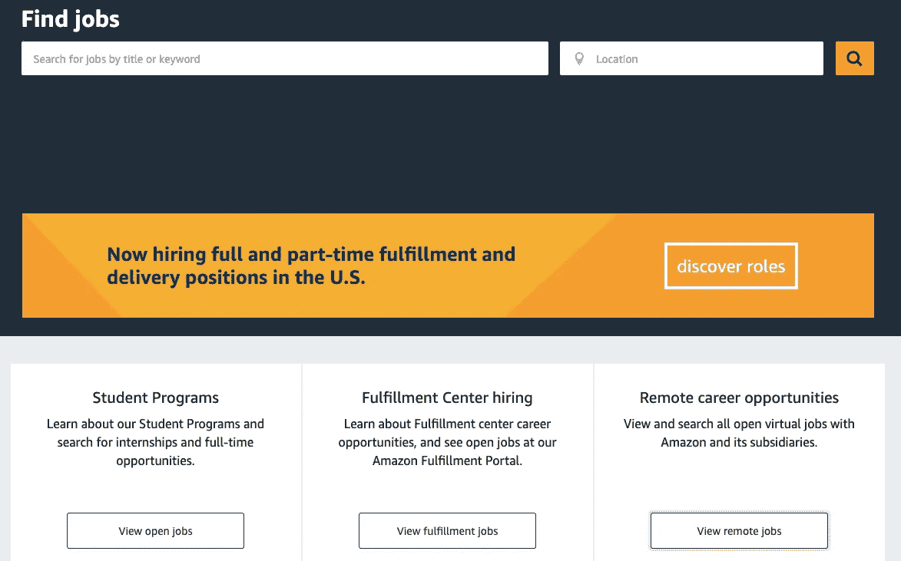
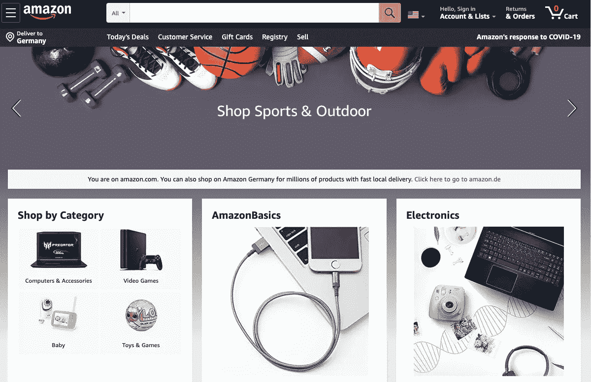
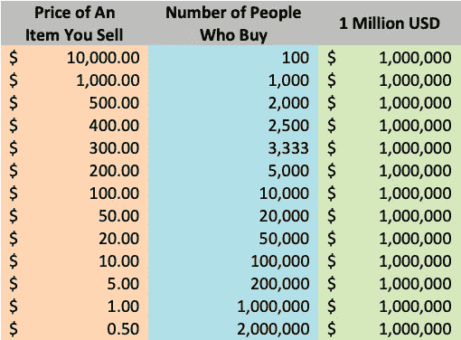
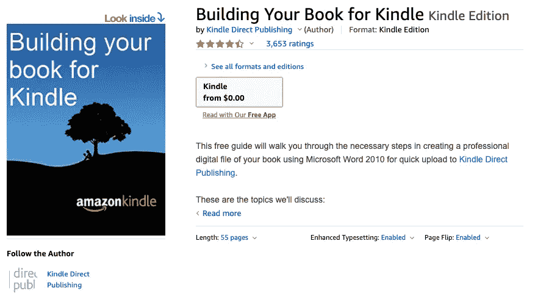

# 亚马逊与所有人都处于‘战争’状态:如何在这场战争中赚钱？

> 原文：<https://medium.datadriveninvestor.com/amazon-is-at-war-with-everyone-how-to-make-money-in-this-war-ac08ff01b1a3?source=collection_archive---------3----------------------->

## 为亚马逊工作、与亚马逊合作以及通过亚马逊工作的 19 种方式

Photo by [Hello I'm Nik 🎞](https://unsplash.com/@helloimnik?utm_source=medium&utm_medium=referral) on [Unsplash](https://unsplash.com?utm_source=medium&utm_medium=referral)

成立于 1994 年的亚马逊现在被 T2 视为与苹果、脸书和谷歌并列的四大科技公司之一。*杰夫·贝索斯*，这个比英国君主制[更富有](https://www.forbes.com/sites/ceciliarodriguez/2017/11/23/the-british-royal-family-is-worth-88-billion/)的人[在 2019 年每秒赚了](https://www.businessinsider.de/international/how-rich-is-jeff-bezos-mind-blowing-facts-net-worth-2019-4/?r=US&IR=T#:~:text=Though%20Jeff%20Bezos'%20annual%20salary,according%20to%20Business%20Insider's%20calculations.)2489 美元——当时他的身家超过 1000 亿美元。他现在身价超过 2000 亿美元，到目前为止仅在 2020 年就赚了 870 亿美元。

尽管一些亿万富翁在疫情失去了他们的钱，但许多美国亿万富翁变得更富了——主要是科技公司的老板。

> 作为微软的比尔·盖茨、脸书的马克·扎克伯格、Space X 的埃隆·马斯克和 LMVH 的伯纳德·阿诺特五位成员组成的实体亿万富翁俱乐部的第一位亿万富翁，杰夫·贝索斯的财富一直在翻倍。

他变得更富有可能有很多原因，但我在这篇文章中要讨论的一个原因是: ***因为他的公司正在与所有人和所有事物进行战争和竞争。*** 我假设他是总司令。你想在这场战争中充当步兵吗？

# “从 A 到 Z”的总指挥官

eff Bezos 是首席执行官，不仅因为他是顶级的亿万富翁，还因为另外两个原因:首先，人们通过亚马逊购买数百家其他公司的产品——甚至是微软和 LMVH 的产品。其次，亚马逊不仅是一个销售产品的电子商务平台，还提供数十种服务，如数字流媒体、出版、云计算、物流服务、人工智能等。它最近也推出了自己的产品。

亚马逊[拥有](https://web.archive.org/web/20140801055637/http://www.amazon.jobs/team-category/subsidiaries)40 多家子公司，并与其他提供相同服务或生产类似产品的公司持续竞争:

Products and Services of Amazon via [https://en.wikipedia.org/wiki/Amazon_(company)](https://en.wikipedia.org/wiki/Amazon_(company)#cite_ref-10)

***这里是一张*** [***商品清单***](https://en.wikipedia.org/wiki/List_of_Amazon_products_and_services) ***以及亚马逊的子公司:***

> *Kindle:* 电子阅读器 *AWS:* 云计算
> *IMDb:* 影评平台
> *Fire TV:* 数字媒体播放器 *亚马逊 App Store:*App Store
> *Fire 平板电脑:*平板电脑 *亚马逊 Echo:* 智能音箱
> *Kindle Store:* 线上 E 社交编目网站
> *A9.com:* 搜索广告技术
> *亚马逊音乐:*音乐流媒体服务 *亚马逊生鲜:*杂货配送服务
> *亚马逊驱动:*云存储应用 *亚马逊物流服务:*物流支持
> *有声:*在线有声书和播客平台
> 【T77

亚马逊正通过这些产品、服务和子公司与其他公司展开“战争”。例如，在视频和电影流媒体服务方面，**不仅与*网飞、*** *展开“战争”，还与* *Hulu、HBO、YouTube、华纳媒体*以及其他许多公司以各种方式展开“战争”。你在亚马逊音乐、苹果音乐和 Spotify 之间切换过多少次？即使你没有，你也可能很快会做。

> 既然你已经了解了更多关于亚马逊战争的事情，我不想再关注“战争”了。**我写这篇文章是为了帮助你在这场打赢的战争中取得胜利。**

这可能是唯一一场没有任何伤亡的正义战争。唯一的损失可能是:你，在读完这篇文章一个月后，没有赚到几美元。这就像在路边看到几块钱，却因为觉得走着走着从路上抢单是一件繁琐的事情而忽略了它。

在我们继续之前，让我告诉你一个关于亚马逊标志的有趣事实。有一个黄色箭头，从“a”开始，以“z”结束。这有一个隐藏的含义，即提供从 A 到 z 的服务。正如其标志所描绘的那样，亚马逊不仅提供横切服务，而且正在以前所未有的速度扩张。如果你是这种扩张的一部分，你可能会相应地受益。

# 通过亚马逊赚钱:为亚马逊工作，与亚马逊合作，通过亚马逊工作

Photo by [Morning Brew](https://unsplash.com/@morningbrew?utm_source=medium&utm_medium=referral) on [Unsplash](https://unsplash.com?utm_source=medium&utm_medium=referral)

从杰夫·贝索斯高达 2000 亿美元的财富中分得一杯羹，并为你的财富增加做出贡献(适当地增加他的财富)可以有几种方式。尽管如此，我还是把它分为三个不同的类别:为亚马逊工作、与亚马逊一起工作和通过亚马逊工作。我对写文章不感兴趣。尽管如此，我还是想讨论一下通过亚马逊赚钱的各种方式。

*在接下来的段落中，我将概述为亚马逊工作、与亚马逊一起工作、通过亚马逊工作、甚至没有亚马逊的情况。可能需要以电子书或书籍的形式进行彻底的讨论。尽管如此，这篇文章可能会向你介绍一个新的世界。*

# 一.为亚马逊工作

在给你任何信息之前，请你打开[(https://www.mturk.com)](https://www.mturk.com)，点击右上角的“作为工人登录”链接。如果你有亚马逊的账户，那太好了。如果没有，点击“创建一个亚马逊账户”按钮，注册 MTurk。

创建帐户，等待 24-48 小时，一旦他们在 MTurk 中批准您的帐户，您就可以作为工作人员登录。(如果你被拒绝了，请确保使用不同的电子邮件地址重新申请。)

现在，让我们记下一些关于 MTurk 的信息。

MTurk 或 Amazon Mechanical Turk [是](https://www.mturk.com/)“一个众包市场，让个人和企业更容易将他们的流程和工作外包给分布式劳动力，他们可以虚拟地执行这些任务。”这是一个[平台](https://www.mturk.com/worker)，在这里你可以“将你的技能应用到成千上万的可用任务中”，并立即赚钱。

例如，汤姆在尼日利亚有一家公司。他在网上卖了 5 万件艺术品。他完成了对每件艺术品的具体产品描述。他将所有这些工作放在 MTurk 中进行审查和准确性检查。对于每个产品描述在拼写和语法上的一致性的审查，他给 0.05 美分。假设你对 8000 项任务进行了评估，完成评估后，你将得到(8000 * 0.05)= 400 美元。每个评论可能需要几秒钟。

另一个例子:其他人在五分钟内完成一份调查就要支付 5 美元。另一个人有 200，000 张收据，并希望 MTurk 工人键入他们在收据中看到的产品的名称和价格。每天都有数以千计的微任务加载到数百个区域。有些任务需要复杂的资格，而对其他人来说，必须达到一定的配额才能给你。例如，只有当你以超过 80%的准确率完成了至少 4000 项任务时，客户才会允许你做这些任务。

> 你会通过亚马逊礼品卡或你的银行账户收到钱。

你有点像数据输入员，按点击量收费，或者更具体地说，根据你提交的数量收费。

我不想给出更多的信息，因为这是一篇文章，不是一本书。浏览谷歌、YouTube、亚马逊和其他平台，搜索更多这方面的技巧。写这个:“如何通过 MTurk 赚钱。”

您也可以使用该服务注册成为请求者。如果你想通过 MTurk 完成某件事，你必须注册成为一个请求者，而不是一个工作者，并确定支付率。在你设定的最后期限之前，作为工人签到的人群工人将为你做那份工作。

[https://www.mturk.com/](https://www.mturk.com/)

*亚马逊藤蔓是什么？* [亚马逊藤蔓](https://www.amazon.com/gp/vine/help)“邀请亚马逊上最受信任的评论者发布关于新品和预发布产品的意见，以帮助他们的客户做出明智的购买决定。”不需要付费，但是评审者[会收到](https://www.amazon.com/gp/vine/help)“参与供应商提交给项目的免费产品。”这是一个基于邀请的程序。请务必通过以上链接阅读更多关于此计划资格的信息。

# 二。与亚马逊合作

亚马逊[拥有](https://blog.aboutamazon.com/company-news/amazons-actions-to-help-employees-communities-and-customers-affected-by-covid-19)超过 65 万名员工，比这个欧洲国家*卢森堡*的人口还多[。他们要么是全职的，要么是兼职的。](https://www.worldometers.info/world-population/luxembourg-population/)

如果你在亚马逊寻找全职或兼职工作，请访问他们的工作门户网站:[亚马逊工作门户网站。](https://www.amazon.jobs/en/)

如果你想在履行/配送领域按小时工作，请访问[亚马逊履行工作](https://www.amazon.jobs/en/business_categories/fulfillment-operations)。

最近，他们开发了亚马逊的 Flex 程序。它的目标是雇佣**司机来运送**货物。如果你有一些优步和 Lyft 的经验，或者你过去是一名送货司机，一定要报名参加这个项目。

除此之外，还有远程职业机会。如果你对在家工作和远程工作感兴趣并有资格，请访问[亚马逊远程](https://www.amazon.jobs/en/locations/virtual-locations)工作。

如果你是学生，有几个实习机会，甚至全职机会:访问[学生工作](https://www.amazon.jobs/en/business_categories/student-programs)。

你也可以通过亚马逊网上销售你的专业服务。访问[亚马逊服务](https://services.amazon.com/selling-services/home.htm)了解更多信息。这些服务主要是针对“在亚马逊商店购买的产品”。例如组装服务、家庭影院服务和设备安装服务。”

如果你有良好的沟通和人际交往能力，并希望成为亚马逊的客户代表，请使用亚马逊工作门户、谷歌和其他工作门户搜索这些工作。

你也可以通过浏览网页找到与亚马逊合作的其他方式。我们不知道自己不知道什么——简单的谷歌搜索可能会发现新的机会。

[https://www.amazon.jobs/en/](https://www.amazon.jobs/en/)

# 三。通过亚马逊工作

虽然第一类和第二类能让你赚钱，但这部分是唯一能让钱倍增的部分。这是我想更加关注的部分，因为可能会有很多机会让你成长和赚钱。

因为题目很多，所以我把它们分成*小节*。每一个小节都可能给你带来额外的收入。

Screenshot of [https://www.amazon.com](https://www.amazon.com) by the Author

## 1.通过亚马逊(FBA)销售你的产品

你家里有 250 台数码相机。你如何通过亚马逊销售它们？你建立一个 FBA 账户，创建产品列表，将你的产品运送到亚马逊，然后产品就在那里供顾客购买——就这么简单。其他一切都由亚马逊负责。

如果你有销售产品的业务，通过 FBA 销售你的产品是一个很好的方式。如果你想知道如何通过 FBA 销售，点击这里:[成为亚马逊卖家](https://sell.amazon.com/sell.html?ref_=sdus_soa_sellov_n)。

This is how a $1 million business looks like (Calculated via Microsoft Excel by the Author)

在上表中，假设你买了 50 美元一台的相机。如果你想赚 100 万美元，你必须以 100 美元的价格卖给 2 万人，这将是 200 万美元减去 100 万美元(初始成本)= 100 万美元(利润)。这是一个针对傻瓜的计算。我只想说，看看这张桌子，站起来，通过亚马逊 FBA 做点什么。

你甚至不用创业就可以通过亚马逊销售。假设你有一家企业，想通过亚马逊销售。在这种情况下，这是一个加分点，因为你甚至可以交易需要政府批准的联邦监管商品——特别是在美国。在美国建立一个有限责任公司，在英国或印度建立一个私人有限责任公司，在德国建立一个通用电气公司，或者在世界任何地方建立一个小企业，都完全取决于你。你也可以建立最简单的商业形式:独资，这不是一个法律实体，可以在你的名下完成——但要确保亚马逊在你的国家有服务。

Photo by [chuttersnap](https://unsplash.com/@chuttersnap?utm_source=medium&utm_medium=referral) on [Unsplash](https://unsplash.com?utm_source=medium&utm_medium=referral)

## **2。通过商家履行销售您的产品(FBM)**

与亚马逊发货的 FBA 不同，通过 FBM 的卖家自行负责将产品运送给他们的客户。另外，如果你的物品又大又重，最好选择加入这个选项。接下来是劳动力和存储空间。在 FBA 中，亚马逊将你的商品存放在自己的仓库中，直到卖给顾客。在 FBM，你必须有足够的人力和仓储空间来存放你想在亚马逊上销售的商品。

你可以从 Brian Gibbs 的博客上了解更多关于这两者的区别。他对比较的[总结是:](https://www.refundretriever.com/blog/amazon-fba-vs-fbm-what-works-better-for-your-company#:~:text=FBA%20means%20Fulfilled%20by%20Amazon,all%20aspects%20of%20order%20fulfillment.)

> **“FBA**的意思是由亚马逊履行，你卖了它，亚马逊发货。卖家在亚马逊的履行中心发送大宗产品，以便亚马逊在产品售出后进行挑选、包装和运输。 **FBM** 意味着由商家[，]履行，卖家在亚马逊上列出产品，同时处理存储和订单履行的所有方面。”

Photo by [Henry & Co.](https://unsplash.com/@hngstrm?utm_source=medium&utm_medium=referral) on [Unsplash](https://unsplash.com?utm_source=medium&utm_medium=referral)

## 3.通过 Kindle Direct Publishing 销售您的电子书和平装书(KDP)

不到五分钟就可以自助出版电子书和平装书。它将在 24-48 小时后出现在全球 Kindle 商店。根据亚马逊提供的[信息，如果你的客户位于“美国、加拿大、英国、德国、印度、法国、意大利、西班牙、日本、巴西、墨西哥、澳大利亚等地”，你将从你的图书销售中获得高达 70%的版税。](https://kdp.amazon.com/en_US/)

好消息是，你可以在 KDP 上免费出版电子书和平装书。如果是平装书，所有的印刷、装订和发行费用都由亚马逊支付。你的工作是写作和出版。

如果你是一个新手，一个好的甚至是知名的作者，你不想找出版商，而是自己出版你的作品，欢迎来到 KDP。如果你打算通过亚马逊出版一本电子书并卖给世界各地的人们，点击这个链接:[亚马逊 KDP。](https://kdp.amazon.com/)

> 假设你以 11 美元或 12 美元的价格出售你的电子书；每本书你大概能得到 7.99 美元(扣除亚马逊的费用)。如果卖给 13 万人，你就是百万富翁了。

我正在写一些我感兴趣的话题和主题的书和电子书——因为我讨论的概念和想法是我所知道的，而且到目前为止还没有人讨论过。然而，我的目标不是赚钱。亨利·福特曾经说过:“只赚钱的企业是糟糕的企业。”如果只是为了钱而写电子书或者书，请不要做。只有当它能产生影响时，才这样做。金钱因素总是存在的，但你不必把它放在首位。

如果你认识其他写书的人，也有一些好消息。举个例子吧。你认识一位用你的母语大量写作的诗人。去见见他或她。告诉他们，你想让世界听到他们的声音，也想给他们带来一些钱。怎么会？你必须把他们的诗翻译成英语或任何你想出版的语言——通过亚马逊 KDP 以书或电子书的形式。这就是鲁米在美国成为畅销书诗人的原因，当时一些作家和翻译家开始在亚马逊和其他电子商务平台上出售他的书，让世界各地的人都能接触到。

还有 [KDP 精选](https://kdp.amazon.com/en_US/help/topic/G200798990)，它“是一个免费的 Kindle 图书计划，让你有机会接触到更多的读者，在不增加成本的情况下赚更多的钱。所有作者和出版商，无论他们住在哪里，都有资格在 KDP 精选中注册他们的 Kindle 图书。”

如果能自己写，那是加分项。当然，你可能需要雇佣一名编辑，因为即使是小说之王斯蒂芬·金也强调了编辑的重要性。要了解更多关于这个和其他写作技巧，你可以阅读我的另一篇文章，题为“T4”，来自斯蒂芬·金的百万本畅销书的 7 个重要写作课程。

写完书后，请务必阅读亚马逊上的这本免费电子书,它为你提供了为 Kindle 编写和出版图书的蓝图。

Free Kindle edition of [“Building Your Book for Kindle”](https://www.amazon.com/Building-Your-Kindle-Direct-Publishing-ebook/dp/B007URVZJ6/ref=sr_1_2?dchild=1&keywords=KDP&qid=1600682162&s=books&sr=1-2) (Screenshot by the Author)

## 4.亚马逊联盟计划——联盟营销和影响者计划

如果你是内容创作者、博客作者或出版商，你可以通过亚马逊联盟计划将你的流量货币化。通过亚马逊上数以百万计的产品，“员工使用简单的链接构建工具将他们的观众引向他们的推荐，并通过[这个项目](https://affiliate-program.amazon.com/)从合格的购买和项目中获利”。

如果你是内容创作者或博客作者，注册这个项目，与你的观众分享亚马逊产品，并通过亚马逊确定的关联佣金赚钱。

你为什么等着？[在这里注册](https://affiliate-program.amazon.com/signup)，从现在开始通过亚马逊的联盟营销计划赚钱。

Photo by [Connor Coyne](https://unsplash.com/@concoyne?utm_source=medium&utm_medium=referral) on [Unsplash](https://unsplash.com?utm_source=medium&utm_medium=referral)

> 作为一个有影响力的人，克里斯蒂亚诺罗纳尔多[赚的钱比他在足球俱乐部赚的还多:€4700 万对€3000 万。](https://www.businessinsider.de/international/cristiano-ronaldo-makes-more-money-from-instagram-than-juventus-2019-10/?r=US&IR=T)

如果你是影响者，亚马逊影响者计划:

> ”是针对社交媒体影响者的现有在线合作伙伴计划的扩展。有了影响者计划，你就可以在亚马逊上拥有自己的网页，上面有一个展示你推荐给追随者的产品的网址。这给了你一个额外的方法将流量导向亚马逊，这在超链接不可能的地方特别有用(例如，Instagram 标题或视频内容。)"

如果你有“一个合格的 **YouTube、Instagram、Twitter 或脸书**账户”，加入[影响者计划。](https://affiliate-program.amazon.com/influencers)

## 5.亚马逊手工制作

如果你制作手工工艺品，并想通过亚马逊销售你的产品，这是适合你的计划。在这种情况下，你是一个工匠。亚马逊[手工项目/商店](https://sell.amazon.com/programs/handmade.html?ref_=asus_soa_rd&)“工匠们可以向全世界数百万亚马逊顾客出售他们的手工产品。”

你只需要 a)注册，b)创建一个卖家中心账户，c)列出你的产品，d)发展你的业务并赚钱。

如果你制作手工工艺品并想在亚马逊上出售，现在就申请吧！

Photo by [Karly Santiago](https://unsplash.com/@clothandtwig?utm_source=medium&utm_medium=referral) on [Unsplash](https://unsplash.com?utm_source=medium&utm_medium=referral)

## 6.亚马逊购物中心

虽然最近改为只有受邀才能参加的项目，但亚马逊购物中心为你提供了一个向数百万顾客出售你设计的 t 恤的机会。这个程序[使](https://merch.amazon.com/landing)你能够“上传你的作品，选择产品类型和颜色，并添加产品描述。”亚马逊将创建一个产品页面，还将处理生产和运输。他们还将处理客户服务和其他相关服务，“*所有这些都没有前期成本。*

基于[程序描述](https://merch.amazon.com/landing):

> “要被考虑，你需要填写一份申请，向(亚马逊)介绍更多你的背景和经历。”

如果你是一名设计师，想要请求邀请，请点击这里:[请求邀请](https://merch.amazon.com/dashboard)。

你也可以通过 [Fiverr](http://www.fiverr.com/) 、 [Upwork](https://www.upwork.com/) 和其他自由职业者市场雇佣自由职业者为你工作。

Photo by [Tiago Felipe Ferreira](https://unsplash.com/@felippetiago?utm_source=medium&utm_medium=referral) on [Unsplash](https://unsplash.com?utm_source=medium&utm_medium=referral)

## 7.自有品牌与批发贸易

它被称为[自有品牌](https://www.thebalancesmb.com/private-label-2890207)，因为产品“通常由一家公司制造或提供，然后贴上另一家公司的品牌标签。”可以通过 FBA 程序完成。

让我们举一个例子:假设一个制造商从拉丁美洲进口大量蜂蜜。许多零售商与这个制造商谈生产加工瓶装蜂蜜，把他们的标签放在上面。零售商可能会在店内销售，通过他们的网上商店，或通过亚马逊的私人标签。给瓶装蜂蜜贴标签的行为是私人标签品牌化。

格雷格·默瑟为自有品牌卖家提供了一些很好的建议。

**批发贸易:**

在这种形式下，你需要找到批发商。然后，你可以代表他们销售。例如，孟加拉国有一家生产防护口罩的批发商。你在意大利工作。你与他们交谈，同意以批发形式购买他们的产品，并通过 FBA 卖给意大利的各种卖家。

你也可以[从亚马逊的可信商家中找到](https://business.amazon.com/en/find-solutions/simplify-buying/selection/wholesale)最畅销的产品并开始交易。

[如果你有兴趣通过亚马逊创建一个批发交易账户，请在此注册](https://www.amazon.com/business/register/org/landing?ref_=b2b_mcs_L1_regnav&ecid=73632690630506393411806960372946154235&abreg_ecid=73632690630506393411806960372946154235)。

Photo by [Austin Distel](https://unsplash.com/@austindistel?utm_source=medium&utm_medium=referral) on [Unsplash](https://unsplash.com?utm_source=medium&utm_medium=referral)

## 8.亚马逊折价物

亚马逊以旧换新计划[提供](https://www.amazon.com/Amazon-Trade-In/b?ie=UTF8&node=9187220011)亚马逊礼品卡，“以换取数千种符合条件的商品，包括亚马逊设备、视频游戏等。”

还可以以旧换新 [***升级***](https://www.amazon.com/l/9187220011) Kindle 电子阅读器、平板电脑、流媒体播放器、echo、蓝牙音箱、耳机、家庭安全设备、无线路由器、手机、游戏设备。

即使你的设备不符合以旧换新要求，亚马逊也可以免费为你回收。[如果您有需要回收的大件物品，请点击此处](https://amazonrecycling-us.re-teck.com/)。基于这一计划:“亚马逊支付与运输和回收您的亚马逊设备和配件相关的所有费用。”

Photo by [Cytonn Photography](https://unsplash.com/@cytonn_photography?utm_source=medium&utm_medium=referral) on [Unsplash](https://unsplash.com?utm_source=medium&utm_medium=referral)

## 超越亚马逊:

如今，通过 Wix、Shopify 和其他一些平台，现成的网站使你有可能建立在线业务，并向全球数百万人销售你的产品。

你也可以通过易贝、中国的阿里巴巴或速卖通、印度的 Flipkart、日本的乐天以及全球其他一些新兴的电子商务平台开展业务或销售产品。

如果你是一个商人，一个卖家，或者一个实体商店的老板，互联网是一个有效的工具来使用你的产品，并使你的产品在你的地区和世界各地的成千上万的人。现在你可以线下买线下卖，为什么不线下买线下卖——或者甚至在线上买线下卖？

除了电子商务，还有很多公司在各个领域提供在家工作的机会。首先，用合适的工具装备自己，也就是说，掌握数字知识，其次，浏览网络，寻找在家工作的机会。如果你没有多种收入来源，或者至少没有一份副业收入，你就无法拥有一份朝八晚五的工作。

> 如果你跟不上技术的发展，你可能会输掉这场你无论如何都要参加的“战争”——否则你就活不到这个世纪。在当今世界，没有人问你是否识字，但如果你是数字素养。

一位亿万富翁首席执行官为成千上万的人提供了数百万个工作机会，使其成为一家价值万亿美元的公司。他把它建成了一个在线图书市场，但现在它提供了数百种服务。大约 25 年前，世界首富可能是最穷的。

你想在 5 年、10 年、15 年、20 年和 25 年后成为什么样的人？*游戏玩家还是游戏改变者？你决定！*

Photo by [Adeolu Eletu](https://unsplash.com/@adeolueletu?utm_source=medium&utm_medium=referral) on [Unsplash](https://unsplash.com?utm_source=medium&utm_medium=referral)