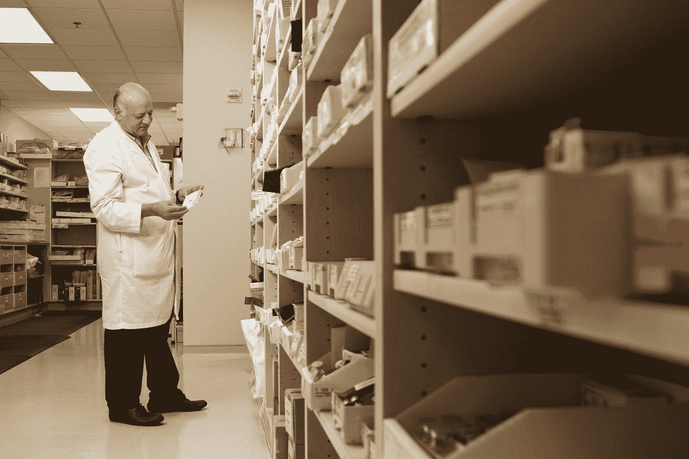

# 亚马逊:21 世纪的科技集团

> 原文：<https://medium.datadriveninvestor.com/amazon-the-21st-century-tech-conglomerate-708e6c74618c?source=collection_archive---------12----------------------->

Photo by [Wicked Monday](https://unsplash.com/@wickedmonday?utm_source=medium&utm_medium=referral) on [Unsplash](https://unsplash.com?utm_source=medium&utm_medium=referral)

# **:359.7 万美元**

这是当你阅读这篇文章时，亚马逊在接下来的 **6 分钟**内将产生的收入。

通常，人们听到亚马逊就会想到在线市场。然而，随着亚马逊变得广泛多元化，这仅仅是冰山一角。截至今天，亚马逊的 AWS 是**全球最大的云服务提供商**，占亚马逊运营收入的大约 70%——暂时如此。在过去的 10 年里，亚马逊的员工从 2010 年的 34，000 人增长到今天的 100 万人。与此同时，收入从 270 亿美元飙升至 3470 亿美元。这种增长已经转化为亚马逊的股价在过去 10 年里增长了 25 倍。

然而，这仅仅是开始:正如我们所知，亚马逊将继续改变社会。

# 亚马逊“基础”

让我们从基础开始。亚马逊出售…嗯，所有东西，甚至创造了成功的品牌“基础”虽然亚马逊占据了美国电子商务零售市场的 49%,但这仅占美国零售支出的 5%。虽然购物者将越来越倾向于网上购物，但实体店永远不会完全消失。亚马逊的定位是通过全渠道战略主导这两个市场。亚马逊收购全食超市及其高科技亚马逊 Go 商店创造了无与伦比的客户体验:**不再排队，不再等待，只需拿起就走**。亚马逊正在重新定义面对面购物体验，并准备在沃尔玛/塔吉特(Walmart/Target)等零售巨头的地盘上与其较量。

很大程度上，亚马逊在在线领域取得了成功，这是因为它拥有世界级的履行网络。亚马逊令人上瘾的 **2 日送达**已经变成了次日送达，并且正在慢慢变成 **1 小时送达**！亚马逊已经对其物流网络进行了巨额投资，每年高达数十亿美元。亚马逊的无人机送货服务 Prime Air 在 8 月份获得了 FAA 的批准，它将把运输时间减少到 30 分钟。亚马逊每年运送大约 40 亿个包裹，仅次于领先的快递公司联邦快递的 20 亿个。此外，亚马逊在其仓库中引入机器人自动化使其运送包裹的速度比竞争对手快 4 倍。亚马逊对物流的掌握将在未来十年大放异彩，因为它们将成为领先的最后一英里送货服务，通过 FBA 与 Shopify 竞争，并直接与 UPS/Fedex 竞争。

# **亚马逊进军制药**

Photo by [National Cancer Institute](https://unsplash.com/@nci?utm_source=medium&utm_medium=referral) on [Unsplash](https://unsplash.com?utm_source=medium&utm_medium=referral)

在以 7.53 亿美元收购 PillPack 一年后，亚马逊药房上个月推出，导致**药房股票仅在新闻中暴跌 10%** 。亚马逊的 1.5 亿 Prime 用户现在可以享受处方药 2 天免费送货以及大幅折扣。这一举措非常有趣，因为**普通 PillPack 客户在 2018 年创造了 5000 美元的收入，而普通 Prime 用户创造了 1400 美元的收入**；这些服务之间的协同作用可能非常有利可图。虽然这一举措还处于起步阶段，但亚马逊很可能会像在零售业那样，在制药行业占据主导地位。看看亚马逊是否试图**垂直整合药品生产流程，或者或许砍掉 PNB 的**，以增加利润并为顾客提供更好的折扣，这将是一件有趣的事情。无论如何，我们都应该期待亚马逊在处方药领域开拓出巨大的市场份额，有可能成为进入保险业的第一步。

# 杰夫=埃隆

Photo by [Bill Jelen](https://unsplash.com/@billjelen?utm_source=medium&utm_medium=referral) on [Unsplash](https://unsplash.com?utm_source=medium&utm_medium=referral)

通过贝佐斯的项目 Kuiper，亚马逊正在进入无线宽带市场，在全球范围内与 ISP 和电信公司竞争。柯伊伯将在低轨道部署一个由 3236 颗卫星组成的星座，为美国乃至全球的消费者提供无线、低延迟的互联网连接。今年 7 月，柯伊伯获得了 FCC 的批准，并有义务在 2026 年前发射至少一半的卫星。亚马逊很可能在此之前发射卫星，并在 2020 年末拥有一个正常运行的网络。凭借这一点，亚马逊将进入 1000 亿美元的巨大 ISP 行业，并可以提供与 AWS 配对的网络资源。

或许亚马逊将颠覆的最令人兴奋(也是我个人最喜欢)的行业是汽车行业。亚马逊今年以 12 亿美元收购 Zoox 的交易非常成功。本月， **Zoox 展示了其全自动双向电动 robotaxi，驾驶时间可达 16 小时**。虽然 Zoox 不太可能在 2022 年之前推出，但我相信亚马逊将成为拼车和送餐市场的主要股东，与优步、DoorDash 和 Lyft 直接竞争。同样值得注意的是，亚马逊对竞争对手电动汽车和自动驾驶汽车公司进行了大量投资，如 **Aurora 和 Rivian** 。

# 还有更多

Photo by [Kelvin Ang](https://unsplash.com/@kelvin1987?utm_source=medium&utm_medium=referral) on [Unsplash](https://unsplash.com?utm_source=medium&utm_medium=referral)

在接下来的十年里，随着几乎所有公司，无论大小，都以云为先，AWS 将进入高速增长期。事实上，仅今年第三季度，AWS 的收入就增长了 29%。尽管 AWS 以其在 IT 基础设施领域的主导地位而闻名，但亚马逊仍在不断发布更多用于云安全和开发的工具。例如，就在今年，亚马逊发布了其 **Honeycode 无代码工具**的测试版，该工具允许团队快速开发应用。亚马逊还发布了更多用于云优化的 AWS 工具，这已经成为一个价值数十亿美元的行业，将 DataDog 和 Nutanix 等公司提升到公众视野中。随着亚马逊发布更多的开发工具、低代码解决方案、网络安全软件，并垂直整合 AWS 基础设施，它将看到**前所未有的收入增长，并为 it 创造一站式解决方案**。

我把重点放在了我认为亚马逊将在 2020 年持续爆发式增长的先驱上。令人惊讶的是(没有双关语)，还有更多。亚马逊正在不断改进其 Echo 智能扬声器、亚马逊 Fire 设备和订阅服务。最近，亚马逊还推出了云游戏服务 **Luna** (游戏现在是一个 1200 亿美元的市场，CAGR 占 12)。亚马逊正在慢慢成为游戏行业的庞然大物，从 **Twitch** 到 **Luna** 再到收购 **Bebo** 。此外，亚马逊正在通过**环**积极为其家庭安全产品系列开发新产品。亚马逊可能很快就会创建基于人工智能的企业安全解决方案，与 Verkada 和 ADT 等传统安全公司竞争。

# **亚马逊成功的原因**

Photo by [Christian Wiediger](https://unsplash.com/@christianw?utm_source=medium&utm_medium=referral) on [Unsplash](https://unsplash.com?utm_source=medium&utm_medium=referral)

亚马逊的增长为其提供了两个独特的竞争优势:**网络效应和规模经济**。例如，随着 AWS 的发展，它在一个地区建立了更多的数据中心，这反过来**减少了网络延迟** y，而**增加了可扩展性**，并为客户提供了**更快的计算能力**，这是它将用来**与 Azure** 竞争的竞争优势。另一个这样的例子是亚马逊物流网络。随着亚马逊零售市场份额的增加，它建立了更多的仓库，改善了运输基础设施，从而缩短了送货时间。亚马逊的规模扩张能力使其能够保持持续增长的周期。亚马逊拥有 1.5 亿用户的 Prime 用户网络，这也是其初露头角的机会。如果亚马逊能够围绕这个基础建立一个社交网络，那么它就可以让 Prime 订阅更具粘性，同时获得额外的网络效应。这也可能成为亚马逊新兴广告业务的主要增长途径。

亚马逊有望成为全球领先的科技企业集团，这与人类历史上的任何企业都不同，因为创新是其文化的核心。我想“足够好”这句话在亚马逊总部几乎是闻所未闻的。我已经概述了亚马逊肯定会扰乱的领域，尽管几乎可以肯定亚马逊会进入两倍的领域。

随着亚马逊继续扩张，其对垂直整合、客户满意度和智能投资的承诺将为**技术奇点**铺平道路。