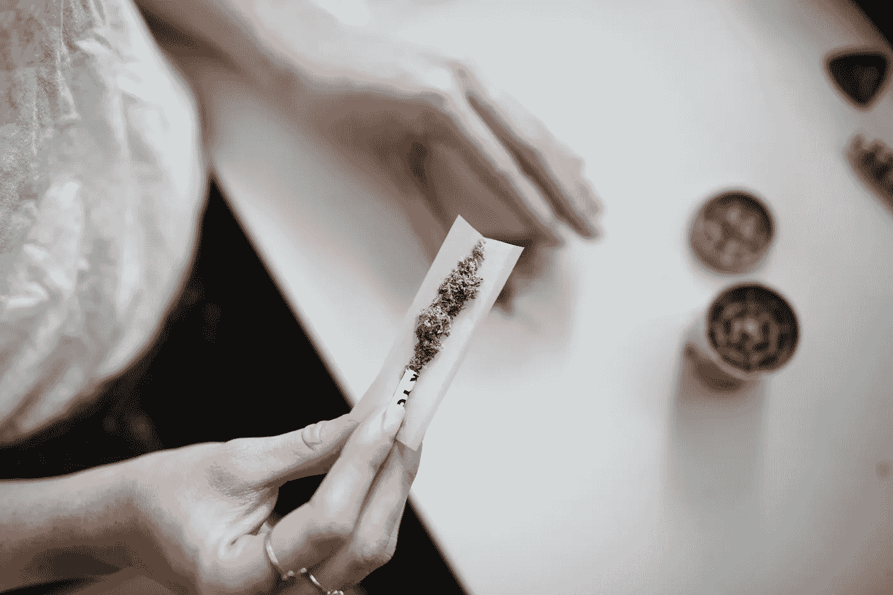

# 美国被烤:你永远猜不到最大的瘾君子

> 原文：<https://medium.datadriveninvestor.com/america-gets-baked-youll-never-guess-the-biggest-stoners-dd46d054a547?source=collection_archive---------15----------------------->

Photo by [Thought Catalog](https://unsplash.com/@thoughtcatalog?utm_source=unsplash&utm_medium=referral&utm_content=creditCopyText) on [Unsplash](https://unsplash.com/s/photos/cannabis-cigarette?utm_source=unsplash&utm_medium=referral&utm_content=creditCopyText)
Investors in pot stocks take note: New research should make you beam.

大麻股票的投资者注意了:新的研究应该让你喜笑颜开。

根据测试公司 Quest Diagnostics 最近的一份报告，美国的毒品使用量正在上升，大麻仍然是大范围的放纵选择。大麻也被称为杂草、大麻、大麻和大麻。

> 研究论文引用 Quest Diagnostics 雇主解决方案科学与技术高级总监 Barry Sample 博士的话说:“[……]在所分析的大多数行业中，药检阳性率正在上升。”。

# 大麻之王

换句话说，美国越来越 high 了。虽然 Quest 的数据涵盖了非法和半合法药物，但这些结果对蓬勃发展的大麻行业的公司来说都是好兆头，比如 ETFMG 另类收获交易所交易基金(股票代码:MJ)持有的股票，该基金跟踪一篮子大麻股票。这是因为数据显示，总体而言，毒品使用量有所增加，而杂草仍然是最主要的。反过来，这意味着更多的大麻消费者。

娱乐性使用大麻在一些州是合法的，但在另一些州则不是。根据美国联邦法律，使用仍然是非法的。

 [## 算法交易的机器学习|数据驱动的投资者

### 当你的一个朋友在脸书上传你的新海滩照，平台建议给你的脸加上标签，这是…

www.datadriveninvestor.com](https://www.datadriveninvestor.com/2019/01/30/machine-learning-for-stock-market-investing/) 

Quest 从其广泛的测试设施中获得了有关药物使用的详细数据，并对这些测试的结果进行了年度分析。最近的报告涵盖了 2015 年至 2017 年期间，并基于 1000 万次药物测试结果。

报告发现，大麻仍然是王道。“[……]大麻是最常被检测到的物质，在大多数工业部门的所有毒品类别中，毒品阳性率最高，”该报告指出

# 教师的最高分

值得注意的是，毒品测试的结果显示，总的来说，老师们并没有因吸食大麻而飘飘欲仙。与其他行业相比，教育行业在考试前不久使用大麻的比例最小，为 0.8%。换句话说，根据 2017 年 Quest Diagnostics 的分析，在 1000 名教育工作者中，只有 8 名在尿液中检测出该药物呈阳性。这些数字显示，与 2015 年相比略有下降，当时 0.9%的教育工作者 pot 测试呈阳性。

他们在做什么呢？一些人在服用兴奋剂，也就是安非他命。数据显示，教育工作者使用这种物质的比例高于其他任何行业:1.66%的人在尿液中发现了苯丙胺的痕迹。根据 Quest 的数据，这一比例是酒店和餐馆员工(0.75%)的两倍多，而酒店和餐馆是苯丙胺使用量最低的行业。

# 厨师被烤了？

大麻的最大使用者是餐饮/住宿行业的人，2017 年，该行业有 3.5%的工人大麻使用测试呈阳性。或者换句话说，在进行药物分析前不久，接受测试的酒店和餐馆员工中有超过 1/30 的人服用过这种药物。这一数字高于 2015 年的 2.9%。

紧随酒店和餐馆工作人员之后的是零售雇员，其中 3.2%接受尿检的人在测试前不久有吸食大麻的证据。这一数字高于 2015 年的 2.7%。

那又怎样？那些在旅游目的地(度假胜地或零售中心)有零售业务的大麻股票可能比其他股票表现更好。

从另一个角度来看，在发电厂附近设立大麻药房可能没有太大意义，因为公用事业行业使用这种药物的发生率相对较低(1%)。

该报告不仅关注大麻的使用，还包括主要行业滥用其他药物的数据。除了大麻，Quest 还提供了可卡因、甲基苯丙胺、阿片类药物和苯丙胺的数据。

该公司发现，超过 1/20 的零售工人最近对提及的药物之一的某种形式的药物使用测试呈阳性。

在这篇报道首次发表后，最近发布的一份报告[显示，美国的总体毒品使用量仍在上升，并且仍以大麻为主](https://www.questdiagnostics.com/home/physicians/health-trends/drug-testing/)。这项后来的研究是基于 2018 年的数据。

*这是一个故事的编辑版本，于 2018 年 12 月 28 日首次出现在 Forbes.com 上。*