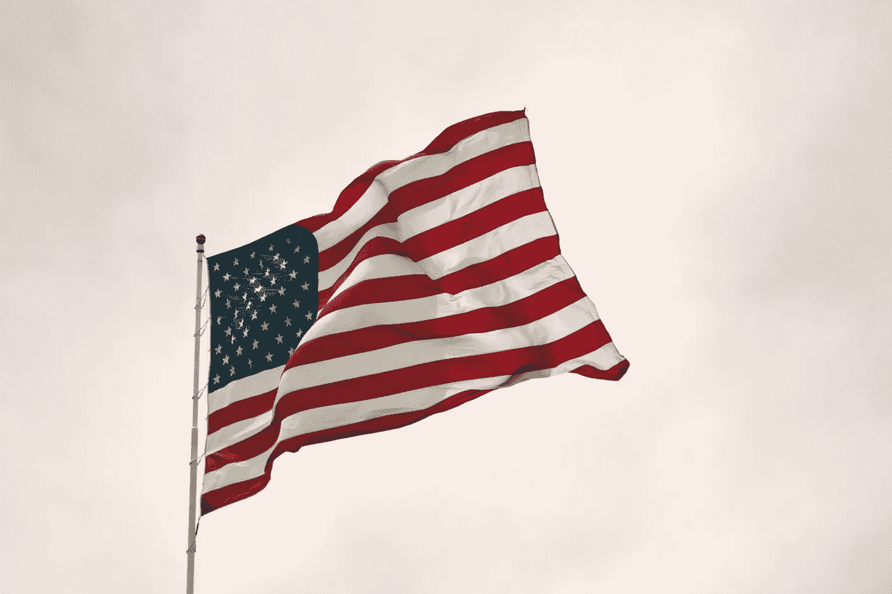

# 道德滑坡中的美国

> 原文：<https://medium.datadriveninvestor.com/america-in-moral-decline-9a80a83b101e?source=collection_archive---------7----------------------->

我们是一个有身份危机的国家。

Photo by [Joshua Hoehne](https://unsplash.com/@mrthetrain?utm_source=unsplash&utm_medium=referral&utm_content=creditCopyText) on [Unsplash](https://unsplash.com/s/photos/united-states?utm_source=unsplash&utm_medium=referral&utm_content=creditCopyText)

美国在历史上肯定经历过道德不公正的时期。作为一个历史问题，这些时期通常每 60 年左右出现一次。在过去十年左右的时间里，我们开始看到另一个转变，社会不信任，以及我们在 50 年代和 60 年代经历的传统价值观的衰退——家庭、宗教、理智主义和自由。这些价值观已经被连根拔起，现在我们正在经历的是一个身份危机的国家，一个正在走向衰落的美国道德价值体系。

大多数人将这种衰退与数字时代的兴起联系在一起。然而，我认为没有灾难性的时刻，而是一系列的灾难让地狱蔓延到我们的土地上。让我给你举几个例子。乔治·弗洛伊德之死以及随之而来的混乱、抗议和暴力，国内恐怖主义的增加，以及大规模枪击事件的急剧上升。我们的人民生活在恐惧中。这只是生活在恐惧和幻灭中的人民所造成的暴力的一个例子。

# 消费主义

渴望快乐。消费主义现在也已经影响到社会秩序，模糊了决策过程，给消费者洗脑，让他们认为他们需要物质产品、服务和财富来获得幸福和健康。结果，我们有一群饱受精神健康问题困扰的人，比如抑郁症。

我们现在有一个重视物质项目超过满足本身的人口——刺激不健康的竞争、不诚实和嫉妒。

# 反智主义

我们还看到了一个令人惊讶的类别的兴起——反智主义。完全无视专家的分析令人震惊，同样令人不安。过去十年见证了“地球扁平论者”的崛起，气候变化的反对者，教育和科学素养的急剧下降，以及原教旨主义与批判性思维的增长。

我们的人口被分散了，这不是偶然的。这不是我们有意识的选择——这是有条件的。公司经营组织、媒体和政府想要一群消息不灵通和无知的人。他们想要一个由消费文化推动的人口，这样企业就可以影响政府政策，并保证他们的经济利益得到照顾——而普通大众正在努力成为 Instagram 的影响者，努力实现收支平衡，对政策一无所知，看着娱乐媒体通过宣传引发民间动乱。恐惧取代了批判性思维。

 [## 全民或跨州的国营保险私人医疗保险:经济学…

### 我们目前生活在一个所有非医疗行业都痴迷于…

www.datadriveninvestor.com](https://www.datadriveninvestor.com/2020/05/21/state-run-insurance-for-all-or-across-the-state-lines-private-healthcare-coverage-economics-politics-social-mix-up/) 

# 宗教的衰落

皮尤研究中心在 2019 年写的一篇[文章](https://www.pewforum.org/2019/10/17/in-u-s-decline-of-christianity-continues-at-rapid-pace/)中写道，

> “与此同时，人口中无宗教信仰的比例，包括将自己的宗教身份描述为无神论者、不可知论者或“没什么特别的”的人，现在占 26%，高于 2009 年的 17%。”

这是一个惊人的数字。腐烂的原因是什么？另一项研究发现，随着个人主义的增加，宗教信仰下降。个人主义是一种更关注自我而不是社会规则的文化体系。这可以归因于许多事情，如对平等的更多容忍，自我关注(福祉文化，自助书籍和自我护理)，以及由于社会支持较少而导致的较低的同理心。关键词——自我。我们变得自私，忘记了服务和支持他人是我们的宗旨。我们必须致力于提高我们的技能，发现我们的激情，这样我们才能释放它们。宗教将我们与更高的存在联系在一起，提醒我们要为更高的目标服务。没有它，我们就迷失了。

# 家庭破裂

众所周知，不稳定的家庭生活对孩子不利。我们的孩子越来越多地在破碎的家庭中成长。这并不是说所有来自破碎家庭的孩子都会成为罪犯。事实当然不是这样。然而，他们中的许多人确实遭受贫困、毒瘾或无家可归之苦，比来自已婚父母的孩子更甚。强大的家庭影响有助于建立强大的传统道德价值观，如同情、信任、诚实和尊重。没有这些价值观，你的道德指南针就会崩溃。

Covid 通过给已经恐惧的人群注入更多的恐惧，放大了这个问题。它让人们对政府限制他们的权利和夺走他们的工作感到绝望和愤怒。他们认为政府不愿提供帮助，这进一步削弱了信任。美国人不再以身为美国人而自豪。

这不是我习惯的美国。这不是我引以为豪的美国。不幸的是，我没有简单的方法来修复它。变革需要在许多层面上发生。政府政策需要改变，教育和家庭需要站在最前沿，美国人需要从分心中清醒过来，更多地(安全地)参与这些问题，我们需要作为一个国家团结起来，重新获得将人类团结在一起的价值观——善良、同情、家庭、宗教、理智和自由。

## 获得专家观点— [订阅 DDI 英特尔](https://datadriveninvestor.com/ddi-intel)