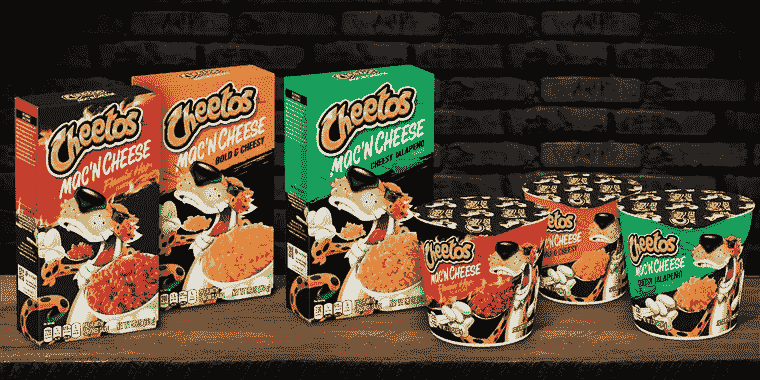
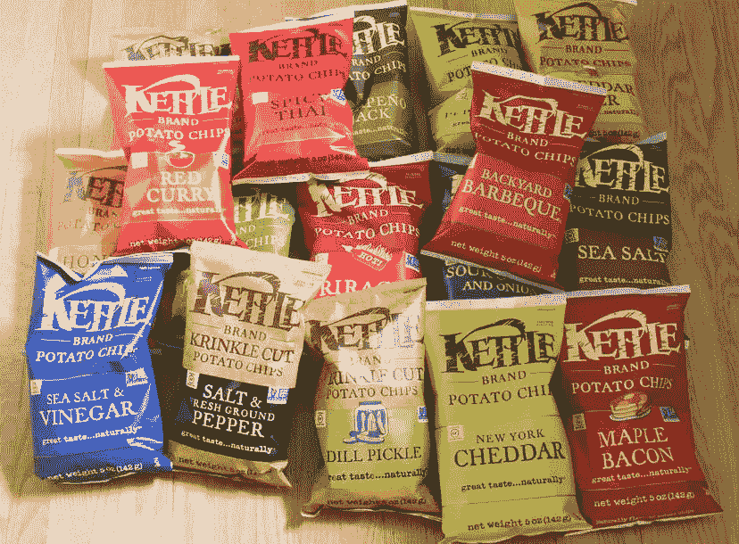
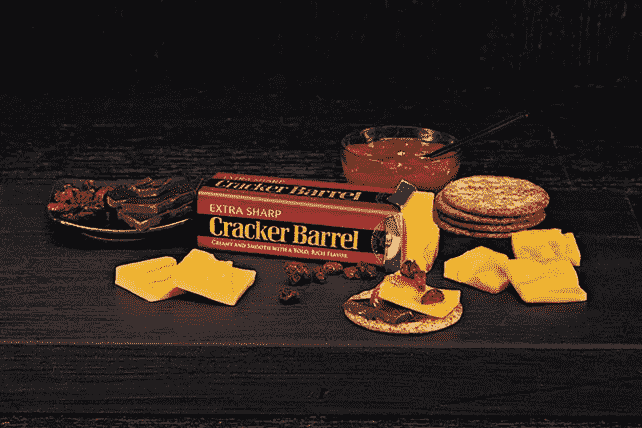

# 美国仍然喜欢垃圾食品

> 原文：<https://medium.datadriveninvestor.com/america-still-loves-junk-food-294e6853e53a?source=collection_archive---------16----------------------->

Photo: Cheetos

## 百事可乐和其他零食制造商今年生意兴隆

不管是热瑜伽、冥想还是康普茶，美国比以往任何时候都健康。(虽然根据 [CDC](https://www.cdc.gov/obesity/data/adult.html) 的数据，2017~2018 年成人肥胖率为 42.4%。随着吃得更好的更便宜选择的增加，食品制造商推出了整个创新系列的薯片、饮料、能量棒以及介于两者之间的所有产品，以迎合新的顾客口味和趋势。但是，经典商品正在支撑持续增长——尤其是今年。

# 菲多利力挽狂澜

百事公司( [PEP](https://finance.yahoo.com/quote/PEP?p=PEP&.tsrc=fin-srch) )在 10 月初报告了一个强劲的季度，消费者仍然对在家制作食物的产品表现出强烈的需求。总体而言，季度销售额增长了 5.3%，菲多利和桂格食品公司的有机收入增长了 6%。

菲多利在 8 月份宣布了一种来自奇多的新的奶酪通心粉，百事公司的首席执行官说它们正在货架上快速销售。他告诉*美国消费者新闻与商业频道*“我们正试图尽可能快地获得容量——这是多么受欢迎。”

国内消费支撑着百事公司，该公司也有一个庞大的餐饮服务业务，由于大多数体育场、餐厅和食堂都在低容量或无容量运行，该业务已经受损。本季度的另一个亮点是直接面向消费者的网站 Snacks.com 和 PantryShop.com。数字频道于 5 月份推出，第三季度销售额几乎翻了一番。

Photo: Thrillist

金宝汤公司——生产金鱼、鳕鱼角薯片和 Kettle 牌薯片等零食——也表现不错。在截至 7 月份的最近一个季度，受餐饮和小吃部门的推动，收入增长了 18%。该公司还能够在本季度将其家庭普及率提高 4%。

# 当一切结束的时候

一旦全国乃至全球的餐馆和休闲活动恢复，食品制造商正准备应对销售下滑。通用磨坊报告了季度业绩，并在 9 月下旬放缓了销售增长，投资者对公司在高需求下增加营销支出持怀疑态度。

随着失业率上升和工资下降，许多人猜测消费者已经选择了普通品牌的主食，如奶酪和肉类。2008 年，自有品牌制造商协会(Private Label Manufacturers Association)已故主席布莱恩·沙罗夫(Brian Sharoff)表示，“当大量美国人开始感到自己的工作面临风险或收入将会下降时，他们不得不寻找更便宜的方式来购买家用产品。”9 月初，卡夫亨氏宣布将以 32 亿美元的价格将部分乳制品业务出售给法国公司 Lactalis。这笔交易包括它的饼干桶奶酪品牌，Breakstone 农舍奶酪和其他品牌，但不包括像 Velveeta 或 Kraft Singles 这样的家喻户晓的品牌。

Photo: Cracker Barrel

虽然 CPG 制造商度过了繁荣的一年，但即将到来的挑战很可能来自供应链和替代分销渠道。我们可能会开始看到更多的电子商务网站和送货选择来满足我们深夜的渴望，特别是如果人们厌倦了亲自去拥挤的商店购物。