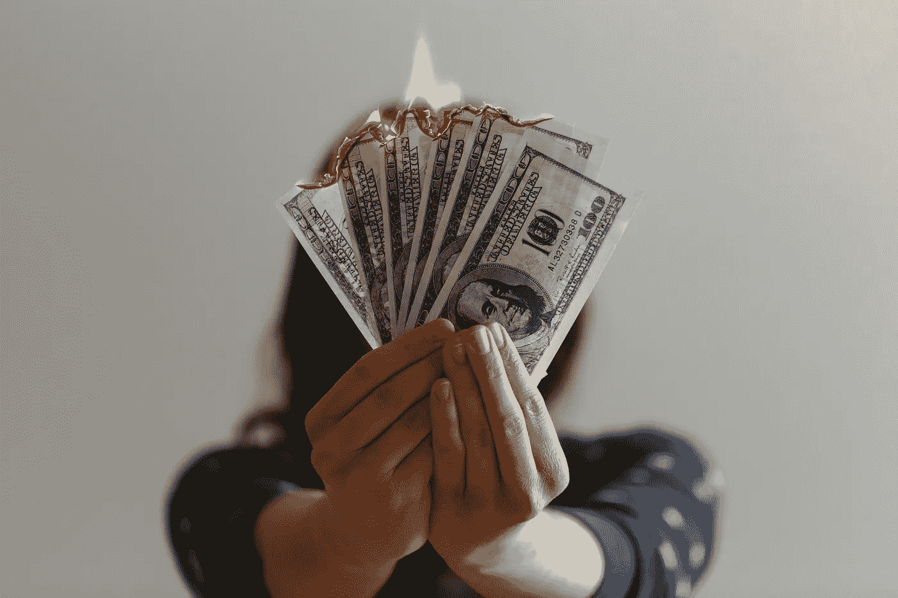

# 美国人感到被剥削和背叛了，因为我们被

> 原文：<https://medium.datadriveninvestor.com/americans-feel-exploited-and-betrayed-because-we-have-been-8c1019705761?source=collection_archive---------1----------------------->

## 至少我们现在知道了。

Photo by [Jp Valery](https://unsplash.com/@jpvalery?utm_source=unsplash&utm_medium=referral&utm_content=creditCopyText) on [Unsplash](https://unsplash.com/@jpvalery?utm_source=unsplash&utm_medium=referral&utm_content=creditCopyText)

一块巧克力。

这是几年前我得到的圣诞礼物。我的老板认为 50 小时的额外工作是值得的。没有比这更好的了。

今年，他代表我拒绝了加薪，告诉大老板，“他们这样做不是为了钱。”尽管他被授权给*所有的老师加薪，但他认为这是“财政上不负责任的”我的老板赚的钱是我们其他人的两倍，尽管他教的课程只有我们的一半，而且根本不出版。*

他靠撒谎和抢别人的功劳取得了今天的成就，这是我拒绝做的事情，尽管现在这似乎是在任何工作场所取得成功的唯一途径。

所以，我不会为加薪而争论。

我在用我的副业弥补差距。就像婴儿潮一代经常告诉我的那样，我正在“走出去，做一些帮助自己的事情”，就像我从 16 岁开始就一直在做的那样。

也许你能理解。

# 我们值六百多美元。

国会最终通过的刺激方案就像我几年前得到的巧克力棒一样。

这是一种伪装成慈善的侮辱。

当然，它现在可能永远不会被签署成为法律。我们的总统正在用它来哗众取宠。所以在某种程度上，我们听到的是，我们甚至不值 600 美元。

600 美元不足以补偿我们今年所经历的困难。它不包括任何人的租金或抵押贷款。我们中的一些人从额外工作中支付了十倍或二十倍的税。政府基本上是在告诉我们，我们不应该拿回我们自己的钱，尽管他们在致命的疫情期间帮了我们一点忙。名厨目前比我们的政治家做得更多。

你值得更好的。

# 我们一直在治理这个国家。

有一种人会因为任何人说出自己的想法而攻击他。他们说*我们是问题所在，因为我们太消极了。他们告诉我们要关注好的事情。*

“成为解决方案的一部分，”他们说。

我们中的一些人已经成为大多数成年人生活的解决方案。我们是老师和护士。我们是父母和看护者。我们一直在管理这个国家，而其他人都在休息，传播积极思考的福音。

我们中的一些人比那些告诉我们对社会毫无贡献的人多交了十倍的税。最重要的是，我们捐给慈善机构和非营利组织的钱比我们总统付给国税局的还多。尽管如此，我们仍然在晚上和周末帮助他人，不管是做志愿者还是做一名好老师。

就我自己而言，我花了数百个小时为我的学生编写免费教科书，这样他们就可以把钱花在食物上。有时我会帮他们付房租，给他们车钱。

我想知道，谁是真正的吃白食的人？

不是*我们*。

# 我们不欠任何人积极的态度。

想象一下，现在有人因为*的感受*而痛斥另一个人是多么的傲慢和自私。

这种事经常发生。

有一个特殊的群体，他们把控制人们的情绪作为自己的使命，即使是在一个充斥着令人瞠目结舌的无知和残忍的疫情。

他们没有注意新闻。如果他们突然进入现实世界一段时间，他们会发现他们阳光般的乐观是问题的一部分。他们的感激之情不是把食物放在任何人的桌子上。他们的精神支持不再帮助任何人。

他们是吸血鬼。

当他们告诉你“振作起来”时，他们的意思是希望你保持安静，然后微笑着为他们服务。他们不想去想那些欢快的面孔背后是怎么回事。

 [## 全民或跨州的国营保险私人医疗保险:经济学…

### 我们目前生活在一个所有非医疗行业都痴迷于…

www.datadriveninvestor.com](https://www.datadriveninvestor.com/2020/05/21/state-run-insurance-for-all-or-across-the-state-lines-private-healthcare-coverage-economics-politics-social-mix-up/) 

# 我们把积极留给自己。

有些人形容像我这样的人是消极的。

请允许我回应…

至少有两种积极的态度。这是我们每天用来度过的私人的、内在的声音。我们控制自己的想法和情绪，是为了对我们负责照顾的每一个人表示善意和同情。这可能包括某人的家人和他们的病人，或者他们的学生，或者一些朋友。现在，这需要很多能量。

然后是第二种积极。

那是一种劳动形式。

它是我们对陌生人的微笑，是我们对问题人物的甜言蜜语。这是我们在对付反假面具者和反暴力者时表现出的克制，这是我们用来忍受领导人月复一月令人震惊的无能的耐心。这种积极性我们已经没有了。我们再也不能容忍我们每天在这个国家看到的愚蠢行为。

我们刚卖完。

# 我们暂时搁置希望。

正如我在别处所写的，希望是危险的。希望不是让你度过最黑暗时期的东西。

希望常常让一切变得更糟。

现在，我们中的许多人都在一种防御性的悲观情绪中运作。坏消息太多了。希望和一厢情愿的想法不会让美国从废墟上重建起来，至少这次不会。

说得直白一些，这样才妥当。

希望和一厢情愿正是我们陷入这种困境的原因。想想我们自己的领导人公开谈论一切有多糟糕，并承认他们当着我们的面撒谎，因为他们认为我们是可牺牲的。他们毫不夸张地说，他们希望我们都生病，面对死亡，仅仅是因为他们厌倦了不得不做自己的工作。

这就是我们现在生活的美国。

任何谈论希望的人要么是疯了，要么显然只是想愚弄我们。

# 贪婪和毒性正在蔓延。

今年，我们的支持网络已经超过了极限。自从失去了日托所(永久地)，我就不能像以前那样陪伴我的学生了。我被迫为自己着想。

我不得不让其他人处理他们的问题，即使他们并不总是完全有能力这样做。人们流着泪来找我，我不得不尽我所能给他们一半的时间和关注。

这让我很生气。

我们领导人的贪婪和自恋正在向我们袭来。因为他们不采取行动，我们其余的人被迫退缩，退回到自己的生活中。我们不能像 T1 一样富有同情心。

我甚至认为这是他们想要的。这是他们一直想要的，让我们和他们一样可怕。有时候感觉他们赢了。我们能感觉到我们内心的自私。

很阴险。

# 自力更生是同情的一种形式。

如今，照顾好自己已经成为一种同情心。你不想成为另一个负担。你不想成为另一个要吃饭的人，或者另一个等待重症监护室的病人。

现在依赖他人的善意，这已经成为它自己的特权和权利。

现在有很多美国人认为*他们在照顾自己，但他们没有。他们没有听取专家的意见。他们没有遵循简单的指示。他们不会为了大家的更大利益而牺牲与家人共度的节日。*

我不得不再次怀疑谁是真正的吃白食的人。

顺便问一下，想吃巧克力吗？

是便宜的那种。

## 获得专家观点— [订阅 DDI 英特尔](https://datadriveninvestor.com/ddi-intel)