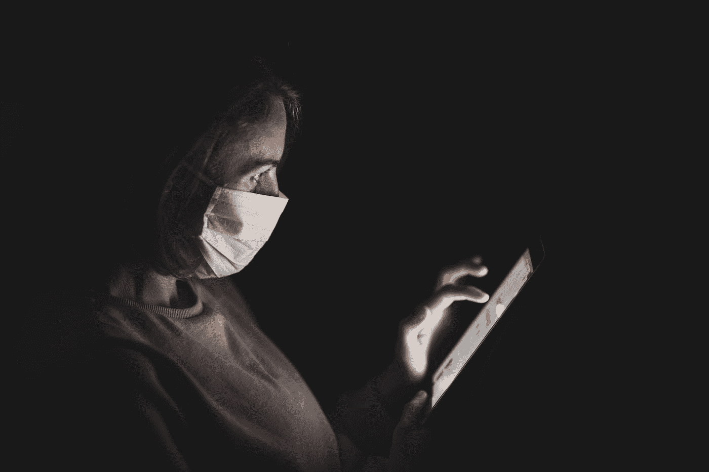

# 美国监控的新时代

> 原文：<https://medium.datadriveninvestor.com/americas-new-age-of-surveillance-afd0b08bf059?source=collection_archive---------24----------------------->

Photo by [engin akyurt](https://unsplash.com/@enginakyurt?utm_source=medium&utm_medium=referral) on [Unsplash](https://unsplash.com?utm_source=medium&utm_medium=referral)

几周前，我问了一个看似挑衅的问题:[冠状病毒会让监控正常化吗？两个星期过去了，越来越多的人给出了响亮的答案*是的*。](https://medium.com/@bmd329/will-the-coronavirus-normalize-surveillance-5feeae8fb3f7)

我现在正在纽约市的一间公寓里写这篇文章，纽约已经成为快速扩张的全球疫情的心脏地带。数字令人沮丧:纽约有超过 89，000 例确诊病例，仅该市就有 40，000 例。超过 1000 名纽约人已经死亡，他们的一些尸体[被保存在货车和卡车的冷冻棺材里。](https://www.express.co.uk/news/world/1263271/new-york-coronavirus-dead-bodies-forklift-trucks-refrigerated-vans)

正是在这种前所未有的恐惧和不确定性的背景下，政府和私营企业已经介入监控你的位置数据，但不一定是以你可能预期的方式。

 [## 监视的状态

### 世界上最新的技术监控和我们可能的发展方向。

mack.substack.com](https://mack.substack.com/subscribe?utm_medium=web&utm_source=subscribe-widget&utm_content=346190) 

根据最近*华尔街日报*的[报道，](https://www.wsj.com/articles/government-tracking-how-people-move-around-in-coronavirus-pandemic-11585393202?utm_campaign=The%20Interface&utm_medium=email&utm_source=Revue%20newsletter)移动广告公司目前正在向疾病控制中心提交大量美国热点地区(包括纽约市)的精确地理定位数据。

下面是拜伦·陶为《T10》杂志撰写的文章:

> 知情人士说，联邦政府通过疾病控制和预防中心，以及州和地方政府已经开始接收从手机数据中提取的关于某些地理区域的人的存在和移动的分析。这些数据来自移动广告行业，而不是手机运营商。

其中一位人士说，目的是为联邦、州和地方官员创建一个门户网站，其中包含全美可能多达 500 个城市的地理位置数据，以帮助规划疫情应对措施。"

表面上，疾病预防控制中心声称，它可以使用采集的位置数据来确定大型群体违反社交距离准则的区域。有了这些知识，官员们希望部署资源来限制人群，并有可能减少病毒的传播。对于实施就地避难指导的城市，这些数据有可能为研究人员提供 ner 实时路线图，通过分析居民离开居住地的频率和距离，说明该地区有多少居民正在遵守。

研究人员在《华尔街日报》的文章中指出，布鲁克林的展望公园(Prospect Park)是高度聚集的地区之一。事实上，就在昨天，我个人绕着公园慢跑(请避开我)，发现到处都是成群结队的游客，有些人在练习社交距离，有些人则没有。几乎所有的健身房都关门了，春天的天气从纽约的冬季阴霾中慢慢走出来，我认为现在展望公园的人比去年这个时候还多。

 [## 为什么加密对日常生活至关重要？数据驱动的投资者

### 你几乎每天都要输入密码，这是你生活中最基本的加密方式。然而问题是…

www.datadriveninvestor.com](https://www.datadriveninvestor.com/2020/02/10/why-encryption-is-critical-to-everyday-life/) 

当我最后一次问及在当前环境下是否有必要进行某种程度的监控时，我试图避免像隐私绝对主义者那样把头埋在沙子里……但我也说过，对这个问题的任何回答都应该在仔细考虑接受上述监控的社区的情况下做出。

事情不是这样的。

相反，移动广告公司——甚至不是直接使用我们数据的电信公司——正在暗中向 CDC 发送个人信息。没有公告，没有公众投票，没有市政厅。甚至没有疾病控制中心的博客帖子。没有《华尔街日报》的报道，公众可能永远不会知道。

政府从广告公司而不是电信公司获取数据的事实也很重要。正如《华尔街日报》的文章所指出的，电信行业受到的监管要多得多，对它们如何分享消费者数据设置了一定的保护措施。这些保护措施大多是在爱德华·斯诺登泄密事件后实施的，当时该事件揭露了一条从电信部门流向政府机构的基本上是直线的个人数据管道。据推测，疾控中心知道这一点，并且知道任何从电信公司收集数据的尝试都会遭到一些反对。因此，它转而转向监管少得多的移动广告行业。透明度见鬼去吧。

这并不是说其他私营公司没有试图参与其中。正如我们在上一期新闻简报中讨论的那样，脸书和谷歌已经宣布了监控地理位置数据的计划，以监控冠状病毒病例。根据《华尔街日报》的文章，全球最大的位置数据公司之一 Foursquare Labs Inc .表示，它正在与“许多州和地方政府就其数据的使用进行讨论。”

本周，同样来自《华尔街日报》的新报道发现，彼得·泰尔的执法分析公司 Palantir 因开创了美国主要城市充满种族色彩的预测性警务时代而备受争议，该公司正在与 CDC 合作进行数据收集和数据整合。据报道，就连反乌托邦面部识别初创公司【Clearview AI 也在与国家机构讨论追踪该病毒，该公司已成为最近大规模监控的事实上的恶棍。

美国政府以公共健康的名义拥抱大规模监控，紧随过去一个月欧洲各地发生的类似位置共享做法。但有理由表明，美国正在对一个完全不同的潜在隐私侵犯层面采取行动。

在应对冠状病毒的某种程度的监控方面取得最大成功的一些国家，如韩国和台湾，在这样做的时候更加关注个人隐私。下面是紫蓝色[为 Engadget 撰写的主题。](https://www.engadget.com/2020-03-27-the-surveillance-profiteers-of-covid-19-are-here.html?guce_referrer=aHR0cHM6Ly93d3cudGVjaG1lbWUuY29tL3JpdmVy&guce_referrer_sig=AQAAAGHSShv-TNJMBAvriI5woJYDRGxTSUruITC45NRD1NE45bx01FgxutgDB0EhSOlLNYPkkhu8ccOwwgsRJIU-ykJQaPDNfPeJaj4fzJjnYQAWGqfiJ5jl44u5L7VVrMBDY7tCmOP_1w2H_uRfx_OCvXVyalHSWkUI5a4AZHD8C1Ov&utm_campaign=The%20Interface&utm_medium=email&utm_source=Revue%20newsletter&guccounter=2)

> “在隐私和病毒追踪之间取得最佳平衡的国家正在遏制它，即韩国和台湾。事实上，在冠状病毒追踪方面取得成功的大多数国家都有独特的、针对大流行的现行立法，其中有关于数据收集的规定。德国、义大利、南韩和台湾的法律符合欧盟的一般资料保护法规(GDPR)标准。这些国家正在思考在我们都从新型冠状病毒中幸存下来后会发生什么，并承认将隐私从医疗保健中剥离出来是一个可怕的想法。”

到目前为止，美国在“我们都幸存下来后会发生什么”这个问题上缺乏任何有意义的对话。

这并不是说监控问题很简单。一些对国家监控最直言不讳的批评者已经放下了他们的护栏。在 BuzzFeed News 的一次采访中，曾帮助揭露美国国家安全局大规模监控设备的格伦·格林沃尔德(也是这篇时事通讯的最大灵感来源之一)表示，他能够接受否则他会感到憎恶的监控。

> 格林沃尔德说，“我花了很多年——甚至在斯诺登之前，然后显然是在斯诺登期间的两三年——倡导反对的那种数字监控，现在我认为可能是有理由的，主要是为了避开在中国使用的更野蛮的解决方案。”

格林沃尔德很快对此进行了警告，并建议谨慎行事。

“我们正处于生存本能指导我们思考的早期阶段，这可能非常危险。我正在努力调整这一点。”

他不是一个人。同一篇 BuzzFeed 文章中的另一位皈依者是前 2016 年自由主义总统候选人加里·约翰逊(还记得他吗？)在定位追踪这个话题上，他告诉谷歌“放手一搏”。

> "你只是没听到:有什么选择？"约翰逊说。“我不知道，没有(目前)作为州长坐在谈判桌前，有什么选择。鉴于每个州似乎都在做同样的事情，我不得不相信一切都是基于现有的最佳信息。”

我崇拜的作家西德尼·福塞尔最近为*连线*杂志写了一篇文章，标题是[“在公共健康危机中，监控如何拯救生命。”](https://www.wired.com/story/surveillance-save-lives-amid-public-health-crisis/)

这是大卫·p·费德勒为美国外交关系委员会撰写的文章。

> “新冠肺炎造成的损害可能会激励政府和公共卫生专家忽视网络安全和隐私问题，转而支持有望在预防和控制生死攸关的紧急情况方面取得成果的技术能力。”

然而，像格林沃尔德一样，其他人仍然在道德困境中挣扎。虽然现在可能需要某种程度的监控，但一旦冠状病毒的烟雾散去，真的没有什么可以确保政府机构不会继续这种做法。

电子前沿基金会(Electronic Frontier Foundation)的分析师马修·瓜里利亚(Matthew Guariglia)在 BuzzFeed News 的文章中说，“我担心，从历史上看，在任何危机时刻，那些总是想要大规模监控权力的人最终都会有一个途径和借口来获得它们。”

此外，尽管突然转向常态化监控，还是有一些希望的迹象。今天，大赦国际(Amnesty International)和其他 100 个人权组织一起发表声明，推动同时尊重人权的冠状病毒追踪标准。这是联合声明的开场白，你可以在这里看到全文。

> “新冠肺炎疫情是一场全球性的突发公共卫生事件，需要世界各国政府采取协调一致的大规模应对措施。然而，各州遏制病毒的努力绝不能被用作一个幌子，以迎来一个入侵性数字监控系统大幅扩张的
> 新时代。"

在另一份电子邮件声明中，大赦国际技术部副主任拉夏·阿卜杜勒·拉希姆进一步阐述了这一点。

阿卜杜勒·拉希姆写道:“只有在满足某些严格条件的情况下，才能增加数字监控来应对这一公共卫生突发事件。”当局不能无视隐私权，必须确保任何新措施都有强有力的人权保障。无论政府在哪里使用科技力量作为他们击败新冠肺炎的策略的一部分，他们都必须以尊重人权的方式这样做。"

也许这整个故事中最令人沮丧的是，美国政府显然不愿意相信民众会做出正确的决定。如果向公众提出暂时中止我们想要的隐私级别以换取直接公开的决定，普遍的共识会是什么？很有可能足够多的人能够看出其中的细微差别，并据此采取行动。但也许不是。

 [## 监视的状态

### 世界上最新的技术监控和我们可能的发展方向。

mack.substack.com](https://mack.substack.com/subscribe?utm_medium=web&utm_source=subscribe-widget&utm_content=346190)