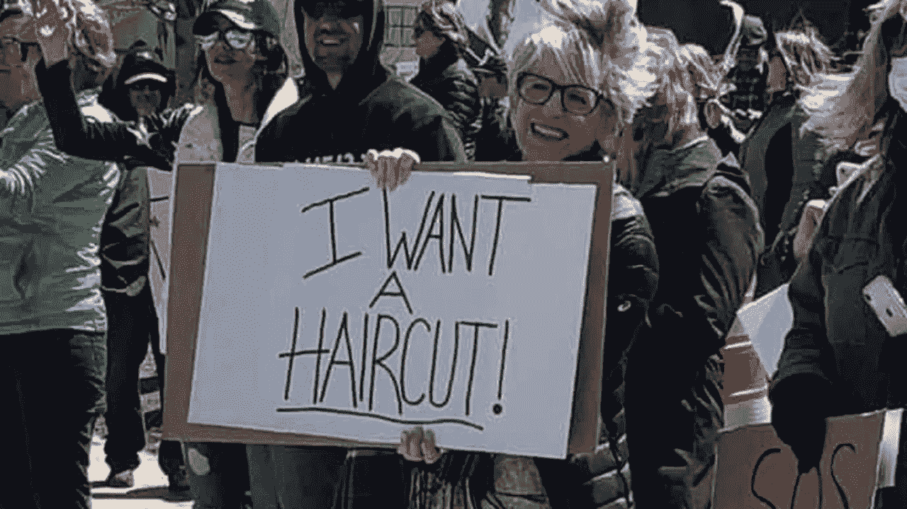

# 美国的下一个威胁是#Klandemic

> 原文：<https://medium.datadriveninvestor.com/americas-next-threat-the-klandemic-22025dfc4b92?source=collection_archive---------1----------------------->

The #Klandemic: Bringing guns to a virus fight. (Image Credit: [The Daily Beast/Jeff Kowalsky/AFP/Getty](https://www.thedailybeast.com/michigan-conservatives-not-concerned-about-covid-19-block-ambulance-during-protest-against-social-distancing))

全面披露:这几天我在社交媒体上看到这个词两次，所以我不声称它是我创造的。我感激和欣赏这是一个多么完美的词。

在过去的几周里，有几件事情变得很清楚:新冠肺炎的死亡率可能会降至 1%以下，美国的曲线和计数正在变平，因为我们的社会距离措施取得了成效——这种疫情虽然严重，但并不代表对健康或经济的存在威胁，而我们在早期担心它可能会这样。我们会赢的。

还是我们会？

过去的一周显示了另一个有趣的，令人筋疲力尽的故事发展:一些团体抗议国家强制的社会距离措施。从俄亥俄州到密歇根州和其他地方，人群聚集在各州首府和全国各地的医院抗议他们认为失去的自由。他们认为，我们对冠状病毒的反应远远超过了许多步——让医学建议见鬼去吧——他们对照常生活的要求符合宪法。

Because “I don’t believe in science” isn’t nearly as catchy. (Image Credit: [Sky News](https://news.sky.com/story/coronavirus-trump-calls-for-some-states-to-be-liberated-from-covid-19-lockdown-11974991))

如果他们的抗议标志是可信的，他们理发的权利，扔掉一些苹果蜂的应用程序，甚至牺牲弱者的权利，都是受宪法保护的。在公共卫生危机期间，他人享有合理安全的权利？忽略。他们说，如果你不喜欢，如果你害怕，就呆在家里。

 [## 保护主义、政治和经济动荡|数据驱动的投资者

### 美国股市昨日出现 400 多点的大幅反转，为未来的事情发出了警告信号。市场…

www.datadriveninvestor.com](https://www.datadriveninvestor.com/2018/06/28/protectionism-politics-economic-turmoil/) 

这样的群体该怎么称呼？他们公然藐视医疗专业人士的建议，这些人的唯一议程就是限制新冠肺炎的传播和危害。他们聚集在一起，大声疾呼，要求他们的反科学立场被接受和执行，让大多数不同意的人见鬼去吧。他们游行，骄傲地展示他们故意的无知，抗议标语上布满拼写和逻辑错误。输入完美的专有名词:介绍#Klandemic。

Late stage capitalism, colorized 2020\. (Image Credit: [Raw Story](https://www.rawstory.com/2020/04/tennessee-anti-lockdown-protester-demands-state-sacrifice-the-weak-to-reopen-economy/))

他们说，他们是有道理的，因为长期隔离的经济困难会比“一场严重的流感”或他们今天所做的任何事实上不正确的类比造成更多的痛苦和生命损失。

事情是这样的:**他们是对的**。

长期的社会隔离和隔离，让数千万人失业，依赖政府刺激，几乎肯定会将我们带入一场严重程度远远超出大多数历史或预测模型的经济危机。毫无疑问，疫情带来的经济后果可能是毁灭性的。完全可以想象，其经济后果可能会比死亡率不到 1%的病毒更糟糕。

How to Start an Economic Crisis. (Image Credit: [Markus Winkler](https://unsplash.com/@markuswinkler?utm_source=medium&utm_medium=referral)/[Unsplash](https://unsplash.com?utm_source=medium&utm_medium=referral))

但是还有另一件事:导致经济全面崩溃的唯一方法就是人们不呆在家里。原谅我用词不当，但重要的是我们要了解情况的严重性。

所以#Klandemic 的成员们，让我告诉你们，我*听到*你们了。我明白。我明白了。被困在家里真糟糕。依赖政府真糟糕。吃我做的而不是苹果蜂做的真糟糕。不能去上班真糟糕。(好吧，那是一个谎言，实际上我热爱我所有新获得的自由，但我理解为什么如果你没有工作以外的身份，你会渴望回到工作中。)

我也想结束这一切。我也担心经济后果——也许更担心，因为我的金融学位让我在这一中断期间看着债务堆积和税收暴跌时有了某种感觉。

事情是这样的:如果我们现在恢复正常，我们将会有一段糟糕的时间。我们将会看到越来越多的大城市经历纽约曾经经历过的事情。我们将会看到这种病毒一次又一次地出现，即使是在它已经袭击过的城市，因为感染率仍然相对较低。

We’re all tired. None of us want this. (Image Credit: [Jusdevoyage](https://unsplash.com/@jusdevoyage?utm_source=medium&utm_medium=referral)/[Unsplash](https://unsplash.com?utm_source=medium&utm_medium=referral))

如果我们现在不理会医生的建议，我们以后将不得不再次关闭。再一次。再一次。

美国是一个有韧性的国家。成为有史以来最富有的国家是其中很大一部分，但作为一个民族，我们已经显示出从灰烬和瓦砾中崛起的能力，并以令人印象深刻的效率将艰难困苦抛在身后。(有时，在桑迪胡克这样的案例中，我们也能轻松地继续前进一点点*。)*

但是我们会赢的。为什么？因为在危机时刻，我们总是再次成为美国人。政治界限总是在最重要的时候消失。2001 年 9 月 12 日，与其说是共和党人和民主党人，不如说是愤怒的美国人。

作为美国人，我们也将在这里获胜。

> 在宪法保护的对生命、自由和幸福的追求中，许多人的生命优先于少数人的自由和幸福。

不是理论。其他国家经历过更严重的封锁，但都很好。各国已经能够推出广泛的测试和跟踪，并已经开始着手开展业务。有些经济体几乎完全脱离了困境。

Because wearing a mask for 20 minutes is exactly the same as being forced to carry a child for 9 months. (Image Credit: Vice News)

如果我们团结起来，我们就能做到。不是在总统、政治家、想法或议程的背后，而是在简单的科学和现实的背后。不应该忽视经济后果。这是一个合理的立场。但是，在我们至少稍微控制住这个问题之前，忽视它的存在只会让我们一次又一次地回到我们的住宅监狱，并严重恶化即将到来的经济衰退。

正是因为这个原因，随着我对新冠肺炎后果的担忧减少，我对“克兰德米克”的担忧增加了。

通常无知并不危险——如果有危险，也是以最间接的方式。除了恐怖主义和源于对世界有限理解的仇恨，无知通常只会让人沮丧。在选举年，这是人类进步的倒退。

Reasons not to cut education spending. (Image Credit: Jason Connolly of AFP)

但是现在，无知是对美国社会的直接威胁。无知的人可能——而且经常——成为致命病原体的携带者。无知的人推动一个违背科学的议程，只会延长他们所抗议的状况。无知的人走上拥挤的街道，以显示他们不害怕这种病毒。

但在这样做的时候，他们显示出自己是最害怕的:当理性的人因为自己的家园受到保护而焦虑不安时，我们却被那些已经对恐惧失去理智和逻辑控制的人进一步拖入了经济深渊。

必须在每一步抵制#Klandemic。必须引用组织者。不用说，在宪法保护的对生命、自由和幸福的追求中，许多人的生命优先于少数人的自由和幸福。

Haircuts: the new constitutional debate rages on. (Image Credit: Raw Story)

我怀疑这其中有一定的智慧，因为它是按照特定的顺序排列的。生命第一。然后是自由。最后是理发和苹果蜂带来的快乐。

与科学联合起来。和美国站在一起。抵制#Klandemic。

*关注* [*迈克尔弗朗西斯*](https://medium.com/u/6656220d293?source=post_page-----22025dfc4b92--------------------------------) *上* [*中*](https://medium.com/u/504c7870fdb6?source=post_page-----dfffe06d908c----------------------) *和* [*推特*](https://twitter.com/MFrancisWrites) *获取更多，以及上***和*[*insta gram*](https://www.instagram.com/mfranciswrites/)*获取文章的短视频摘要。**