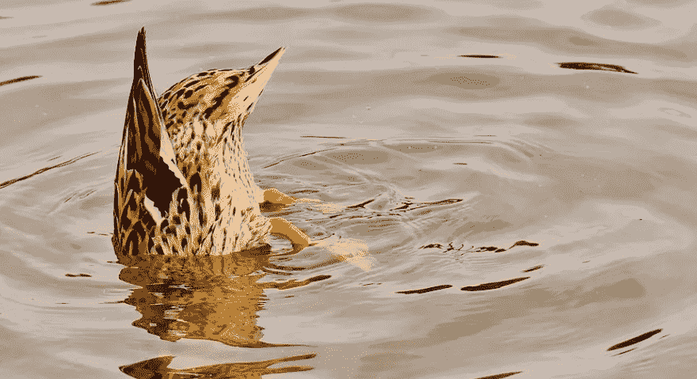

# 美国的接受问题

> 原文：<https://medium.datadriveninvestor.com/americas-problem-with-acceptance-87033460f564?source=collection_archive---------9----------------------->

## 我们不会回到去年。让我们集中精力度过这一关。

Image courtesy of Pixabay.

我们步行。似乎只有我们知道古老的巴豆水渠的秘密。

我们很少碰到任何人。对许多步行者来说，纽约太冷了。我把这段时间叫做*冷紫罗兰*，因为当我还需要一件外套的时候，紫罗兰就在草丛中冒出来了。

每年的这个时候，自然界有一种非凡的美。最淡的绿色激发温柔。我开始称它为 [*夏尔*](https://en.wikipedia.org/wiki/The_Shire) ，还有点期待[比尔博·巴金斯](https://en.wikipedia.org/wiki/Bilbo_Baggins)自己会出现，邀请我们进去吃第二顿早餐。

这当然是海市蜃楼。托尔金的思想与另一个文学参考混合在一起。T.S .艾略特的线，

[*四月是最残酷的月份*](https://en.wikipedia.org/wiki/The_Waste_Land)

似乎永远留在了我的脑海里。

我丈夫和我正在进行我们漫长的日常旅行。今年四月初。他刚刚丢了工作，还失去了我们的健康保险；新冠肺炎·疫情 T20 造成的数百万失业人口之一。

幸运的是，我碰巧也特别穷。我是美国人口普查局的新雇员，但我知道我不会很快就去敲门。隔离生效后就不会了。

我们走路，这样我们就不会因为担心而发疯。我们走着走着，直到我们累得不再关心经济灾难，或者最终依靠呼吸机。

我不喜欢被骗。我不会让早春的疼痛让我眼花缭乱。四月是最残酷的月份的另一个原因是这是挨饿的好时机。从历史上看，农民已经没有冬季供应，现在种植任何东西都为时过早。

我想起 [*草原上的小房子*](https://en.wikipedia.org/wiki/Little_House_on_the_Prairie) 。然后，我想起了我的萨莉阿姨，她自己也住在大草原上。

我已故的父亲和她还有一个妹妹，比蒂，是三人中最小的一个。和我父亲一样，比蒂在很小的时候就被诊断患有晚期癌症。她和莎莉异常亲密。

莎莉从德州来到佛罗里达陪她。她走进了病房。比蒂对她的问候是:

***这*** *到底是怎么发生的？*

莎莉告诉我，比蒂做了一轮化疗，宣布她自己结束了。将不再有化疗。她不适合吃药生病。他们离开了医院。

莎莉说:我们以为我们还有时间。*我们没有意识到的是，这些* ***正是*** *美好的日子。*

在碧蒂生命的最后三天，我和莎莉以及我的表妹珍妮在一起。她停止饮食以加速死亡，但是她的身体不配合。我对她身体保持的凶猛程度感到震惊。与其说她在呼吸，不如说她在喘气。三天来，我觉得她的每一次呼吸都是最后一次。

 [## 不是数据驱动的政治辩论投资者

### 《纽约时报》在 2020 年 6 月 3 日在线发表了阿肯色州参议员汤姆…

www.datadriveninvestor.com](https://www.datadriveninvestor.com/2020/06/08/the-political-debate-that-has-not-been/) 

那些好日子是在她刚卧床不起的时候。

现在，当我们走路的时候，我们每个人都有可能失去房子的想法。这太可怕了，难以启齿，但恐惧正在增长。我感觉到了。

这些是好日子。

突然，我做了一个决定。我开口告诉他。

*看。我们必须挺过去。这是我们唯一的目标。我们只需要保持健康，度过难关。如果我们失去了一切，那就这样吧。我们重新开始。*

这成了我们的约定。保持健康。挺过来。到目前为止，我们已经做到了。这个决定是好的。

我回头看那一刻，知道我收到了一些真正的恩典。我很幸运。

将世界上正在发生的事情框定为对我们生存的简单挑战的能力极大地帮助了我。我放弃了对美好未来的希望。我放弃了再次旅行的机会。我不再做房主了。我学会了活在当下，真的。

这些年的冥想从未让我像这个疫情那样沉浸在那一刻。

我知道很多人现在非常担心强加给我们的各方面的变化。我没有一个朋友的生活没有被冠状病毒搞得天翻地覆。他们中的大多数人都过得很好，但有时焦虑会让他们觉得自己可能会死。

我有一个朋友在隔离期间刚刚丧偶。在失去了三十多年的丈夫后，她现在孤身一人。另一个人有两个孩子在上中学，不知道他们剩下的学校生活会是什么样子。

我的大多数密友都是老师。一周前，他们中的一个人正在考虑提前退休，而不是回到有成千上万个孩子的大楼里。她的当地学校董事会勉强通过了一项决定，让第一学期成为虚拟学习，所以她现在是安全的。

这些都是教师被迫做出的艰难抉择。

我不是老师，所以不存在这些问题。我甚至不能教幼儿园，现在。我直到三十岁才得到一台电脑。作为 X 世代的一员，我正处于人类发展的尴尬青春期。

我可能会有一两个糟糕的时刻，但我已经放弃与正在发生的事情抗争。我知道我的生活再也不会像以前那样了。

我知道这是美好的日子。这是人类进化史上一个非常奇怪的时期。我试着不去想太多。

[进化](https://www.yourgenome.org/facts/what-is-evolution)不是选择。不管我们愿不愿意，我们都会进化；我们是否准备好了，或者准备好了，这都不重要。我怀疑几百万年前有任何一只恐龙会梦到他的[后代是鸡](https://www.theverge.com/2014/12/11/7378239/chickens-are-closely-related-to-dinosaurs-new-bird-family-tree)。

我们要么适应，要么死亡。我们要么投降，要么被粉碎。

然而，我注意到这不是一个被广泛接受的想法。

如果我告诉你我最常听到人们说的一件事，无论是政治家还是公民，它是这样的:

*我不能* ***等*** *等到一切恢复正常再说！*

*正常的*，就像孩子们说的，取消了。没有回头路了。接受这一点似乎很痛苦。与之抗争更糟。

一个在家的母亲，祈祷她不会对在家教育两个青少年负责，是一回事。她不对她的城市、州或国家负责。希望事情会恢复正常不会对我们的社会产生负面影响。

我期待我们的领导人有更好的批判性思维。

我们现在面临的每一个问题，无论是个人还是国家，都与接受有关。我们正处于全球疫情的第一波*。冠状病毒没有回来——它从未离开。我们必须采取相应的行动。旧的方法行不通。*

*抓住过去不放，尤其是去年的经济会让人丧命。坚持让我们[太快重新开放](https://www.cnbc.com/2020/06/25/coronavirus-live-updates.html)已经造成了灾难性的后果。怀念昨天不仅毫无意义，还会伤害我们。*

*如果你不担心有人会死，请考虑这一点:拒绝处理基于数据的感染率模型[。从头开始，一次又一次不是一个划算的策略。](https://www.governor.ny.gov/news/governor-cuomo-announces-new-data-driven-guidance-reopening-schools)*

*几个月前取消共和党大会要比把它从北卡罗来纳移到佛罗里达便宜。[反正取消了](https://www.axios.com/trump-cancel-rnc-convention-coronavirus-1f1ebeb6-0c5e-4a11-afac-8d68924c3a3e.html)。*

*将整个国家关闭一两个月，然后评估我们的处境，这可能是昂贵的。充分补充每个美国人的收入或向每个失业者提供医疗保险可能会很昂贵。*

*做我们正在做的事情只会更加昂贵。*

*今天，疾病预防控制中心的当权者突然改变了对孩子们重返校园的危险的看法。得知他们屈服于特朗普令人非常失望，但可能不应该感到意外，因为他们处于行政部门的控制之下。*

*当然，让孩子上学会更好。当然，他们错过了社交。当然，网上学习更难。*

*我们真的想把这些孩子和我的朋友，他们的老师送进学校，只是为了让他们在太多人死去后再次关闭吗？*

*我不知道我们是如何来到这里的。但是我们在这里。如果我自己的政府处理现实，而不是幻想，我会非常感激。现在重要的是根据科学做出正确的决定。*

*相反，我们的总统想要回到去年。*

*用另一个文学比喻来说，川普总统让我想起了《玻璃动物园》中的[田纳西·威廉姆斯](https://en.wikipedia.org/wiki/Tennessee_Williams)角色[阿曼达·温菲尔德](https://www.cliffsnotes.com/literature/g/the-glass-menagerie/character-analysis/amanda-wingfield)；只是没有她的魅力。看着他为去年的经济而憔悴，真令人尴尬。这与眼前的巨大问题毫无关系。*

*他还不如希望蓝山上有十七位绅士来访。他幻想的时间越长，这些好日子就会很快变成我们最糟糕的日子。*

***访问专家视图—** [**订阅 DDI 英特尔**](https://datadriveninvestor.com/ddi-intel)*