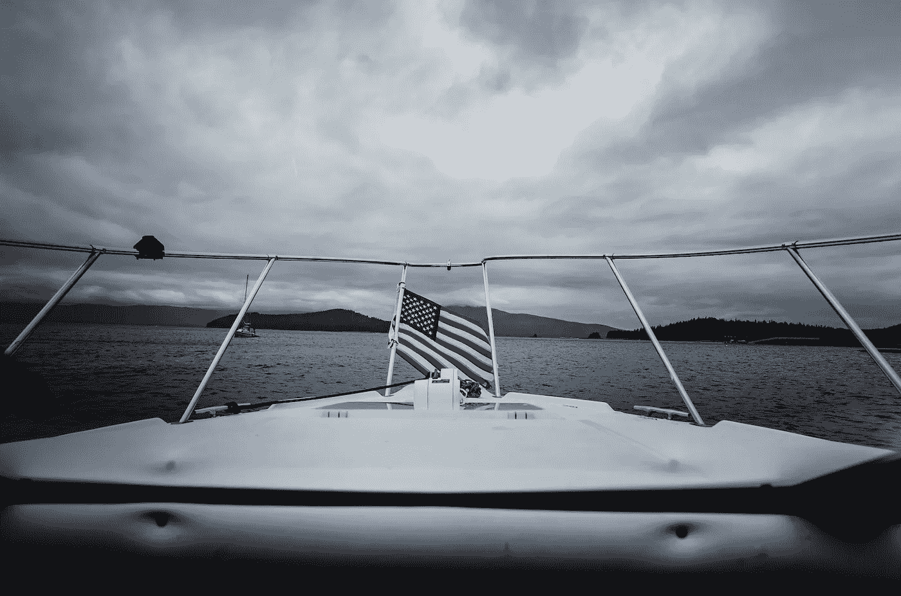

# 美国的梦遗。

> 原文：<https://medium.datadriveninvestor.com/americas-wet-dream-8a7512d55791?source=collection_archive---------17----------------------->

## 一个处于危机中的国家求助于性别揭露和船队。

Photo by [丁亦然](https://unsplash.com/@yiranding?utm_source=unsplash&utm_medium=referral&utm_content=creditCopyText) on [Unsplash](https://unsplash.com/s/photos/american-flag-on-boat?utm_source=unsplash&utm_medium=referral&utm_content=creditCopyText)

好男孩们喝着威士忌和黑麦酒，唱着这将是我死去的一天。“唐·麦克林

你得把它交给美国人。在他们的历史上，包括 1918 年的西班牙流感，没有哪个地方的公民花费如此多的时间和精力去做他们不应该做的事情。

毕竟，这是美国，自由的土地，根据第一修正案，每个美国人都有集会的权利。根据第二修正案，他们也有权维护自己的权利，拉斯维加斯的大屠杀凶手就是这样做的，他在一天内购买了 33 件高能武器。

嗯，甚至一些开国元勋在 1788 年对第一修正案(和第二修正案)有所保留，声称这将导致“最高形式的煽动。”所谓“最高形式”肯定是指有组织的煽动，而不是我们在任何给定的黑色星期五在大卖场看到的。

> 现在，我明白了，船队就像船和卡车一样，美国人两者都相信——可能比宗教更相信——或者同样相信。

那时候美国人并不愿意倾听，就像他们现在一样。尽管美国每天有 2000 人死于 COVID 疫情，但这并没有阻止抗议活动、宗教集会——或者最疯狂的——性别揭示和支持特朗普的船队。

现在，我明白了船队的概念，因为船很像卡车，而美国人相信两者的集合——可能超过宗教——或者一样多。

拥有一辆大卡车——或一艘大船——定义了主导德克萨斯州和佛罗里达州等红色州的“不做大就回家”的心态，这解释了为什么这两个州都决定用装饰着在大三角帆上高高升起的特朗普旗帜的船只游行来表达对特朗普总统的支持。

在德克萨斯州莱克威附近的特拉维斯湖，超过 2600 人乘坐各种大小的船只出现，组织者告诉每个人将他们的船的速度保持在 10 英里/小时(16 公里/小时)。这对任何一个德州人来说都是很高的要求，尤其是一个爱国的德州人。“在那样的速度下，我甚至无法让我的 20 英尺特朗普旗帜展开，孩子，”他们靠在油门上说。

 [## 全民或跨州的国营保险私人医疗保险:经济学…

### 我们目前生活在一个所有非医疗行业都痴迷于…

www.datadriveninvestor.com](https://www.datadriveninvestor.com/2020/05/21/state-run-insurance-for-all-or-across-the-state-lines-private-healthcare-coverage-economics-politics-social-mix-up/) 

这导致尾流淹没了五艘船，并使更多的船因舱底泵损坏而一瘸一拐地返回港口。对打捞人员来说，这将是个好日子。毫无疑问他们现在正拖着特拉维斯湖。打捞法是这样的，你拖进来的任何东西，无论是沉没的还是被丢弃的，都是公平的游戏，大船击沉小船并不是一个讽刺。

“我们是美国人，”他们会说，大的总是比小的更有活力，这是啤酒肚的特朗普们愿意证明的——无论是在水上还是水下。

现在让我们转到佛罗里达州的克利尔沃特，在那里，一个 Trumptilla 的组织者决定尝试创造一项吉尼斯世界纪录。超过 2000 人报名参加，但尚未确定他们是否需要 1180 艘船来超过 2014 年在马来西亚创下的纪录。

> 他指责自由党人，称他们攻击他和他的家人“热爱特朗普的一切”。

另一个症结是，组织者卡洛斯·加维迪亚被指控发送短信威胁要杀死或伤害他以前所在社区的一名居民。他指责自由党人，称他们攻击他和他的家人“热爱特朗普的一切”。

如果你被指控犯有重罪，成为特朗普的真正支持者并不能让你摆脱困境。但它确实允许近乎崇高的言论。在加维迪亚承认发出威胁后，他的律师斯图尔特·卡普兰(Stuart Kaplan)面无表情地说，“卡洛斯·加维迪亚没有什么可恨的。”此外，发出威胁和反犹太人的诽谤不是种族主义，如果你心中有爱，或者一个律师被支付忽略明显的。

奥斯卡·王尔德曾经说过:“美国是唯一一个从野蛮走向颓废而中间没有文明的国家。”显然不是粉丝，但他说的很有道理。颓废有各种各样的形式。有时它几乎像婴儿一样，这是美国的一个明确标志。

以亚利桑那州南部一名下班的边境巡逻员为例，他决定在一场性别揭秘派对中加入一些烟火。他布置了一个目标，里面装满了与孩子性别一致的彩色粉末，然后用一种合法但极易爆炸的物质点燃。结果是 47，000 英亩土地被烧毁，损失价值 800 万美元。

接下来是棕榈泉附近的“黄金国”大火。一个主持另一场性别展示的家庭引爆了一个发烟装置，导致超过 10，000 英亩的土地被毁。这家人留在附近，真心相信这是一场意外。

> 即使对初为人父母的人来说，一分钱也要在某个时候花掉。或者那些希望成为没有犯罪记录的新父母的人。

“我想他们现在明白了形势的严重性，”加州林业和消防部门的发言人 Bennet Milloy 告诉每日邮报，特别是因为“埃尔多拉多大火”距离上个月苹果大火肆虐的 33，000 英亩的地方只有两英里。

即使对初为人父母的人来说，一分钱也要在某个时候花掉。或者那些希望成为没有犯罪记录的新父母的人。这可能有些牵强，因为他们可能面临数百万美元的损失和可能的牢狱之灾。

奇怪的是，如今水似乎成了所有美国事物的连接组织。如果美国人不在消防水管的末端，他们正在滑下 18 英尺长的船尾。如果有什么让美国变得伟大，那就是水。美国的历史充满了水的类比，甚至特朗普也说过，如果他被迫提交报税单，“我就完蛋了。”

你可以说这是美国的梦遗，是我们不由自主做的事情，但这并不能改变我们睡衣的状况。也许这都是美国衰落的一部分。正如韦德·戴维斯在他的《滚石》杂志的文章《美国的解体》中指出的，所有迹象都指向一个享受着世界国家地位的最后痕迹的王国。

戴维斯提供了一些惊人的事实，包括美国如何在他们从未赢过的战争上花费了 6.4 万亿美元。与此同时，自上世纪 30 年代末日本入侵以来，中国还没有参与过全面战争。

> 中国在 3 年内浇注的混凝土比美国在整个 20 世纪浇注的混凝土还多。

相反，他们投资基础设施，在各方面都超过了美国。中国在 3 年内浇注的混凝土比美国在整个 20 世纪浇注的混凝土还多。与此同时，14 名美国亿万富翁拥有的财富比美国其他人加起来还多。难怪美国人消费了全球三分之二的抗抑郁药——许多是中国生产的——或者中国目前占所有 COVID 死亡的五分之一(另一方面，中国只有 4634 例，低于加拿大)。

美国正显示出把两条腿都放进坟墓的所有迹象，在未来几年不会有什么变化，因为没有计划，除了浇更多的水，这对坟墓没有任何帮助。

正如性别揭秘派对的创始人詹娜·卡维尼迪斯所说，“不要再举办这些愚蠢的派对了。看在上帝的份上，不要把东西烧掉告诉所有人你孩子的阴茎。除了你没人在乎。”

嗯，这也算是美国的梦遗吧，不是吗？

最终，你醒来发现，第一，你湿了，第二，你一个人，第三，没人在乎。这一定很伤人，尤其是那些一心一意的共和党人，他们认为乘船旅行几乎可以解决所有问题。

不幸的是，它没有。

罗伯特·科马克是讽刺作家、小说家和博客作者。他的第一部小说[“你可以把马带到水边(但你不能让它潜水)”](http://robertcormack.net/)在网上和大多数主要书店都有售。查看[天马出版社](http://skyhorsepublishing.com/)或[西蒙和舒斯特](http://simonandschuster.ca/)了解更多细节。

**访问专家视图—** [**订阅 DDI 英特尔**](https://datadriveninvestor.com/ddi-intel)