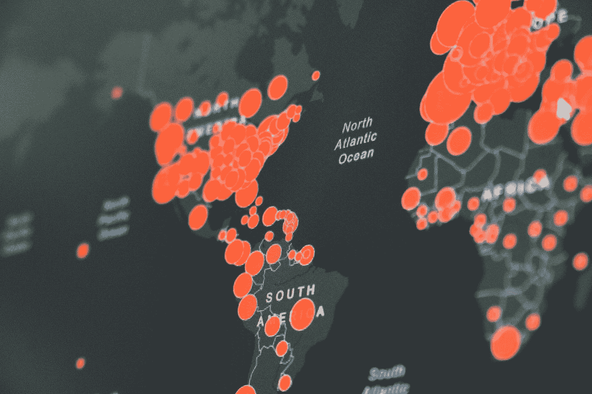

# 在新冠肺炎大流行中，私立医院和诊所面临困境

> 原文：<https://medium.datadriveninvestor.com/amid-covid-19-pandemics-private-hospitals-and-clinics-are-going-out-of-business-what-is-wrong-171e1c62ca45?source=collection_archive---------16----------------------->

## 图片有什么问题？！

Photo by [Fusion Medical Animation](https://unsplash.com/@fusion_medical_animation?utm_source=medium&utm_medium=referral) on [Unsplash](https://unsplash.com?utm_source=medium&utm_medium=referral)

随着冠状病毒大流行在美国蔓延，医疗资源也变得紧张。由于医疗服务系统面临考验，国家对自然灾害的集体反应进一步显示出缺陷。

在任何健全的系统，特别是在发达国家，必须接受全面和积极的反应的情况下，初级医疗保健能力越来越不足。事实上，[今天许多美国人无法获得他们认识和信任的或者认识他们的人提供的负担得起的医疗服务。减少看医生的机会，至少看起来不是经济驱动的，因为数万亿美元被浪费了。相反，主要问题是建立一个符合每个社区需要的合适的基础设施。](https://hbr.org/2020/03/coronavirus-is-exposing-deficiencies-in-u-s-health-care)

在疫情爆发期间，医生通过可信的建议和护理扩展了第一线支持，使患者在不需要的时候不会挤满急诊室和医院门诊。当诊所和急诊室挤满了不太可能感染新冠肺炎病毒的人时，他们会推迟对那些真正感染新冠肺炎病毒并预计自己也会感染的人的护理。

显然，在疫情期间，正如我们现在所经历的那样，对卫生保健人员的需求会扩大。但遗憾的是，现实与拼命寻找的东西相差甚远。

许多诊所和医院已经取消了非紧急预约，特别是那些非 COVID 病例和选择性手术。因此，包括医生在内的医务人员要么减少工作时间，要么关门歇业。显然，根据常识，这些医生没有必要照顾新冠肺炎，因为他们没有被叫去其他机构帮忙。相反，我们看到的是解决新冠肺炎患者迫切需求的医疗保健服务被关闭，剩下的医疗保健机构则处于休假状态。

毫无疑问，由于疫情的经济增长而关闭医疗设施的情景类似于第 22 条军规的比喻。由于新冠肺炎·疫情，当前系统的反应是一个进退两难的困境，只有在相互冲突的危机条件下，我们才没有医疗保健。似乎缺乏储备能力来处理社区正在经历的医疗保健危机。或者——由于物流不完善，资源分配严重不均；因此，我承认最后一点。毫无疑问，冠状病毒已经成功地暴露了美国医疗保健系统的不足，不一定是从财政的角度，也从物流和交付的角度。

## 冠状病毒已经影响了医生看病人的方式

过去几个月，由于冠状病毒疫情，初级保健诊所的住院病人数量减少，门诊病人数量下降，这已经成为医生执业的强大推动力；也是生意。

Photo by [Ashkan Forouzani](https://unsplash.com/@ashkfor121?utm_source=medium&utm_medium=referral) on [Unsplash](https://unsplash.com?utm_source=medium&utm_medium=referral)

根据一项调查，由于新冠肺炎危机，大约十分之八的初级保健诊所面临巨大压力。为了解决这个问题，联邦医疗保险计划和一些商业健康计划已经开始向医生提供预付款，这实际上是根据他们预计从持续的患者流中收取的费用来预付给医生一笔总额。但结论就是预支薪水。很少有专家认为政府的这一举措是重新定义传统门诊和扩大远程医疗的第一步。它们还规定，政府的新行动是进一步放弃已经疏远的习惯性服务费计划的标志。

医生的做法似乎正在适应更多的远程医疗访问，这一举措受到公共卫生当局的普遍欢迎。尽管如此，远程保健服务的费用仍然低于门诊费用。

## 毫无疑问，新冠肺炎危及独立医生的命运

处于冠状病毒困境中心的患者减少是全国大多数(如果不是全部)小型诊所面临的状况。这只是冠状病毒给卫生保健系统带来的不平衡压力的一部分。在 3 月中旬最初报道冠状病毒大流行后，医生开始建议患者远离医生的办公室，以保护医生和患者。自那以后，大多数办事处推迟了年度体检和预防性访问。他们告诉病人来之前要打电话，他们已经开始虚拟地看病人。

## 交通量的减少让医生付出了高昂的代价

许多医生的实践表明，患者的就诊率下降了 50%至 75%。门诊人次的下降使得医生们努力生存，迫使越来越多的人解雇工人或关门。一些手术中心报告收入下降了 95%。

一些独立的医生坚持拿薪水。

医生们鼓励他们的病人去远程健康中心就诊，大约是新冠肺炎之前总数的 60%。大多数医疗实践已经决定了他们的临床实践只能支持支付一个月的员工工资。

## 全国医院和诊所趋势

根据《新闻周刊》发表的观点[,至少在疫情冠状病毒最需要他们的时间和地点，大量的医疗保健员工被解雇或休假。它多少描述了:联邦政府和州政府笨拙的指令停止所有非紧急程序，即使看起来是为了做好事；限制不必要的暴露，保护员工、床位和设备。政府关门只是让医疗系统完全瘫痪了。这影响了冠状病毒疫情热点地区的行业，并破坏了全国的整个医疗保健系统。政府对医疗行业的严厉制裁造成了其自身计划的压力，在危机期间最需要的时候，医院的闲置床位被暂时取消。因此，它导致数十万人失业。有偏见的流行病学策略的经济后果实际上已经超过了疫情本身。](https://www.newsweek.com/most-us-hospitals-are-empty-soon-they-might-closed-good-opinion-1500028)

除非是管理式医疗系统的大型连锁机构的一部分，否则全国各地的医院已经采取了不同寻常的裁员措施来弥补暂时的预算赤字，后者可能不适用于由富裕的管理式医疗组织支持的医院。尽管如此，从历史上看，健康维护组织并没有表现出任何特别的好奇心去勤奋地关注农村社区的福祉，除了他们喋喋不休的话题。相反，企业不分青红皂白地破坏医院和诊所，这些医院和诊所是为了帮助服务不足的社区而设计和运营的。因此，除非迅速采取措施，否则行业和经济趋势将朝着长期有害的结果发展。

由于禁止选择性手术，医院和手术中心仅在一个月内就损失了数十亿美元的收入，选择性手术包括大量的手术服务，如膝盖修复和小手术。

医疗保健是一个价值 3.6 万亿美元的行业，每年占美国经济的近 18%。此外，门诊服务占医院总收入的 50%。

不足为奇的是，到目前为止，医疗保健行业仅在新冠肺炎疫情的第一个月就减少了 43，000 多名医疗保健工作者。在疫情之前，25%的农村医院面临关闭，只是由于当前的动荡而加剧。

Photo by [Free To Use Sounds](https://unsplash.com/@freetousesoundscom?utm_source=medium&utm_medium=referral) on [Unsplash](https://unsplash.com?utm_source=medium&utm_medium=referral)

不需要经济学家也能意识到当前趋势的经济后果。此外，短期内不仅仅是农村社区会受到影响。

冠状病毒的传播是不可避免的，因为我们可能会为了解决紧急医疗需求的能力而减缓其发展速度，但我们不太可能很快根除它。因此，通过让私人医院和独立诊所关门，我们只是在破坏我们自己的医疗保健系统，并赋予行业巨头权力。因此，如果尚未受影响的医院选择大规模裁员，我们治疗和预防新冠肺炎病毒传播的能力将受到严重限制。

## 哪种诊所受冠状病毒经济的影响最大

每个行业都以这样或那样的方式受到冠状病毒大流行的不良影响。如前所述，医疗保健行业也有自己的挫折。危机造成的经济损失是由于口罩和手套等个人防护设备(PPE)的医疗供应链紧张，以及强制自我隔离的公共卫生政策。

几乎每一种形式的医疗实践，从大型医院系统到个体医师实践，都受到了这种混乱的影响。

## 某些地区受冠状病毒危机的影响比其他地区更大

2019 年，9 个州的 20 多家医院关闭。后者远在 2020 年 3 月冠状病毒疫情被宣布之前。公告发布后，[农村社区](https://www.beckershospitalreview.com/finance/5-washington-hospitals-face-imminent-closure-as-covid-19-wreaks-havoc.html)受到的打击更大。T4 一些疫情最严重的地区，如纽约州和旧金山湾区，可能会使新冠肺炎感染曲线变平。然而，该国的不同地区，包括农村地区，甚至还没有达到爆发的高峰。尽管如此，他们仍然受到危机的经济后果的影响。例如，南达科他州苏福尔斯的一家大型猪肉厂因冠状病毒爆发而被勒令关闭。

一些医院由于各种因素被迫关闭，如农村人口下降、医疗费用上涨、医疗保险报销不足、大量未参保患者、州政府反对医疗补助扩大的决定以及管理不善。

## 在新冠肺炎大流行中，贫困的社会经济因素经历了最糟糕的情况

根据发表在[《今日美国报》](https://www.usatoday.com/story/news/investigations/2020/04/25/coronavirus-strains-cash-strapped-hospitals-could-cause-mass-closures/2996521001/)上的一份报告，位于路易斯安那州独立小镇的 24 张床位的慈善医院 Lallie Kemp Regional Medical Center 在 2016 年损失了超过 1500 万美元，在 2017 年损失了 1900 万美元。在冠状病毒肆虐 Tangipahoa 教区后，Lallie Kemp 努力帮助治疗该社区数百名经确认的新冠肺炎贫困受害者，他们无法支付或依赖于低报销的医疗补助。在政府限制选举程序后，疫情削减了 130 万美元的预算收入。

## 管理式医疗系统在疫情的表现如何？

在农村诊所面临的艰难困苦中，管理式医疗系统凭借其数据挖掘任务蓬勃发展。伊利诺伊州的一个管理式医疗组织正在为冠状病毒花费大量资金，通过[建立一个人工智能(A.I .)平台](https://patientengagementhit.com/news/ai-fuels-managed-care-patient-outreach-for-coronavirus-testing)，这将有助于识别高危患者，并进行重要的患者外联，以推动冠状病毒测试。

虽然该系统旨在帮助无家可归者、没有交通工具的人或经历其他社会决定因素的人，但他们提供此类技术的能力反映了他们如何能够利用企业力量在普遍危机中生存。

管理保健系统和私人(独立)医疗实体之间的可持续性差异更多地指向了对前一种结构利益的机会偏见。

## 全球化和集中化是一个错误

该系统值得进一步关注的另一个角度是当前医疗保健结构的集中化、整合和全球化本质的概念。过去几十年的历史趋势告诉我们，社会经济全球化是许多实体的首选靶心。随着流程和数据的集中化，医疗保健系统变得高度依赖其他国家来维持生计。后者对于服务不足的社区和农村地区的生存是易受影响和适得其反的。

Photo by [Martin Sanchez](https://unsplash.com/@martinsanchez?utm_source=medium&utm_medium=referral) on [Unsplash](https://unsplash.com?utm_source=medium&utm_medium=referral)

管理式医疗和按时间顺序排列的公司制等中央集权制度在提供农村医疗保健方面发挥了不良作用，因为它们在农村的主导作用主要是惰性的。

公司盈利系统的权力增长和全球市场的相互依赖削弱了农村地区的医疗服务物流。另一方面，政府对这一问题的不当处理对医疗社会来说是格外令人沮丧的，无论是通过未经证实的命令，还是支持“医疗社会”的企业重组，支持管理式医疗系统等主导实体。

维持高效的农村医疗保健服务[取决于基层](https://www.datadriveninvestor.com/2020/02/02/healthcare-needs-physician-independence/),因为农村社区保持着独特的健康和医疗保健视角，只有通过权力下放、独立医生授权和患者参与才能实现。

主权社会的理想运作最好建立在该社会的合作领域内。与此同时，它将作为政府的义务继续存在，以承受高层次、透明而精确的责任，防止经济租金。

全球化以及由此而来的中央集权是[现代奴隶制](https://medium.com/be-unique/the-axis-of-modern-day-slavery-money-power-and-control-and-its-implication-on-21st-century-a61a752a2a7a)的结果。政府管理的医疗保健系统、保险和制药实体已经掌握了医疗保健行业中经济和政治权力线的关键管道。

企业通过战略性地调整自己在医疗保健物流领域的主导地位，干预了价值数十亿美元的医疗保健市场。所以，他们在保持对医疗系统的控制方面取得了胜利。

医疗资本中企业卡特尔的经济倾向使他们处于游说的最佳位置。

 [## 增强患者权能离不开增强医生权能。数据驱动的投资者

### 权力是授予个人的权力或某人为完成某项任务而获得的权力。个人从…获得授权

www.datadriveninvestor.com](https://www.datadriveninvestor.com/2020/04/07/patient-empowerment-cannot-be-without-physician-empowerment/) 

## 单靠初级保健是不会有帮助的

根据[的另一份报告，一项初级保健马歇尔计划](https://medcitynews.com/2020/04/covid-19-requires-a-marshall-plan-for-primary-care/)正在实施，该计划涉及所有的健康保险公司，加上签署合同的商业领袖以及州和地方政府官员，以转向承诺付款，而不是客户的事后账单。这意味着，通过查看他们前一年为受益人的初级保健需求支付的费用，他们给予这些医生相同的金额。

人们还认为，在大型医疗保健网络的支持下，绝大多数初级保健倡导者相信初级保健医生短缺。

初级保健不是临床专业；相反，这是一个专制驱动的工作描述，旨在剥削医疗行业。此外，在冠状病毒的困境中，农村地区面临的不是初级医生短缺的问题。尽管如此，独立医生在管理式医疗地牢之外茁壮成长的机会分布不佳。

## 独立医生必须占上风

独立医疗实践生存是可持续医疗保健的关键，尤其是在像新冠肺炎这样的大流行期间。独立医疗实践更灵活，更少官僚主义，考虑到他们的规模，更重要的是，个性化的结构，易于维护。他们为土著居民创造就业机会，了解基层的基本需求。

独立医疗实践是任何医疗保健框架中最小但最基本的元素，但不幸的是，在当前的管理体系下，它受到的保护最少。

在合适的情况下，小型基层医疗诊所和医院可以为当地患者提供一流的医疗服务；同时保持竞争态度。然而，这种有偏见的观点，以及当前政府的重点任务，束缚了私营“夫妻店”式医疗保健行业的手脚，使整个行业陷入了公司的困境。

 [## #权力下放#HITEC

medium.com](https://medium.com/@Adamtabriz/corporate-greed-over-big-data-is-the-epitome-of-a-self-destructive-path-of-a-broken-centralized-8323ac86966b) 

## 严格的斯塔克斯法律会适得其反

我想指出美国最有争议的立法之一，《T2 斯塔克法》后一项法案于 1988 年颁布，作为实施“病人转诊道德法案”的一部分。该法案主要关注企业和患者的医生自我转诊。该措施中的一些概念成为另一项立法的一部分，即 1990 年的综合预算协调法。

不幸的是，斯塔克法则并不一定同样适用于所有的实体和个人，因为它在“伦理”标题下有偏见地针对独立医生的主权。事实上，最近的法案很可能是针对不道德的行为；然而，它的法律含义正朝着另一个方向发展。

为了绕过斯塔克法律，使一些企业和实体不受影响，其他法案，包括“安全港法令”，通常以各种形式和各种原因获得通过。

安全港是一项规定或法规，它将某些行为定义为不违反给定的规则(在这种情况下，是严格的法律)。这通常是在互惠中遇到的一个模糊的，全面的措施。

制药行业及其相关机构、保险行业以及医疗保健领域的许多其他公司都违背了斯塔克法则。

## 医生需要拥有医院

今天，在美国，根据“斯塔克法律”，医生被禁止拥有医院。尽管农村社区领导和一些医生团体反对这一政策，但对后者来说，这仍是一场必败之战。

作为该规则的一种例外形式，出于帮助农村社区的良好意愿，奥巴马政府通过了 2010 年患者保护与平价医疗法案第 6001 条，修订了社会保障法案第 1877 条，对医生拥有整个医院和农村医疗服务提供者的资格提出了额外的要求。

医生拥有的医院目前被禁止增加设施容量。但是，符合适用医院或高医疗补助机构资格的医师所有医院可以向部长申请禁令的例外。

事实上，全世界的医生都可以拥有医院，或者至少是大型医院网络的股东，而不会危及医患关系的完整性。归根结底，当务之急是患者的健康，以合理的成本确保满意度。与此同时，包括治疗在内的专业医生必须为他们的服务获得一定的报酬。

是的，任何形式的从病人身上牟取暴利的行为不仅是不道德的，而且必须承担法律责任。然而，总的来说，禁止医生合法行医无异于偏见。

## 必须赋予病人权力，尤其是在大流行期间

医疗保健系统，尤其是医疗服务，是一个[巨大而艰巨的任务](https://www.datadriveninvestor.com/2020/04/03/database-decentralizing-is-vital-but-the-centralizing-process-stands-the-circumstance-of-the-opening-strategy/)。日常职能的承担，尤其是在冠状病毒大流行等危机期间，需要其他人的配合。和谐的人际关系承担着整合时间、热情、奋斗和技能的角色。

任何给定的协作环境都利用多个个体的资源来满足增强患者能力和提供一流护理的广泛目标。在协作环境中，不仅有医疗专业人员，还有积极主动的患者。

为了恰当地协调对单个患者的责任，他们必须被赋予超越适度参与的权力。协调允许一个人可能遇到的更大的任务越来越多。这对于医疗保健服务来说更为重要。

中央集权制度将永远无法维持患者的主权，因为它天生就被设计成将控制权掌握在实体领导层的少数人手里。

## 技术必须通过区块链创新去中心化

[区块链是去中心化的](https://medium.com/datadriveninvestor/blockchain-technology-the-physicians-perspective-a72cb28a95c6)，没有任何东西被集中存储。这一新颖的技术标志使得从多个位置存储和访问数据成为可能。患者、医生、护士和其他医务人员可以单独访问信息，也可以组合访问信息，从而为扩展互操作性创造了空间。

区块链的开源性质也有助于为医疗中心和医疗办公室在用户对用户的基础上的互联互通奠定基础。患者不需要等上几个月才能将医疗记录从一个提供商转移到另一个提供商。后一种情况将为患者和医生提供所需的灵活性和连接性，以满足他们的临床需求。

区块链的分散结构和原始数据提供者之间所有权的分布性质也产生了分散的责任。在数据集中存储的情况下，如果出现任何违规行为，信息持有人将承担责任。但是，区块链将其独有的数据所有权的相同概念的责任分配给了做出贡献的所有者。

## 如果我们想在危机时刻拯救医疗保健，就必须通力合作

在应用理解中，[协作是一种预先计划好的关系](https://www.datadriveninvestor.com/2020/04/03/database-decentralizing-is-vital-but-the-centralizing-process-stands-the-circumstance-of-the-opening-strategy/)，在这种关系下，所有各方都有策略地、有选择地选择共同完成一个共享的结果。

尽管有压倒性的理想，协作伴随着某些缺点，例如协作者内部的群体思维直觉集合的发生率通过受影响的分裂煽动歧视行为。后者如果不加保护，将通过形成选择性整合为捷径创造环境。反过来，这也是为什么当前的系统通常依赖一致而不是协作的原因。

Photo by [Cyrus Chew](https://unsplash.com/@cyrus_c?utm_source=medium&utm_medium=referral) on [Unsplash](https://unsplash.com?utm_source=medium&utm_medium=referral)

## 努力必须分散，以鼓励合作

集权的联合是将两个或两个以上的人或实体联合起来，作为一个独立的单位运作。它需要对一个单一的、不可改变的使命有强烈的责任感，把它的各个部分结合起来；这些人。

协作壮举的核心本质是去中心化的，没有唯一的权威来支持最终的给予或索取。当面对有限资源的竞争时，协作系统通常可以获得大量的资源、认可和奖励。协作鼓励对行为和交流的沉思，从而在团队参与联合解决问题时增加团队的成功。非同寻常的合作被虚构地用于对立的目的，显示出对抗性合作的概念。

## 私立医院和诊所必须在新冠肺炎疫情中茁壮成长

对于一个发达国家来说，没有任何合法的理由不为其公民提供高质量的医疗保健。但不幸的是，这个系统是有缺陷的，因为医院和诊所关闭了，而它们本应继续营业，并更加稳健地运行。

他们说照顾一个病人需要一个村子，但是今天没有这样的村子了。在新出现的流行病引发的所有政治和经济混乱中，最大的困难最终落在了病人身上。

冠状病毒政治化的负面后果是迅速的。然而，[对公司业务的垄断](https://www.datadriveninvestor.com/2020/03/08/coronavirus-epidemic-beyond-socio-political-rhetoric/)很可能比真正病毒的致病性进口更为猖獗。在整个过程中，新出现的感染总是取得胜利。然而，只要被认为是可行的，它们就只是被视为公司的赚钱工具或政客赢得选票的工具。

公众恐慌是理想的策略，而不是结果。在[冠状病毒大流行中，医疗保健系统](https://www.datadriveninvestor.com/2020/04/14/21-st-century-corporate-medicine-and-the-surge-of-neo-feudalism/)比以往任何时候都更快地走向新封建主义的陷阱，农村医疗保健的生存不是封建主所希望的。

医疗保健的新封建主义正在走向全球。此外，在新封建主义争取更多农奴和附庸的过程中，医疗保健行业仍远未摆脱他们的压迫。[全球化对新世界的领主更有吸引力](https://www.datadriveninvestor.com/2020/04/26/coronavirus-crisis-czars-politicians-versus-the-neo-aristocrats/)，因为它强化了他们的领地，并迫使他们最终变得高贵。

为了遏制新冠肺炎给社区带来的疾病，我们必须[首先认识到我们作为个人](https://www.datadriveninvestor.com/2020/04/17/covid-19-crisis-from-neo-populist-rhetoric-to-globalist-instrument/)，社区，然后作为一个国家的能力。上述功能与我们在给定时间和地点可访问的资源和背景有关。有影响的是，世界上没有足够的经济来节俭地维持任何受到就地安置危害的社区。因此，世界上没有一个经济体能够长期承受持续的抑制。

全球化正走向一个新的高峰。现实主义者对国际政治和外国信念的处理方式并没有对像新冠肺炎这样的潜在流行病的主题表现出多少礼貌。

大国争夺胜利和国家间实际合作的持久障碍。冠状病毒以及私人医院和诊所的消亡与流行病学或公共卫生最佳实践没有太大关系，更多的是与系统内部的裂缝有关。

当前疫情危机的解决取决于个人与实体之间的选择。公司医学是自上而下政策网络的原型——在医学领域实施。这很容易，更便宜，但也容易受到行政权力链的干预。

[最初发表于数据驱动投资者](https://www.datadriveninvestor.com/2020/05/27/amid-covid-19-pandemics-private-hospitals-and-clinics-are-going-out-of-business-what-is-wrong-with-the-picture/)

 [## 以业务为中心的医疗保健还是以患者为中心的业务|数据驱动的投资者

### 医疗保健本身存在着深刻的矛盾。它只是遭受其业务之间拔河的后果…

www.datadriveninvestor.com。](https://www.datadriveninvestor.com/2020/05/06/business-centered-health-care-or-patient-centered-business-the-conflict-of-interest-fueled-by-the-populist-attitude/)