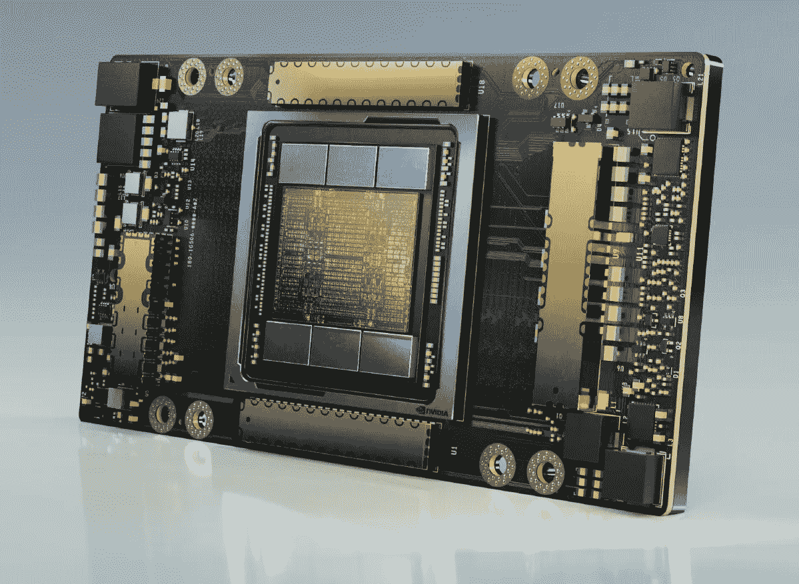
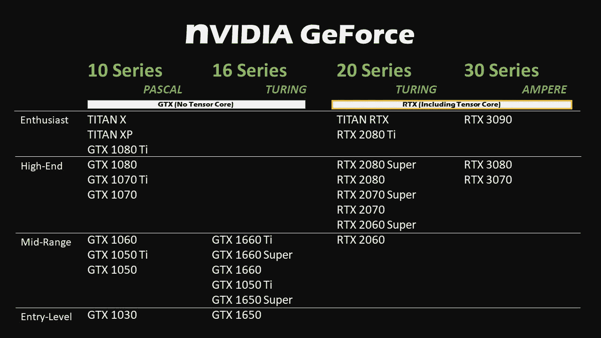
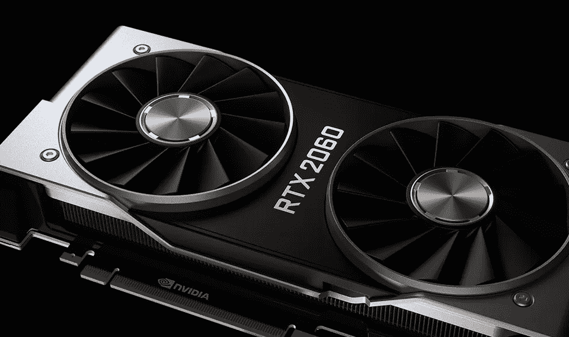
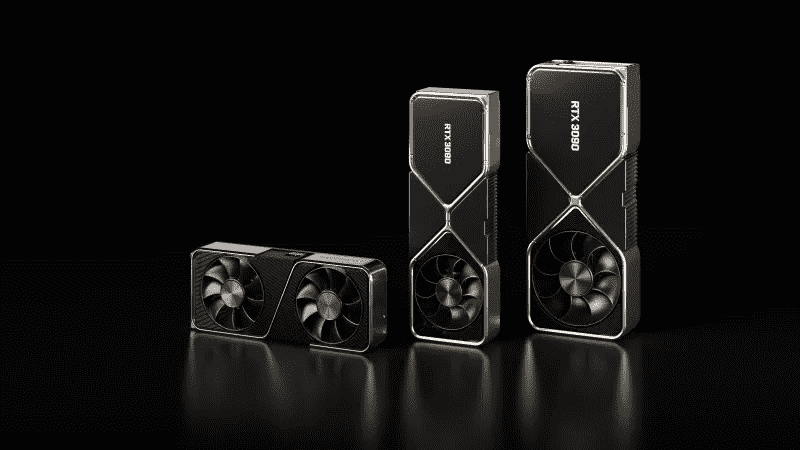
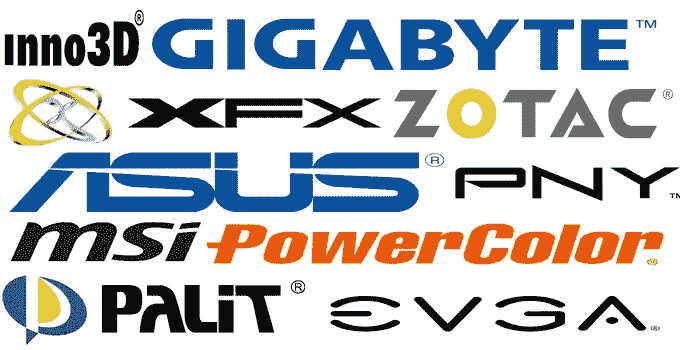
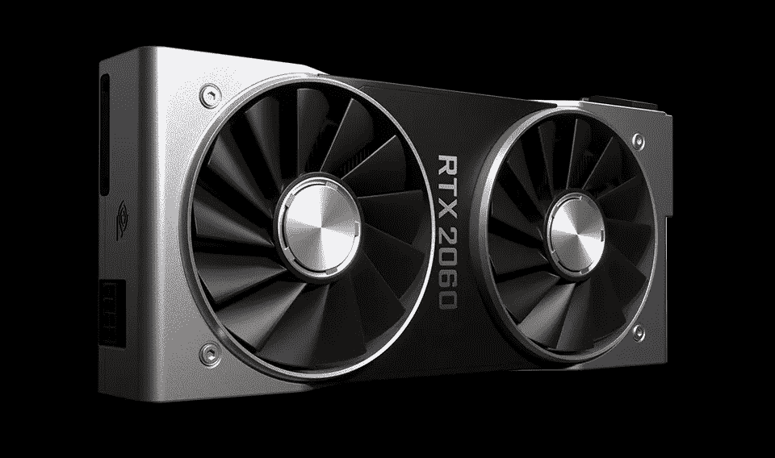

# 面向数据科学家的经济实惠的 GPU

> 原文：<https://medium.datadriveninvestor.com/an-affordable-gpu-for-data-scientists-db376450117?source=collection_archive---------0----------------------->

## 数据科学

## 对于您的下一个数据科学项目，您需要了解市场上价格合理的 GPU。

如果你是一名数据科学家，正在为你的电脑寻找一款价格合理的 GPU，那么这篇文章就是为你准备的。当你的预算紧张时，你必须更加见多识广，才能为你的钱找到最好的选择。如果你没有有限的预算，你仍然可以从这篇文章中学到很多技术方面的东西，并做出更明智的购买。

如果你是一个游戏玩家，你基本上有两种显卡选择:AMD 显卡或 NVIDIA 显卡。但是，既然你是一名数据科学家，也许还是一名游戏玩家，你只有一个选择:NVIDIA。为什么不能挑 AMD？因为您需要 CUDA 作为数据科学电脑的重要组件。你可以把 CUDA 看作是一种计算机编程语言，它允许你和许多其他可用的库(如 amazing Tensorflow 或 PyTorch)在 NVIDIA GPUs 上进行并行计算。CUDA 由英伟达开发，仅在英伟达 GPU 上可用。在 AMD 开发出像 CUDA 一样受欢迎的东西之前，数据科学家们一直粘在 NVIDIA GPUs 上。

现在，下一个问题是，我应该买什么类型的 NVIDIA 显卡？虽然在 AMD 和 NVIDIA 之间做出选择很简单，但是从 NVIDIA 产品线中选择合适的显卡并不是一件容易的事情。在我看来，英伟达用不同的品牌和技术术语来迷惑客户，做得非常好。这部分是因为英伟达为不同的客户群提供了不同的产品线。

我给你一点关于 NVIDIA GPUs 和显卡的必要信息。我相信在读完这篇短文后，你会对自己的需求做出更好的决定。我们走吧…

NVIDIA GPUs 随着时间不断发展，这种发展的主要方面是其架构。英伟达 GPU 架构从最老到最新依次是特斯拉(2006 年发布)、费米(2010 年)、开普勒(2012 年)、麦克斯韦(2014 年)、帕斯卡(2016 年)、沃尔特(2017 年)、图灵(2018 年)、安培(2020 年)。其中一些架构面向数据中心和专业用户，一些架构更面向普通消费者，尤其是游戏玩家。如今，大多数可用的 NVIDIA GPUs 都是基于 Pascal、Volta、Turing 或 Ampere 的。

NVIDIA GPU 架构中一项引起数据科学家和人工智能(AI)专家关注的重要创新是张量核心的引入。通俗地说，张量核加快矩阵乘法和加法的速度。作为一名数据科学家，你知道矩阵乘法和加法在深度学习等 AI 技术中的重要性。因此，为了让你的钱发挥最大作用，我强烈建议选择基于 Volta、Turing 和 Ampere 架构的 GPU。值得一提的是，并不是每个基于这些架构的显卡都有张量核(你稍后会看到一个例子)。有张量核的图形卡通常用 RTX 表示。没有张量核的图形卡通常(不总是)用 GTX 表示。

Tesla (released in 2006), Fermi (2010), Kepler (2012), Maxwell (2014), Pascal (2016), Volta (2017), Turing (2018), and Ampere (2020) are NVIDIA GPUs architectures

除了架构，NVIDIA 显卡针对不同的客户目标有不同的品牌或产品线。对我们来说最重要的三个是 GeForce、Quadro 和 Titan。虽然 NVIDIA 推荐 Quadro 和 Titan 用于 AI 和深度学习项目，但它们的价格标签(2500 美元及以上)让个人或业余数据科学家负担不起。另一方面，我们有针对游戏玩家的 GeForce 品牌，价格更实惠，仍然使用相同的先进架构技术，如图灵或安培。因此，我建议选择 GeForce 显卡，而不是花太多钱买像 Quadro 品牌卡这样昂贵的卡。

GeForce 卡有不同的系列。最著名的有 GeForce 10 系列，GeForce 16 系列，GeForce 20 系列，以及新的 GeForce 30 系列。GeForce 10 系列是基于 Pascal 的卡。如前所述，基于 Pascal 的 GPU 没有张量核心技术，因此这些显卡通常被称为类似 GeForce GTX *的型号(例如 GeForce GTX 1060)* 。有时你可能会在这个系列的显卡名称前看到“Ti”或“Super ”,这只是对非 Ti 或非 Super 版本的一个小小的改进。我们还有 GeForce 16 系列。这一系列的显卡是用基于图灵的 GPU 构建的，但不包括张量和 RT(光线跟踪)内核。因此，和第十季一样，他们的名字中也有 GTX。这种卡的一个例子是 GeForce GTX 1650。虽然 GeForce 10 和 16 系列没有张量核，但对于那些想学习深度学习和并行计算的人来说，仍然是很好的选择。张量核的缺乏减缓了包括 DL 算法在内的许多机器学习方法的训练和推理，但仍然拥有 NVIDIA GPUs 在仅运行在 CPU 上时具有显著的优势。10、16 系列 160 元起，想学的话推荐。

NVIDIA GeForce GPUs. The table compares 10, 16, 20, and 30 Series. For deep learning and parallel computing, I recommend RTX graphics cards(20 and 30 Series).

如果您正在考虑一种更强大的显卡，它不仅可以帮助您学习并行计算和深度学习，还可以运行更繁重的 DL 项目，您应该考虑 GeForce 20 系列。GeForce 20 系列是基于图灵的显卡，具有张量内核。正如你猜对的，这些卡片的名字里有 RTX。例如，你可以花 330 美元买一个 GeForce RTX 2060 显卡，它有 240 个张量核心。这是一个图形卡，我推荐给想要一个负担得起但仍然强大的 GPU 系统的个人数据科学家。

NVIDIA RTX 2060 Founders Edition.

最后，我们新发布的 GeForce 30 系列卡(包括 3070、3080 和 3090)是基于安培的卡。2020 年 9 月发布了基于安培的 GPU 的显卡。基于安培的卡享受第三代张量核心。虽然它们的价格从 499 美元(最新技术的好价格)开始，但它们需要在其他 PC 组件如 CPU 和 PSU(电源单元)上进行大量投资。换句话说，如果你想购买这样一款高端显卡，很可能你买得起的 PC 在其他地方有一个处理瓶颈，你无法使用你显卡的最大功率。因此，如果你决定建立一个负担得起的 PC 或用新的显卡升级 PC，最好避免 GeForce Series 30 等昂贵和高端的显卡，除非你想升级一切，建立一个昂贵但功能强大的 PC。

NVIDIA RTX 3070, 3080, and 3090 (from left to right) Founders Edition.

除了架构、品牌和型号，您可能会在不同制造商制造的不同显卡上找到 NVIDIA GPUs。NVIDIA 生产自己的显卡，他们称之为创始人版。此外，GIGABYTE、EVGA、ASUS 和 MSI 是使用 NVIDIA GPUs 构建显卡的第三方制造商的几个例子。在性能方面，通常情况下，不同厂商如果使用相同的 NVIDIA GPUs，我们看不出太大的区别。

Top NVIDIA Graphics Card Manufacturers ([Source](https://graphicscardhub.com/graphics-card-manufacturers-brands/))

综上所述，如果你正在寻找一个负担得起的，但功能强大的显卡，我建议 RTX 2060。它的起价为 330 美元，拥有用于加速深度学习项目的张量核心。

My recommendation for an affordable GPU is GeForce RTX 2060.