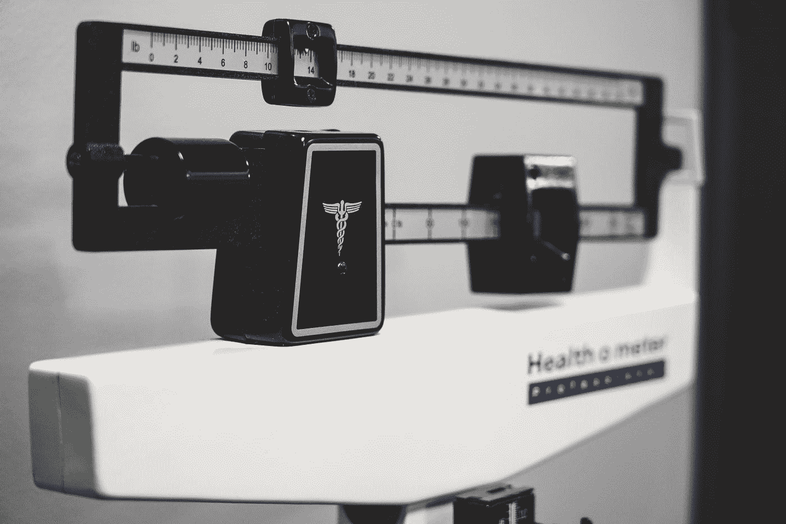
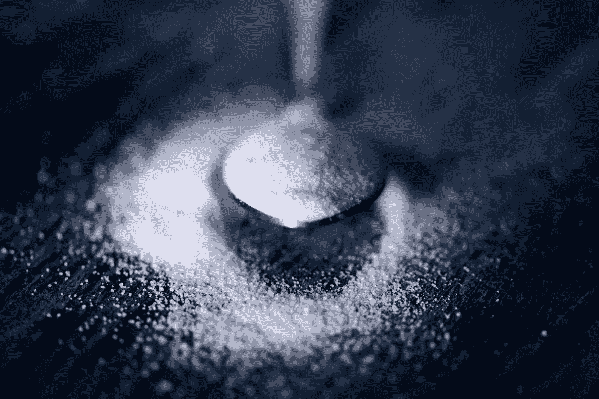

# 一个负担得起的医疗保健的想法，会让你点燃

> 原文：<https://medium.datadriveninvestor.com/an-affordable-healthcare-idea-that-will-make-you-light-up-8938ac741132?source=collection_archive---------21----------------------->

Photo by [Samuel Ramos](https://unsplash.com/@idgeek?utm_source=medium&utm_medium=referral) on [Unsplash](https://unsplash.com?utm_source=medium&utm_medium=referral)

## 有争议但有效的方法来改变我们的饮食

我要说两件事，很多人，至少 7000 万人，不想听，可能会有理由想和我争论:美国可以通过增税来负担医疗保险。没错，负担得起的医疗保健…以下是方法:

美国的医疗保健危机大多是由一件事引起的:肥胖。在 Medium 中搜索肥胖，你会发现几十个，也许几百个故事——许多是由医生提交的，大部分信息非常丰富——关于各种原因、治疗和结果。其中一致的观点是，肥胖是许多其他疾病的“先存状态”，许多疾病是严重的和晚期的。肥胖显然与糖尿病和癌症有关，但也对身体和心理有许多其他影响。甚至社会效应，如网上的“肥胖羞辱”，也导致了抑郁症甚至自杀的增加。

导致肥胖的因素有很多。我不会试图去解释它们，因为它们在下面已经被医学博士 Rami Bailony 很好的描述了，但是首先读一下我的想法…

 [## 肥胖不仅仅是饮食和锻炼的问题

### 一位肥胖专家揭示了四个被忽视的因素

elemental.medium.com](https://elemental.medium.com/the-diet-delusion-the-many-ways-in-which-were-underestimating-obesity-1190a0771c35) 

显然，肥胖会导致身体、心理和社会疾病——这些疾病会导致住院、手术和医疗程序、药物治疗、心理治疗和社会支持活动——所有这些都代价高昂。然而，美国许多最贫穷的人也是肥胖率最高的人群。

> 如果糖在今天被发现，它将是一种被禁止或被控制的物质，因为它会使人上瘾并产生不良影响

虽然承认这个问题的复杂性，但这个问题有一个压倒性的促成因素:糖。如果糖在今天被发现，它将是一种被禁止或被控制的物质。在我们的食物供应中是不允许的。无论是天然来源的、加工过的天然糖，还是精制的加工糖，几乎所有可以买到的加工食品中都含有某种形式的甜味剂。为什么？天然糖，比如水果中的果糖，奶制品中的乳糖都还不错。那么，为什么再制奶酪需要 8g 的*添加的*糖呢？社会已经沉迷其中，期待一切事物甜度的增加。然而，有如此多的香料和调味料可以用来影响食物的味道——其中大多数对我们健康的影响远不如糖。你不需要那一勺糖来帮助药物消化。你甚至可能不需要药物。

所以这里有个想法:**对糖征税。对糖课以重税。这项税收将会影响到所有含糖的加工食品。然后**用税收收入资助医疗系统**。我知道…很疯狂。想想看，许多食用高糖加工食品的人正是那些肥胖率较高的人，也是那些最终需要更多医疗保健的人。对于那些反对任何社会化医疗保健概念的人来说，这是一种“用户付费”的形式……可能要提前很多年支付。**

想减少糖的摄入量(以及未来的税收)？你可以开始减少咖啡或茶中的糖分。简单却有效。在这篇由[亨里克·a·科瓦尔茨克](https://medium.com/u/71590b19aebe?source=post_page-----8938ac741132--------------------------------)撰写的文章中，有一些可怕的含糖加工食品和含糖饮食的绝佳替代品的例子

 [## 吃饭是为了活着，而不是活着为了吃饭|数据驱动的投资者

### 对于很多在社交上认识我的人来说，我是一个贪吃的人。在派对上，我是挑大牛排的人，双份…

www.datadriveninvestor.com](https://www.datadriveninvestor.com/2020/09/09/eat-to-live-not-live-to-eat/#) 

无论如何，对糖征税都不是答案。但是它做了两件事:(1)它抑制了人们购买便宜的含糖食品，并可能导致食品工业减少糖在食品中的使用，以提高价格竞争力。(2)它为保健系统提供了重要的收入来源，该保健系统已经被高糖摄入引起的肥胖的第一、第二和第三级效应所超负荷。

负担得起的医疗保健和更健康的食物选择。很难否认。