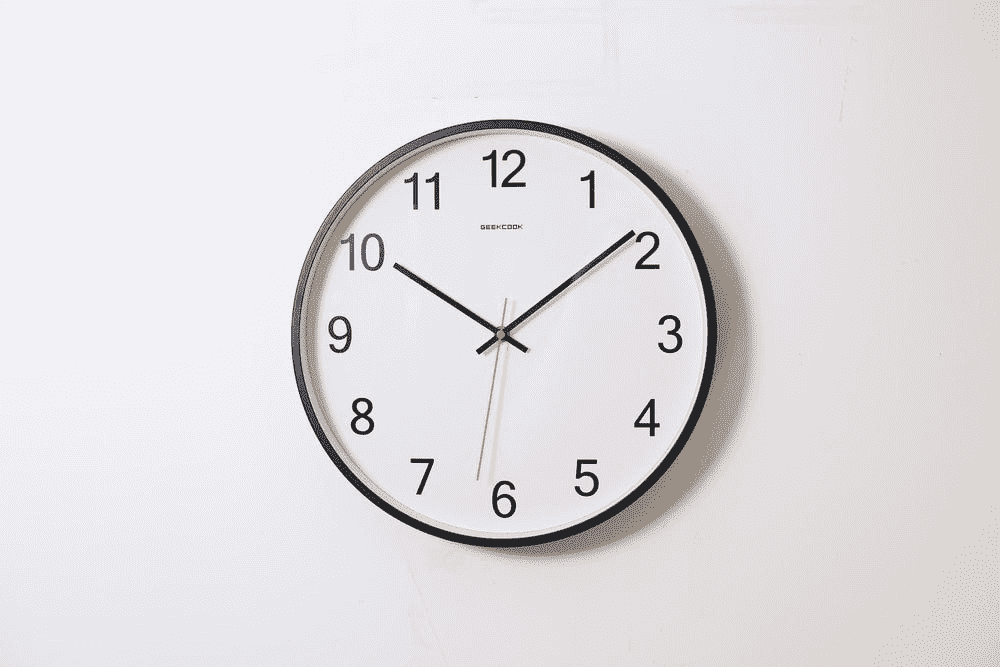

# 业余投资者对把握市场时机的尝试

> 原文：<https://medium.datadriveninvestor.com/an-amateur-investors-attempt-at-timing-the-market-f6e2a25a6c2d?source=collection_archive---------10----------------------->

Photo From Unsplashed by @oceanng

市场中的时间胜过市场时机。不要试图把握市场时机。那匹马被打死了。这句话在各种投资论坛和博客上被重复。即使是最业余的投资者也知道这一点。

但是……低成本指数基金并不性感。除非我用自己定制的投资组合跑赢市场，否则我不会有那种优越感。我想要那种“赚快钱”的肾上腺素——你猜对了——我试图把握市场时机。事情是这样的。

# 疫情

现在是 2020 年 3 月 17 日。S&P500 已经下跌了 30%。加州刚刚被封锁了。新冠肺炎病例开始呈指数增长。散布恐惧的新闻文章在媒体上流传。底线是事情看起来不太妙。

然而……市场开始复苏。当坏消息不断传来时，我对市场如何实现历史性反弹感到困惑。创纪录的失业率即将公布。甚至我在服务行业之外的朋友都被解雇了。世界基本上被搁置了。在我看来，股票不可能继续上涨。我确信市场将会暴跌。

就在这个时候，我做了只有最有经验的投资者才会做的事情。我向 reddit 的智囊团寻求证实。

 [## 投资区块链前要问的三个简单问题(也是一个困难的问题)|数据…

### 现在是了解区块链的最佳时机。不同货币之间的增长率，比如…

www.datadriveninvestor.com](https://www.datadriveninvestor.com/2020/03/12/three-simple-questions-and-one-difficult-one-to-ask-before-investing-in-a-blockchain/) 

# 业余投资者容易受影响

诚然，我不知道我在做什么。所以，我会把最高票数的 reddit 帖子作为真理之声。reddit 的一个共同主题是，用户会涌向最有信心的帖子和评论，并否决任何其他有冲突信息的帖子和评论，这几乎形成了一种蜂群思维。投资分支也不例外。

我当时看的帖子写得如此自信，以至于我忘记了大多数 redditors 也是新手投资者。你瞧，所有投资子领域的叙述似乎都是一样的。“这是一个泵和转储。”“我们还没有触底”。“波动在熊市中很常见”。“刺激计划是不够的”。“这是经典的修正模式，它将回落”。“是时候在 SQQQ 上加载了”。

# 我不知道我在做什么

在我看来，reddit 的大师们已经说话了。我得到了我想要的认可，所以现在唯一合乎逻辑的事情就是向 SQQQ 和 SOXS 砸钱。对于那些不知道的人来说，SQQQ 和 SOXS 是三倍杠杆反向基金。SQQQ 反向追踪纳斯达克 100 指数基金。这意味着，如果纳斯达克 100 指数下跌 10%，SQQQ 将上涨 30%，反之亦然。

SOXS 逆向追踪…与半导体有关的东西。真正显示了我在投资辛苦赚来的钱之前投入了多少研究…

无论如何，这些杠杆基金不是好的长期投资，因为市场通常会长期上涨。此外，由于所谓的衰退，这些基金随着时间的推移会失去价值。

换句话说，购买这类基金的人实际上是在押注市场将在未来几周下跌。在过去的几周里，那个人就是我。哪里出了问题？

# 事情出了差错

事实证明，我的傻瓜计划并不那么傻。我以平均每股 26 美元的价格买入这些基金，令人惊讶的是，市场对我并不适用。

自市场触底以来，S&P500 上涨了约 28%，结果，我的杠杆反向基金在过去几周内损失了一吨。当基金贬值时，我甚至尝试平均成本，这感觉就像把钱扔进火里。

我决定在 2020 年 4 月 7 日减少损失，并以每股 14 美元左右的价格卖掉我在这些基金中的头寸，这几乎是我在 2020 年买入时的一半。

# 经验教训

从本质上的赌博中输掉几千美元是很痛苦的。但是，我要把它作为一个非常昂贵的教训。

还记得我之前说的那匹死马吗？让我们打败它。市场中的时间胜过选择市场时机——尤其是对于像我这样的新手投资者。

与其把钱投入短期投资，我还不如把钱投入长期投资。因此，我重新投资于指数基金和个股，因为我知道它们会挺过这场危机。我现在最大的持股是 VOO 和 DIS。

谁知道呢，reddit 权威人士最终可能是对的，市场明天确实会暴跌。或者，随着市场继续全面复苏，他们可能是错的。没有人真正知道。我只知道，凭我浅薄的投资知识，我应该继续长期投资。如果我想短期投资，我还不如去赌场。