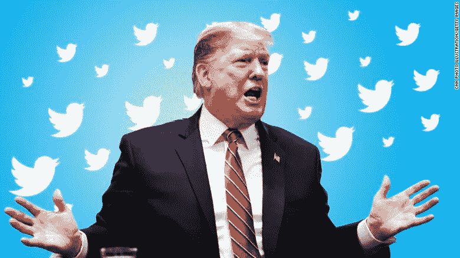
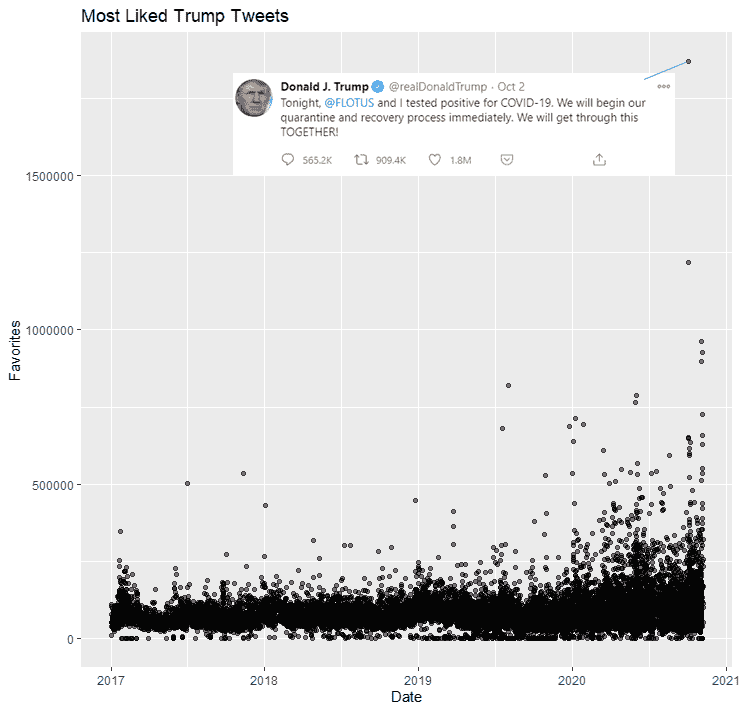
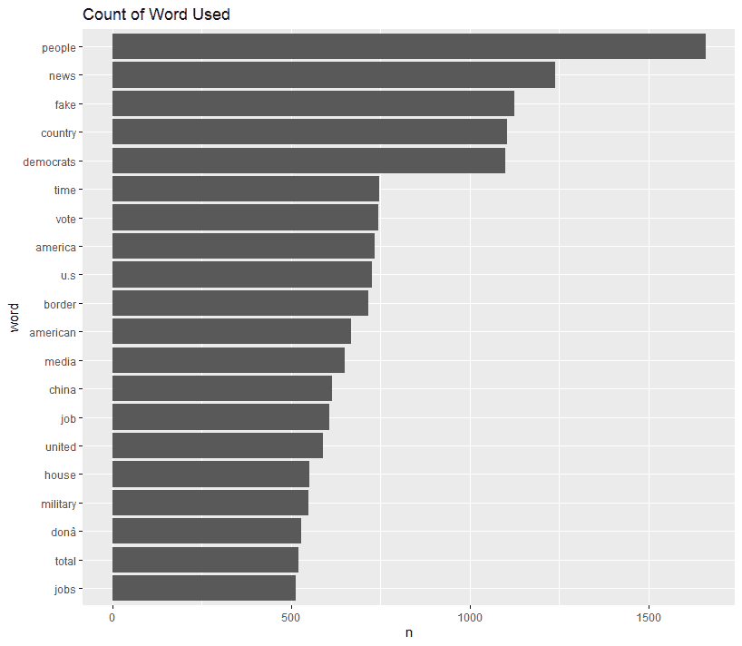
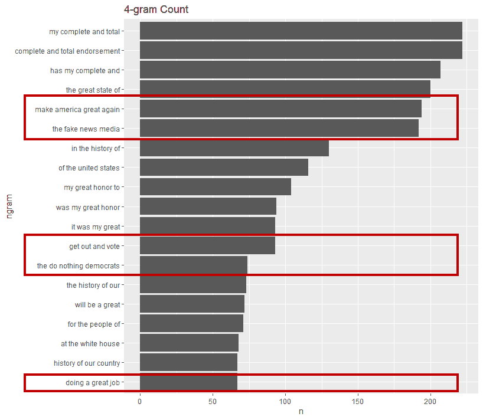
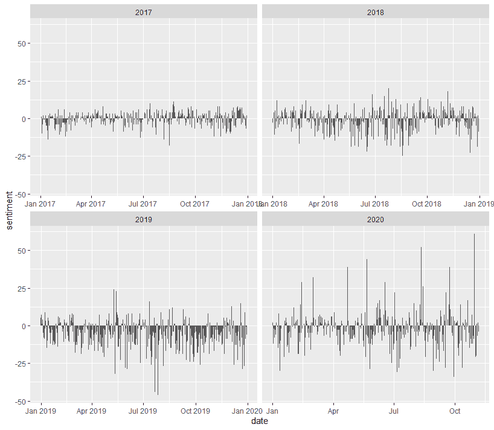
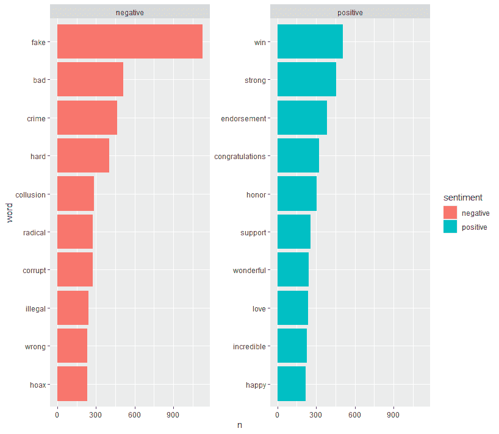
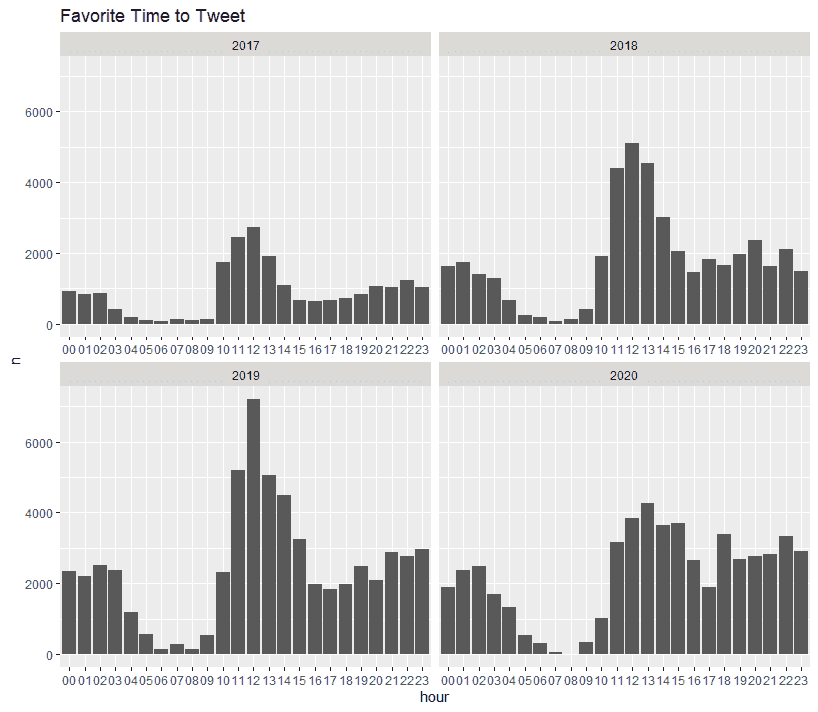
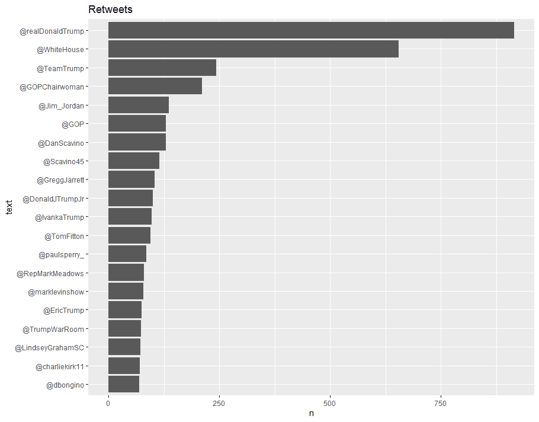

# 唐纳德·特朗普的推特分析

> 原文：<https://medium.datadriveninvestor.com/an-analysis-of-donald-trumps-tweets-46bb85e89022?source=collection_archive---------20----------------------->

Source: CNN

# 背景

随着乔·拜登即将被确认为美国当选总统，我们将看到唐纳德·特朗普总统任期内混乱的四年的结束。我们已经看到了特朗普的许多事情，但也许他将被记住的是他在推特上的统治。

在特朗普担任美国总统期间，推特是他向世界传达自己想法的方式。无论是哪一天或哪一个小时，特朗普的全大写推文都在意料之中。他对 Twitter 的大量使用给了我一个巨大的数据集，用于使用自然语言处理进行分析。当我们最终放下特朗普总统任期的帷幕时，我们应该看看他的推文在这四年里是怎样的，这将是我们有这样一位总统的很长一段时间(希望如此)。

# 最受欢迎的推文趋势

在我们深入研究特朗普的推文之前，我们先来看看他一年来最受欢迎的推文的趋势。显然，随着任期的推移，他收到了更多追随者的喜爱，特别是在 2020 年。然而，也许很能说明问题的是，他在这段时间内最受欢迎的推文是宣布他和 Melanie Trump 一起被新冠肺炎检测呈阳性的推文。嗯……这对总统来说是一个伟大的壮举。

# 最喜欢用的词

对于一个总统来说，他用得最多的词是“人民”，这并不奇怪，因为毕竟他是为这个国家的人民服务的。但是，往下走，可以明显看出川普的执念。“新闻”、“假新闻”、“民主人士”、“媒体”、“中国”和“军事”都是他最常用的 20 个词的一部分。不难发现特朗普总统任期的主题吧？

# 特朗普最喜欢的短语

为了更深入地了解他最喜欢的话，我整理了他最常用的四个词短语，这毕竟是一个因他的口号和标语而受欢迎的人。

再一次，忽略不完整的短语，“让美国再次伟大”是他最喜欢使用的口号，其次是一个由他自己创造并推广的术语，即“假新闻媒体”。其他流行的口号或短语包括“出去投票”和“无所事事的民主党人”(滑稽的我认为)和“做得很好”。这个简单的练习再一次展示了特朗普总统任期的主题。

# 战胜积极和消极

我现在使用语言处理技术来获取特朗普担任总统 4 年期间的情感脉搏，使用 Bing 词典，该词典以二元方式将单词分为积极和消极两类。

我们可以看到，随着时间的推移，特朗普变得更加两极化，他在 2019 年和 2020 年发推文的情绪摇摆到极端，在积极和消极之间疯狂摇摆。有趣的是，如果我们看看他在 2020 年 3 月的推文中的观点，新冠肺炎病例在美国开始加速，他的推文仍然保持着压倒性的积极。

# 有助于特朗普消极和积极的话

我们更进一步，分析了影响他情绪的前 10 个词。他最喜欢的词再次出现，包括“假的”、“激进的”、“腐败的”，当然，促成他积极情绪的词是“赢”，这是他在最近的选举中宣称自己的。

# 其他有趣的花絮

# 一个不睡觉的总统

他最喜欢在下午或工作时间发微博，这四年来一直如此。大量的推文也是在凌晨发出的。

# 在他自己的区域内

特朗普转推，很多。他转发最多的是谁？当然是他自己。然后是他的办公室。然后他的特朗普官方竞选。总统在他的推特账户上创建了一个 A 级回音室，这真的让他自己感到惊讶吗？在他的前 20 个被转发最多的账户中，除了已经提到的，还有他的儿子小唐纳德·特朗普和埃里克·特朗普以及他的女儿伊万卡·特朗普。惊喜惊喜。

# 特朗普的推文及其对金融市场的影响

特朗普的推特风暴一直被认为是市场波动的原因。众所周知，交易员会在他们的交易系统中保留一个位置来监控特朗普的推特账户。我现在试图找出他对金融市场影响最大的推文，即标准普尔 500 和 S&P 500 期货。

# 方法病理学

我首先将特朗普的推文过滤为与市场开盘时间相关的推文，并使用 R 的 Data.table 进行滚动连接，这将把特朗普过滤的推文与其最接近的远期回报进行匹配。

# 对 S&P500 没有实质影响

正如我们所见，特朗普推文的前 5 大运动并不是他推文的结果。正是在 2020 年 3 月的抛售期间，市场以夸张的方式波动。这严重扭曲了结果。

# 但是，对期货市场有些影响

尤其是特朗普在推特上呼吁美联储降低利率，刺激经济。特朗普对期货市场的更大影响可能与他在下班后、午夜(期货市场开放，但 S&P500 不开放)发推特的倾向有关。

# 警告

由于数据集的限制，我无法得到我想要的准确图片。

1.  数据集在 30 分钟内，很难判断市场是否因特朗普而波动，需要背景知识。如果可能的话，一点一点地，数据将会更准确，以观察市场在他的推文发布后立即做出的反应。然而，不幸的是，我无法访问这样的数据集。
2.  一些推文的影响没有被完全捕捉到，特别是如果它稍微低于 30 分钟或小时。市场的反应不会很大，仅仅是因为他们移动的窗口变小了。同样，逐个滴答数据集可能会解决这个问题。
3.  未来的数据只来自 2020 年，因为这是我能得到的唯一信息，因此受到了限制。因此，美中贸易战期间的推文不会反映在未来的市场上。

# 一个时代的终结

不管特朗普相信什么，我们已经结束了一个真正不同的美国总统任期。对总统推特的分析将不再给交易者带来市场优势。随着乔·拜登的当选，传统的政策制定将回归美国，政治将回归其应有的样子，平淡乏味，也许这对世界更好。