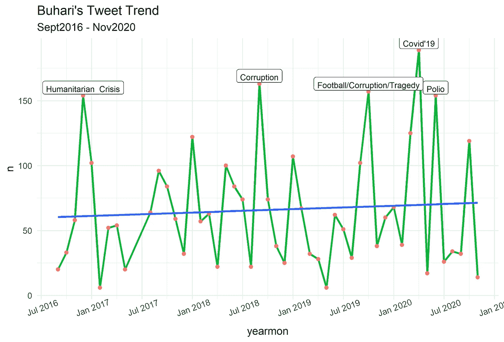

# 对穆罕默杜·布哈里推特的分析

> 原文：<https://medium.datadriveninvestor.com/an-analysis-of-muhammadu-buharis-tweet-36e92c22ef6d?source=collection_archive---------12----------------------->

使用文本挖掘技术分析模式


穆罕默杜·布哈里自 2015 年以来一直是尼日利亚总统。围绕非洲最大国家尼日利亚的总统有很多争议。尤其是自从总统成为国家的总统以来，有很多令人困惑的问题。特别是在推特上，你会发现很多 tweeps 在总统的推特上发垃圾评论，比如 IFB 或“我跟着回来”，这是抗议总统作为 GCFR 统治的一种方式。Twitter 用户超过 300 万，人们很想知道总统的推文内容会吸引 tweeps 的评论。

## 分析背景

我决定应用**文本分析**来理解总统推文的关键内容，**情绪分析**来理解情绪，以及一些图表分析来查看总统推文特有的短语。

你可以在这里阅读文本分析和情感分析的区别。

**数据采集**

在布哈里的推特页面上，你会发现他在过去六年(2014 年至 2020 年)里发了大约 4952 条推文。你可以在这里找到数据集。


数据收集和分析都是在 R 中使用 **rtweet 包**完成的，该包允许您使用 Twitter 的开发者 API 从 Twitter 收集数据。然而，免费 API 从用户账户收集 tweets 有一个限制，因为你只能从单个用户的时间表中收集大约 3200 条。我使用下面的代码收集了 3224 条推文，时间跨度为**“2016–09–12 10:10:32”&“2020–11–13 15:32:25”**；

```
library(rtweet)
library(tidyverse)#Get as many tweets as possible
df <- get_timeline("MBuhari", n = 3200)#Write to csv
df %>% 
  write_as_csv("buhari.csv") 
```

查询的结果大约有 3224 行，90 列。

**数据探索**

让我们来看看这些年来总统们发推特的趋势；

```
#Lets take a look at his tweet trend over the years
 df %>% 
  separate(created_at, into = c("date", "time"), sep = " ") %>%
  mutate(date = ymd(date)) %>% 
  mutate(year = year(date)) %>% 
  mutate(yearmon =  format(as.Date(date), "%Y-%m")) %>% 
  mutate(yearmon = as.yearmon(yearmon)) %>% 
  group_by(yearmon) %>% 
  count() %>% 
  ggplot(., aes(yearmon, n, group = 1)) +
  geom_line(size = 1, color = "#00ba38") +
  geom_point(color = "#f8766d") +
  geom_smooth(method = "lm", se = F) +
  annotate(geom = "label", vjust = -0.1, 
           label="Humanitarian \ Crisis",x = as.yearmon("Dec 2016"), 
           y= 154, color = "black", size =3) +
  annotate(geom = "label", vjust = -0.1, 
           label="Covid'19",x = as.yearmon("Apr 2020"), 
           y= 189, color = "black", size =3) +
  annotate(geom = "label", vjust = -0.1, 
           label="Corruption",x = as.yearmon("Sep 2018"), 
           y= 163, color = "black", size =3)  +
  annotate(geom = "label", vjust = -0.1, 
           label="Football/Corruption/Tragedy",x = as.yearmon("Oct 2019"), 
           y= 157, color = "black", size =3) +
  annotate(geom = "label", vjust = -0.1, 
           label="Polio",x = as.yearmon("Jun 2020"), 
           y= 154, color = "black", size =3) +
  theme_minimal()  +
  theme(axis.text.x = element_text(angle = 20)) +
  scale_x_yearmon(format = "%b %Y", n = 10) +
  labs(title = "Buhari's Tweet Trend",
       subtitle = "Sept2016 - Nov2020")
```



这一高峰期很可能与该国的起义或庆祝活动相关联。2020 年出现多个峰值的一些主要原因可能是新冠肺炎疫情爆发、非典结束后的抗议以及该国的其他紧迫问题。

我们进一步对推文进行文本分析，并查看他的推文中使用的热门词汇。

```
df %>% 
  separate(created_at, into = c("date", "time"), sep = " ") %>% 
  mutate(text = tolower(text)) %>% 
  mutate(text = gsub("brt", "", text)) %>% 
  mutate(text = gsub("t.co", "", text)) %>% 
  mutate(text = gsub("https", "", text)) %>% 
  mutate(text = gsub("amp", "", text)) %>% 
  mutate(text = gsub("â", "", text)) %>% 
  unnest_tokens(word, text) %>% 
  anti_join(stop_words) %>% 
  count(word, sort = T) %>% 
  arrange(desc(n)) %>% 
  top_n(20) %>% 
  ggplot(., aes(reorder(word, n), n)) +
  geom_bar(stat = "identity") +
  coord_flip() +
  labs(title =  "Top 20 most used words", x = "Words")
```


我们做了进一步的分类，看看哪些词在每年的推文中占主导地位。

```
#Most used words for each year
df %>% 
  separate(created_at, into = c("date", "time"), sep = " ") %>% 
  mutate(date = ymd(date)) %>% 
  mutate(year = year(date)) %>% 
  mutate(text = tolower(text)) %>% 
  mutate(text = gsub("brt", "", text)) %>% 
  mutate(text = gsub("t.co", "", text)) %>% 
  mutate(text = gsub("https", "", text)) %>% 
  mutate(text = gsub("amp", "", text)) %>% 
  mutate(text = gsub("â", "", text)) %>% 
  unnest_tokens(word, text) %>% 
  anti_join(stop_words) %>% 
  group_by(year) %>% 
  count(word, sort = T) %>% 
  arrange(desc(n)) %>% 
  mutate(word = reorder(word, n)) %>% 
  slice(1:10) %>% 
  ungroup() %>% 
  ggplot(., aes(reorder_within (word, n, year), n, fill = as.character(year))) +
  geom_col(show.legend = F) +
  coord_flip() +
  facet_wrap(~year, ncol =  2, scales = "free") +
  xlab("Words") +
  ggtitle("Top 10 Words", subtitle = "2016-2020") +
  theme_dark() +
  theme(plot.title = element_text(hjust = 0.5, face = "bold"),
        plot.subtitle = element_text(hjust = 0.5))
```


二元模型分析还可以揭示句柄使用的常用短语。这个词在不同年份的用法似乎有一个一致的模式，可能是同一个处理者(如果有的话)。

```
#Bigram Analysis 
df %>% 
  as.data.frame() %>% 
  mutate(text = unlist(text)) %>% 
  mutate(text = gsub("brt", "", text)) %>% 
  mutate(text = gsub("t.co", "", text)) %>% 
  mutate(text = gsub("https", "", text)) %>% 
  tidytext::unnest_tokens(bigram, text, token = "ngrams", n = 2, collapse = F) %>% 
  separate(created_at, into = c("date", "time"), sep = " ") %>% 
  mutate(date = ymd(date)) %>% 
  mutate(year = year(date)) %>% 
  group_by(year) %>% 
  count(bigram, sort = TRUE) %>% 
  ungroup() %>% 
  separate(bigram, c("word1", "word2"), sep = " ") %>% 
  filter(!word1 %in% stop_words$word) %>%
  filter(!word2 %in% stop_words$word) %>% 
  group_by(year) %>% 
  count(word1, word2, sort = TRUE) %>% 
  drop_na() %>% 
  ungroup() %>% 
  unite(bigram, word1, word2, sep = " ") %>% 
  group_by(year) %>% 
  slice(1:10) %>% 
  ungroup() %>% 
  mutate(bigram = reorder_within(bigram, n, year)) %>% 
  ggplot(., aes(bigram, n, fill =as.character(year))) +
  geom_col(show.legend = F) +
  facet_wrap(~year, ncol = 2, scales = "free") +
  coord_flip() +
  xlab("Bigrams") +
  ggtitle("Top 10 Bigrams", subtitle = "2016-2020") +
  theme_dark() +
  theme(plot.title = element_text(hjust = 0.5, face = "bold"),
        plot.subtitle = element_text(hjust = 0.5))
```


每小时统计一次每一年的 tweets 揭示了一个有趣的事实。你应该预料到总统会在当天晚些时候发推特。通常在下午 3 点到 7 点之间。

```
#Hourly tweet Trend
df %>% 
  separate(created_at, into = c("date", "time"), sep = " ") %>% 
  mutate(time = hms(time)) %>% 
  mutate(hour = lubridate::hour(time)) %>% 
  mutate(date = ymd(date)) %>% 
  mutate(year = year(date)) %>% 
  group_by(hour, year) %>%
  count() %>% 
  ggplot(., aes(factor(hour), n, fill = as.character(year))) +
  geom_col(show.legend = F) +
  facet_wrap(~year, ncol = 2, scales = "free") +
  ggtitle("Tweets Count by Hour of Day") +
  xlab("Hour")
```


## 情感分析

情绪分析可以帮助我们检测每条推文传达的情绪类型，以及使用的每个词是积极还是消极。

首先，我将尝试检查正面或负面使用的热门词汇。

```
#Sentiments 
df %>% 
  mutate(text = gsub("brt", "", text)) %>% 
  mutate(text = gsub("t.co", "", text)) %>% 
  mutate(text = gsub("https", "", text)) %>% 
  unnest_tokens(word, text) %>% 
  anti_join(stop_words) %>% 
  inner_join(get_sentiments("bing")) %>%
  count(word, sentiment, sort = TRUE) %>%
  group_by(sentiment) %>% 
  top_n(10) %>% 
  ggplot(., aes(reorder(word, n), n, fill = sentiment)) +
  geom_col(show.legend = F) +
  facet_wrap(~sentiment, ncol = 2, scales = "free") +
  coord_flip() +
  labs(x =  "Words")
```


一个更有趣的方法是观察积极(或消极)的模式。我将制定总体目标(2016 年至 2020 年)以及每年的目标。

```
#Yearly trend of sentiments
dataInput <- df
data_format <- dataInput %>% 
  mutate(text = iconv(text, from = "latin1", to = "ASCII")) %>% 
  mutate(text = tolower(text)) %>% 
  mutate(row_id = row_number()) %>% 
  mutate(text = tolower(text)) %>% 
  mutate(text = gsub("brt", "", text)) %>% 
  unnest_tokens(word, text) %>% 
  anti_join(stop_words) %>% 
  inner_join(get_sentiments("bing")) %>% 
  count(sentiment, row_id, screen_name) %>% 
  spread(sentiment, n, fill = 0) %>%  # made data wide rather than narrow
  mutate(sentiment = positive - negative)All_banks <- dataInput %>%
  mutate(row_id = row_number())data_format <- data_format %>% 
  left_join(All_banks, by = "row_id")#convert negative column to negative values
data_format2<- data_format %>% 
  mutate(negative = negative * (-1))data_format2 %>% 
  separate(created_at, into = c("date", "time"), sep = " ") %>%
  mutate(date = ymd(date)) %>% 
  mutate(year = year(date)) %>% 
  mutate(yearmon =  format(as.Date(date), "%Y-%m")) %>% 
  mutate(yearmon = as.yearmon(yearmon)) %>% 
  group_by(yearmon) %>% 
  summarise(negative = sum(negative), positive = sum(positive)) %>% 
  gather(key = "sentiment", value = "n", 2:3) %>% 
  ggplot(., aes(yearmon, n, group = sentiment, color = sentiment)) +
  geom_line(size = 0.8) +
  labs(title = "Sentiment Trend", x = "YearMonth", subtitle = "2016-2020") +
  theme_minimal() +
  scale_x_yearmon(format = "%b %Y", n = 10) +
  theme(axis.text.x = element_text(angle = 30))
```


最后，我们可以包含一个二元图来显示单词之间的联系。

```
#Bigram analysis
a <- df %>% 
  as.data.frame() %>% 
  mutate(text = unlist(text)) %>% 
  mutate(text = gsub("brt", "", text)) %>% 
  mutate(text = gsub("t.co", "", text)) %>% 
  mutate(text = gsub("https", "", text)) %>% 
  tidytext::unnest_tokens(bigram, text, token = "ngrams", n = 2, collapse = F) %>% 
  separate(created_at, into = c("date", "time"), sep = " ") %>% 
  mutate(date = ymd(date)) %>% 
  mutate(year = year(date)) %>% 
  group_by(year) %>% 
  count(bigram, sort = TRUE) %>% 
  ungroup() %>% 
  separate(bigram, c("word1", "word2"), sep = " ") %>% 
  filter(!word1 %in% stop_words$word) %>%
  filter(!word2 %in% stop_words$word) %>% 
  group_by(year) %>% 
  count(word1, word2, sort = TRUE) %>% 
  ungroup() %>% 
  drop_na() %>% 
  arrange(desc(n)) %>% 
  unite(bigram, word1, word2, sep = " ") %>% 
  group_by(bigram) %>% 
  count(sort = T) %>% 
  ungroup() %>% 
  top_n(40) %>% 
  graph_from_data_frame() %>% 
  ggraph(., layout = "fr") +
  geom_edge_link() +
  geom_node_point(color = "lightblue", size = 3) +
  geom_node_text(aes(label = name), vjust = 0.6, hjust = 0.2) +
  theme_void()a
```


## 结论

虽然我不会从这些推文中做出太多的推断或结论(我会把这些留给研究人员……哈哈),但有一些显而易见的事情。它包括这个账户的处理者一直在使用某些词语，而且似乎总统并没有亲自发出那些推文(如果你检查第三人称词语用法的话)。