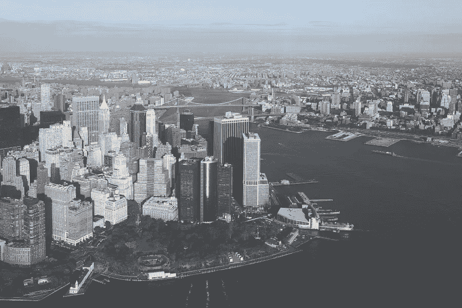

# 软银愿景基金押注印尼新资本分析。

> 原文：<https://medium.datadriveninvestor.com/an-analysis-on-softbank-visions-fund-bet-to-indonesia-s-new-capital-c6d18c2dc6e4?source=collection_archive---------8----------------------->

Photo by [Jon Flobrant](https://unsplash.com/@jonflobrant?utm_source=unsplash&utm_medium=referral&utm_content=creditCopyText) on [Unsplash](https://unsplash.com/s/photos/city-aerial?utm_source=unsplash&utm_medium=referral&utm_content=creditCopyText)

## 智能大都市

2020 年 1 月初，软银的孙正义访问雅加达，与佐科·维多多总统进行了私人会晤。这是关于孙正义投资美国新首都计划的后续会议。他提出了“智能资本”的愿景，为当前的丛林城市带来大量人工智能。此前，软银只对电动汽车感兴趣，此前它投资了打车初创公司 Grab 和电子商务初创公司 Tokopedia。

据海事与投资统筹部长卢胡图·潘查伊坦称，此次富有成果的会议获得了软银的软承诺，软银将在之前承诺的 20 亿美元的基础上再向 T2 投资 30 亿美元。除了软银，阿布扎比王储穆罕默德·本·扎耶德·阿勒纳哈扬也签署了一份谅解备忘录，向该项目投资[228.9 亿美元](https://www.cnbcindonesia.com/news/20200114094004-4-129770/dari-abu-dhabi-jokowi-bawa-pulang-oleh-oleh-proyek-rp-315-t)，并讨论了与软银和该共和国建立主权财富基金的可能性。

这个新的资本项目预计耗资约 340 亿美元，占地 256，000 公顷，容纳 700 万人口。当局将于 2024 年开始搬迁。

> 佐科维在周一的一份声明中说:“我们不希望只是建立一个小规模的行政首都，而是希望建立一个智能大都市，因为巴黎的人口将是巴黎人口的三倍，华盛顿 DC 人口的 10 倍，甚至将等于纽约和伦敦的人口。”。在 Rieka Rahadiana 的协助下

## 软银的愿景基金

愿景基金是一只 1000 亿美元的基金，于 2017 年 5 月注册成立。客观地说，愿景基金的庞大规模可以用来建立三个新的资本。据路透社报道，它已经投资了各种后期创业公司，如:

*   *超过 130 亿美元的美国办公共享初创公司 WeWork 母公司 We Company(由软银集团投资)。*
*   *118 亿美元投资中国打车公司滴滴出行。*
*   美国打车公司优步科技公司(Uber)市值 77 亿美元。nT11*)。*
*   *东南亚打车公司攫取 30 亿美元。*
*   韩国电子商务公司 Coupang 的 30 亿美元。

Photo by [Markus Spiske](https://unsplash.com/@markusspiske?utm_source=unsplash&utm_medium=referral&utm_content=creditCopyText) on [Unsplash](https://unsplash.com/s/photos/investor-return?utm_source=unsplash&utm_medium=referral&utm_content=creditCopyText)

从我这个前风险投资家的角度来看，软银对新资本的押注非常非常合理。有三个因素可以让我和孙正义产生共鸣。

**1。财务收益**

作为基金，愿景基金应该为其有限合伙人(LP)创造回报。截至 2019 年 5 月，孙先生透露，该基金有两个波段。前 400 亿美元通过优先股有 7%的固定分配，剩余的 586 亿美元有 45%的净内部收益率。混合基金产生了 29%的净内部收益率。考虑到其 1000 亿美元的规模，这一回报是巨大的。然而，这只是一个纸面上的数字，这个数字下降到普通合伙人(GP)索赔的三分之一之间是很常见的。

对新资本的投资可以提供与现有业绩类似的回报。有了空白的画布和政府的支持，我相信智慧城市的愿景是可以实现的。这项投资与 WeWork 和其他 IPO 类型的交易具有不同的风险水平，可以被视为基金的一种良好的多元化策略。

**2。现有组合的协同作用**

此外，想象一下软银过去的投资产生协同效应的可能性。WeWork 可以开辟更多的办公空间，Grab 可以增加他们的出行次数，arm 可以为智能城市出售数百万个芯片，等等。新资本的回报不会与这一策略成线性关系，而是成比例的，会影响愿景基金的整体倍数。

**3。筹款策略**

最后一个通常被公众忽视的议程是筹款政治问题。作为一名全科医生，孙先生应该准备为以下基金筹集资金。愿景基金 2.0 于 2019 年 7 月公布。目标为 1080 亿美元的 2.0 基金只能在第一次收盘时获得[20 亿美元。据报道，1.0 基金(450 亿美元承诺)的主要支持者沙特公共投资基金(PIF)在收到【2019 年](https://www.techinasia.com/softbank-bags-2b-vision-fund-2-first-close)89 亿美元运营亏损的消息后，暂停了投资后续基金的计划。

> 本·萨勒曼[在 2018 年 5 月](https://www.bloomberg.com/news/articles/2018-10-05/saudi-arabia-doubles-down-on-softbank-bet-with-extra-45-billion)告诉彭博:“如果我们没有在第一年看到第一个 450 亿美元的巨额收入，我们不会像 PIF 那样再投入 450 亿美元。”。

印度尼西亚的新首都将成为软银的僚机。通过投资总基金规模的 5%，软银可以与阿布扎比王储建立密切关系，并向他出售愿景基金 2.0。假设他能再获得 450 亿美元，1:9 的投资比例对他来说是一个胜利。

中东人装着干粉，目前在寻找石油之外的替代投资。我相信印尼政府也意识到了这种情绪，并借此向软银要求更多的投资。

> 这就像给你的同学上免费的数学课，以便去他的地方见他可爱的妹妹。然后你的同学让你在去的路上给他买杯咖啡。

Photo by [Nik MacMillan](https://unsplash.com/@nikarthur?utm_source=unsplash&utm_medium=referral&utm_content=creditCopyText) on [Unsplash](https://unsplash.com/s/photos/formal-meeting?utm_source=unsplash&utm_medium=referral&utm_content=creditCopyText)

孙正义对印尼新都的举动是可以理解的，对双方都有利。通过刺激国家发展，他可以从现有基金中获得财务、协同和筹资方面的收益。

*   更新:截至 2020 年 1 月 17 日，软银计划将投资增加至 300-400 亿美元。确切数字将于 2020 年 2 月披露。

感谢您的阅读。你同意我的意见吗？愿景基金还能从这笔交易中获得其他收益吗？请让我知道你的评论，如果你觉得这篇文章有用，请重新分享。你可以在 linkedin.com/in/erikhormein/和我联系。