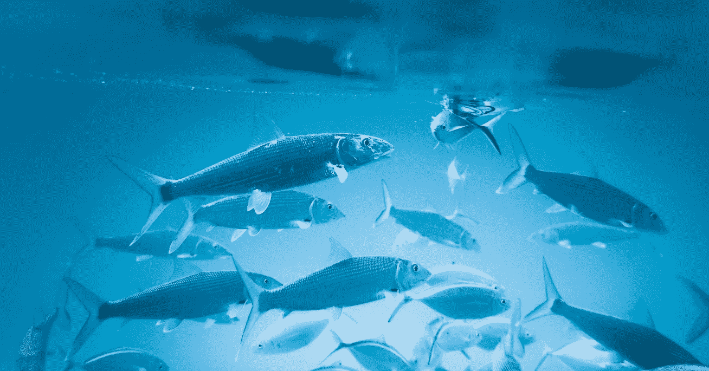
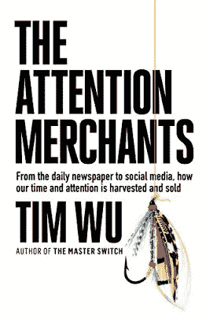

# 蒂姆·吴《注意力商人》中的克劳德·霍普金斯轶事

> 原文：<https://medium.datadriveninvestor.com/an-anecdote-about-claude-hopkins-from-tim-wus-the-attention-merchants-335dcb644406?source=collection_archive---------12----------------------->

## 营销

## "广告是二十世纪的洞穴艺术."——麦克卢汉元帅

Photo by [Jakob Owens](https://unsplash.com/@jakobowens1?utm_source=unsplash&utm_medium=referral&utm_content=creditCopyText) on [Unsplash](https://unsplash.com/s/photos/fishing?utm_source=unsplash&utm_medium=referral&utm_content=creditCopyText)

我一看到标题就引起了我的注意。当然，很多书吸引了我们的注意力，但却没有成功。从一开始，我就知道蒂姆·吴的书会带来成功。

Public domain.

作为一个以学习如何引起人们的注意从而影响他们的行为为职业的人(作为一个广告人，他的背后武器是网络和公关)，我一直是媒体和信息时代数字空间发生的事情的狂热学生。蒂姆·吴(Tim Wu)的这本书研究透彻，轶事丰富，将当今的广告/影响力游戏置于历史背景中。

大卫·奥格威的书构成了我广告教育的一部分，里斯和特劳特的作品也是如此。奥美向 Claude Hopkins 致敬，这位极具影响力的广告“天才”是现代广告之父，他创作了*科学广告*和*我的广告生涯*。

这本书的第一章是关于报纸如何变得更像营销而不是新闻。更确切地说，报纸是如何成为一种不同的行业，而不仅仅是散发故事。然后在第二章中，他向我们讲述了克劳德·霍普金斯的故事，以及霍普金斯作为一名早期蛇油推销员的想法的形成。我读过霍普金斯的两本关于广告和影响力的经典著作，但不知道他的出身。

 [## 抓住智能营销，获得巨大成果|数据驱动的投资者

### 网上的人都看过。每当人们在谷歌上搜索某样东西，他们最终都会与类似的广告互动…

www.datadriveninvestor.com](https://www.datadriveninvestor.com/2020/08/19/grab-on-to-intelligent-marketing-for-great-results/) 

1893 年的芝加哥世界博览会是这位来自密歇根的年轻人生活中的一个转折点。(令人惊讶的是，这一特殊事件对如此多的人及其生活产生了影响。胡迪尼和《美丽的美国》的灵感立即浮现在脑海中。)对克劳德·霍普金斯来说，他被一个名叫克拉克·斯坦利的小贩迷住了。大胆的斯坦利穿着牛仔服装，带珠子的皮夹克和彩色的大手帕，他会把响尾蛇扔进一大桶沸水中，然后撇去浮在上面的物质，作为药物出售。“对你的病痛有好处。”确实如此。

这要追溯到广告法存在之前的日子。那是在销售药品需要 FDA 批准之前的日子。过去，有很多这样的企业家从一个城镇来到另一个城镇。你甚至可以在《汤姆·索亚和哈克·费恩历险记》中见到他们。

Photo by the author.

霍普金斯受到启发，为其中一个产品——舒普博士的长生不老药——写故事和广告文案。他的成功在三个方面得到了回报。第一，经济上的。第二，他获得的经验。第三，他的成功带来了意想不到的结果。

他和舒普博士的成功在芝加哥引起了更大的轰动。他开始推广神奇的 Liquozone，是免费样品的先驱。Liquozone 的声明包括医生的认可。不幸的是，这真的是一剂糟糕的药。这发生在厄普顿·辛克莱的《丛林》揭露其他文化灾难的时候。政府加强了监管，随后媒体的严厉批评导致了 Liquozone 的消亡。

对霍普金斯来说，故事的结局是幻灭和某种崩溃。他隐居在密歇根的一所小屋里，转向写作，打算放弃广告游戏。说起来容易做起来难。

T 这本书经过了充分的研究，为读者提供了很多内容，无论他们是在营销游戏中，还是今天“注意力机器”的目标

这里有一个在亚马逊上的账号是 E . l . R 的人写的评论:

> 注意力产业的历史。令人震惊。这本书将当前的互联网/智能手机注意力抓取作为商业力量用来捕捉和转售你的注意力的一长串技术中的最后一个。连同阿德勒的*不可抗拒的*和卡尔的*浅滩*，在我看来，这是任何使用现代媒体技术的人的必读之作。

我会继续阅读并随时通知你。目前我给这本书打了 5 颗星。如果情况有变，我会让你知道。

我认为有趣的是，这本书的封面以一个鱼饵为图形。除非靠运气，否则光着钩在水里是钓不到鱼的。诱饵是用来吸引注意力的。

*最初发表于*[*https://pioneerproductions.blogspot.com*](https://pioneerproductions.blogspot.com/2020/10/an-anecdote-about-claude-hopkins-from.html)*。*

## 访问专家视图— [订阅 DDI 英特尔](https://datadriveninvestor.com/ddi-intel)