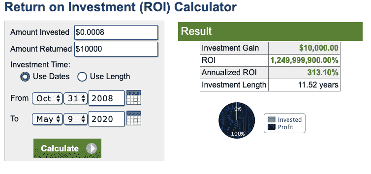
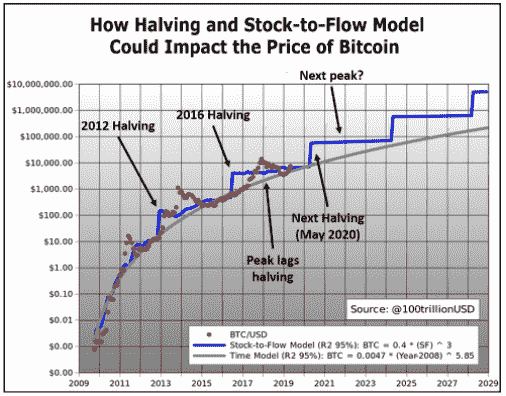
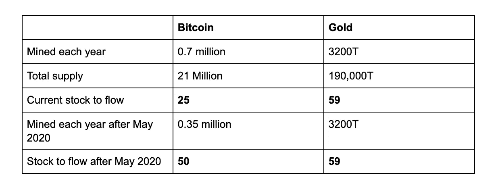
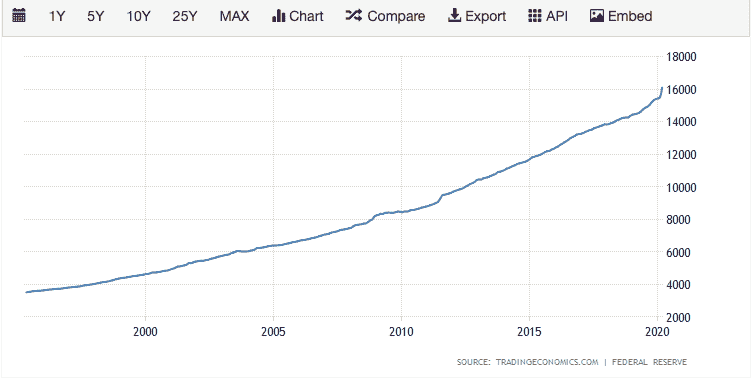
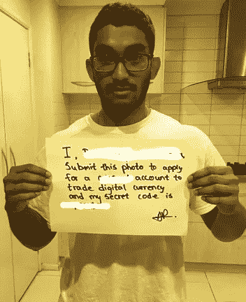

# 危机产生的资产类别，为了危机

> 原文：<https://medium.datadriveninvestor.com/an-asset-class-made-by-a-crisis-for-a-crisis-a3f72b860c20?source=collection_archive---------9----------------------->

大约 12 年前，在 2008 年大衰退最严重的时候，匿名的 Satoshi Nakomoto 发布了比特币白皮书。

过去十年中表现最好的资产类别是比特币，投资回报率为 295，999，900%，而表现最好的标准普尔 500 股票网飞(NASDAQ)的投资回报率达到了令人难以置信的 3680%。

ROIC calculator

从 10000 个 BTC 披萨到丝绸之路，过去十年比特币的旅程可谓非同寻常。

纳撒尼尔·波普(Nathaniel Popper)在《数字黄金》(Digital gold)中讲述了比特币的起源、成功故事、引发的争议以及未来的旅程。

从经济学的角度来看，很难不看到比特币的价值和重要性。

# **期待已久的减半**

比特币的总供应量永远固定在 2100 万。每 10 分钟，世界各地的比特币矿工就会开采出一定数量的比特币。每 4 年，区块奖励会减半，这基本上意味着平均开采的比特币数量会减半。同样值得注意的是，开采一枚比特币的平均成本是 5600 美元。

2008 年:每 10 分钟 50 BTC

2012 年:每 10 分钟 25 BTC

2016 年:每 10 分钟 12.5 BTC

2020 年:每 10 分钟 6.25 BTC(2020 年 5 月 12 日)

2024 年:每 10 分钟 3.125 BTC

超过 1800 万个比特币已经被挖掘出来。减半将持续到 2140 年最后一个比特币被开采。

# **什么创造价值？稀缺还是丰富？**

稀缺性是价值的关键驱动力。人们通常渴望和想要更难得到的东西。限量版手表、稀有艺术品、FOMO 和欲擒故纵都是稀缺产生潜在经济价值的例子。

S2F model

库存流量(S2F)用于衡量某种资源的丰富性(或稀缺性)。它简单地由特定资源的储量除以其年产量得出。

S2F comparison before and after May 2020 halving

# **量化宽松与量化硬化**

一股巨大的量化宽松浪潮席卷全球，以抵消全球疫情带来的经济冲击。

量化宽松(QE):货币供应量的增加，相对于那些拥有硬资产和股票的人来说，这是对拥有大部分现金财富的人的惩罚。当利率接近零时，中央银行将此作为最后手段，通过购买长期证券和政府债券来诱导金融市场的流动性并鼓励贷款。将钱直接放在人们手中的普遍基本收入(UBI)被称为“人民的 QE”。

Increase in money supply over the last 25 years→ Abundance

> QE 在 2008 年只有几十亿人口。2020 年的 QE 是几万亿。下一轮的 QE 将会在几万亿次。

定量**硬化**:与 QE 相反。通过限制货币供应来减少通货膨胀。

比特币减半来得再好不过了。

# **主流媒体的作用**

我们正处于消费内容的创纪录水平，这导致我们消费的内容决定了我们的一些决定。三月初戏剧性的市场崩溃对媒体来说显然是一个巨大的成功。

纵观金融史；系统、政策、货币和全球力量发生了巨大的变化，但投资心理仍然相当稳定。

有了丰富的实时信息，恐慌和泡沫会进一步加速(即 2020 年的卫生纸大短缺)。在这个过程中，会吸引更多的投机者，而不是没有足够时间建立信心的投资者。

由于疫情，人们已经数字化了整个生活方式。当媒体开始谈论数字货币(已经有了)时，首先想到的是什么？

最近，亿万富翁对冲基金经理保罗·都铎·琼斯声称，他正在装载比特币，以帮助防范通货膨胀的上升。

# **进入门槛低**

早在 2017 年，当我 FOMO 并试图获得比特币时，因为“每个人都在谈论它”，我不得不等待几天才能通过加密货币经纪人认证我的账户。这是一个令人沮丧的过程得到验证，转移资金，并开始交易。

时代变了。

2020 年，你可以在几分钟内获得验证并开始交易。与上一次减半相比，2020 年的平台将提供更多的安全性、流动性、易于验证、协助和先进的投资组合管理系统。

FOMO +交通便利+信息或许能创造另一轮牛市。

# **那么，这里面有什么蹊跷？**

不用说，比特币有其独特的问题，这些问题会定期得到改善。在作出任何财务决定之前，了解它的好处和缺点都是值得的。

*   首先，比特币价格**极其不稳定**。2020 年 3 月，在 5 月份收复所有失地之前，它在几天内暴跌了 51%。这是由于其相对较低的市值。随着市场资本化和采用的增加，波动性已经降低。
*   比特币支付是**不可逆的**，它只能由接收资金的人退还。
*   政府税收和法规。任何扰乱现有遗留系统并迫使它们变得更高效的事情都将受到审查。
*   比特币安全:冷钱包指的是不联网的钱包。一般比较安全，但是不要接受很多加密货币。根据功能不同，一个冷钱包的价格在 80-200 美元之间。如果包含密钥的文件丢失或被盗，用户的比特币将永远消失**。热门钱包是指连接到互联网的钱包，通常更容易设置，但容易受到黑客和监管的影响。**
*   比特币交易所:尽管现在更加安全，但早期的比特币交易所经常因外部黑客和欺诈而失败。
*   骗子:如果你看到一些人在社交媒体上评论尝试新的比特币平台或保证一周内让你的钱翻倍的服务，阻止他们。追逐“致富计划”是傻瓜的黄金，适用于任何形式的投资。
*   比特币仍然是非常新的和实验性的。它仍然极其复杂，难以理解。它会随着时间的推移不断改进。
*   量子计算:普通计算机很难破解用于保护比特币的加密协议。量子计算机可以解决普通计算机无法解决的复杂问题。科技巨头对量子霸权的争夺可能会以我们无法想象的速度普及量子计算机，这可能会对区块链网络的安全构成威胁。
*   比特币巨鲸:很少有大型玩家持有任何加密货币的大部分，可以集体引起大的价格波动。
*   交易速度低:比特币每秒只能进行 5 次交易，而电子支付巨头 Visa 每秒可以进行高达 24000 次交易。

出于这些原因，比特币并不适合所有人……目前还不适合。

建立足够的信念来支撑(HODL)度过情绪的大起大落至关重要。

# 最终意见

回到 2017 年，我并不服气。至少在我了解了货币的历史之后。

比特币拥有法定货币一次又一次未能体现的健全货币的所有要素。很容易将它视为骗局，但当我开始了解并质疑金钱到底是什么时，比特币是我首先想到的东西。归根结底，任何货币的价值都是建立在对其效用的集体信心之上的。

全球贸易已经从易货、商品、贵金属发展到纸币和卡片。同样，纸币和卡片也将很快成为历史的一部分。

不管怎样，把你净财富的 1%(你能承受损失的钱)放在一种纯粹基于数学的真正自由的市场货币中不会有什么坏处。比特币美元成本平均化可能是一个忽略新闻和情绪的有价值的策略。

全天候工作，不会被保释，也不会被随意打印。

对我来说，这是有意义的。2020 年更是如此。

*现在付款，以后购买。*

**推荐来源**

*   文章:雷伊·达里奥的[改变世界秩序](https://www.linkedin.com/pulse/changing-value-money-ray-dalio/?published=t)
*   Youtube:向迈克·马洛尼学习金钱的[隐藏秘密](https://www.youtube.com/playlist?list=PLE88E9ICdipidHkTehs1VbFzgwrq1jkUJ)
*   书:[数字黄金](https://amzn.to/2LhT5QV)纳撒尼尔·波普著
*   澳大利亚最佳经纪人: [Swyftx](https://trade.swyftx.com.au/register/?ref=ashainperera)
*   经纪人其他国家:[币安](https://www.binance.com/en/register?ref=R8NU0ARU)

# 参考

比特币什么时候会达到下一个大高峰？会涨到多高？—韦斯加密评级(2020 年)。可在:[https://Weiss crypto . com/en/article/when-will-bit coin-hit-its-next-big-peak-how-high-it-go](https://weisscrypto.com/en/article/when-will-bitcoin-hit-its-next-big-peak-how-high-will-it-go)(访问时间:2020 年 5 月 10 日)。

M2 货币供应量| 1959–2020 年数据| 2021–2022 年预测|历史数据(2020 年)。可用时间:[https://tradingeconomics.com/united-states/money-supply-m2](https://tradingeconomics.com/united-states/money-supply-m2)(访问时间:2020 年 5 月 10 日)。

你需要知道的一些事情——比特币(2020)。可在:[https://bitcoin.org/en/you-need-to-know](https://bitcoin.org/en/you-need-to-know)(访问时间:2020 年 5 月 10 日)。

货币价值的变化(2020)。可在:[https://www . LinkedIn . com/pulse/changing-value-money-ray-dalio/？已发布=t](https://www.linkedin.com/pulse/changing-value-money-ray-dalio/?published=t) (访问日期:2020 年 5 月 10 日)。

计算器，r. (2020)投资回报率计算器，Calculator.net。可用时间:[https://www.calculator.net/roi-calculator.html](https://www.calculator.net/roi-calculator.html)(访问时间:2020 年 5 月 10 日)。

GoldSilver:贵金属投资的全球领导者(2020)。可用时间:[https://goldsilver.com/](https://goldsilver.com/)(访问时间:2020 年 5 月 10 日)。

markets.businessinsider.com，亿万富翁投资者保罗·都铎·琼斯说他正在装载比特币(GBTC) |货币新闻|金融和商业新闻|市场内幕。可在:[https://markets . business insider . com/currences/news/bit coin-billionaire-investor-Paul-Tudor-Jones-says-buying-crypto currency-inflation-2020-5-1029179495](https://markets.businessinsider.com/currencies/news/bitcoin-billionaire-investor-paul-tudor-jones-says-buying-cryptocurrency-inflation-2020-5-1029179495)(访问时间:2020 年 5 月 10 日)。