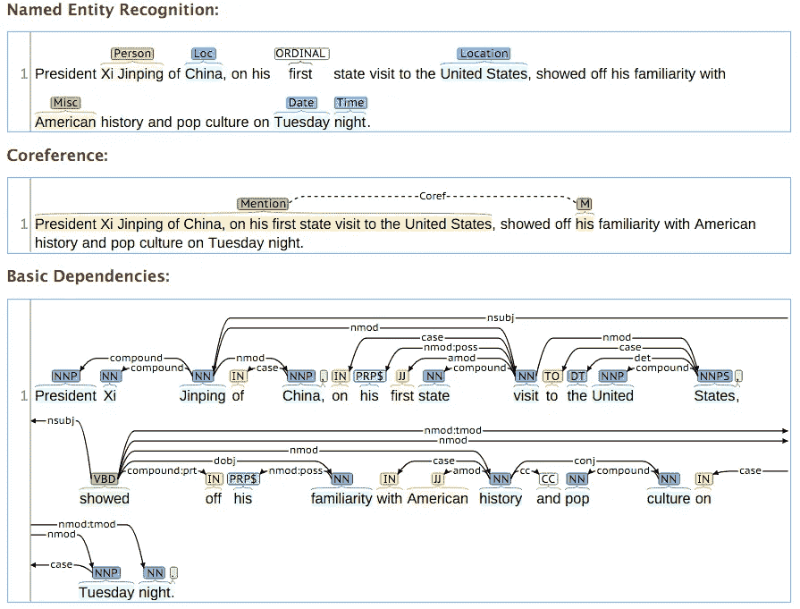

# 从文本中提取地理位置的尝试

> 原文：<https://medium.datadriveninvestor.com/an-attempt-to-extract-geo-location-from-text-c76cb6bd49d4?source=collection_archive---------0----------------------->

最近我正在处理一个从大量文章(不同语言)中提取地理位置的任务。这是我的发现。

# 问题定义:

给定一个任意的文本体(有点像报告)，确定报告的每个部分所指的地理位置。

# 分析问题:

[Stackoverflow 响应:](https://stackoverflow.com/questions/17386394/determining-geo-location-by-arbitrary-body-of-text)

> 如果我没理解错的话，您正在寻找一种方法来(1)找到文本中的地名，(2)消除地名的地理参考的歧义，以及(3)在空间上将整个句子或段落接地。
> 
> 有很多开源包可以做到第一点。[斯坦福核心 NLP](http://nlp.stanford.edu/software/corenlp.shtml) ， [OpenNLP](http://opennlp.apache.org/)
> 
> 有几个软件包可以做到第一和第二点。CLAVIN 可能是目前唯一可以做到这一点的开源应用。Yahoo Placemaker 花钱但能做。
> 
> 真的没有一个包可以做到第三点。有一个更新的项目叫做 [TEXTGROUNDER](https://github.com/utcompling/textgrounder) 做一些叫做“文档地理定位”的事情，但是虽然代码是可用的，但是它没有被设置为在你自己的输入文本上运行。我只建议你看看它，如果你渴望开始或参与一个项目，试图做这样的事情。

 [## 机器学习的外汇交易挑战|数据驱动的投资者

### 机器学习是人工智能的一个分支，之前占据了很多头条。人们是…

www.datadriveninvestor.com](https://www.datadriveninvestor.com/2019/02/18/the-challenge-of-forex-trading-for-machine-learning/) 

# 各个击破

这个问题可以分为三个部分。
1)在文本中查找地名(命名实体识别)
2)消除地名的歧义
3)根据给定的地名指出地理位置

## 0)可以(几乎)直接完成任务的工具

[CLIFF:](https://github.com/mitmedialab/CLIFF)
CLIFF 是一个轻量级服务器，允许 HTTP 请求到斯坦福命名实体识别器和一个修改过的 [CLAVIN 2.1.0 geoparser](http://clavin.bericotechnologies.com) 。

[谷歌地理编码 API:](https://developers.google.com/maps/documentation/geocoding/start)
地理编码是将地址(比如街道地址)转换成地理坐标(比如经纬度)的过程，你可以用它在地图上放置标记，或者定位地图。

[Geograpy3:](https://github.com/jmbielec/geograpy3)
它的核心功能是从 URL 或文本中提取地名，并为这些名称添加上下文——例如区分国家、地区或城市。
Geograpy 使用以下优秀的库:
- [NLTK](http://www.nltk.org/) 用于实体识别
- [报纸](https://github.com/codelucas/newspaper)用于从 HTML 中提取文本
- [水母](https://github.com/sunlightlabs/jellyfish)用于模糊文本匹配
- [pycountry](https://pypi.python.org/pypi/pycountry) 用于国家/地区查找
Geograpy 使用以下数据源:
[GeoLite2](http://dev.maxmind.com/geoip/geoip2/geolite2/) 用于城市查找

## 1)命名实体识别

Google 自然语言 API:
目前最强大的 NER 工具。非常适合多语言环境。但它不是免费的。
Python 参考:[https://open source . com/article/19/7/Python-Google-natural-language-API](https://opensource.com/article/19/7/python-google-natural-language-api)

[斯坦福 NER:](https://nlp.stanford.edu/software/CRF-NER.shtml)
支持阿拉伯语、汉语、英语、法语、德语、西班牙语、意大利语、葡萄牙语和瑞典语。
Python reference:[http://www . nltk . org/API/nltk . tag . html # module-nltk . tag . Stanford](http://www.nltk.org/api/nltk.tag.html#module-nltk.tag.stanford)

[神经元:](https://github.com/Franck-Dernoncourt/NeuroNER)
NER 引擎包含三层:
-字符增强令牌嵌入层、
-标签预测层、
-标签序列优化层。
提供与 BRAT 和 TensorBoard 的集成，以更好地测量和可视化数据。

## 2)消除地名的歧义

[Google 地理编码 API:](https://developers.google.com/maps/documentation/geocoding/best-practices)
全面可靠，但同样，它也不是免费的。

[geo parsepy:](https://pypi.org/project/geoparsepy/)
geo parsepy 是一个 Python 地质分析库，可以从文本中提取位置并消除歧义。它使用本地 OpenStreetMap 数据库，该数据库允许非常高且无限制的地理解析吞吐量，这与使用第三方地理编码服务(例如 Google 地理编码 API)的方法不同。

这个项目提供了从短文本中消除地名歧义的源代码。结合 DBpedia 和 Wikipedia 作为地名消歧的背景知识。

## 3)根据给定的地名指出地理位置

[CLAVIN:](https://github.com/Berico-Technologies/CLAVIN)
CLAVIN(*制图位置和邻近索引*)是一个开源软件包，用于文档地理标记和地理分析，采用基于上下文的地理实体解析。

谷歌地理编码 API:
同 0)