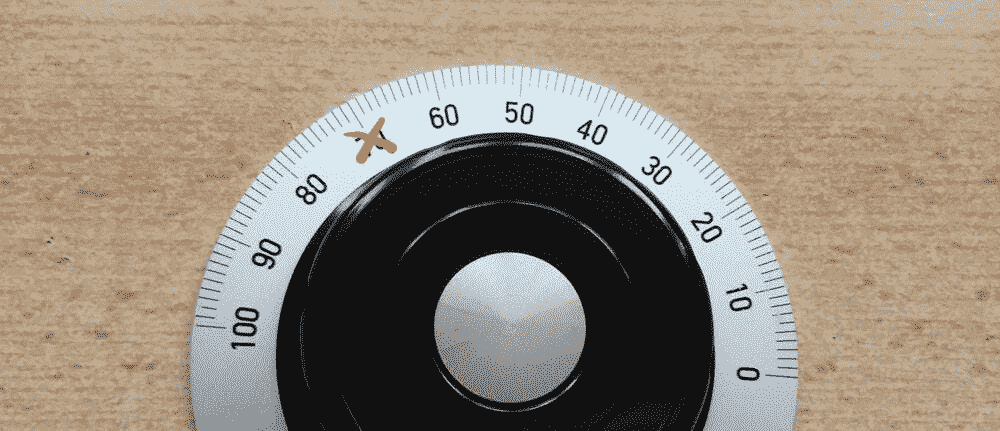
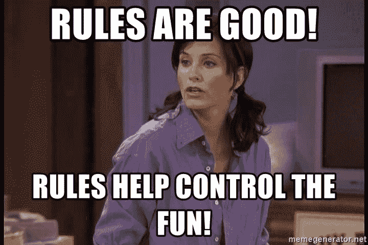

# 评估困难事物的简单方法

> 原文：<https://medium.datadriveninvestor.com/an-easy-way-to-evaluate-hard-things-2b8a8a150f90?source=collection_archive---------15----------------------->

有时候你会不会完全忘记你是从哪里得到一个想法的？我经常遇到这种事。

不久前，我在某个地方读到或听到(很难知道*在哪里*，真的)关于**的一种快速简单评估某事的方法**，它也可以让你减少偏见，特别是在你试图评估的事情与你非常接近的情况下:要么是因为你做了它，要么是因为你认识并喜欢的人做了它，要么是因为你知道它花了多长时间。

在这种情况下，根据这种方法，一个好的方法是尝试给它分配一个从 1 到 10 的分数，但这个分数不能是 7。

# 为什么？

因为这让你在给它 6 分和给它 8 分之间做出选择，6 分是我们通常认为很低或不够的分数，8 分将使它成为量表中的前 3 名。

 [## 决策的移情设计方法如何工作|数据驱动的投资者

### 移情设计是一种产品设计方法，首先由多萝西·伦纳德和杰弗里·雷波特在哈佛大学提出

www.datadriveninvestor.com](https://www.datadriveninvestor.com/2018/07/18/how-the-empathic-design-method-of-decision-making-works/) 

这背后的假设是，我们受文化制约，特别是受小学教育的制约，认为**当某件事值得 7 分时，那件事就没问题**。它可能不显著或实际上很优秀，但它也没有错。换句话说， **7 是一个安全的地方**，当一些事情让我们觉得不太好时，我们会躲在那里，但我们不想伤害任何人的感情，也不想为纠正它所需要的认知和情感努力承担责任。

但是让我们到柜台的另一边去一会儿，看一些有趣的东西。在柜台的另一边，我们会想象我们正在做一些东西。它可以是任何东西:一首诗，一段视频，一句生日祝福，一个蛋糕。

你在想象吗？好吧，让我们补充一下，也想象一下，我们做的这个东西，最终会被某个人评价。在那一刻，即使你没有注意到，你的大脑也会做一件有趣的事情:它会自动尝试确定你正在做的东西是否有任何被授予 7 分的机会。在你生命的前 15 年里，学校已经让你(*和你的大脑*)习惯于认为，如果你的工作值得 7 分，那就足够好了*。所以你可以放松。7 分不算优秀，但是还可以。*

*问题是，事实并非如此。至少在校外生活中不会。尤其是如果另一边评估你工作的人知道这种方法，包括*确切地说*不惜一切代价避免给某件事打 7 分，因为那会是容易的事，舒服的事。*

*另一方面，如果你必须决定如何更好地利用你的时间，问自己从这笔不可退还的投资中你将获得的东西是否值得 8 分(或更多)，或者它是否会落在 6 分或更少的袋子里，这是有用的。因为，如果你打算投入生命中的 2 个小时来获得一个低于标准的结果，不值得 6 分或更多，那么也许你会想把这 2 个小时用在可以得到 8 分或更高的事情上，或者也许你可以问问自己如何才能让你的工作质量超过 8 分。*

# *为此，首先是:规则！*

*是的，我知道。如果你了解我一点点，我提倡规则听起来一定很奇怪，而我通常是反对规则的。但是武断、荒谬、恐惧和渴望控制的规则是一回事(我非常反对这些)，游戏规则是另一回事。*

**

*那么，你没有要求的建议是:学习然后*掌握*游戏规则。为了创作出值得 7 分的作品，掌握游戏规则是必须的。*

*但是等等。我们不是说过 7 不是个好东西吗？不完全是。7 是怀疑的分数。如果我的工作应该得到 7 分，我的工作会让人产生疑问:这是 6 分还是 8 分？既然我们人类普遍不喜欢有怀疑(人类的大脑因为怀疑而短路)，那么我们能做的最好的事情就是生产出能让我们骄傲的作品，不给怀疑留有余地的作品。*

*这就是为什么知道、理解和掌握游戏规则很重要。正是这种精通让你知道你输出的是什么质量的工作。当然，一旦你知道、理解并掌握了这些规则，请尽可能地打破它们。然后更多，即使规则似乎表明你不能。*

*学习如何演奏一种乐器的过程很能说明这一点。首先，你需要知道乐器是如何工作的，如何调音，音符在哪里，什么是音阶以及如何使用它们。所有这些都需要你牢记一些规则。只有当你学会了这些规则，你才能真正开始*演奏*，弯曲它们并打破它们，理解为什么当你这样做时乐器会发出这样或那样的声音。*

*当你明白你打破了什么规则，你就能制造不和谐。不是任何不和谐，而是一个值得 8 分或更高的不和谐。一个有意的不和谐，一个有意义并创造意义的不和谐。但是如果你不理解你正在打破的那些规则，如果不和谐是偶然的，你只是在制造噪音。*

> *“如果你弹错了一个音符，你弹的下一个音符就决定了它是好是坏。”米勒·戴维斯*

*是的，当然，打破所有的规则，但是只有当你了解并掌握了它们。这是我知道的最好的停止做 7 的方法。*